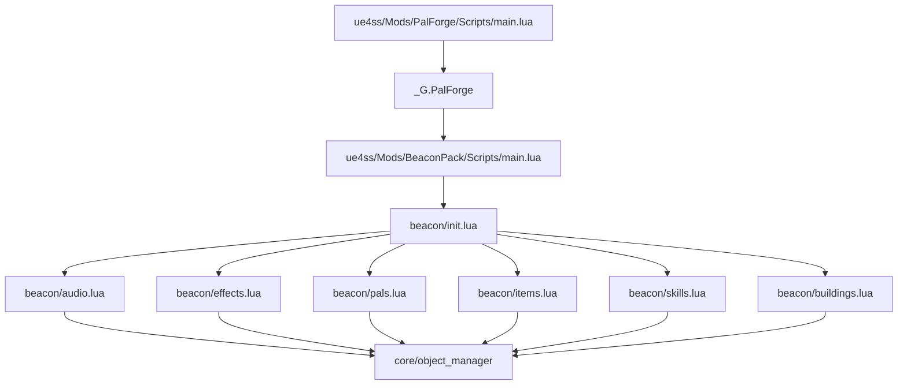
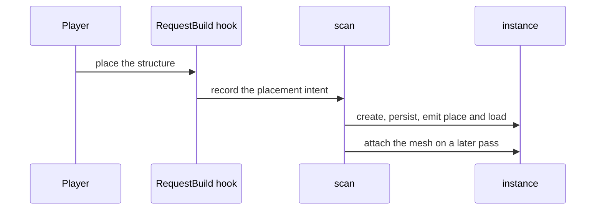
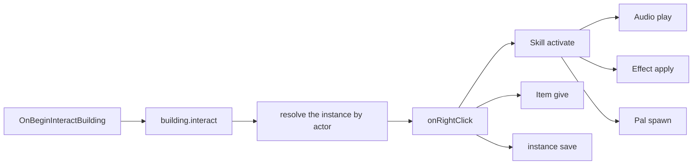

## What you can do after this page

- Put your own mod folder into Palworld and watch it load
- Make a structure in the build menu do something when you interact with it
- Play a sound, hand out a buff and pay out an item from that one interaction
- Know which of those steps this version can carry out, and how each one reports itself
- Give every structure you place a counter that is still there the next time you play
- Read the game's log to find out why something did not happen

## What you are building

A pack called **BeaconPack**. It takes over one structure in the build menu — a beacon — and
gives it something to do:

- interacting with the beacon fires a skill with a 30 second cooldown,
- the skill plays a sound on the character who interacted,
- gives them a 12 second buff that can stack up to three times,
- and calls a guardian pal to the beacon's position,
- the beacon itself pays out an item, counts its uses, spends a charge, and saves that
  count into the world file,
- a repeating handler recharges it while you are away from it.

All of it happens in game. The one thing to expect rather than be surprised by is the pal: it
arrives a few seconds after the interaction rather than at once, which the guide says again
where it appears.

That is Building, Skill, Audio, Effect, Pal and Item in one pack, and the pack is its own
mod folder that reuses the PalForge already loaded in the session.

Before you start:

- PalForge is installed and loading. `ue4ss/Mods/PalForge/Scripts/main.lua` runs, and the
  UE4SS console shows `[PalForge.main][info] ready`.
- Calling a pal goes through `UPalCheatManager`, the game's own admin object. PalForge finds
  one, or builds one on the player controller itself, so you only need to be in a world.
- Handing out an item goes through the inventory's own write, and reports what it measured:
  `Item.Handle:give` reads the inventory before and after, and answers `true` only when the
  count really rose.
- A spawn is not instant. `Pal.Handle:spawn` returns as soon as the call is issued and the
  creature turns up four to eight seconds later, so nothing in this pack waits for it and
  nothing checks that it arrived. See [Pal](/docs/api/pal).

<Callout type="info">
The beacon below takes over structures, items and creatures the game already has. Lua can
give an existing id behaviour and metadata, but it cannot add a brand new row to the game's
data tables — publishing a new build object, item or creature is PalSchema's job. The section
on [moving to your own ids](#variations) shows the one line that changes once a row of your
own exists.
</Callout>

## How a pack is laid out

A pack is its own UE4SS mod folder with its own `Scripts/main.lua`, laid out the same way
PalForge is:

```text
ue4ss/Mods/BeaconPack/
    enabled.txt              <- UE4SS's own switch for this mod folder
    Scripts/
        main.lua             <- the entry point UE4SS runs
        beacon/
            init.lua         <- requires every domain module, in dependency order
            audio.lua        <- the sounds
            effects.lua      <- the blessing
            pals.lua         <- the guardian
            items.lua        <- the reward
            skills.lua       <- the signal: sound + blessing + guardian
            buildings.lua    <- the beacon itself
```

Switch the mod folder on the way your UE4SS install expects — an `enabled.txt` inside the
folder, or a line in `mods.txt`. What matters below that is the shape: one file per kind of
content, plus an `init.lua` that requires them all.

PalForge finishes loading by putting itself on a global called `_G.PalForge`:

```lua
_G.PalForge = {
    env    = env,                       -- { dev, name, version }
    api    = require("palforge.api"),   -- Pal, Item, Building, Skill, Effect, Audio, Mesh, UI, Player
    utils  = { log, json, file, items },
    core   = { registry, event, object_manager, spawn, mesh, sound, player, spatial, icons },
    native = require("palforge.native"),
}
```

Your pack reads that table, and it is everything the pack needs from PalForge. `api` is what
you write content against, `utils.log` prints to the game's console, `core.event` is the event
bus, and `native` is Palworld's own content listed out as catalogs you can look ids up in.



Requiring a module registers its content. Every `X{ ... }` call inside it runs as the file
loads and writes its definition into PalForge, so **the require is the registration**.

## Build the pack

<Steps>

<Step>

### Create the mod folder

Make `ue4ss/Mods/BeaconPack/Scripts/beacon/` and switch the mod on the way your UE4SS
install expects. That is the whole setup: nothing to generate, nothing to build.

</Step>

<Step>

### Write the entry point

`main.lua` does three things. It puts its own `Scripts` directory on `package.path` so
`require("beacon.audio")` finds your files, checks that PalForge loaded, and requires the
pack. Keep it short — the content belongs in the modules.

```lua title="ue4ss/Mods/BeaconPack/Scripts/main.lua"
-- BeaconPack — a PalForge content pack, running as its own UE4SS Lua mod.
--
-- Install layout (mirrors PalForge's own):
--   ue4ss/Mods/BeaconPack/Scripts/main.lua      <- this file
--   ue4ss/Mods/BeaconPack/Scripts/beacon/*.lua  <- the pack's modules

-- Make require() resolve beacon.* relative to this Scripts dir.
local thisDir = debug.getinfo(1, "S").source:match("@?(.*[\\/])") or ""
package.path = thisDir .. "?.lua;" .. thisDir .. "?\\init.lua;" .. package.path

-- PalForge publishes itself on _G.PalForge at the end of its own main.lua.
local forge = _G.PalForge
if not forge then
    pcall(print, "[BeaconPack] PalForge is not loaded - this pack does nothing this session")
    return
end

local log = forge.utils.log.scope("beacon")
log.info("loading against PalForge v" .. tostring(forge.env.version))

local ok, err = pcall(function() require("beacon") end)
if not ok then
    log.err("load failed: " .. tostring(err))
else
    log.info("loaded")
end
```

`forge.utils.log.scope("beacon")` gives you a logger with `info`, `warn` and `err`. Each one
takes a single message. Every line it prints starts with `[PalForge.beacon]` and the level —
`[PalForge.beacon][info]`, `[PalForge.beacon][warn]`, `[PalForge.beacon][err]` — so you can
filter your pack's output the same way you filter PalForge's.

<Callout type="warn">
`_G.PalForge` exists only after PalForge itself has loaded, and only inside the same Lua
state. Your pack has to load into that state, after it. The guard above returns quietly
rather than erroring, so if you see that message, check the order UE4SS loads the two mod
folders in.
</Callout>

</Step>

<Step>

### Write the pack index

One require per kind of content, in dependency order: the skill uses the sound, the buff and
the guardian, and the building uses the skill and the reward.

```lua title="Scripts/beacon/init.lua"
-- beacon — the pack's modules, one per domain, required in dependency order.
-- Requiring a module IS registering its content: every X{ ... } call inside runs on
-- require and writes the definition into PalForge's object_manager.
local M = {}

M.audio     = require("beacon.audio")      -- the sound the beacon plays
M.effects   = require("beacon.effects")    -- the blessing it hands out
M.pals      = require("beacon.pals")       -- the guardian it calls
M.items     = require("beacon.items")      -- the reward it pays out
M.skills    = require("beacon.skills")     -- the signal: sound + blessing + guardian
M.buildings = require("beacon.buildings")  -- the structure the player interacts with

return M
```

</Step>

<Step>

### Declare the sounds

You play a sound when you want it; nothing plays it for you. A definition names an
`AkAudioEvent` — one of the game's own sound events — in two ways. `soundPath` is the asset
path that actually plays, and `soundId` is the fallback lookup by name.

```lua title="Scripts/beacon/audio.lua"
-- beacon.audio — the sounds this pack plays.
local api   = _G.PalForge.api
local log   = _G.PalForge.utils.log.scope("beacon.audio")
local Audio = api.Audio

local M = {}

-- The beacon's activation sound, named by the pack. Both fields point at the SAME event;
-- the pair is copied out of PalForge's AkAudioEvent catalog (native.audio.CATALOG).
M.Signal = Audio.se{
    id          = "beacon:Signal",
    name        = "Beacon Signal",
    description = "Played on the interacting character when the beacon fires.",
    soundId     = "AKE_BuffAura",
    soundPath   = "/Game/Pal/Sound/Events/SE/System/StatusCondition/AKE_BuffAura.AKE_BuffAura",
}

-- The same thing, looked up by name instead of typed out: native.audio.se returns a ready
-- handle for any catalog name, and nil for a name the catalog does not have.
M.Reward = _G.PalForge.native.audio.se("AKE_CampLevelUp")
if not M.Reward then log.warn("AKE_CampLevelUp is not in the AkAudioEvent catalog") end

return M
```

`Audio.se` and `Audio.bgm` fill in `kind` for you. `kind` is a label for your own benefit:
music and sound effects both play through the same call.

<Callout type="warn">
Two things here are not what the name suggests, so plan around them. A `soundFile` — your own
audio file — is accepted and then does nothing, so use a game `AkAudioEvent` from the catalog
instead. And neither `Handle:stop` nor `Handle:setVolume` is per sound: both act on everything
playing on that actor, so to make one sound quieter than another, pick a quieter event.
</Callout>

</Step>

<Step>

### Declare the effect

An effect keeps its own schedule. `:apply(target)` starts a live application, and PalForge
advances it on a shared 500 ms heartbeat until it runs out or you remove it.

```lua title="Scripts/beacon/effects.lua"
-- beacon.effects — the blessing the beacon hands out.
local api    = _G.PalForge.api
local log    = _G.PalForge.utils.log.scope("beacon.effects")
local Effect = api.Effect
local Item   = api.Item

local M = {}

-- 12 seconds long, ticking every 3, up to 3 stacks. The timing is owned by PalForge; the
-- gameplay is owned by these handlers.
M.Blessing = Effect{
    id          = "beacon:Blessing",
    name        = "Beacon Blessing",
    description = "A short blessing granted by the beacon.",
    duration    = 12.0,
    interval    = 3.0,
    stackable   = true,
    maxStacks   = 3,
    events = {
        onApply = function(effect, target, ctx)
            -- ctx carries effect and stacks, plus whatever you passed to :apply.
            log.info("blessing applied by " .. tostring(ctx.source))
        end,
        onStack = function(effect, target, ctx)
            log.info("blessing stacked to " .. tostring(ctx.stacks))
        end,
        onTick = function(effect, target, ctx)
            -- One berry per tick, scaled by the stack count. ctx.elapsed is how long this
            -- application has been alive, in seconds.
            Item.get("Berries"):give(ctx.stacks)
            log.info(string.format("blessing tick at %.1fs", ctx.elapsed))
        end,
        onExpire = function(effect, target, ctx)
            -- ctx.reason is "duration", "removed", "target_gone" or "world_left".
            log.info("blessing ended: " .. tostring(ctx.reason))
        end,
    },
}

return M
```

The first argument of an effect handler is this effect's **handle**, so `:remove`,
`:timeLeft` and `:stacksOn` are right there. Whatever you pass as `:apply(target, ctx)` is
readable in `onApply` and `onStack`. `onTick` and `onExpire` get the runtime's own context
instead: `effect`, `elapsed`, `stacks`, and `reason` when it ends.

<Callout type="warn">
`nativeStatus` on a definition switches one of the game's own status icons on while the effect
runs, and off again when it ends. It does not carry gameplay with it, so put whatever the effect
should actually do into `onTick` — the icon and the damage are two separate things.
</Callout>

</Step>

<Step>

### Declare the guardian

`"Kitsunebi"` is a creature id the game already has, so this definition gives an existing
creature behaviour. Leave `mesh` out: the pal already has its own model, and you add `mesh`
only when you want to put a different one on it.

```lua title="Scripts/beacon/pals.lua"
-- beacon.pals — the guardian the beacon calls.
local api = _G.PalForge.api
local log = _G.PalForge.utils.log.scope("beacon.pals")
local Pal = api.Pal

local M = {}

M.Guardian = Pal{
    id          = "Kitsunebi",
    name        = "Beacon Guardian",
    description = "The creature the beacon calls.",
    -- Ids only. Nothing equips them for you; read them back with :skillsOf().
    skills      = { "beacon:Flare" },
    events = {
        onSpawned = function(pal, ctx)
            log.info("guardian spawned: " .. tostring(ctx.actor))
        end,
        onDamaged = function(pal, ctx)
            log.info("guardian took damage")
        end,
        onCaptured = function(pal, ctx)
            log.info("guardian captured - the beacon lost its keeper")
        end,
        onDeath = function(pal, ctx)
            log.info("guardian died")
        end,
    },
}

return M
```

PalForge finds this definition from the spawned creature's blueprint class name:
`BP_Kitsunebi_C` becomes `Kitsunebi`, which it looks up. A vanilla pal with no definition of
its own matches nothing, and the handlers are skipped.

A pal can also declare `onTick`. PalForge sweeps the world for live pals every three seconds
and calls it once per creature, with `ctx.actor` set to that creature, `ctx.count` the
heartbeat number and `ctx.now` the clock. One handle serves every creature of the same id, so
key anything per-creature by `ctx.actor` yourself. Change the pace with
`require("palforge.core.event").PAL_SCAN_MS = 5000`, or set it to `0` to switch the sweep off.

</Step>

<Step>

### Declare the reward

```lua title="Scripts/beacon/items.lua"
-- beacon.items — the reward the beacon pays out.
local api  = _G.PalForge.api
local log  = _G.PalForge.utils.log.scope("beacon.items")
local Item = api.Item

local M = {}

-- "Ruby" is a real game ItemId. Defining it attaches metadata and handlers to that id; it
-- does not create a new inventory row.
M.Reward = Item{
    id          = "Ruby",
    name        = "Ruby",
    description = "What the beacon pays out.",
    category    = "material",
    maxStack    = 999,
    -- Metadata: nothing in PalForge publishes a recipe into the game's crafting tables.
    -- Read it back with Item.get("Ruby"):recipeOf().
    recipe = {
        materials = { Stone = 20, Flint = 5 },
        count     = 1,
        work      = 30,
        station   = "Workbench",
    },
    events = {
        onObtain = function(item, ctx)
            log.info("reward obtained x" .. tostring(ctx.count))
        end,
    },
}

return M
```

<Callout type="warn">
`onObtain` follows the game's own "you obtained an item" log
(`PalPlayerState:AddItemGetLog_ToClient`), which fires on pickups, loot and rewards. An
inventory add that does not show up in that log is not covered, so do not count on your own
`:give` call coming back to you as an `onObtain` — log it where you call it instead.
`onCraft` and `onDiscard` can be declared, but nothing sends them yet.
</Callout>

</Step>

<Step>

### Declare the signal

Nothing in the game fires a skill handler for you. You fire it yourself. `:activate(owner)`
runs `onActivate` right now, and refuses while the skill is still cooling down — which is
exactly the gate the beacon wants.

```lua title="Scripts/beacon/skills.lua"
-- beacon.skills — the signal the beacon fires. :activate runs the handler now and refuses
-- while the skill is still cooling down, so the beacon gets its rate limit for free.
local api     = _G.PalForge.api
local log     = _G.PalForge.utils.log.scope("beacon.skills")
local Skill   = api.Skill
local audio   = require("beacon.audio")
local effects = require("beacon.effects")
local pals    = require("beacon.pals")

local M = {}

M.Flare = Skill{
    id          = "beacon:Flare",
    name        = "Beacon Flare",
    description = "Sound, blessing and a called guardian - the beacon's whole payload.",
    kind        = "active",
    element     = "fire",
    cooldown    = 30.0,
    power       = 25,
    events = {
        onActivate = function(skill, owner, ctx)
            audio.Signal:play(owner)                                -- on the interacting character
            effects.Blessing:apply(owner, { source = ctx.beacon })  -- 12s, stacks to 3
            pals.Guardian:spawn{ at = ctx.at, level = 5 }           -- arrives seconds later
            log.info("flare fired from " .. tostring(ctx.beacon))
        end,
    },
}

return M
```

The cooldown is kept per owner and per skill id, so two players cool down independently. It
is not kept per beacon: the owner here is `ctx.player`, so the same player's second beacon
stays blocked until the 30 seconds are up.

</Step>

<Step>

### Declare the beacon

Every structure you place gets its own live object, and that object is `self` in the handlers
below. `self.actor` is the placed actor, `self.pos` its position in the world, `self.state` a
table of your own that gets saved, `self.key` its stable name in the save file, and
`self:save()` writes the state to the world file.

```lua title="Scripts/beacon/buildings.lua"
-- beacon.buildings — the structure the player interacts with.
local api      = _G.PalForge.api
local log      = _G.PalForge.utils.log.scope("beacon.buildings")
local Building = api.Building
local items    = require("beacon.items")
local skills   = require("beacon.skills")

local M = {}

-- "Altar" is a real game BuildObjectId, so the beacon claims a structure that is already in
-- the build menu.
M.Beacon = Building{
    id           = "Altar",
    name         = "Signal Beacon",
    description  = "Interact with it to fire the beacon.",
    gridCm       = 100,
    tickInterval = 4,   -- every 4th heartbeat, so roughly every 2 seconds
    -- A factory, not a plain table: a plain table is handed to every new instance as the
    -- SAME table, and two beacons would then share one counter.
    state = function()
        return { uses = 0, charges = 3 }
    end,
    events = {
        onPlace = function(self, ctx)
            log.info(string.format("beacon placed at %.0f/%.0f/%.0f",
                self.pos.x, self.pos.y, self.pos.z))
            self:save()
        end,
        onLoad = function(self, ctx)
            log.info(string.format("beacon tracked %s: %d use(s), %d charge(s)",
                ctx.reconstructed and "from the save" or "fresh",
                self.state.uses, self.state.charges))
        end,
        onRightClick = function(self, ctx)
            if self.state.charges <= 0 then
                log.info("beacon is empty - wait for it to recharge")
                return
            end
            -- ctx.player is the character that interacted; ctx.actor is the structure.
            local fired = skills.Flare:activate(ctx.player, { beacon = self.key, at = self.pos })
            if not fired then
                log.info(string.format("beacon cooling down: %.0fs left",
                    skills.Flare:cooldownLeft(ctx.player)))
                return
            end
            items.Reward:give(3)
            self.state.uses    = self.state.uses + 1
            self.state.charges = self.state.charges - 1
            self:save()
        end,
        onTick = function(self, ctx)
            if self.state.charges >= 3 then return end
            self.state.charges = self.state.charges + 1
            self:setDirty()   -- mark it; the file is written by the next :save() or on world-left
            if self.state.charges == 3 then
                log.info("beacon fully charged at heartbeat " .. tostring(ctx.count))
                self:save()
            end
        end,
        onRemove = function(self, ctx)
            log.info(string.format("beacon gone [%s] after %d use(s)",
                tostring(ctx.reason), self.state.uses))
        end,
        onWorldLeft = function(self, ctx)
            -- The last look at this instance: it is dropped right after, while its saved
            -- record survives for the next load.
            log.info("beacon going quiet: " .. self.key)
        end,
    },
}

return M
```

Two details that are easy to miss:

- `onTick` runs only for a definition that writes one. A building with no `onTick` is never
  put on the tick list at all.
- `tickInterval` counts heartbeats, not seconds. A heartbeat is 500 ms, so `4` is about two
  seconds.

</Step>

<Step>

### Load it and watch the log

Start the game with both mods enabled, load a world, place an Altar and interact with it. The
UE4SS console tells the whole story:

```text
[PalForge.main][info] PalForge v0.3.0 starting (dev=true)
[PalForge.registry][info] initialized (dev=true, 12 class(es) registered)
[PalForge.beacon][info] loading against PalForge v0.3.0
[PalForge.beacon][info] loaded
[PalForge.event][info] world ready - building dispatch enabled
[PalForge.beacon.buildings][info] beacon placed at 12345/-6789/420
[PalForge.beacon.buildings][info] beacon tracked fresh: 0 use(s), 3 charge(s)
[PalForge.beacon.effects][info] blessing applied by Altar@123,-68,4
[PalForge.beacon.skills][info] flare fired from Altar@123,-68,4
[PalForge.items][info] give Ruby x3: 0 -> 3 [evidence declared]
[PalForge.beacon.effects][info] blessing tick at 3.0s
[PalForge.spawn][info] spawn.palAt: placed new pal at (12345,-6789,420); it reads back (12345,-6789,420), off by 0
```

The registered-class count and the instance key are whatever your session produces. The order of
the lines is not. `onActivate` runs the sound, the effect and the spawn before it logs its own
line, so the blessing is reported first and the `give` line comes after `:activate` returns.

The spawn line is last by several seconds, and that is the shape of a spawn rather than a
problem: the call is issued during the interaction and the pal arrives afterwards, which is when
the placement is reported. Every line names what was measured — the `give` line carries the
inventory count before and after, the spawn line the position read back off the pal — so a run
tells you exactly which step did or did not land.

</Step>

</Steps>

## What happens at runtime

Placing the beacon is not one single event. The game announces the placement before the actor
exists, through a `RequestBuild_ToServer` hook, and a scan running on the same 500 ms
heartbeat finds the real actor afterwards, creates the live object, saves it, and attaches any
declared mesh on a *later* pass. Attaching one the frame a structure is placed crashes the
game, which is why the mesh waits.



A placed structure carries no id of its own, so PalForge names each one by its build id plus
its rounded-off position — `Altar@123,-68,4` for a beacon with `gridCm = 100`. That name is
`self.key`, and the saved record is stored under it.

Interaction is the short path. An `OnBeginInteractBuilding` hook ignores repeats within one
second, sends `building.interact`, and PalForge finds the live object from the actor before
calling its `onRightClick`.



The rest of the beacon's life runs on the same heartbeat and the same world gate:

- **World ready.** Five one-second polls in a row that find a valid `PalPlayerCharacter` open
  the gate, and the first scan that finishes afterwards sends `world.ready` and calls
  `onWorldReady` on every live structure. Until the gate opens the building scan does nothing,
  which keeps it clear of the load storm.
- **Tick.** `LoopAsync(500)` sends `tick`. Every live structure whose definition declares
  `onTick` is called, subject to its `tickInterval`. If a handler raises five times, that
  structure's `onTick` is switched off and a warning is logged; the rest keep running.
- **Removal.** A structure the scan misses six times in a row sends `building.remove` — so
  `onRemove` still sees it — and is then dropped along with its saved record.
- **World left.** When the player pawn goes invalid, `world.left` is sent, `onWorldLeft` runs
  on every live structure, the world file is written out, and the live objects are dropped.
  The saved records survive, and that is what `onLoad` restores from next time.

There are two ways to save state. `self:save()` marks the structure changed and writes the
world file now. `self:setDirty()` only marks it, which is what you want from a handler that
runs twice a second — the write happens on the next `save()` or when the world unloads.

Definitions registered after startup are fine. The building runtime re-reads its definitions
before every scan and before recording a placement, so a pack that loads minutes after
PalForge still gets its structures tracked.

## What the game drives, and what you drive

Check this before you design around a handler.

| Domain | The game calls it | You call it |
| --- | --- | --- |
| Building | `onPlace`, `onLoad`, `onRightClick`, `onRemove`, `onTick`, `onBuild`, `onWorldReady`, `onWorldLeft` | `:instances()`, `:render()`, `:update()`, `:unlock()` |
| Pal | `onSpawned`, `onDamaged`, `onDeath`, `onCaptured`, `onTick` | `:spawn()` (the pal arrives seconds later), `:renderOn(actor)`, `:skillsOf()`, `:teachAll(actor)` |
| Item | `onObtain`, `onUse` | `:count()`, `:give(n)`, `:take(n)` (consumes; needs the player to have something equipped), `:iconOf()`, `:recipeOf()` |
| Effect | `onApply`, `onTick`, `onStack`, `onExpire`, on PalForge's own schedule | `:apply()`, `:remove()`, `:isActive()`, `:stacksOn()`, `:timeLeft()` |
| Skill | nothing | `:activate()`, `:hit()`, `:equip()`, `:unequip()`, `:cooldownLeft()`, `:teach(actor)`, `:forget(actor)`, `:skillsOn(actor)` |
| Audio | nothing | `:play()`, `:stop()` |

Four handlers can be declared but never run yet, because nothing in the game announces them:
`Building.onLeftClick`, `Building.onBreak`, `Item.onCraft` and `Item.onDiscard`. Use
`onRightClick` and `onRemove` for a structure, and `onObtain` and `onUse` for an item. They
stay declarable so your pack does not have to change if a source turns up.

`Building.onBuild` runs when a structure finishes building, up to one scan before its live
object exists. It is the one building handler whose `self` is the definition rather than the
live object, so `self.actor`, `self.pos`, `self.state` and `self:save()` are not there —
`ctx.buildId` and `ctx.model` are. PalForge starts listening for it only once the world has
loaded, because the same signal fires for every structure already standing when a save opens.
`onPlace` stays the safe placement handler; try `onBuild` in a throwaway world first.

`Building.onWorldReady` is a one-shot world-load moment, not a per-structure one.
`world.ready` is sent by the first scan that finishes after the world opens, so the structures
near the player are already tracked and do get it — but anything that streams in on a later
scan misses it. Per-structure startup work belongs in `onLoad`, where `ctx.reconstructed`
tells you the structure came back from the save. You can also subscribe to the channel
yourself with `event.on("world.ready", fn)`.

`Pal.onSpawned` is wired to `BroadcastOnCompleteInitializeParameter`, a candidate hook rather
than a confirmed one, and PalForge arms it only after the world has loaded. Treat it as best
effort and keep the handler safe to run twice.

## Variations

### Give the beacon its own mesh

A mesh is content in its own right, so you can declare one once and let several definitions
wear it. Add a module:

```lua title="Scripts/beacon/meshes.lua"
-- beacon.meshes — named visuals, so a model is declared once and reused by id.
local api  = _G.PalForge.api
local Mesh = api.Mesh

local M = {}

-- A structure wears a STATIC mesh. Any UStaticMesh path works; this one ships with the game.
M.Beacon = Mesh{
    id    = "beacon:BeaconBody",
    kind  = "static",
    model = "/Game/Pal/Model/Other/PalBox/SM_PalBox.SM_PalBox",
    scale = 1.0,
    color = { r = 1.0, g = 0.6, b = 0.1, a = 1.0 },
}

return M
```

Then in `beacon/buildings.lua`, require it at the top
(`local meshes = require("beacon.meshes")`) and pass the handle as the definition's `mesh`
(`mesh = meshes.Beacon,` next to `gridCm`). You can pass a mesh handle or write the mesh out
inline — `mesh = meshes.Beacon` and `mesh = { kind = "static", model = "..." }` are checked
exactly the same way.

Once a mesh is attached, `self.color` and `self:update()` re-tint it from a handler:

```lua
onTick = function(self, ctx)
    self.color = (self.state.charges >= 3)
        and { r = 1.0, g = 0.9, b = 0.3, a = 1.0 }
        or  { r = 0.4, g = 0.4, b = 0.5, a = 1.0 }
    self:update()
end,
```

`update()` does nothing, safely, on an actor with no PalForge mesh attached, so a tint on a
mesh-less definition changes nothing rather than failing.

### Move to your own ids

An id with a colon in it, `"beacon:Beacon"`, becomes the data table row name `beacon_Beacon`.
Once PalSchema publishes that row, the pack changes in one place:

```lua
M.Beacon = Building{
    id   = "beacon:Beacon",           -- your own row instead of "Altar"
    name = "Signal Beacon",
    -- ... everything else identical
}
```

A modded building's technology gets a `DT_TechnologyRecipeUnlock` row named after the
resolved id, and `Handle:unlock()` unlocks exactly that row so the structure shows up in the
build menu:

```lua
_G.PalForge.api.Building.get("beacon:Beacon"):unlock()
```

That call needs `PalCheatManager` to already exist in the session, so it wants the
CheatManagerEnabler mod.

### Add a debug module

The event bus is yours to use, which makes a diagnostics module a few lines. Subscribing costs
nothing, and every channel exists before anything is sent on it, so subscribing early is safe.

```lua title="Scripts/beacon/debug.lua"
-- beacon.debug — diagnostics for the pack. Require it from init.lua while developing.
local forge  = _G.PalForge
local log    = forge.utils.log.scope("beacon.debug")
local event  = forge.core.event
local Effect = forge.api.Effect
local Player = forge.api.Player

local M = {}

-- Raw channel traffic, before dispatch resolves anything.
M.subs = {
    event.on("building.interact", function(ctx)
        log.info("interact: buildId=" .. tostring(ctx.buildId))
    end),
    event.on("pal.captured", function(ctx)
        log.info("captured: " .. tostring(ctx.actor))
    end),
}

-- Every 5 seconds: how many beacons are live, and what is on the player.
M.report = event.every(5000, function()
    local beacons = forge.api.Building.get("Altar"):instances()
    local active  = Effect.activeOn(Player.character())
    log.info(string.format("%d beacon(s) live, %d effect(s) on the player",
        #beacons, #active))
end)

-- Stop everything: for _, s in ipairs(M.subs) do s:unsubscribe() end; M.report:unsubscribe()
return M
```

`event.every(ms, fn)` rounds to the 500 ms heartbeat, and every subscription gives you back an
object with `:unsubscribe()`.

## When something does not fire

**A define call errors.** Every problem is a hard error, so the call never half succeeds. Read
the message — it usually contains the whole answer. A typo in a field name:

```text
PalForge: Building: unknown field "tickinterval" (did you mean "tickInterval"?). Valid fields: id, name, description, gridCm, buildIds, tickInterval, mesh, material, color, texture, icon, state, events, data
```

A typo inside `events`, where the nested shape is named so you know what to go and read:

```text
PalForge: Building: field "events" (Building.Spec.Events): unknown field "onRightclick" (did you mean "onRightClick"?). Valid fields: onPlace, onLoad, onRightClick, onRemove, onTick, onWorldReady, onWorldLeft, onBuild, onLeftClick, onBreak
```

A missing required field, with that field's own documentation as the explanation:

```text
PalForge: Building: field "id" is required (build id: a game BuildObjectId ("PalBoxV2") or "pack:name")
```

You can read the same information at runtime instead of guessing:

```lua
local schema = require("palforge.core.schema")
print(schema.help("Building.Spec"))        -- every field, type, default and meaning
print(schema.help("Building.Spec.Events"))
```

**Nothing happens when you interact.** Look for `[PalForge.event][info] world ready` first —
the building runtime waits for it. Then check that the structure is being tracked:
`#Building.get("Altar"):instances()`. An empty list means the scan has not matched the actor
to your definition, usually because the id in `Building{ id = ... }` is not the id the game
uses for that structure.

**The pal does not appear.** Give it eight seconds — a spawn is not instant, and the log says
when the creature arrived. If it never does, the earlier failure to rule out is a missing player
controller: without one the call never reaches the game at all and logs
`spawn.palAt: no PalCheatManager and none could be constructed (no player controller yet?)`.

**The reward does not arrive.** `:give` answers `false` when the inventory count was not seen to
rise, and its log line says which step stopped: the inventory refusing outright, an item id the
game does not know, or a bag with no room left in it.

**The skill never fires twice.** That is `cooldown` doing its job. `:activate` returns `false`
while cooling down. It also returns `false` for a skill whose `kind` is `"passive"`, and if
your own handler raised.

**The effect ticks but nothing changes.** An effect runs its own schedule, not the game's
status system. Whatever should happen belongs in `onTick`.

**Two definitions, one id.** Registering the same id twice for the same kind of content
replaces the earlier one, so the last definition to run wins. Define at load, and reach for
`X.get(id)` inside handlers rather than redefining on every event.

## Where to go next

<Cards>
  <Card title="Building" href="/docs/api/building">
    The live object, its state, the scan, and every field of the definition.
  </Card>
  <Card title="Lifecycle" href="/docs/concepts/lifecycle">
    Channels, sources and dispatch, end to end.
  </Card>
  <Card title="Skill" href="/docs/api/skill">
    Firing a skill yourself, and how the cooldown is kept.
  </Card>
  <Card title="Effect" href="/docs/api/effect">
    Duration, interval, stacking, and what runs each heartbeat.
  </Card>
  <Card title="Pal" href="/docs/api/pal">
    Spawning, meshes and every pal handler.
  </Card>
  <Card title="Item" href="/docs/api/item">
    Give, take, recipes and the two live item events.
  </Card>
  <Card title="Audio" href="/docs/api/audio">
    How a sound plays, the catalog, and what is missing.
  </Card>
  <Card title="Mesh" href="/docs/api/mesh">
    Named visuals, backends and material overrides.
  </Card>
  <Card title="Definitions" href="/docs/concepts/definitions">
    The three entry points every kind of content shares.
  </Card>
  <Card title="Schema" href="/docs/concepts/schema">
    How field shapes are declared, checked and read back.
  </Card>
  <Card title="Editor setup" href="/docs/concepts/editor-setup">
    Completion for every field, generated from the specs.
  </Card>
</Cards>

## Summary

- A pack is its own mod folder with a `Scripts/main.lua`. It reads `_G.PalForge`, requires its
  own modules, and each `X{ ... }` call inside them registers that content as the file loads.
- `id` is the only required field anywhere. An id with a colon (`"beacon:Flare"`) is your own;
  an id without one (`"Altar"`, `"Ruby"`, `"Kitsunebi"`) is content the game already has.
- A placed building is the one thing that gets its own live object. `self.state` is your table
  and `self:save()` writes it to the world file, so it is still there next session.
- Buildings, pals and items get their handlers called by the game. You fire skills and sounds
  yourself, and effects run on PalForge's own schedule.
- `tickInterval` counts 500 ms heartbeats, not seconds.
- When a definition is wrong the call stops with a message naming the field and suggesting the
  right one, and `schema.help("Building.Spec")` prints the same list at runtime.

Next, read [Building](/docs/api/building) for every field a structure can carry and everything
its live object can do.
