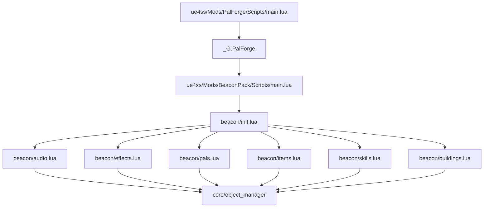
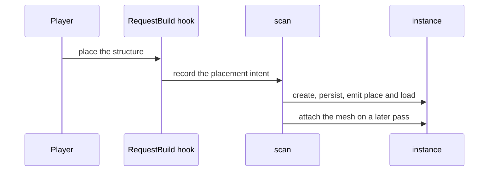
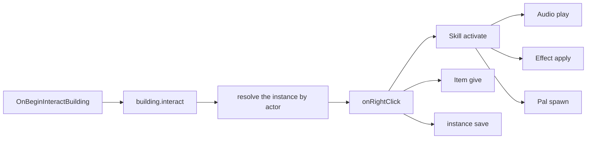

## 读完本页你可以做到

- 把自己的模组文件夹放进 Palworld，看着它被加载
- 让建造菜单里的一个建筑物，在你交互时做点什么
- 一次交互就播放音效、给出增益、发放道具
- 弄清这几步里哪些在这个版本能做到，以及每一步是怎么汇报自己的
- 给你放下的每个建筑物一个计数器，下次进游戏时它还在
- 读游戏日志，找出某件事没发生的原因

## 你要做的东西

一个叫 **BeaconPack** 的包。它接管建造菜单里的一个建筑物——信标——并给它安排点事做：

- 与信标交互会发动一个冷却 30 秒的技能，
- 技能在交互的那个角色身上播放音效，
- 给他一个 12 秒、最多叠 3 层的增益，
- 并在信标的位置召唤一只守护帕鲁，
- 信标本身发放一件道具、数一次使用次数、消耗一次充能，并把这个次数写进世界存档，
- 一个反复运行的处理函数，会在你不在它旁边时把充能补回来。

这些都会在游戏里真的发生。唯一需要事先知道、免得吓一跳的是那只帕鲁：它不会立刻出现，而是在交互
之后几秒才到。到了那个位置会再说一次。

这样 Building、Skill、Audio、Effect、Pal 和 Item 就都在一个包里了。这个包自己就是一个模组
文件夹，复用同一次会话里已经加载好的 PalForge。

开始之前：

- PalForge 已安装并正常加载。`ue4ss/Mods/PalForge/Scripts/main.lua` 在跑，UE4SS 控制台里
  能看到 `[PalForge.main][info] ready`。
- 召唤帕鲁要经过 `UPalCheatManager`，也就是游戏自己的管理对象。PalForge 会去找一个，找不到
  就在玩家控制器上自己造一个，所以你只要在世界里就够了。
- 发放道具走的是背包自己的写入，并且返回它实测到的结果：`Item.Handle:give` 在前后各读一次背包，
  只有数量真的上升了才返回 `true`。
- 生成不是立刻的。`Pal.Handle:spawn` 在调用发出去的当下就返回，而生物要 4 到 8 秒后才到，所以这个
  包里没有任何地方等它，也没有任何地方去核对它到了没有。见 [Pal](/docs/api/pal)。

<Callout type="info">
下面这个信标接管的是游戏里已经有的建筑物、道具和生物。Lua 可以给一个已有的 id 加上行为和
元数据，但没法往游戏的数据表里加一整行新的——发布一个全新的建造物、道具或生物是 PalSchema
的活。等你自己的那一行存在之后，需要改的只有一行代码，见
[改用你自己的 id](#改用你自己的-id)。
</Callout>

## 包的结构

一个包就是它自己的 UE4SS 模组文件夹，有自己的 `Scripts/main.lua`，布局和 PalForge 一样：

```text
ue4ss/Mods/BeaconPack/
    enabled.txt              <- UE4SS's own switch for this mod folder
    Scripts/
        main.lua             <- the entry point UE4SS runs
        beacon/
            init.lua         <- requires every domain module, in dependency order
            audio.lua        <- the sounds
            effects.lua      <- the blessing
            pals.lua         <- the guardian
            items.lua        <- the reward
            skills.lua       <- the signal: sound + blessing + guardian
            buildings.lua    <- the beacon itself
```

按你的 UE4SS 安装所要求的方式打开这个模组文件夹：可以是文件夹里的 `enabled.txt`，也可以是
`mods.txt` 里的一行。重要的是下面那层结构：每种内容一个文件，再加一个把它们全部 require
起来的 `init.lua`。

PalForge 加载的最后一步，是把自己放到一个叫 `_G.PalForge` 的全局变量上：

```lua
_G.PalForge = {
    env    = env,                       -- dev, debug, name, version, gameBuild, multiplayer
    api    = require("palforge.api"),   -- Pal, Item, Building, Skill, Effect, Audio, Mesh, UI, Player
    pack   = api.pack,                  -- the SCOPED surface: PalForge.pack("beacon").Item{ ... }
    utils  = { log, json, file, items },
    core   = { registry, event, object_manager, spawn, mesh, sound, player, spatial, icons,
               uobject, assetpath },
    native = require("palforge.native"),
}
```

你的包读这张表，包需要从 PalForge 拿到的东西全在这里了。`api` 是你写内容时打交道的对象，
`utils.log` 往游戏控制台打印，`core.event` 是事件总线，`native` 是把 Palworld 自己的内容列成
目录，你可以在里面查 id。

**请把你的包写在 `PalForge.pack("beacon")` 上，而不是直接写在 `api` 上。** 它交回来的是同样的
九个成员，其中八个构造器被包了一层，凡是经由它们做出的定义都会把 `beacon` 记成拥有者。有没有这份
归属信息，决定了一次 id 冲突是"悄悄覆盖"还是"一行点出两个包名字的日志"；而且这也是框架唯一能说出
定义归谁的办法——定义调用就是一次普通的 Lua 调用，本身不带任何关于是谁调的证据。不用它，包照样能
跑，只是它的内容会以"无主"的身份注册。

```lua
local api = _G.PalForge.pack("beacon", { depends = { "otherpack" } })
local Item = api.Item

Item{ id = "beacon:Potion" }        -- registered with pack = "beacon"
```

`depends`（以及 `recommends`）记录这个包可以在值里提到哪些命名空间，于是别人命名空间里的 id
要么是声明过的，要么会被报出来。唯一没有被包起来的成员是 `Player`：它什么都不定义，也就没有
可归属的东西。



require 一个模块，就等于注册了它的内容。文件加载时，里面每一次 `X{ ... }` 调用都会执行，把
定义写进 PalForge，所以 **require 本身就是注册**。

## 动手做这个包

<Steps>

<Step>

### 建立模组文件夹

建好 `ue4ss/Mods/BeaconPack/Scripts/beacon/`，再按你的 UE4SS 安装所要求的方式打开这个模组。
准备工作就这些：没有要生成的东西，也没有要编译的东西。

</Step>

<Step>

### 写入口文件

`main.lua` 做三件事：把自己的 `Scripts` 目录加进 `package.path`，好让
`require("beacon.audio")` 找得到你的文件；检查 PalForge 有没有加载；再 require 这个包。保持
简短——内容属于各个模块。

```lua title="ue4ss/Mods/BeaconPack/Scripts/main.lua"
-- BeaconPack — a PalForge content pack, running as its own UE4SS Lua mod.
--
-- Install layout (mirrors PalForge's own):
--   ue4ss/Mods/BeaconPack/Scripts/main.lua      <- this file
--   ue4ss/Mods/BeaconPack/Scripts/beacon/*.lua  <- the pack's modules

-- Make require() resolve beacon.* relative to this Scripts dir.
local thisDir = debug.getinfo(1, "S").source:match("@?(.*[\\/])") or ""
package.path = thisDir .. "?.lua;" .. thisDir .. "?\\init.lua;" .. package.path

-- PalForge publishes itself on _G.PalForge at the end of its own main.lua.
local forge = _G.PalForge
if not forge then
    pcall(print, "[BeaconPack] PalForge is not loaded - this pack does nothing this session")
    return
end

local log = forge.utils.log.scope("beacon")
log.info("loading against PalForge v" .. tostring(forge.env.version))

local ok, err = pcall(function() require("beacon") end)
if not ok then
    log.err("load failed: " .. tostring(err))
else
    log.info("loaded")
end
```

`forge.utils.log.scope("beacon")` 给你一个带 `info`、`warn` 和 `err` 的日志器。每个都只收一条
消息。它打印的每一行都以 `[PalForge.beacon]` 加级别开头——`[PalForge.beacon][info]`、
`[PalForge.beacon][warn]`、`[PalForge.beacon][err]`——所以你可以像筛选 PalForge 的输出那样
筛选自己包的输出。

<Callout type="warn">
`_G.PalForge` 只在 PalForge 自己加载之后才存在，而且只存在于同一个 Lua 状态里。你的包必须
加载进那个状态，并且排在它后面。上面那段守卫是安静地返回而不是报错，所以你要是看到这条
消息，就去检查 UE4SS 加载这两个模组文件夹的顺序。
</Callout>

</Step>

<Step>

### 写包的索引文件

每种内容一次 require，按依赖顺序排：技能要用音效、增益和守护帕鲁，建筑物要用技能和奖励
道具。

```lua title="Scripts/beacon/init.lua"
-- beacon — the pack's modules, one per domain, required in dependency order.
-- Requiring a module IS registering its content: every X{ ... } call inside runs on
-- require and writes the definition into PalForge's object_manager.
local M = {}

M.audio     = require("beacon.audio")      -- the sound the beacon plays
M.effects   = require("beacon.effects")    -- the blessing it hands out
M.pals      = require("beacon.pals")       -- the guardian it calls
M.items     = require("beacon.items")      -- the reward it pays out
M.skills    = require("beacon.skills")     -- the signal: sound + blessing + guardian
M.buildings = require("beacon.buildings")  -- the structure the player interacts with

return M
```

</Step>

<Step>

### 声明音效

声音是你想放的时候自己放，没有谁替你放。一个定义用两种方式指向同一个 `AkAudioEvent`，也就是
游戏自己的音效事件。`soundPath` 是真正会播放的资源路径，`soundId` 是按名字查的备用方案。

```lua title="Scripts/beacon/audio.lua"
-- beacon.audio — the sounds this pack plays.
local api   = _G.PalForge.pack("beacon")
local log   = _G.PalForge.utils.log.scope("beacon.audio")
local Audio = api.Audio

local M = {}

-- The beacon's activation sound, named by the pack. Both fields point at the SAME event;
-- the pair is copied out of PalForge's AkAudioEvent catalog (native.audio.CATALOG).
M.Signal = Audio.se{
    id          = "beacon:Signal",
    name        = "Beacon Signal",
    description = "Played on the interacting character when the beacon fires.",
    soundId     = "AKE_BuffAura",
    soundPath   = "/Game/Pal/Sound/Events/SE/System/StatusCondition/AKE_BuffAura.AKE_BuffAura",
}

-- The same thing, looked up by name instead of typed out: native.audio.se returns a ready
-- handle for any catalog name, and nil for a name the catalog does not have.
M.Reward = _G.PalForge.native.audio.se("AKE_CampLevelUp")
if not M.Reward then log.warn("AKE_CampLevelUp is not in the AkAudioEvent catalog") end

return M
```

`Audio.se` 和 `Audio.bgm` 会替你填好 `kind`。`kind` 只是给你自己看的标签：音乐和音效走的是
同一个播放调用。

<Callout type="warn">
`soundFile`（你自己的音频文件）在定义时就会被拒绝，错误里会点出未决项 `audio-custom-file-loader`。
这个版本上自带音频放不出来：UE 原生那条路没有能活到发行版的导入器，Wwise 那条路是把打包时已经准备
好的媒体重新绑一遍，而不是去读文件。请改成点名一个游戏自带的声音。另外 `Handle:stop` 和
`Handle:setVolume` 都不是按单个声音来的：两者作用的都是那个 actor 上正在播放的一切，所以想让某一个
声音更轻，就挑一个更轻的事件。
</Callout>

</Step>

<Step>

### 声明效果

效果有自己的一套时间表。`:apply(target)` 开始一次实际生效，PalForge 会在共用的 500 ms 心跳上
推进它，直到它到期，或者你把它移除。

```lua title="Scripts/beacon/effects.lua"
-- beacon.effects — the blessing the beacon hands out.
local api    = _G.PalForge.pack("beacon")
local log    = _G.PalForge.utils.log.scope("beacon.effects")
local Effect = api.Effect
local Item   = api.Item

local M = {}

-- 12 seconds long, ticking every 3, up to 3 stacks. The timing is owned by PalForge; the
-- gameplay is owned by these handlers.
M.Blessing = Effect{
    id          = "beacon:Blessing",
    name        = "Beacon Blessing",
    description = "A short blessing granted by the beacon.",
    duration    = 12.0,
    interval    = 3.0,
    stackable   = true,
    maxStacks   = 3,
    events = {
        onApply = function(effect, target, ctx)
            -- ctx carries effect and stacks, plus whatever you passed to :apply.
            log.info("blessing applied by " .. tostring(ctx.source))
        end,
        onStack = function(effect, target, ctx)
            log.info("blessing stacked to " .. tostring(ctx.stacks))
        end,
        onTick = function(effect, target, ctx)
            -- One berry per tick, scaled by the stack count. ctx.elapsed is how long this
            -- application has been alive, in seconds.
            Item.get("Berries"):give(ctx.stacks)
            log.info(string.format("blessing tick at %.1fs", ctx.elapsed))
        end,
        onExpire = function(effect, target, ctx)
            -- ctx.reason is "duration", "removed", "target_gone" or "world_left".
            log.info("blessing ended: " .. tostring(ctx.reason))
        end,
    },
}

return M
```

效果处理函数的第一个参数，就是这个效果的**句柄**，所以 `:remove`、`:timeLeft` 和
`:stacksOn` 直接就在手边。你传给 `:apply(target, ctx)` 的东西，在 `onApply` 和 `onStack` 里
读得到。`onTick` 和 `onExpire` 拿到的则是运行时自己的 context：`effect`、`elapsed`、
`stacks`，结束时还有 `reason`。

<Callout type="warn">
定义里的 `nativeStatus` 会在效果运行期间点亮游戏本身的状态图标，结束时再熄灭。它并不会顺带把玩法
一起带来，所以效果实际要做的事情，请写进 `onTick` —— 图标和伤害是两回事。
</Callout>

</Step>

<Step>

### 声明守护帕鲁

`"Kitsunebi"` 是游戏里已经有的生物 id，所以这个定义是给一只已有的生物加上行为。不要写
`mesh`：这只帕鲁本来就有自己的模型，只有当你想给它换一副模型时才写 `mesh`。

```lua title="Scripts/beacon/pals.lua"
-- beacon.pals — the guardian the beacon calls.
local api = _G.PalForge.pack("beacon")
local log = _G.PalForge.utils.log.scope("beacon.pals")
local Pal = api.Pal

local M = {}

M.Guardian = Pal{
    id          = "Kitsunebi",
    name        = "Beacon Guardian",
    description = "The creature the beacon calls.",
    -- Ids only. Nothing equips them for you; read them back with :skillsOf().
    skills      = { "beacon:Flare" },
    events = {
        onSpawned = function(pal, ctx)
            log.info("guardian spawned: " .. tostring(ctx.actor))
        end,
        onDamaged = function(pal, ctx)
            log.info("guardian took damage")
        end,
        onCaptured = function(pal, ctx)
            log.info("guardian captured - the beacon lost its keeper")
        end,
        onDeath = function(pal, ctx)
            log.info("guardian died")
        end,
    },
}

return M
```

PalForge 从生成出来的那只生物的蓝图类名里找到这个定义：`BP_Kitsunebi_C` 变成 `Kitsunebi`，
再拿去查。没有自己定义的原版帕鲁谁也匹配不上，处理函数会被跳过。

帕鲁也可以声明 `onTick`。PalForge 每三秒扫一遍世界里活着的帕鲁，每只调用一次，`ctx.actor`
是那只生物，`ctx.count` 是心跳序号，`ctx.now` 是时钟。同一个 id 的所有个体共用一个句柄，
所以要按个体存的东西，请你自己用 `ctx.actor` 做键。用
`require("palforge.core.event").PAL_SCAN_MS = 5000` 改节奏，设成 `0` 就把这轮扫描关掉。

</Step>

<Step>

### 声明奖励道具

```lua title="Scripts/beacon/items.lua"
-- beacon.items — the reward the beacon pays out.
local api  = _G.PalForge.pack("beacon")
local log  = _G.PalForge.utils.log.scope("beacon.items")
local Item = api.Item

local M = {}

-- "Ruby" is a real game ItemId. Defining it attaches metadata and handlers to that id; it
-- does not create a new inventory row.
M.Reward = Item{
    id          = "Ruby",
    name        = "Ruby",
    description = "What the beacon pays out.",
    category    = "material",
    maxStack    = 999,
    -- Metadata: nothing in PalForge publishes a recipe into the game's crafting tables.
    -- Read it back with Item.get("Ruby"):recipeOf().
    recipe = {
        materials = { Stone = 20, Flint = 5 },
        count     = 1,
        work      = 30,
        station   = "Workbench",
    },
    events = {
        onObtain = function(item, ctx)
            log.info("reward obtained x" .. tostring(ctx.count) .. " via " .. tostring(ctx.via))
        end,
        onCraft = function(item, ctx)
            -- Fired when a production finishes at a real machine. ctx.count is absent: the
            -- per-craft count lives in the recipe row, not on the hook.
            log.info("reward crafted from recipe " .. tostring(ctx.recipeId))
        end,
    },
}

return M
```

<Callout type="info">
道具的四个处理函数都是活的。`onObtain` 有两个来源，去重后合成一个事件：游戏自己那条"你获得了
一件道具"的日志（`PalPlayerState:AddItemGetLog_ToClient`，`ctx.via = "getlog"`），以及背包的添加
（`PalPlayerInventoryData:AddItem_ServerInternal`，`ctx.via = "additem"`）。两个都挂上，是因为它们
朝相反的方向失效，而 `ctx.via` 会说出这次是哪一个送来的。`onCraft` 在真实设备上一次生产完成时
触发（`ctx.itemId`、`ctx.recipeId`、`ctx.via = "convert" | "product"`）；`ctx.count` 是特意没有的，
因为每次产出的数量写在配方行里，而钩子不是读数据表的地方。`onDiscard` 在丢弃或处理掉时触发
（`ctx.itemId`、`ctx.count`、`ctx.reason = "drop" | "dispose"`）。
</Callout>

</Step>

<Step>

### 声明信号技能

游戏不会替你调用技能处理函数。是你自己发动它。`:activate(owner)` 当场运行 `onActivate`，而在
技能还在冷却时会拒绝——这正好就是信标想要的那道闸门。

```lua title="Scripts/beacon/skills.lua"
-- beacon.skills — the signal the beacon fires. :activate runs the handler now and refuses
-- while the skill is still cooling down, so the beacon gets its rate limit for free.
local api     = _G.PalForge.pack("beacon")
local log     = _G.PalForge.utils.log.scope("beacon.skills")
local Skill   = api.Skill
local audio   = require("beacon.audio")
local effects = require("beacon.effects")
local pals    = require("beacon.pals")

local M = {}

M.Flare = Skill{
    id          = "beacon:Flare",
    name        = "Beacon Flare",
    description = "Sound, blessing and a called guardian - the beacon's whole payload.",
    kind        = "active",
    element     = "fire",
    cooldown    = 30.0,
    power       = 25,
    events = {
        onActivate = function(skill, owner, ctx)
            audio.Signal:play(owner)                                -- on the interacting character
            effects.Blessing:apply(owner, { source = ctx.beacon })  -- 12s, stacks to 3
            pals.Guardian:spawn{ at = ctx.at, level = 5 }           -- arrives seconds later
            log.info("flare fired from " .. tostring(ctx.beacon))
        end,
    },
}

return M
```

冷却是按 owner、按技能 id 分开记的，所以两个玩家各冷各的。它不是按信标记的：这里的 owner 是
`ctx.player`，所以同一个玩家的第二个信标，也要等这 30 秒过完才动。

</Step>

<Step>

### 声明信标本身

你放下的每个建筑物都有自己的一个活对象，下面这些处理函数里的 `self` 就是它。`self.actor` 是
放下的那个 actor，`self.pos` 是它在世界里的位置，`self.state` 是一张属于你的、会被保存的表，
`self.key` 是它在存档里的稳定名字，`self:save()` 把 state 写进世界存档。

```lua title="Scripts/beacon/buildings.lua"
-- beacon.buildings — the structure the player interacts with.
local api      = _G.PalForge.pack("beacon")
local log      = _G.PalForge.utils.log.scope("beacon.buildings")
local Building = api.Building
local items    = require("beacon.items")
local skills   = require("beacon.skills")

local M = {}

-- "Altar" is a real game BuildObjectId, so the beacon claims a structure that is already in
-- the build menu.
M.Beacon = Building{
    id           = "Altar",
    name         = "Signal Beacon",
    description  = "Interact with it to fire the beacon.",
    gridCm       = 100,
    tickInterval = 4,   -- every 4th heartbeat, so roughly every 2 seconds
    -- A factory, not a plain table: a plain table is handed to every new instance as the
    -- SAME table, and two beacons would then share one counter.
    state = function()
        return { uses = 0, charges = 3 }
    end,
    events = {
        onPlace = function(self, ctx)
            log.info(string.format("beacon placed at %.0f/%.0f/%.0f",
                self.pos.x, self.pos.y, self.pos.z))
            self:save()
        end,
        onLoad = function(self, ctx)
            log.info(string.format("beacon tracked %s: %d use(s), %d charge(s)",
                ctx.reconstructed and "from the save" or "fresh",
                self.state.uses, self.state.charges))
        end,
        onRightClick = function(self, ctx)
            if self.state.charges <= 0 then
                log.info("beacon is empty - wait for it to recharge")
                return
            end
            -- ctx.player is the character that interacted; ctx.actor is the structure.
            local fired = skills.Flare:activate(ctx.player, { beacon = self.key, at = self.pos })
            if not fired then
                log.info(string.format("beacon cooling down: %.0fs left",
                    skills.Flare:cooldownLeft(ctx.player)))
                return
            end
            items.Reward:give(3)
            self.state.uses    = self.state.uses + 1
            self.state.charges = self.state.charges - 1
            self:save()
        end,
        onTick = function(self, ctx)
            if self.state.charges >= 3 then return end
            self.state.charges = self.state.charges + 1
            self:setDirty()   -- mark it; the file is written by the next :save() or on world-left
            if self.state.charges == 3 then
                log.info("beacon fully charged at heartbeat " .. tostring(ctx.count))
                self:save()
            end
        end,
        onRemove = function(self, ctx)
            log.info(string.format("beacon gone [%s] after %d use(s)",
                tostring(ctx.reason), self.state.uses))
        end,
        onWorldLeft = function(self, ctx)
            -- The last look at this instance: it is dropped right after, while its saved
            -- record survives for the next load.
            log.info("beacon going quiet: " .. self.key)
        end,
    },
}

return M
```

有两个细节容易漏掉：

- `onTick` 只对写了它的定义运行。没有 `onTick` 的建筑物，根本不会被放进 tick 名单。
- `tickInterval` 数的是心跳，不是秒。一次心跳是 500 ms，所以 `4` 大约两秒。

</Step>

<Step>

### 加载它，然后看日志

两个模组都启用后启动游戏，进入世界，放一个 Altar 再和它交互。UE4SS 控制台会把整件事讲清楚：

```text
[PalForge.main][info] PalForge v0.3.0 starting | game build: declared v1.0.2.101103, live v1.0.2.101103 (PalGameSetting) | dev=true debug=true | dev overlay: Scripts/palforge_dev.lua
[PalForge.main][info] PalForge targets SINGLE-PLAYER Palworld. Dedicated servers and co-op guests are not supported and are not tested: there is no replication layer, and the item, spawn and event routes are all client-authoritative. A pack may appear to work for the host and do nothing for anyone else.
[PalForge.registry][info] initialized (dev=true, debug=true, 17 class(es) registered)
[PalForge.beacon][info] loading against PalForge v0.3.0
[PalForge.beacon][info] loaded
[PalForge.event][info] world ready - building dispatch enabled
[PalForge.beacon.buildings][info] beacon placed at 12345/-6789/420
[PalForge.beacon.buildings][info] beacon tracked fresh: 0 use(s), 3 charge(s)
[PalForge.beacon.effects][info] blessing applied by Altar@123,-68,4
[PalForge.beacon.skills][info] flare fired from Altar@123,-68,4
[PalForge.items][info] give Ruby x3: 0 -> 3 [evidence declared]
[PalForge.beacon.effects][info] blessing tick at 3.0s
[PalForge.spawn][info] spawn.palAt: placed new pal at (12345,-6789,420); it reads back (12345,-6789,420), off by 0
```

注册类的数量和实例键取决于你这次会话，行的顺序则不会变。`onActivate` 先跑音效、效果和生成，再打印
自己那一行，所以增益先被报出来，而 `give` 那一行会在 `:activate` 返回之后出现。

生成那一行晚好几秒才出现在最后，这不是问题，而是“生成”这件事本来的形状：调用是在交互过程中发出去
的，帕鲁随后才到，放置也是那时候才被报告。每一行写的都是实测到的东西 —— `give` 那一行带着背包前后
的数量，生成那一行带着从帕鲁身上读回来的位置 —— 所以跑一次就能确切知道哪一步成了、哪一步没成。

</Step>

</Steps>

## 运行时发生了什么

放下信标不是一次单独的事件。游戏在 actor 存在之前，就通过 `RequestBuild_ToServer` 钩子宣告了
这次放置；随后一个跑在同样 500 ms 心跳上的扫描找到真正的 actor，创建活对象，保存它，并在
*更晚的*一轮里挂上声明过的 mesh。在建筑物放下的那一帧挂 mesh 会让游戏崩溃，所以 mesh 要等。



放下的建筑物自身不带 id，所以 PalForge 用它的建造 id 加上取整后的位置来给每一个命名——
`gridCm = 100` 的信标就是 `Altar@123,-68,4`。这个名字就是 `self.key`，保存记录也存在这个
名字下面。

交互走的是短路径。`OnBeginInteractBuilding` 钩子忽略一秒内的重复，发送 `building.interact`，
PalForge 从 actor 找到活对象，再调用它的 `onRightClick`。



信标剩下的一生，跑在同一个心跳、同一道世界闸门上：

- **世界就绪。** 每秒一次的轮询连续五次都找到有效的 `PalPlayerCharacter`，闸门就打开；之后
  第一次跑完的扫描会发送 `world.ready`，并对每个活着的建筑物调用 `onWorldReady`。闸门打开
  之前，建筑物扫描什么都不做，这样它就避开了加载时那阵风暴。
- **Tick。** `LoopAsync(500)` 发送 `tick`。定义里写了 `onTick` 的每个活着的建筑物都会被调用，
  按各自的 `tickInterval` 来。某个处理函数报错五次，那个建筑物的 `onTick` 就会被关掉并记一条
  警告，其余的照常运行。
- **移除。** 扫描连续六次没找到的建筑物会发送 `building.remove`——所以 `onRemove` 还能看到
  它——然后连同它的保存记录一起被丢掉。
- **离开世界。** 玩家 pawn 失效时会发送 `world.left`，每个活着的建筑物的 `onWorldLeft` 都会
  运行，世界存档被写出，活对象被丢掉。保存记录会留下来，下一次 `onLoad` 就是从它恢复的。

保存 state 有两种方式。`self:save()` 把建筑物标记为已改动，并立刻写世界存档。
`self:setDirty()` 只做标记，对一个一秒跑两次的处理函数来说，这才是你要的——写入发生在下一次
`save()`，或者世界卸载的时候。

启动之后再注册的定义没有问题。建筑物运行时在每次扫描前、以及记录一次放置前，都会重新读一遍
定义，所以比 PalForge 晚几分钟加载的包，它的建筑物一样会被跟踪。

## 游戏调用什么，你调用什么

围绕某个处理函数做设计之前，先看这里。

| 领域 | 游戏调用 | 你调用 |
| --- | --- | --- |
| Building | `onPlace`, `onLoad`, `onRightClick`, `onRemove`, `onTick`, `onBuild`, `onWorldReady`, `onWorldLeft` | `:instances()`, `:render()`, `:update()`, `:unlock()` |
| Pal | `onSpawned`, `onDamaged`, `onDeath`, `onCaptured`, `onTick` | `:spawn()`（帕鲁几秒后才到）、`:renderOn(actor)`、`:skillsOf()`、`:teachAll(actor)` |
| Item | `onObtain`, `onUse`, `onCraft`, `onDiscard` | `:count()`、`:give(n)`、`:take(n)`（消耗掉；需要玩家装备着东西）、`:iconOf()`、`:recipeOf()` |
| Effect | `onApply`, `onTick`, `onStack`, `onExpire`（按 PalForge 自己的时间表） | `:apply()`, `:remove()`, `:isActive()`, `:stacksOn()`, `:timeLeft()` |
| Skill | 没有 | `:activate()`, `:hit()`, `:equip()`, `:unequip()`, `:cooldownLeft()`, `:teach(actor)`, `:forget(actor)`, `:skillsOn(actor)` |
| Audio | 没有 | `:play()`, `:stop()` |

有两个处理函数可以声明，而且永远不会运行：`Building.onLeftClick` 和 `Building.onBreak`。这是
一个已经定下来的否定结论，不是还没找到：可能拥有它们的每个类的完整函数表都读过了。
`PalBuildObject` 有 22 个函数，里面没有任何点击、命中或击打项；唯一一个形状像伤害的，是一个
每 12 到 13 秒走一次、玩家根本不在旁边的老化计时；而破坏只以委托*字段*的形式存在，`RegisterHook`
没法按路径去指它。交互请用 `onRightClick`；建筑物消失请用 `ctx.reason = "missing"` 的 `onRemove`
——它分不清是被拆掉了还是被流式卸载了。两个都保留可声明，这样包自己的 emit 可用，将来出现来源
时也有地方落脚。

`Building.onBuild` 在一个建筑物建造完成时运行，最早可能比它的活对象早一次扫描。它是唯一一个
`self` 是定义而不是活对象的建筑物处理函数，所以 `self.actor`、`self.pos`、`self.state` 和
`self:save()` 都没有，有的是 `ctx.buildId` 和 `ctx.model`。同一个信号在打开存档时会对每个
已经立着的建筑物都发一次，所以 PalForge 要等世界加载完才开始听它。放置的处理仍然是
`onPlace` 更稳妥；`onBuild` 请先在一个可以丢掉的世界里试。

`Building.onWorldReady` 是世界加载时的一次性时刻，不是每个建筑物一次。`world.ready` 由世界
打开后第一次跑完的扫描发送，所以玩家附近的建筑物已经被跟踪，能收到它——但更晚的扫描里才流
进来的就收不到。每个建筑物自己的初始化，请放进 `onLoad`，那里的 `ctx.reconstructed` 会告诉你
这个建筑物是从存档回来的。你也可以用 `event.on("world.ready", fn)` 自己订阅这个频道。

`Pal.onSpawned` 挂在三个来源上，而且全都只在世界加载完之后才装：同一个信号会在加载风暴里为世界
中已有的每只帕鲁触发一次，在启动时就装会把共享的钩子分发挤死。`BroadcastOnCompleteInitializeParameter`
在真实存档里被测出什么都不送，所以真正干活的是绑在它上面的两个委托接收方：
`PalPlayerCharacter:OnCompleteInitializeParameter`（只对玩家订阅过的角色触发）和
`PalNPC:OnCompletedInitParam`（绑在帕鲁自己那一侧，所以不依赖谁去订阅）。请让处理函数跑两次也
不出事。

## 更多做法

### 给信标一副自己的 mesh

mesh 本身就是一种内容，所以你可以只声明一次，让好几个定义都穿上它。加一个模块：

```lua title="Scripts/beacon/meshes.lua"
-- beacon.meshes — named visuals, so a model is declared once and reused by id.
local api  = _G.PalForge.pack("beacon")
local Mesh = api.Mesh

local M = {}

-- A structure wears a STATIC mesh. Any UStaticMesh path works; this one ships with the game.
M.Beacon = Mesh{
    id    = "beacon:BeaconBody",
    kind  = "static",
    model = "/Game/Pal/Model/Other/PalBox/SM_PalBox.SM_PalBox",
    scale = 1.0,
    color = { r = 1.0, g = 0.6, b = 0.1, a = 1.0 },
}

return M
```

然后在 `beacon/buildings.lua` 顶部 require 它（`local meshes = require("beacon.meshes")`），
把句柄作为定义的 `mesh` 传进去（写在 `gridCm` 旁边：`mesh = meshes.Beacon,`）。你可以传一个
mesh 句柄，也可以就地把 mesh 写出来——`mesh = meshes.Beacon` 和
`mesh = { kind = "static", model = "..." }` 的检查方式完全一样。

mesh 挂上之后，`self.color` 加 `self:update()` 就能在处理函数里给它重新上色：

```lua
onTick = function(self, ctx)
    self.color = (self.state.charges >= 3)
        and { r = 1.0, g = 0.9, b = 0.3, a = 1.0 }
        or  { r = 0.4, g = 0.4, b = 0.5, a = 1.0 }
    self:update()
end,
```

`update()` 在没挂 PalForge mesh 的 actor 上什么也不做，而且是安全的，所以给一个没有 mesh 的
定义上色不会失败，只是什么都不会变。

### 改用你自己的 id

带冒号的 id `"beacon:Beacon"` 会变成数据表里的行名 `beacon_Beacon`。等 PalSchema 发布了那一
行，包里只有一处要改：

```lua
M.Beacon = Building{
    id   = "beacon:Beacon",           -- your own row instead of "Altar"
    name = "Signal Beacon",
    -- ... everything else identical
}
```

模组添加的建筑物，它的科技会得到一行以解析后的 id 命名的 `DT_TechnologyRecipeUnlock`，而
`Handle:unlock()` 解锁的正是那一行，建筑物就会出现在建造菜单里：

```lua
_G.PalForge.api.Building.get("beacon:Beacon"):unlock()
```

这个调用要求会话里已经有 `PalCheatManager`，所以它需要 CheatManagerEnabler 模组 —— 这一点和
生成帕鲁那条路不同，那条路在没有时会自己在玩家控制器上造一个。科技解锁走的是道具辅助模块自己的
查找，而那个查找只要一个现成的作弊管理器，不会去造。它事后还会核对：必须存在同名的科技行，
否则日志会写成"调用发出去了，但没有可解锁的东西"，`unlock()` 返回 `false`。

### 加一个调试模块

事件总线随你用，所以一个诊断模块只要几行。订阅不花什么代价，而且每个频道在有东西发上去之前
就已经存在，所以早订阅是安全的。

```lua title="Scripts/beacon/debug.lua"
-- beacon.debug — diagnostics for the pack. Require it from init.lua while developing.
local forge  = _G.PalForge
local log    = forge.utils.log.scope("beacon.debug")
local event  = forge.core.event
local Effect = forge.api.Effect
local Player = forge.api.Player

local M = {}

-- Raw channel traffic, before dispatch resolves anything.
M.subs = {
    event.on("building.interact", function(ctx)
        log.info("interact: buildId=" .. tostring(ctx.buildId))
    end),
    event.on("pal.captured", function(ctx)
        log.info("captured: " .. tostring(ctx.actor))
    end),
}

-- Every 5 seconds: how many beacons are live, and what is on the player.
M.report = event.every(5000, function()
    local beacons = forge.api.Building.get("Altar"):instances()
    local active  = Effect.activeOn(Player.character())
    log.info(string.format("%d beacon(s) live, %d effect(s) on the player",
        #beacons, #active))
end)

-- Stop everything: for _, s in ipairs(M.subs) do s:unsubscribe() end; M.report:unsubscribe()
return M
```

`event.every(ms, fn)` 会向 500 ms 心跳取整，每一次订阅都会还给你一个带 `:unsubscribe()` 的
对象。

## 什么都没发生的时候

**定义的调用报错了。** 每个问题都是硬错误，所以调用绝不会只成功一半。读那条消息——答案通常
整个都在里面。字段名打错了：

```text
PalForge: Building: unknown field "tickinterval" (did you mean "tickInterval"?). Valid fields: id, name, description, gridCm, buildIds, tickInterval, mesh, material, color, texture, icon, state, events, data
```

`events` 里面打错了，嵌套结构的名字也会写出来，你就知道该去读哪份声明：

```text
PalForge: Building: field "events" (Building.Spec.Events): unknown field "onRightclick" (did you mean "onRightClick"?). Valid fields: onPlace, onLoad, onRightClick, onRemove, onTick, onWorldReady, onWorldLeft, onBuild, onLeftClick, onBreak
```

少了必填字段，连那个字段自己的说明一起给你：

```text
PalForge: Building: field "id" is required (build id: a game BuildObjectId ("PalBoxV2") or "pack:name")
```

还有 id 自己的形状，在定义时就检查。带命名空间的 id 会解析成数据表的行名 `packid_name`，所以两半
都必须是字母、数字或 `_` —— 带连字符的 id 会一路定义、注册下去，然后解析不到任何东西：

```text
PalForge: Building: field "id" is invalid: invalid pack id 'my-pack' in 'my-pack:Bench' (letters/digits/_ only)
```

同样的信息也可以在运行时读，不用猜：

```lua
local schema = require("palforge.core.schema")
print(schema.help("Building.Spec"))        -- every field, type, default and meaning
print(schema.help("Building.Spec.Events"))
```

**交互了却什么都没发生。** 先找 `[PalForge.event][info] world ready`——建筑物运行时在等它。
然后确认建筑物有没有被跟踪：`#Building.get("Altar"):instances()`。空列表说明扫描没能把 actor
和你的定义对上，通常是因为 `Building{ id = ... }` 里的 id 不是游戏给那个建筑物用的 id。

**帕鲁没有出现。** 先等够八秒 —— 生成不是立刻的，日志会写它是什么时候到的。如果一直不出现，要排除
的更早一步的失败是没有玩家控制器：没有它时调用根本够不到游戏，并记下
`spawn.palAt: no PalCheatManager and none could be constructed (no player controller yet?)`
。不带 `at` 的 `:spawn()` 报的是同一件事，前缀是 `spawn.pal:`。

**奖励没有到手。** `:give` 在没有观察到背包数量上升时返回 `false`，它的日志行会说明是哪一步停下的：
背包当场拒绝、游戏不认识这个道具 ID，或者背包已经放不下。

**技能永远只发动一次。** 那是 `cooldown` 在干活。冷却期间 `:activate` 返回 `false`。`kind`
是 `"passive"` 的技能也返回 `false`，你自己的处理函数报错时同样返回 `false`。

**效果在 tick，但什么都没变。** 效果跑的是它自己的时间表，不是游戏的状态系统。该发生的事情
要写进 `onTick`。

**两个定义用了同一个 id。** 最后跑的那个定义仍然赢，但现在注册表会把这件事说出来，而不是默默
覆盖；如果两者来自不同的包，它还会把两边都点名：
`item 'mypack:Potion' was defined by pack 'mypack' and is being redefined by pack 'other'; the
new definition replaces the old one (last-wins)`。这行只有在包说出自己是谁时才存在，而
`PalForge.pack("beacon")` 就是为此而设。定义放在加载时做，处理函数里用 `X.get(id)` 取，而不是
每次事件都重新定义一遍。

## 接下来读什么

<Cards>
  <Card title="Building" href="/docs/api/building">
    活对象、它的 state、扫描，以及定义的每一个字段。
  </Card>
  <Card title="Lifecycle" href="/docs/concepts/lifecycle">
    频道、来源和派发，从头到尾。
  </Card>
  <Card title="Skill" href="/docs/api/skill">
    自己发动技能，以及冷却是怎么记的。
  </Card>
  <Card title="Effect" href="/docs/api/effect">
    时长、间隔、叠层，以及每次心跳会跑什么。
  </Card>
  <Card title="Pal" href="/docs/api/pal">
    生成、mesh，以及帕鲁的每一个处理函数。
  </Card>
  <Card title="Item" href="/docs/api/item">
    给予、拿走、配方，以及两个真的会来的道具事件。
  </Card>
  <Card title="Audio" href="/docs/api/audio">
    一个声音是怎么响的、目录，以及还缺什么。
  </Card>
  <Card title="Mesh" href="/docs/api/mesh">
    命名的外观、后端和材质覆盖。
  </Card>
  <Card title="Definitions" href="/docs/concepts/definitions">
    每种内容共有的三个入口。
  </Card>
  <Card title="Schema" href="/docs/concepts/schema">
    字段的形状是怎么声明、检查和读回来的。
  </Card>
  <Card title="Editor setup" href="/docs/concepts/editor-setup">
    从 spec 生成的、覆盖每个字段的补全。
  </Card>
</Cards>

## 小结

- 一个包就是它自己的模组文件夹，带一个 `Scripts/main.lua`。它读 `_G.PalForge`，require 自己的
  模块，模块加载时里面每一次 `X{ ... }` 调用就注册那份内容。
- api 请从 `PalForge.pack("beacon")` 取，而不是 `PalForge.api`：成员是同样的九个，而经由它做出的
  每个定义都会记下归哪个包所有。
- `id` 是任何地方唯一必填的字段，而且它的形状在定义时就会检查。带冒号的 id（`"beacon:Flare"`）
  是你自己的；不带冒号的 id（`"Altar"`、`"Ruby"`、`"Kitsunebi"`）是游戏里已经有的内容。两半都
  只能是字母、数字或 `_`。
- 只有放下的建筑物会拿到自己的活对象。`self.state` 是你的表，`self:save()` 把它写进世界存档，
  下次进游戏它还在。
- 建筑物、帕鲁和道具的处理函数由游戏来调用。技能和声音要你自己发动，效果按 PalForge 自己的
  时间表运行。
- `tickInterval` 数的是 500 ms 的心跳，不是秒。
- 定义写错时，调用会停下，并给出一条指名字段、还建议正确写法的消息；`schema.help("Building.Spec")`
  在运行时打印同一份列表。

接下来读 [Building](/docs/api/building)，那里有一个建筑物能带的每个字段，以及它的活对象能做的
所有事。
