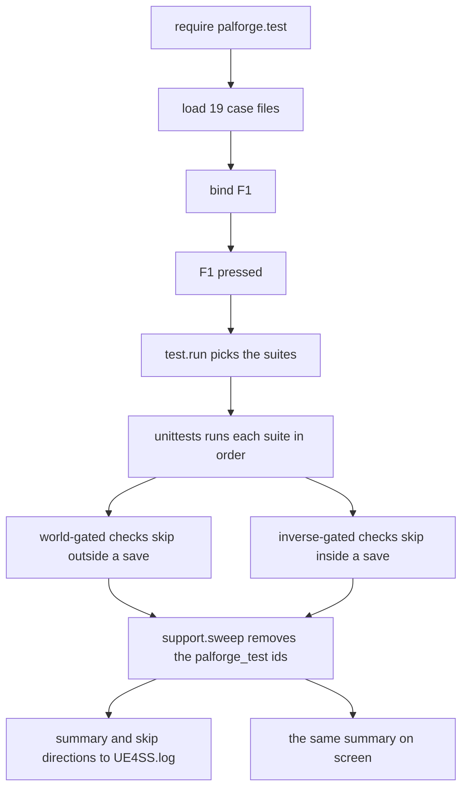

## このページでできるようになること

- PalForge がゲームで読み込まれて動いているかを、数秒で確かめる
- 遊びながら画面に出る「成功・失敗・スキップ」の 1 行を読む
- なぜ 1 回の押下ではすべてのチェックを走らせられないのか、残りはどこで押せば埋まるのかを知る
- 全部ではなく、気になる部分だけを実行する
- 動いている Palworld でしか答えられない計測を、名前を指定して 1 つずつ実行する
- ゲームがまだ取っていないキーに、自分のコンテンツを割り当てる
- 自分のチェックを足して、壊れたパックをプレイヤーより先に見つける

## F1 を 2 回押す

ゲーム中に **F1** を押します。少しすると、画面に 2 行出ます。

```text
[PalForge] tests: running 19 suite(s)
[PalForge] tests: 577 passed, 0 failed, 35 skipped (31 need a world, 1 need a declared test/hooks run, 3 could not be answered by this session)
```

`0 failed` が「自分の環境は動いているか」への答えです。PalForge は読み込まれ、あなたが書く api は
api ページの説明どおりに動き、ゲームもその呼び出しを受け付けています。0 以外の数字が出たときは、
壊れている場所が画面とログに名指しで出ます。

**1 回の押下ですべてのチェックが走ることはありません。サマリはそれを言葉で言います。** 31 件は
ロード済みのセーブを必要とし、タイトル画面ではスキップされます。さらに 18 件は逆向きで、*拒否*の
経路（閉じたままの ready ゲート、描画先のオーナーがないウィジェット、ポーンのない
`Player.coordinate()`）を確かめるものなので、成功しうるものが何もない場所でしか走れません。この
18 件のうち 5 件はワールドが立ち上がるとスキップされ、タイトル画面で走ります。残る 13 件は
エンジンをまったく必要とせず、ヘッドレスの `lua5.4` プロセスでしか走りません。どのセッション状態
でも、1 回の押下がすべてを計測することはありません。タイトル画面で 1 回、セーブデータ内で 1 回
押してください。緑の実行結果とは 2 回分の実行のことです。

同じ 612 件のチェックは、ゲームがまったく無くても実行できます。CI がやっているのはこれです。

```bash
npm test        # cd Scripts && lua5.4 ... palforge.test.run()
```

```text
tests: 576 passed, 0 failed, 36 skipped (612 total)
tests: 36 skipped (31 need a world, 1 need a declared test/hooks run, 3 could not be answered by this session, 1 did not say which)
```

**2 つの経路の差はチェック 1 件で、これは食い違いではありません。** `npm test` は `run()` を直接
呼びます。F1 は `install()` を経由して到達し、`install()` は F1 の割り当ても行います。そのため
*PalForge がすでに握っているキーは拒否され、その拒否は握っている側を名指しする*ことを確かめる
`ui` のチェックは、F1 経路では拒否される相手のキーがありますが、`npm test` 経路では見るものが
なく、方向を示さずにスキップします。`install()` はさらに先にヘッドレスの起動バンドルを走らせ、
612 件の前に自分の `8 passed, 0 failed, 0 skipped` の行を出します。

上の 2 つの数字はどちらも、2026-08-03 にエンジンのない素の `lua5.4` プロセスで実際に走らせた値です。
ゲーム内ではワールド依存の 31 件が代わりに走り、`could not be answered by this session` の 3 件の
うち 2 件もなくなります。その 2 件は、素の Lua プロセスには `LoopAsync` も UE4SS の `Key` テーブルも
ないという理由だけで出ているものです。



チェックの読み込みと F1 への割り当ては、ゲーム起動時に一度だけ行われます。`F1 pressed` から
下は、キーを押すたびに毎回実行されます。

起動時にこれらのチェックに対して行われるのは**読み込みだけ**で、実行はされません。チェックはパルを
スポーンさせアイテムを配るので、実行は必ずあなたが指示したときだけ起きます。起動時に実際に走るのは
ヘッドレスの `units/` バンドルだけで、それが別ディレクトリになっている理由でもあります。触れるのは
Lua のテーブルだけだからです。

キーは `core/keyboard/base/registory` 経由でインストールされ、コールバックは
`ExecuteInGameThread` と `pcall` で包まれます。チェックが例外を投げても、キーボード入力まで
巻き添えにすることはありません。

F1 があるのは dev セッションだけで、`env.dev` は `false` の状態で配布されます。`env.debug` も
同じです。フレームワークの側でこれらを自分で有効にするものはありません。dev セッションでは
任意モジュール `Scripts/palforge_dev.lua` で有効にします。このファイルは `tools/deploy.sh` が
既定モードで書き出し、`--release` では削除し、gitignore されているのでリポジトリ経由で
プレイヤーに届くことはありません。

```lua title="Scripts/palforge_dev.lua"
local env   = require("palforge.env")
env.dev     = true
env.debug   = true
-- Per-hook opt-in for the hooks that write into a real save.
-- env.debugHooks["pal-skills-equip"] = true
```

`dev = false` なら PalForge はコンテンツカタログだけを読み込みます。dev キーバインド（F4 は
ロード中のセーブの全テクノロジーを解放します）も、F1 のスイートも、F9 リロードも、カタログ
ダンパーも、ヘッドレス束も、テストフックもありません。起動ログは読み込んだものと読み込まなかった
ものを 1 つずつ名前で記録するので、「キーが効かない」と「キーが割り当てられていない」は別々の行に
なります。

<Callout type="warn">
`reg.register` はフェイルソフトです。そのセッションで `RegisterKeyBind` または UE4SS の `Key`
テーブルが利用できない場合、`could not bind F1 (keybinds unavailable this session)` を記録して
`false` を返します。その場合押すキーは存在しないので、自分のコードから `test.run()` を呼んで
ください。
</Callout>

## テストツリー

このページに出てくるものはすべて `Scripts/palforge/test/` の下にあり、5 つの区画を持つ 1 本の
ツリーです。製品コードが知っている名前は `test/init.lua` だけで、`core/registry.lua` は dev
ゲートの内側でこれを require し、`install()` を呼びます。この 1 回の呼び出しが起動時バンドルを
走らせ、ケースファイルを読み込み、F1 とプローブのキーを割り当て、`ps_catalog` を含むすべての
`pf_*` コンソールコマンドを登録し、`core/autorun` にアクションテーブルを渡します。

```text
Scripts/palforge/test/
├── init.lua      唯一の入口。install() が以下すべてを配線する
├── units/        ヘッドレスのスイート。起動時に走る - スイート 2 本、チェック 8 件
├── cases/        ゲーム内 API スイート。F1 で走る - 19 ファイル
├── hooks/        Palworld が動いていないと取れない計測 - 25 件宣言、自動実行は無し
├── probes/       調査用ダンプ - テストではなく、合否を一切出さない
├── tools/        dev 用の道具 - catalog.lua、ps_catalog の中身
├── support.lua   ワールドの読み取り、名前空間付き ID、スイープ
└── probe.lua     プローブとフックが出力を囲む BEGIN/END のブラケット
```

| ディレクトリ | 何がここに属するか | いつ走るか |
| --- | --- | --- |
| `units/` | Lua のテーブル以外に触れないスイート | 起動時、dev セッションのたび |
| `cases/` | ワールド・ポーン・UObject・UE4SS のグローバルを必要とするスイート。環境が無ければ方向付きで skip する | F1 を押したときだけ |
| `hooks/` | ゲームが動いていないと取れない計測。多くは画面を見る人間が要る | 名前で呼ばれたときだけ |
| `probes/` | エンジンの実際の姿のダンプ。未解決の問いを閉じるためのもの | 専用キー、または `pf_<name>` |
| `tools/` | そもそもテストではない道具 | そのコマンドを打ったとき |

`units/` の条件が一番狭く、それが起動を安全に保っています。このバンドルは最初のワールドが存在する
前、まだロード中のゲームの中で丸ごと走るので、ここに置いたスイートがブロックしたり例外を投げたり
すると毎回の起動が遅れます。ワールド・ポーン・UObject・UE4SS のグローバルが要るチェックは、
`cases/` のスイートか `hooks/` の計測です。

**リリースデプロイにはこれが一切入りません。** `tools/deploy.sh --release` はステージしたコピー
から `palforge/test/` を 58 ファイルまるごと削除します。カーネルの唯一の
`require("palforge.test")` はそこで `absent` を返しますが、それはプレイヤーのインストールとして
正しい状態であって、不完全なインストールではありません。このページのものはプレイヤーには届き
ません。スイートもプローブキーもフックも `pf_*` コマンドも `ps_catalog` も、どれ 1 つとして。

## 何がチェックされるのか

チェックは全部で **612 件**あり、**19 個**の**スイート**に分かれています。スイートとは api の
1 領域を受け持つチェックのまとまりで、それぞれ `Scripts/palforge/test/cases/` の 1 ファイル
です。チェックはあなたのセッションの実際のゲームに対して走ります。

| スイート | チェック数 | セーブ内でしか走らない | エンジンが無いときしか走らない |
| --- | --- | --- | --- |
| `schema` | 28 | 0 | 0 |
| `registry` | 42 | 0 | 0 |
| `definitions` | 23 | 0 | 0 |
| `store_codec` | 19 | 0 | 0 |
| `store_state` | 36 | 0 | 0 |
| `store_api` | 12 | 0 | 1 |
| `store_runtime` | 5 | 0 | 5 |
| `store_disk` | 27 | 0 | 0 |
| `native` | 26 | 0 | 0 |
| `pal` | 34 | 5 | 0 |
| `item` | 39 | 6 | 0 |
| `building` | 32 | 3 | 1 |
| `skill` | 39 | 3 | 0 |
| `effect` | 40 | 2 | 0 |
| `audio` | 24 | 4 | 1 |
| `mesh` | 46 | 3 | 1 |
| `ui` | 116 | 1 | 7 |
| `player` | 10 | 4 | 1 |
| `events` | 14 | 0 | 1 |

真ん中の列が、実際の実行から数えたワールド依存の 31 件です。右の列はゲームがロードされた状態では
走れない 18 件で、ここには 2 種類のゲートが同居しています。5 件は `support.needNoWorld` を呼び、
タイトル画面では走ります（`store_api`、`building`、`audio`、`player`、`events`）。13 件は
`support.needNoEngine` を呼び、ヘッドレスのプロセスでしか走りません（`store_runtime` の 5 件、
`ui` の 7 件、`mesh` の 1 件）。これらが確かめるのは、`LoadAsset` が無く、オーナーが無く、
差し替える `FindAllOf` も無いときに何が起きるかで、UE4SS のセッションにはその 3 つが揃っています。

表の並びがそのまま実行順で、その実体は `Scripts/palforge/test/init.lua` の `M.CASES` です。F1 が
どのスイートを走らせるかについて、権威はそのリストだけです。Lua だけで完結するスイートを先に
走らせるので、基礎部分の破損はセーブデータに触れる前に報告されます。

`pal` の 1 件はどちらの列にも入りません。`teachAll` の書き込み側は生きたパルを必要とし、実際の
セーブを書き換えるため、F1 ではなく宣言済みフックが計測します。そのスキップ行には、計測を行う
フックの名前が付きます。そのフックはすでに実行済みです——`pal-skills-equip`、実セーブ上で
8 pass / 0 fail——なので、このスキップは「不明」ではなく「別の場所で計測済み」という意味です。

`store_runtime` の 5 件もどちらの列にも入りません。理由はもっと鋭いものです。これらは偽のアクター
一覧を相手に建物スキャンを動かすので、UE4SS がロードされた状態でそれをやると、実際の 500 ms の
スイープにプレイヤーの構造物が 1 つも入っていないワールドを渡すことになり、そのすべてがスキャンを
外して隔離されてしまいます。そのため `lua5.4` のヘッドレスでのみ走り、ゲーム内では 2 つの状態の
どちらでもスキップし、そう言います。残る 4 つの store スイートは純粋な Lua でどこでも走ります。
5 つのいずれも `state/` には書きません。3 つはストアの I/O をまるごと差し替え、実際のファイル
システムに会う必要がある `store_disk` は OS の一時ディレクトリ配下の使い捨てディレクトリで動きます。
プレイヤーの保存された状態が住むモジュールのスイートが、プレイヤーの保存された状態に書き込めては
ならないからです。

## 出力を読む

結果は 2 か所に出ます。`UE4SS.log` にはすべてが記録され、スコープは `[PalForge.test]`（ランナー）と
`[PalForge.unittests]`（フレームワーク）です。

```text
[PalForge.test][info] build 2026-08-02 12:41:30 | dev=true debug=true | game v1.0.2.101103 (live v1.0.2.101103) | running 19 suite(s): schema, registry, definitions, store_codec, store_state, store_api, store_runtime, store_disk, native, pal, item, building, skill, effect, audio, mesh, ui, player, events
[PalForge.unittests][info] SKIP [player] coordinate returns the local player's position as numeric x, y, z (world): no world loaded
[PalForge.unittests][info] tests: 577 passed, 0 failed, 35 skipped (612 total)
[PalForge.unittests][info] tests: 35 skipped (31 need a world, 1 need a declared test/hooks run, 3 could not be answered by this session)
[PalForge.unittests][info] tests: 31 check(s) were not measured because there is no world loaded - load a save and press the key again.
[PalForge.unittests][info] tests: 1 check(s) can only be measured by a declared hook - `pf_hooks` lists them with the reason each one would skip, and each SKIP line above names the action that runs its own.
[PalForge.test][info] swept 127 test definition(s)
```

行は 5 種類として読みます。

- 出所の行。`tools/deploy.sh` が書いたビルドスタンプ、2 つのスイッチ、すべての機能を計測した
  Palworld のビルドと動いているゲームが報告するビルド、そしてこの押下がこれから何をするのか。
  読み込み済みの Lua は読み込まれたままなので、スタンプが直前のデプロイより古ければ F9 が
  押されていないということであり、その下の内容はいま書いたコードの証拠になりません。
  `unstamped (not deployed by tools/deploy.sh)` は手でコピーしたツリーです。
- `SKIP [suite] test (direction): reason` — スキップされたチェック 1 件につき 1 行。どの状態なら
  走ったのかを併記します（`world` / `no-world` / `hook` / `opt-in` / `setup` / `session`）。
  スキップは異常ではないので `info` レベルです。
- `FAIL [suite] test: message` — アサーションのメッセージ付きで `err` レベルに記録されます。
- `tests: P passed, F failed, S skipped (T total)` — 最初に見るべき 1 行。
- その下の内訳。上の行を読めるものにしているのはこれです。どの状態を待っているスキップが何件あるか、
  そして両方向が待っている場合には「1 回の実行ではすべては測れない」という文が出ます。

サマリは `SendSystemAnnounce` で画面にも出ます。先頭に `[PalForge]` が付き、内訳の節も同じものが
付くので、実際に何が測れたのかを知るために alt-tab する必要はありません。

```text
[PalForge] tests: running 19 suite(s)
[PalForge] tests: 577 passed, 0 failed, 35 skipped (31 need a world, 1 need a declared test/hooks run, 3 could not be answered by this session)
[PalForge] FAIL [item] give really adds to the live inventory, measured both ways: the Wood count must RISE across a give (135 -> 135)
```

失敗はすべて 1 件ずつ画面に繰り返されます。`3 failed` としか言わないサマリでは、結局ログに戻る
ことになるからです。

<Callout type="info">
素の `N skipped` では、ほぼすべてを測れた実行と、ほとんど測れなかった実行を見分けられません。
だからスキップは方向を持ちます。`31 need a world` は行動に移せる 1 文ですが、`35 skipped` は
そうではありません。
</Callout>

## 1 つのスイートだけ実行する

`test.run` は引数なし、スイート名 1 つ、または名前のリストを受け取ります。

```lua
local test = require("palforge.test")

test.run()                        -- every suite this module owns
test.run("schema")                -- one
test.run({ "pal", "item" })       -- several
```

結果テーブルを返すので、自分のツールから確かめられます。

```lua
local results = test.run("item")

print(results.passed, results.failed, results.skipped, results.total)
for direction, n in pairs(results.needs) do print(direction, n) end   -- world, no-world, hook, ...
for _, suite in ipairs(results.suites) do
    print(suite.name, suite.passed, suite.failed, suite.skipped)
    for _, f in ipairs(suite.failures) do print("FAIL", f.test, f.msg) end
    for _, s in ipairs(suite.skips)    do print("SKIP", s.test, s.needs, s.msg) end
end
```

引数なしの `test.run()` が実行するのは、この 19 スイートだけです。起動時バンドルは別物で、純 Lua
のチェック群 `palforge.test.units` を、カーネルではなく `test/init.lua` の `install()` が走らせ
ます。これらも同じ一覧に登録されますが、F1 は意図的に手を出しません。登録済みのすべてに
届かせたいときは、1 段下を使います。

```lua
local T = require("palforge.core.unittests")

T.names()            -- every registered suite name, sorted
T.byName("pal")      -- one suite, or nil
T.run()              -- EVERY registered suite, including the headless bundle
T.NEEDS              -- the seven skip directions, as the summary spells them
```

その登録簿を空にする手段は意図的に用意されていません。スイート一覧はプロセスと同じ寿命を持ち、
本当に白紙が必要になる場面 —— 編集したケースファイルの読み直し —— は F9 が担当します。F9 は
`palforge.*` のモジュールをすべて落として、一覧をゼロから組み直します。

`palforge.test` は自分自身についても報告します。

```lua
test.CASES       -- the case names, in run order
test.loaded      -- case name -> suite, or false when the file failed to load
test.suites()    -- the names that actually loaded, in run order
test.ACTIONS     -- name -> function, every pf_* command this module owns
test.bindings()  -- one line per PalForge key, with what the GAME has on the same key
```

`test.bindings()` はキーボードレジストリ自身のレポートに委譲します。各行の後半こそ読む価値の
ある部分です。

```text
keyboard: F1                   palforge tests: all suites                        game: nothing
keyboard: F5                   unknown  probe reflect (reflection dump: classes, functions, parameters, DataTable rows) - needs a loaded save game: the game's key config has not been read
```

起動時の `unknown` は壊れているのではなく正しい状態です。ゲームのキー設定はワールドサブシステム上に
あり、mod の読み込み時点ではワールドがありません。`world.ready` 以降に埋まっていき、`pf_keys` は
必要なときに表全体を出力します。

## 入口は 3 つ: キー、コンソール、autorun.txt

入力経路は実機で 3 つ続けて失敗しました。そのたびに仕事の中身は問題なく、入口だけが欠けていました。
そこで、すべてのコマンドは 1 つのテーブル `test.ACTIONS` に置かれ、3 つの経路がそこへ届きます。

**UE4SS のコンソール。** すべてのアクションがコンソールコマンドとして登録され、その一覧は起動の
たびにソートして出力されます。説明対象のテーブルから生成されるので、ずれようがありません。

```text
[PalForge.test][info] console commands: pf_hook  pf_hook_audio_custom_file_loader  pf_hook_audio_setvolume_audible  pf_hook_building_actor_streaming  pf_hook_building_record_orphans  pf_hook_building_runtime_reload  pf_hook_building_unlock  pf_hook_game_build_live  pf_hook_item_datatable_row_read  pf_hook_item_satiety_write  pf_hook_keymap_key_coverage  pf_hook_mesh_actor_identity  pf_hook_mesh_color_change  pf_hook_mesh_texture_import_live  pf_hook_pal_skills_equip  pf_hook_pal_spawned_fresh  pf_hook_save_survives_pack_removal  pf_hook_skill_hit_source  pf_hook_skill_projectile_spawn  pf_hook_store_base_load_cost  pf_hook_store_crash_recovery  pf_hook_store_save_roundtrip  pf_hook_ui_backhandler  pf_hook_ui_host_layer  pf_hook_ui_update_event  pf_hooks  pf_hooks_all  pf_keys  pf_mesh  pf_native  pf_pal  pf_reflect  pf_spawn  pf_teach  pf_tests  pf_title  pf_uidecl  pf_uievents  pf_uiroute  pf_uislot  pf_uiz  pf_watch
```

**コマンドを登録できることと、コマンドを打てることは同じではありません。** UE4SS はコンソールを
切った状態で配布されており、ハンドラは存在しないウィンドウに対して問題なく登録されます。ログは
`console commands: ...` と言い、置き場所はどこにもありません。`ue4ss/UE4SS-settings.ini` で有効に
してからゲームを再起動してください。

```ini title="ue4ss/UE4SS-settings.ini"
ConsoleEnabled = 1
GuiConsoleEnabled = 1
GuiConsoleVisible = 1
```

PalForge はそのファイルを読めないので、起動ログも同じことをチェックではなく注記として言います。
`if you cannot type those, UE4SS's console is off`。

**キー。** F1 がスイートを実行し、6 つの探索プローブがそれぞれのキーに乗っています。それ以外に
キーを予約するものはツリー内にありません。キーは PalForge が予約してよいものではないからです。

**`Scripts/palforge/autorun.txt`。** 入力をまったく必要としない経路です。アクション名を並べた
テキストファイルで、ワールドのロードごとに 1 回読まれ、`world.ready` で実行されます。1 行は
`[delay] name` で、delay はワールドが ready になってからの秒数です。

```text title="Scripts/palforge/autorun.txt"
# comments and blank lines are ignored
pf_keys                       # as soon as the world is ready
12 pf_hook_item_datatable_row_read   # 12 seconds later
```

この遅延は見た目より重要です。パルの到着には 4〜8 秒かかるので、近くにパルが必要なアクションを、
それを生むスポーンと同じ息で走らせることはできません。このファイル自体は表を持たず、名前はすべて
`test.ACTIONS` から引かれ、無い名前は報告されてスキップされます。読むのは名前の一覧であって
コードではないので、キー押下でできないことがこのファイルからできるようになることはありません。
セーブに書き込むフックは、その上にさらに独自の関門を持ちます。1 行は引数を運べないので、各フックには
生成された専用のアクション名も用意されています。

## 独自のキーを割り当てる

`test.bind` は 1 行で済み、4 つの形を取ります。

```lua
local test = require("palforge.test")

test.bind("F1")                              -- everything (installed by default)
test.bind("F11", "pal")                      -- one suite
test.bind("F12", { "item", "effect" })       -- several
test.bind("INS", function()                  -- anything at all
    Pal.get("ChickenPal"):spawn(Player.coordinate())
end, { desc = "spawn a chicken" })
```

4 つめの形はテスト実行ではありません。関数を渡せば、キーはそれを呼ぶだけです。遊びながら試したい
ことは何でもここに入れられます。パルを出す、素材を自分に配る、自作の UI パネルを開く、などです。

`opts` はキーバインドレジストリへそのまま渡されます。`desc` は `test.bindings()` が表示する文字列で、
省略した場合は `bind` が代わりに書きます（`tests: pal`、`tests: all suites`、または `custom`）。

**まだ誰も持っていないキーを選んでください。** dev セッションはファンクションキーの最初の 10 個の
うち 9 個を握っています。F1 がスイート、F2・F3・F5・F6・F8・F10 が 6 つのプローブ、F4 が全テクノロジー
解放、F9 がリロードです。残る 1 つが F7 で、F7 は Palworld 自身の音量キーです。ゲームは UE4SS より
下でこのキーを取るので、そこに割り当てたプローブは一度も押されることがなく、`RegisterKeyBind` は
正常に返り、ログには何も出ませんでした。外から見れば、届かないキーと「走ったが何も見つからなかった
プローブ」は同じ沈黙です。

いまその問いは 1 回の参照で済みます。`pf_keys` は動いているゲームから Palworld 自身のキー設定
（オプション画面が編集するのと同じ構造体）と、プロジェクト同梱の `DefaultInput.ini` の既定値を読み、
UE4SS が割り当てられるすべての名前と PalForge が保持しているものと突き合わせて、名前ごとに 1 行
出力します。

```text
keymap: UE4SS NAME           UNREAL FKEY        STATUS   WHAT HAS IT
keymap: F1                   F1                 palforge tests: all suites
keymap: W                    W                  game     MoveForward [project/axis]
keymap: ESCAPE               Escape             refused  Esc is not a KEY on this build ...
keymap: 64 free, 24 taken by the game, 9 held by PalForge, 1 refused outright, 67 unanswerable
```

- `free` — ゲームのキー設定でこのキーを使っているアクションはありません。このキーについて言える
  最も強い言明ですが、押下が届く保証ではありません。Steam オーバーレイ、OS、UE 自身のコンソール
  キーはその設定の外にあります。「free なのに届かなかった」は、いまや別の何かについての報告可能な
  発見であって、読み取れないゼロではありません。
- `game` — Palworld がアクションを持っており、その**名前が出ます**。両方が発火するか、押下が
  そもそも UE4SS に届かないかのどちらかです。
- `palforge` — この mod がすでに持っています。最後の列がどのバインドかを言います。
- `refused` — Esc、そして Esc だけです。PalForge のどこからも割り当てられません。プレイヤーは
  常にゲーム自身のメニューを閉じられなければならないからです。Esc が欲しいパネルは代わりに
  `UI{ backHandler = true }` を宣言します。
- `unknown` — 設定が読めなかった（まだワールドがない）か、その UE4SS 名に対応する Unreal の
  `FKey` 名が無いかです。これを free と見なしてはいけません。

キー設定はワールドサブシステム上にあるので、ロード済みのセーブが必要です。プロパティを辿るだけで
`UFunction` は 1 つも呼ばず、設定にもセーブにも何も書かず、1 秒ほどで終わります。実機の実行では
プロジェクト側のマッピング 107 件、プレイヤー側の設定は空（Palworld はキー設定を上書きとして
保存するので、誰も再割り当てしていないセーブは正当に空です）、名前引きは 0 回でした。

呼び出しは起動時に走る場所ならどこに置いても構いません。専用の置き場は
`palforge/core/keyboard/functions/` 以下のファイルで、`reg.load()` がディレクトリを走査して
拾い上げます。

```lua title="Scripts/palforge/core/keyboard/functions/beacon_tests.lua"
local test = require("palforge.test")

test.bind("F11", { "building", "skill" }, { desc = "tests: beacon domains" })
```

キーの再割り当ては**その場で挙動を差し替えます**。レジストリはキーごとにエンジンバインドを 1 つだけ
保持し、その裏の関数を交換するので、F1 にハンドラが 2 つ乗ることはありません。しかも差し替えは
両方の説明文を挙げた警告として記録されるので、誰も意図していない置き換えは、F1 を押して他人の
パネルが出て初めて気付くのではなく、ログに現れます。もう 1 つの入口 `reg.claim(key, fn, opts)` は
同じ問いを立てたうえで、置き換える代わりに拒否します。

<Callout type="warn">
`functions/` のファイルから `reg.register` で F1 を奪わないでください。`reg.load()` は
`registry.initialize()` の中で F1 を割り当てる `require("palforge.test")` よりも先に走るため、
あなたのハンドラは直後に黙って上書きされます。上の例のようにファイルの先頭で `palforge.test` を
require すればその場で読み込まれ、`palforge.test` 自身の `bind("F1")` が先に走り、あなたの bind が
勝ちます。
</Callout>

## ゲームが動いていないと測れないもの

テキストエディタからは問えない問いがあります。アクティブ技の書き込みは実際のパルに載るのか、
そしてゲームは生き延びるのか。色は画面上で変わるのか。`setVolume` は聴こえる変化を起こすのか。
どの UI 関数が、どの順で発火するのか。それらは `Scripts/palforge/test/hooks/` 以下に**宣言済みの
フック**として置かれています。1 計測 1 ファイルで、画面上に何が必要か、セーブに書き込むか、
出力が何を意味するかを、それぞれが名指しで書いています。

名前で呼ばれない限り何も走りませんし、`env.debug` が true でなければフックのファイルは
1 つも読み込まれません。

```lua
-- from the UE4SS console
pf_hooks                      -- list every hook, its gate state, and the sentence that opens it
pf_hook pal-skills-equip      -- run one by its id
pf_hooks_all                  -- run every hook whose gate is open, read-only ones first

-- from autorun.txt, which cannot carry an argument, one generated name per hook
pf_hook_pal_skills_equip
```

関門は 3 つあり、閉じている関門は黙って見過ごされるのではなく必ず出力されます。

1. `env.debug` —— これが無ければフックのファイルは 1 つも読み込まれません。`dev` はキーとスイートを
   与え、`debug` はこのディレクトリを与えます。
2. `needs = { world, player, pal, title }` —— 動いているゲーム側で成り立っていなければならない条件。
   拒否は関門の名前と、それを開ける文を出します。「スキップしました」ではなく「近くにパルがいないので
   スキップしました。パルを笛で呼ぶか `pf_spawn` を実行してください」です。
3. `writes = true` —— セーブを書き換えるフックには、`env.debugHooks["<id>"] = true` という
   フックごとの 2 つめの同意が要ります。`debug` はセッション全体のスイッチであり、書き込みは
   使い捨てのセーブで下す実験ごとの判断だからです。

`tools/deploy.sh` が書き出すオーバーレイは、書き込み系のオプトイン 9 つを 1 行ずつ**コメントアウト
した状態**で並べます。1 つずつが別の判断だからです。セッション全体で意図的にそれらを掃くときは、
フラグ 1 つでまとめて有効にし、そう宣言します。

```bash
tools/deploy.sh --writes    # all nine env.debugHooks opt-ins ON. Throwaway save only
```

これが既定ではなく別のフラグになっているのは、**9 つのうち 3 つが取り消せない**からです。
スポーンさせたパルには個体単位の削除がありません。解放したテクノロジーには施錠がありません
（`UPalCheatManager` は解放系の項目を 4 つ宣言していますが、ヘッダのダンプのどこにも逆操作は
ありません）。そして覚えさせたアクティブ技は、このツリーの中で唯一、ゲームの終了と相関したことの
ある書き込みです。（その相関はすでに決着しています。原因は書き込みではなく対象が村人だったこと
でした。`pal-skills-equip` はいま `PalMonsterCharacter` を尋ね、ゲームが動いたまま 8 pass / 0 fail
を返しています。）

宣言済みの 25 個のフックを、`pf_hooks_all` が実行する順（読み取り専用が先。途中で落ちても、書き込みに
至る前に出せるものはすべて出ているように）で並べます。

| フック | 必要なもの | 何を決着させるか |
| --- | --- | --- |
| `game-build-live` | world | `GetBuildVersion` / `GetEngineVersion` / `GetGameName` の生の文字列。宣言したビルドと動いているビルドを実際に比較するため —— **2026-08-02 に 3 回実行**。この 3 つが運ぶのは *Unreal* の素性であって Palworld のものではなく、ビルド番号は `PalGameInstance.DisplayVersion` と `PalUtility.GetDisplayVersion` から来ます。どちらも `v1.0.2.101103` と答えます |
| `keymap-key-coverage` | *なし* | `keymap.FKEY` が UE4SS のライブな 165 名の `Key` テーブルを双方向で覆えているか、ずれをすべて名指しする —— `test/cases/ui.lua` のガードのうち、ヘッドレスでは skip されるゲーム内側の半分。ここで唯一 `needs` を宣言しないフックなので、タイトル画面でも答えが出る |
| `mesh-actor-identity` | world | UE4SS のアクターハンドルをキーにしたテーブルが、後のスイープでも当たるのか —— アクター単位の再キー化全体が乗っている計測。**2026-08-02 に別々の 3 セッションで確認**。ハンドルは外れ、フルネームは当たり、`rawequal` は false で `uo.same` は true。つまりキーは名前でなければなりません |
| `item-datatable-row-read` | world | `dt:FindRow(id)` が返す構造体からスカラや FName の列を直接引けるのか。**2026-08-02 に実行、引けます**。`Item.Handle:recipeOf` がゲームの行を読むのはこの結果によります |
| `audio-custom-file-loader` | world | 製品ビルドに、ディスク上の `.wav` を再生可能なものへ変える手段が 1 つでもあるのか。**2026-08-02 に実行**。Wwise の外部メディア側はこのビルドに存在せず、UE の再生側は生きており、残るのは `USoundWave` を構築して中身を埋められるかどうかです |
| `building-record-orphans` | world | 実セーブに対する orphan 隔離の往復。レコードがいくつ読み込まれ、いくつが登録された所有者を持たず、いくつが隔離されたか —— そして肝心の主張として、今回のセッションで単にロードされていないだけのパックが**破棄されていない**こと |
| `store-base-load-cost` | world | 実際の拠点がストアの読み込みにどれだけかかるか。ファイル数、バイト数、そのバイト列で計測したデコード時間、そして同じレコードを 1 ファイルにまとめていた場合の費用。**2026-08-02 に実行、0 バイト / 0.00 ms / 0 ファイル**。ビルディング定義が 1 つも登録されていなかったためです |
| `building-actor-streaming` | world, player | `FindAllOf("PalBuildObject")` が、プレイヤーが歩いて離れた拠点を返さなくなるのか。なるなら何メートルで —— **まだ結果は出ていません**。操作者は 287 m まで離れましたが、7 つの構造物は 90 回のサンプルすべてに残り続けました。Palworld のストリーミング半径がそれより単に大きいということです |
| `ui-update-event` | world | 名前を挙げた UI 関数 21 個を仕掛け、どれがどの順で発火するかを報告する —— **2026-08-02 に実行、3 つが発火しました。**`CommonActivatableWidget:ActivateWidget`、`PalHUDService:Push`、`PalHUDService:Close` は操作者が画面を 2 枚開閉するあいだにすべて発火しました。これが `UI.Handle:autoRefresh` がいま乗っている再構築シグナルです。残り 18 個は沈黙しましたが、それは発見ではなく入力が無かったということです |
| `pal-spawned-fresh` | world | `pal.spawned` の発火をすべて `world.ready` からの時刻で記録し、新規スポーンをロード直後の嵐と区別する —— **2026-08-02 に実行、発火 27 回、うち 17 回はワールドロードとまったく無関係な時刻**。このイベントは本当に「新しいパル」を意味します |
| `skill-hit-source` | world | ダメージ経路に技 id を運ぶものが無いことを確認し、発動とダメージの相関付けがなぜ誤りかを数値で示す —— **2026-08-02 に実行、このビルドが宣言する 3 つのダメージ構造体のどのフィールドも技を名指ししていません**（40 + 6 + 12 フィールド）。`onHit` は未解決ではなく否定側で決着しました |
| `ui-host-layer` | world | Palworld 自身の CommonUI レイヤーにパネルを積み、ゲームが受け入れたかどうかを報告する |
| `ui-backhandler` | world | CommonUI の back アクションを主張するパネルをマウントし、そのとき Esc が何をするかを確かめる |
| `building-runtime-reload` | world | 建築ランタイムが F9 を生き延びるのか。押すのは**このフックの 2 回の実行のあいだ**です。スキャンとディスパッチは 1 つの `_G.__PalForgeBuildingRegistry` を共有するようになり、`object_manager` はリロードの KEEP リストに入りました —— そのあとも建築フックは発火するのか |
| `mesh-texture-import-live` | world, player | `ImportFileAsTexture2D` を呼び、続けて同じパスでもう一度呼んで、キャッシュが再インポートの代わりに答えたかどうかを述べる。**2026-08-02 に実行**。本物の `Texture2D` が返り、2 回目はキャッシュが答えました |
| `mesh-color-change` | world, player, **書き込み** | 色を付けたメッシュをプレイヤーの前に置き、色を 2 回変える —— **2026-08-02 に実行、操作者がそれを見ました**。空中のチェストが赤 → 緑 → 青 → 消滅と変わりました |
| `audio-setvolume-audible` | world, player | 1 つの音を 4 段階の出力バス音量で鳴らし、`setVolume` に聴こえる効果があるかを人が判断できるようにする —— **唯一の未解決項目。**2026-08-02 に実行し、呼び出しはどの音量でも true を返し、聴いた人は 2 度、留保付きで、0.00 は無音では**なかった**と報告しました |
| `building-unlock` | world, player, **書き込み** | `Building.Handle:unlock` について確認できる事実をすべて記録し、確認できない半分は操作者に渡す |
| `item-satiety-write` | world, player, **書き込み** | 動いているビルドが `SetFullStomach` にどんな引数リストを宣言しているのか、そして満腹度 / HP の書き込みがそもそも Lua から届くのか —— **2026-08-02 に実行、届きます。**`SetFullStomach` は引数を 1 つ取り、満腹度は 31.648 → 21.648 と動いて元に戻され、`AddHPByRate` も届きました。`Item.Spec.restores` はこの計測の上に建っています |
| `skill-projectile-spawn` | world, pal, **書き込み** | 弾／スポーン系のあらゆる経路について宣言された引数リストを出力し、引数を取らないものだけを実際に撃ち、構造体を取るものは名指しで拒否する —— **2026-08-02 に実行、引数リスト 7 本を歩き、6 経路を拒否、そのすべてが構造体を取ります。**否定側で決着し、6 つすべてを運ぶ拒否として出荷されています |
| `store-save-roundtrip` | world, **書き込み** | パックの状態を公開サーフェス経由で実セーブのストアへ書き、実際のパスから読み戻し、リロード後にもう一度走らせてワールドロードをまたげるかを見る。**2026-08-02 の 1 回目: 7 pass**、370 バイトを書いてフィールド単位で読み戻しました。その前に、Linux のスイートでは決して見つからない本物の欠陥を捕まえています（`ensureDir` がディレクトリについて `io.open` に尋ねており、Windows は「ない」と答える）。ワールドロードをまたぐ 2 回目はまだ残っています |
| `store-crash-recovery` | world, **書き込み** | 実セーブのストアに、途中で切れた書き込みと読めないファイルを仕込み、ローダーがどちらのコピーから復旧するかを報告する —— **2026-08-02 に実行、復旧表の 4 行すべてが NTFS 上で成立**。紙の上だけの話ではありません |
| `save-survives-pack-removal` | world, player, **書き込み** | PalForge がこのセーブに記録させた id をすべて名指しし、パックをアンインストールして再ロードしたあと、それぞれがどうなったかを述べる。**一度始めたきり、終わっていません**。ストアの一連の作業は、そもそもこの計測のために始まりました |
| `pal-skills-equip` | world, pal, **書き込み** | アクティブ技の書き込みが実際のパルに載るのか、そしてゲームが生き延びるのか —— **2026-08-02 に実行、8 pass / 0 fail、ゲームは動いたままでした。**`AddEquipWaza` が `Human_Punch` を装備させ、生きた `PalMonsterCharacter` から読み戻せました。`:forget` がそれを外し、`teachAll(pal)` は `2, 2` を返し、`ClearEquipWaza` は手持ちを空にしたうえで、外した技をすべて事後に戻しました |

25 個のうち 9 個が `writes = true` を宣言します。`audio-setvolume-audible` は意図的に宣言しません。
音は鳴りますが、変えたものはセッションを越えず、ファイルにも届きません。`writes` は「何かが起きる」
ではなく「セーブが書き換わる」という意味だからです。`mesh-texture-import-live` も同じ理由で宣言
しません。`UTexture2D` を確保し、小さな PNG を自分の隣に書き出しますが、それが変えるのは動いている
プロセスとディレクトリであって、プレイヤーのセーブではありません。

出力は探索プローブとまったく同じ形で囲まれるので、`UE4SS.log` からブロックを切り出して報告に
そのまま貼れます。

```text
#### BEGIN item-datatable-row-read
NOTE can a scalar / FName column be indexed off the struct dt:FindRow(id) returns ...
NOTE build 2026-08-02 21:32:44 | dev=true debug=true | game v1.0.2.101103 (live v1.0.2.101103)
VALUE dt:FindRow('Arrow')               = ScriptStruct /Script/Pal.PalItemRecipe
VALUE Product_Count                     = number(10)
VALUE Material1_Id                      = userdata(Wood)
PASS THE STRUCT ROUTE WORKS: all 4 columns came off the row by name.
NOTE item-datatable-row-read finished: 2 pass, 0 fail
#### END item-datatable-row-read
```

本体が返ったあとも観測を続けるフックは、`#### BEGIN <id>-1`、`-2` と自前のブロックをさらに出力し、
返る前にそのことを自分の言葉で言います。そうしたウォッチャが生きている間、**F9 のリロードは拒否
されます**。どの処理が残っていて何秒経っているかを名指しで告げます。UE4SS のコールバックがまだ
掴んでいるモジュールを落とすリロードは、このツリーが過去にクラッシュした原因そのものです。
先にデプロイし、それからフックを実行してください。逆ではありません。

<Callout type="info">
F1 スイートの「これはゲームが必要」というスキップは、すべて計測を行うフックの名前を挙げます。
つまりスキップは常に、実際に実行できる何かへ辿れます。`pf_hooks` は 25 個すべてを、いま
スキップされる理由付きで一覧にします。
</Callout>

## ワールドゲート

api のほとんどはロード済みのワールドを必要とします。ワールドに触れるチェックは最初の 1 行で
`support.needWorld(t)` を呼びます。プレイヤーポーン（いまゲームがあなたのために動かしている
キャラクター）がなければ、そのチェックを**失敗ではなくスキップ**します。

```lua
s:test(":give hands the player three Wood", function(t)
    local pawn = support.needWorld(t)     -- returns the pawn, or skips out of the test
    local wood = Item.get("Wood")
    t:eq(wood:give(3), true, "give reads the count before and after, so true means it rose")
end)
```

その逆が `support.needNoWorld(t)` で、ワールドが**ある**ときにスキップします。確かめる対象が拒否
—— ポーンがない、コントローラがない、オーナーがないために通る経路 —— であり、ワールドがあると
その拒否がプレイヤーのセッションに対する実際の動作に置き換わってしまう場合に呼びます。両者は同じ
問いを立てるので、対になったゲートはちょうど相補的です。2 つの半分のうち必ず一方が走り、両方が
走ることはありません。

```lua
support.needWorld(t)      -- skip unless a world is loaded; returns the pawn
support.needNoWorld(t)    -- skip when a world IS loaded
support.player()          -- the local PalPlayerCharacter, or nil; never throws
support.worldReady()      -- core/event's gate, falling back to the pawn check
support.nearbyPal()       -- the nearest PalMonsterCharacter and its class, or nil
support.needGlobal(t, "FindAllOf")   -- skip unless that engine global is a function
```

`support.worldReady()` はまず `core/event.isWorldReady()` に尋ねます（このゲートは ready ウォッチが
5 回連続でポーンを見つけて初めて開きます）。そしてウォッチが落ち着く前の瞬間のために、素のポーン
チェックへフォールバックします。`needNoWorld` が意図的にこれを使わないのは、`LoopAsync` が無いとき
そのゲートは*開いた側*に倒れるからです。エンジンのないセッションこそ、ワールド無し側の半分だけが
走れる状況です。`needGlobal` は UE4SS のグローバルをすべて公開しないセッションやホストに備えます。

`nearbyPal` が `PalCharacter` ではなく `PalMonsterCharacter` を探すのには理由があります。階層は
`APalMonsterCharacter : APalNPC : APalCharacter` なので、広い方の名前は村人や商人にも当たり、
そのどれも装備技を持ちません。そうした相手に対する読み取りは「技 0 件」を報告し、壊れた読み取りと
見分けが付かなくなります。

チェックは自分の判断で、どの深さからでも、前提条件が揃っていないと分かった時点でスキップできます。
どの状態なら走ったのかを述べれば、サマリがそれを数えられます。

```lua
s:test("a coordinate spawn is issued and the world can be enumerated", function(t)
    support.needWorld(t)
    local coord = support.inFront(600.0, 50.0)
    if not coord then t:skipUnanswerable("no player location to spawn in front of") end

    local ok = Pal.get("ChickenPal"):spawn(coord)
    t:eq(ok, true, "the spawn call was issued")

    -- The pal is seconds away, so there is nothing to assert about arrival here.
    local near = support.nearestPal(coord)
    if not near then t:skipUnanswerable("the world could not be enumerated") end
    t:type(near.dist, "number", "and the world can be measured around the point asked for")
end)
```

この形は真似する価値があります。スポーンは非同期なので、クリーチャーが到着したことをチェックでは
主張できません。チェックは証拠のあるところで終わり、到着はログに残ります。呼び出しが本当に答えられる
ことだけを主張し、答えられないことは、それを見られる側に任せてください。

## アサーション

各テスト本体に渡される `t` は 9 個のアサーションを持ちます。どれも末尾の `msg` は省略可能で、
省略するとフレームワークが読みやすい既定文を書きます。

| 呼び出し | 成功する条件 |
| --- | --- |
| `t:assert(cond, msg)` | `cond` が真値である |
| `t:eq(a, b, msg)` | `a == b` |
| `t:neq(a, b, msg)` | `a ~= b` |
| `t:truthy(v, msg)` | `v` が `nil` でも `false` でもない |
| `t:falsy(v, msg)` | `v` が `nil` または `false` である |
| `t:type(v, want, msg)` | `type(v) == want` |
| `t:near(a, b, eps, msg)` | 両方が数値で `math.abs(a - b) <= eps` |
| `t:errors(fn, pattern, msg)` | `fn` が raise し、そのメッセージが `pattern` を含む |
| `t:fail(msg)` | 成功しない —— その場でテストを失敗させます |

その隣に、失敗させずにチェックを止める 7 つの方法があります。どれも方向を記録し、サマリはそれを
数えます。

| 呼び出し | 意味 |
| --- | --- |
| `t:skipNeedsWorld(why)` | セーブを読み込んでもう一度キーを押してください |
| `t:skipNeedsNoWorld(why)` | タイトル画面に戻ってもう一度キーを押してください |
| `t:skipNeedsHook(id, why)` | `test/hooks/<id>` でしか測れません。理由文に `pf_hook_<id>` が入ります |
| `t:skipOptIn(why)` | 意図的に無効。実行するとテスターのセーブに書き込むためです |
| `t:skipNeedsSetup(why)` | ワールドはあるが、このチェックが必要とする状態ではありません |
| `t:skipUnanswerable(why)` | このセッションでは答えられませんでした。それ自体が発見です |
| `t:skip(why)` | 分類なし。数えられはしますが「方向を述べなかった」として報告されます |

7 つのいずれでもない方向は、スキップではなくチェックの失敗になります。綴りを間違えた方向は、
そうしなければチェックを再び見えなくしてしまい、それこそがこの api が取り除くために存在する欠陥
だからです。`skipNeedsHook` がフック id を必須にするのも同じ理由で、何も名指ししないスキップは
辿れません。

`eq` は素の `==` です。テーブルの深い比較はありません。2 つのテーブルが等しいのは同一のテーブルで
あるときだけで、これは `t:neq(Player.coordinate(), c, "every call returns a new table")` のような
同一性チェックにはむしろ望ましい挙動です。

`near` の `eps` の既定値は `0.001` です。エンジンを経由して返ってきた値には必ずこれを使ってください。
浮動小数点数が往復して正確なまま戻ることは稀です。

```lua
local base = Player.coordinate()
local off  = Player.coordinateOffset(250.0, -750.0, 125.0)

t:near(off.x - base.x, 250.0, 0.001, "x moved by dx")
t:near(off.y - base.y, -750.0, 0.001, "y moved by dy")
t:near(off.z - base.z, 125.0, 0.001, "z moved by dz")
```

`errors` は api の厳格なバリデーションを固定するための手段です。`pattern` は **Lua パターンではなく
プレーンな部分文字列**です。エラーテキストはマジック文字だらけなので、リテラルに照合するしか
ありません。メッセージを返すので、そこからさらに確かめられます。

```lua
s:test("an unknown field is rejected at define time", function(t)
    local msg = t:errors(function()
        Pal{ id = support.id("pal"), displayName = "Boss" }
    end, 'unknown field "displayName"')

    t:truthy(msg:find("did you mean", 1, true), "the error suggests a real field")
end)
```

失敗したアサーションは raise します。ランナーはそれを捕まえ、そのチェック 1 件を失敗として記録し、
次へ進みます。1 件の不良チェックがスイートを止めることはありません。予期しない Lua エラーも
同じように捕まえられ、生のメッセージ付きの失敗として報告されます。別枠で数えられるのはスキップ
だけです。

## ケースを書く

<Steps>

<Step>

### ファイルを作る

ケースファイルは `Scripts/palforge/test/cases/` に、領域ごとに 1 つ置きます。フレームワークと
ヘルパーを require し、スイートを作り、チェックを追加し、スイートを返します。

```lua title="Scripts/palforge/test/cases/beacon.lua"
local T       = require("palforge.core.unittests")
local support = require("palforge.test.support")

local s = support.sweepAfter(T.suite("beacon"))

s:test("a beacon registers under the id it was declared with", function(t)
    local id = support.id("building")
    local h  = Building{ id = id, name = "Beacon" }

    t:eq(h.id, id, "the handle carries the id it was defined with")
    t:eq(h:name(), "Beacon")
end)

s:test("a beacon pays out wood when it is interacted with", function(t)
    support.needWorld(t)

    local wood   = Item.get("Wood")
    local before = wood:count()
    if before == nil then t:skipUnanswerable("the inventory count could not be read") end

    t:eq(wood:give(3), true, "give answers the before/after delta, so true means the count rose")

    local after = wood:count()
    if after then t:eq(after - before, 3, "and it rose by exactly what was asked for") end
end)

return s
```

ゲームが許す範囲では、型チェックではなく実測にしてください。`:give`、`:take`、`:count` はいずれも
引き算できる数値を返すので、チェックは「ブール値が返ってきた」ではなく実際に何がどれだけ動いたかを
言えます。そう書かれたチェックは、数字が変わった日にも意味を持ち続けます。

`Suite:test` はチェイン可能なので、好みに応じて `s:test(...):test(...)` と書けます。
`support.sweepAfter(suite)` は `Suite:after` を通してスイートに専用の後始末を与えるので、使い捨ての
定義は実行の最後ではなく、そのスイートが終わった時点で出ていきます。

</Step>

<Step>

### ケース名を登録する

`Scripts/palforge/test/init.lua` の `M.CASES` にファイル名を追加します。このリストが実行順なので、
純粋なスイートはワールドに触れるものより前に置いてください。

```lua
M.CASES = {
    "schema",
    "registry",
    "definitions",
    "native",
    "beacon",
    "pal",
    -- ...
}
```

</Step>

<Step>

### キーを押す

`M.load()` は各名前を `palforge.test.cases.` の下から require し、結果を `test.loaded` に記録します。
読み込みに失敗したファイルが実行を止めることはありません。`err` レベルに記録され、
`test.suites()` から外れるだけで、残る 18 件はそのまま走ります。

```text
[PalForge.test][err] case 'beacon' failed to load: ...cases/beacon.lua:12: attempt to index a nil value
```

</Step>

</Steps>

<Callout type="warn">
スイートの名前は、誰も使っていないものにしてください。`T.suite(name)` は、その名前がすでに
登録されている場合、2 つめを作らずに**既存の**スイートを返します。そのため、埋まっている名前を
選んだケースファイルは、自分のチェックを他人のスイートに追記することになります。`M.load()` は
それに気付いて警告します。
`case 'pal' shares its suite name with an already registered suite; the two are now merged`
</Callout>

## 名前空間付きの id とスイープ

定義に有効期限はありません。一度定義したものはそのセッションの間ずっと残り、`core/event` は
スキャンのたびにライブレジストリを辿ります。ですから、使い捨てのコンテンツを定義した実行は、
それを自分で取り除く必要があります。そうしないと、キーを 10 回押せば 10 回分が残ります。

そのため、チェックが作る id はすべて `support.id` から来ます。これは実行ごとのカウンタを混ぜ込みます。

```lua
support.id("pal")                          -- "palforge_test:pal_1"
support.id("pal")                          -- "palforge_test:pal_2"
support.NAMESPACE                          -- "palforge_test"
support.isTestId("palforge_test:pal_1")    -- true
support.isTestId("ChickenPal")             -- false
```

カウンタはセッション中リセットされないので、スイートを 10 回走らせても自分自身と衝突しません。

`support.sweep()` は `object_manager.TYPES` のすべてを走査し、`isTestId` を通った id を
`object_manager.unregister` で登録解除して、その件数を返します。`test.run` は最後のスイートの
あとにこれを呼び、定義を多く作る `schema`・`pal`・`item`・`skill`・`effect` は自分の後始末としても
呼ぶので、レジストリが 1 スイート分より多くを抱えることはありません。

```text
[PalForge.test][info] swept 95 test definition(s) after [pal]
[PalForge.test][info] swept 127 test definition(s)
```

判定が `palforge_test:` の前方一致であるため、スイープが実コンテンツに触れることはありません。
ネイティブカタログにも、あなたのパックにも届きません。キーを何度押しても、レジストリは押す前と
まったく同じ状態で残ります。

## support のヘルパー

`test/support.lua` は、ゲーム内で動くスイートに必要な道具を持っています。ケースファイルはすべて
これを require します。例外は `test/cases/native.lua` だけで、こちらはワールドを必要とせず、
自前の id も作りません。カーネルがすでに読み込んだカタログを読み、実在するゲームの行に対する
ハンドルを作るだけだからです。

レポート:

```lua
support.announce("half way through")   -- on screen via SendSystemAnnounce, prefixed [PalForge]
support.log("give Wood x3 -> 135 -> 138")   -- UE4SS.log under [PalForge.test]
```

`announce` は `pcall` で包まれており、`PalUtility` と有効な `PalPlayerCharacter` の両方を必要と
します。ワールドがなければ静かに何もしないので、事前に確認せず呼べます。

ワールドの読み取り。いずれも例外ではなく `nil` を返します。

```lua
support.player()             -- the local pawn, or nil
support.location(actor)      -- { x, y, z }, or nil
support.inFront(600.0, 50.0) -- a point 600cm ahead of the player and 50cm up, or nil
support.nearestPal(coord)    -- { actor, pos, dist, count }, or nil
support.nearbyPal()          -- the nearest PalMonsterCharacter, and its class name
```

`inFront` は、スポーンのチェックが対象を自分の中ではなく目に見える前方に置くために使います。ポーンの
前方ベクトルが読めないときは +X 軸へフォールバックします。`nearestPal` は `PalCharacter` を列挙し、
ある座標に最も近い 1 体を距離と総数付きで報告します。スポーンのチェックはこれを使って、要求した
地点のまわりでゲームがキャラクターを列挙できることを確かめます。

<Callout type="info">
`:spawn` はパルが存在するより前に返るので、pal スイートは到着を主張しようとしません。呼び出しが
発行されたことを確かめ、次に `nearestPal` が要求した地点のまわりでワールドを列挙できることを
確かめます。それは遅延処理がクリーチャーを見つけて報告するのに使っている手段そのものです。
</Callout>

スイートが依拠する実際のゲーム id。ライブチェックがゲームに本当に存在するコンテンツを扱うためです。

```lua
support.GAME = {
    pal      = "ChickenPal",
    pal2     = "SheepBall",
    item     = "Wood",
    consume  = "Berries",
    building = "WorkBench",
    palbox   = "PalBoxV2",
    bgm      = "AKE_BGM_Title",
}
```

## 実行が残すもの

スイープが登録解除するのは定義です。ライブチェックがセーブデータに対して行ったことは元に戻せません。
ワールド側のチェックはそれを踏まえて書かれていますが、すべてが可逆というわけではありません。

- **スポーンしたパルは残ります。** `pal` はライブチェック 3 件で `ChickenPal` を要求し、どれも実行が
  終わった数秒後に現れます。ツリー内にパルをデスポーンさせるものはありません。
- **渡した Wood はそのまま返されます。** `item` は `Wood` を 3 個渡し、同じ 3 個を消費するので、
  問題なく走ればインベントリは元のままです。give が成立して take が成立しなかった場合は（何も装備
  していないプレイヤーは取り出せません）、その 3 個が鞄に残ります。
- **設置も装着も建築もしません。** メッシュと pal のレンダリングのチェックは、意図的にロードできない
  モデルパスを指すので、バックエンドはプレイヤーのメッシュコンポーネントに触れる前に降ります。
  building スイートはすでに建てられているものに対する読み取り専用で、`inst:save()` は決して
  呼びません。UI スイートは `PalPlayerController` が存在するときはウィジェットの構築手前で止まります。
- **エフェクトは自分で後始末します。** ライブの effect チェックは 1 件だけで、`pcall` の下でポーンに
  適用してから外します。`nativeStatus` を宣言していないのでゲーム本体の状態異常は点灯しません。
  宣言しているエフェクトなら、外れるときに一緒に消えます。
- **スイートが意図してセーブに書き込むことはありません。** 書き込むものはすべて宣言済みフックで、
  `env.debugHooks` の後ろにあり、F1 スイートはその半分をフック名付きでスキップします。

<Callout type="warn">
ワールドに触れるスイートは、大事なセーブではなく使い捨てのセーブで実行してください。チキン 3 羽は
小さな散らかりですが、散らかりであることに変わりはなく、フレームワークはそれを片付ける約束を
していません。しかも実行が終わったと表示された数秒後に現れます。
</Callout>

緑の実行結果は、api のすべての呼び出しが名前どおりの仕事を最後までやる、という意味ではありません。
いまのところ 3 つは、名前から想像するより広い範囲に、あるいは遅れて効きます。スイートはそれを
意図的に固定しています。

- `Pal.Handle:spawn` が答えるのは呼び出しについてであって、クリーチャーについてではありません。
  パルはその 4〜8 秒後に現れるので、ここでのどの主張も到着についてのものにはなりません。到着が
  記録されるのはログです。
- `Audio.Handle:setVolume` はアクター単位です。呼び出したサウンド 1 つではなく、そのアクターが
  出しているものすべての音量を変えるので、チェックもアクターの性質として扱います。
- `Audio.Handle:stop` もアクター単位です。`StopSoundByActor` を発行するので、呼び出した対象の音 1 つ
  ではなくそのアクター上のすべてを止めます。一度も定義されたことのない id のハンドルでも、同じように
  アクターを黙らせます。個別に止めたい音は、別々のアクター上で鳴らしてください。

## まとめ

- ゲーム中に **F1** を押します。画面の行が `0 failed` なら、あなたの環境は動いています。
- 2 回押してください。タイトル画面で 1 回、セーブデータ内で 1 回です。31 件はセーブ内でしか走らず、
  5 件はセーブが無いときしか走らないので、1 回の押下ではすべては測れません。サマリがどちらかを言います。
- `npm test` は同じ 612 件のチェックをゲームなしで実行します。**576 passed, 0 failed, 36 skipped** です。
  F1 の経路である `install()` 経由なら **577 / 0 / 35** に、起動バンドルの `8/0/0` が加わります。
- スキップは方向を持ちます。ゼロのままでなければならないのは `failed` だけです。
- `test.run("pal")` で 1 スイートだけ実行でき、`test.bind("F11", fn)` で好きな処理をキーに置けます。
  ただし `pf_keys` でそのキーが空いていることを確かめてから。
- 動いている Palworld が要る計測は `test/hooks/` の宣言済みフックです。`env.debug` のときだけ
  読み込まれ、`pf_hooks` / `pf_hook <id>` / `pf_hooks_all` で名前を指定して実行し、セーブに書き込む
  9 つはさらに `env.debugHooks[id] = true` を必要とします。`tools/deploy.sh --writes` はその 9 つを
  一度に有効にします。使い捨てのセーブ専用です。
- ツリーは 1 本、区画は 5 つ（`units/`、`cases/`、`hooks/`、`probes/`、`tools/`）。`--release` は
  それを丸ごと削除するので、プレイヤーには 1 つも届きません。
- どのコマンドにも入口が 3 つあります。UE4SS のコンソール（既定で切られています）、キー、または
  `world.ready` で走る `Scripts/palforge/autorun.txt` の 1 行です。
- ワールドが必要なチェックは `support.needWorld(t)` で始めます。失敗ではなくスキップになります。
- チェック内で作る id は必ず `support.id(...)` から取ります。あとでスイープが片付けます。
- ワールドに触れるスイートは使い捨てのセーブで実行します。ライブチェックが出したパルはワールドに
  残り、しかも実行が終わったあとに到着します。

次は [コンテンツパックを作る](/docs/guides/first-content-pack) を読むと、これらのチェックが守る
対象そのものを書けます。

<Cards>
  <Card title="コンテンツパックを作る" href="/docs/guides/first-content-pack">
    上のビーコンの例の出どころとなるウォークスルー。
  </Card>
  <Card title="はじめる" href="/docs/getting-started">
    PalForge のインストールと、カーネルが読み込まれていることの確認。
  </Card>
</Cards>
