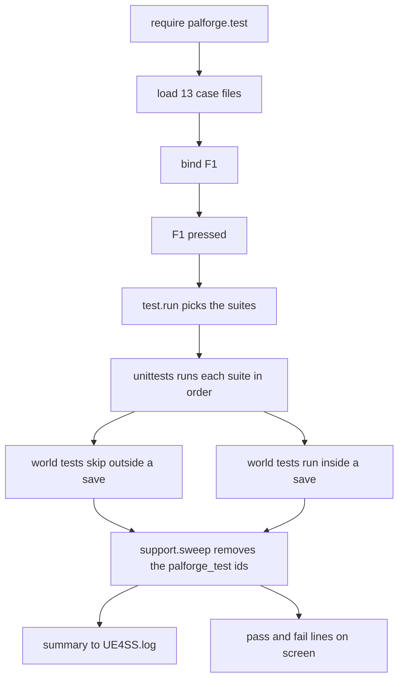

## このページでできるようになること

- PalForge がゲームで読み込まれて動いているかを、数秒で確かめる
- 遊びながら画面に出る「成功・失敗」の 1 行を読む
- 全部ではなく、気になる部分だけを実行する
- 自分のコンテンツをキーに割り当てて、ゲームを離れずに試す
- 自分のチェックを足して、壊れたパックをプレイヤーより先に見つける

## F1 を押す

ゲーム中に **F1** を押します。少しすると、画面に次の 1 行が出ます。

```text
[PalForge] tests: 276 passed, 0 failed, 18 skipped
```

この 1 行が「自分の環境は動いているか」への答えです。`0 failed` なら、PalForge は読み込まれ、
あなたが書く api は api ページの説明どおりに動き、ゲームもその呼び出しを受け付けています。
0 以外の数字が出たときは、壊れている場所が画面とログに名指しで出ます。

タイトル画面でもセーブデータ内でも押せます。どちらも役に立ちます。ワールドが必要なチェックは
タイトル画面では脇に退き、失敗ではなく**スキップ**として数えられます。上の `18 skipped` が
それです。



チェックの読み込みと F1 への割り当ては、ゲーム起動時に一度だけ行われます。`F1 pressed` から
下は、キーを押すたびに毎回実行されます。

起動時に行われるのは**読み込みだけ**で、実行はされません。チェックはパルをスポーンさせ
アイテムを配るので、実行は必ずあなたが指示したときだけ起きます。

キーは `core/keyboard/base/registory` 経由でインストールされ、コールバックは
`ExecuteInGameThread` と `pcall` で包まれます。チェックが例外を投げても、キーボード入力まで
巻き添えにすることはありません。

F1 が割り当てられるのは dev モードのときだけで、PalForge は dev モードで起動します。パックを
配布するときは `registry.initialize()` の前に切ってください。

```lua
local env = require("palforge.env")
env.dev = false     -- set this BEFORE registry.initialize()
```

`dev = false` なら PalForge はコンテンツカタログだけを読み込みます。dev キーバインドも、
カタログダンパーも、チェックも、F1 もありません。

<Callout type="warn">
`reg.register` はフェイルソフトです。そのセッションで `RegisterKeyBind` または UE4SS の `Key`
テーブルが利用できない場合、`could not bind F1 (keybinds unavailable this session)` を記録して
`false` を返します。その場合押すキーは存在しないので、自分のコードから `test.run()` を呼んで
ください。
</Callout>

## 何がチェックされるのか

チェックは全部で **294 件**あり、13 個の**スイート**に分かれています。スイートとは api の
1 領域を受け持つチェックのまとまりで、それぞれ `Scripts/palforge/test/cases/` の 1 ファイル
です。チェックはあなたのセッションの実際のゲームに対して走ります。

| スイート | テスト数 | ワールドを必要とするテスト数 |
| --- | --- | --- |
| `schema` | 28 | 0 |
| `registry` | 23 | 0 |
| `definitions` | 14 | 0 |
| `pal` | 30 | 5 |
| `item` | 21 | 1 |
| `building` | 26 | 2 |
| `skill` | 23 | 1 |
| `effect` | 35 | 1 |
| `audio` | 17 | 2 |
| `mesh` | 21 | 1 |
| `ui` | 32 | 1 |
| `player` | 10 | 4 |
| `events` | 14 | 0 |

表の並びがそのまま実行順です。Lua だけで完結するスイートを先に走らせるので、基礎部分の破損は
セーブデータに触れる前に報告されます。

## 出力を読む

結果は 2 か所に出ます。`UE4SS.log` にはすべてが記録され、スコープは `[PalForge.test]`（ランナー）と
`[PalForge.unittests]`（フレームワーク）です。

```text
[PalForge.test][info] running 13 suite(s): schema, registry, definitions, pal, ...
[PalForge.unittests][info] SKIP [pal] spawns at a coordinate: no world loaded
[PalForge.unittests][info] tests: 276 passed, 0 failed, 18 skipped (294 total)
[PalForge.test][info] swept 217 test definition(s)
```

行は 4 種類として読みます。

- `running N suite(s)` — この押下がこれから何をするのか。
- `SKIP [suite] test: reason` — スキップされたテスト 1 件につき 1 行、欠けていた前提条件付き。
  スキップは異常ではないので `info` レベルです。
- `FAIL [suite] test: message` — アサーションのメッセージ付きで `err` レベルに記録されます。
- `tests: P passed, F failed, S skipped (T total)` — 最初に見るべき 1 行。

同じサマリは `SendSystemAnnounce` で画面にも出て、先頭に `[PalForge]` が付きます。緑だったかどうかを
知るために alt-tab する必要はありません。

```text
[PalForge] tests: running 13 suite(s)
[PalForge] tests: 276 passed, 0 failed, 18 skipped
[PalForge] FAIL [item] give adds to the live inventory and take drops it back out, both measured: the Wood count must RISE across a give (135 -> 135)
```

失敗はすべて 1 件ずつ画面に繰り返されます。`3 failed` としか言わないサマリでは、結局ログに戻る
ことになるからです。

<Callout type="info">
上の 18 件のスキップは、タイトル画面でのワールド依存チェックです。セーブデータ内ではこの数は減り、
代わりに*別の*いくつかのチェックがスキップされます。ワールドがない場合の経路を確かめるチェックは、
ワールドが存在すると脇に退くためです。パス数もそれに連動して動きます。ゼロのままでなければ
ならないのは `failed` です。
</Callout>

## 1 つのスイートだけ実行する

`test.run` は引数なし、スイート名 1 つ、または名前のリストを受け取ります。

```lua
local test = require("palforge.test")

test.run()                        -- every suite this module owns
test.run("schema")                -- one
test.run({ "pal", "item" })       -- several
```

結果テーブルを返すので、自分のツールから確かめられます。

```lua
local results = test.run("item")

print(results.passed, results.failed, results.skipped, results.total)
for _, suite in ipairs(results.suites) do
    print(suite.name, suite.passed, suite.failed, suite.skipped)
    for _, f in ipairs(suite.failures) do print("FAIL", f.test, f.msg) end
    for _, s in ipairs(suite.skips)    do print("SKIP", s.test, s.msg) end
end
```

引数なしの `test.run()` が実行するのは、この 13 スイートだけです。PalForge は起動時に Lua だけで
完結する小さなチェック（`palforge.tests`）も走らせます。それらも同じ一覧に登録されていますが、
F1 は手を出しません。登録済みのすべてに届かせたいときは、1 段下を使います。

```lua
local T = require("palforge.core.unittests")

T.names()            -- every registered suite name, sorted
T.byName("pal")      -- one suite, or nil
T.run()              -- EVERY registered suite, including the headless bundle
T.reset()            -- drop all registrations (tooling; you rarely want this)
```

`palforge.test` は自分自身についても報告します。

```lua
test.CASES       -- the case names, in run order
test.loaded      -- case name -> suite, or false when the file failed to load
test.suites()    -- the names that actually loaded, in run order
test.bindings()  -- { "F1   tests: all suites", "F4   ?" }
```

## 独自のキーを割り当てる

`test.bind` は 1 行で済み、4 つの形を取ります。

```lua
local test = require("palforge.test")

test.bind("F1")                              -- everything (installed by default)
test.bind("F2", "pal")                       -- one suite
test.bind("F3", { "item", "effect" })        -- several
test.bind("F5", function()                   -- anything at all
    Pal.get("ChickenPal"):spawn(Player.coordinate())
end, { desc = "spawn a chicken" })
```

4 つめの形はテスト実行ではありません。関数を渡せば、キーはそれを呼ぶだけです。遊びながら試したい
ことは何でもここに入れられます。パルを出す、素材を自分に配る、自作の UI パネルを開く、などです。

`opts` はキーバインドレジストリへそのまま渡されます。`desc` は `test.bindings()` が表示する文字列で、
省略した場合は `bind` が代わりに書きます（`tests: pal`、`tests: all suites`、または `custom`）。

呼び出しは起動時に走る場所ならどこに置いても構いません。専用の置き場は
`palforge/core/keyboard/functions/` 以下のファイルで、`reg.load()` がディレクトリを走査して
拾い上げます。

```lua title="Scripts/palforge/core/keyboard/functions/beacon_tests.lua"
local test = require("palforge.test")

test.bind("F6", { "building", "skill" }, { desc = "tests: beacon domains" })
```

キーの再割り当ては**その場で挙動を差し替えます**。レジストリはキーごとにエンジンバインドを 1 つだけ
保持し、その裏の関数を交換するので、F1 にハンドラが 2 つ乗ることはありません。

<Callout type="warn">
`functions/` のファイルから `reg.register` で F1 を奪わないでください。`reg.load()` は
`registry.initialize()` の中で F1 を割り当てる `require("palforge.test")` よりも先に走るため、
あなたのハンドラは直後に黙って上書きされます。上の例のようにファイルの先頭で `palforge.test` を
require すればその場で読み込まれ、`palforge.test` 自身の `bind("F1")` が先に走り、あなたの bind が
勝ちます。
</Callout>

## ワールドゲート

api のほとんどはロード済みのワールドを必要とします。ワールドに触れるテストは最初の 1 行で
`support.needWorld(t)` を呼びます。プレイヤーポーン（いまゲームがあなたのために動かしている
キャラクター）がなければ、そのテストを**失敗ではなくスキップ**します。

```lua
s:test(":give hands the player three Wood", function(t)
    local pawn = support.needWorld(t)     -- returns the pawn, or skips out of the test
    local wood = Item.get("Wood")
    t:eq(wood:give(3), true, "give reads the count before and after, so true means it rose")
end)
```

そのおかげで、どちらの場所でも 1 回押す価値があります。タイトル画面では残り 276 件のチェックが
spec、レジストリ、ディスパッチ、そしてすべてのフェイルソフトな戻り値を確かめ、セーブデータ内では
そこに 18 件のワールドチェックが加わります。ワールドにいなかったという理由だけで赤くなることは
ありません。

`needWorld` はポーンを返すので、`local pawn = support.needWorld(t)` は通常の取得のように読めます。
ゲートだけが欲しいなら戻り値は捨てます。

```lua
support.needWorld(t)
```

隣にはさらに 2 つのゲートがあります。

```lua
support.player()          -- the local PalPlayerCharacter, or nil; never throws
support.worldReady()      -- core/event's gate, falling back to the pawn check
support.needGlobal(t, "FindAllOf")   -- skip unless that engine global is a function
```

`support.worldReady()` はまず `core/event.isWorldReady()` に尋ねます（このゲートは ready ウォッチが
5 回連続でポーンを見つけて初めて開きます）。そしてウォッチが落ち着く前の瞬間のために、素のポーン
チェックへフォールバックします。`needGlobal` は UE4SS のグローバルをすべて公開しないセッションや
ホストに備えるものです。同梱のケースではまだ必要になっていませんが、`LoopAsync` や `FindAllOf` に
直接手を伸ばすケースを書くなら使うべきです。

テストは自分の判断で、どの深さからでも、前提条件が揃っていないと分かった時点でスキップできます。

```lua
s:test("a coordinate spawn is issued and the world can be enumerated", function(t)
    support.needWorld(t)
    local coord = support.inFront(600.0, 50.0)
    if not coord then t:skip("no player location to spawn in front of") end

    local ok = Pal.get("ChickenPal"):spawn(coord)
    t:eq(ok, true, "the spawn call was issued")

    -- The pal is seconds away, so there is nothing to assert about arrival here.
    local near = support.nearestPal(coord)
    if not near then t:skip("the world could not be enumerated") end
    t:type(near.dist, "number", "and the world can be measured around the point asked for")
end)
```

この形は真似する価値があります。スポーンは非同期なので、クリーチャーが到着したことをテストでは
主張できません。チェックは証拠のあるところで終わり、到着はログに残ります。呼び出しが本当に答えられる
ことだけを主張し、答えられないことは、それを見られる側に任せてください。

スキップは双方向に働きます。*ワールドがない*場合の経路を確かめるチェック（閉じたままの ready ゲート、
オーナーのないウィジェットの `:screen()`）がいくつかあり、それらはワールドを見つけると
`t:skip("a world is loaded")` を呼びます。

## アサーション

各テスト本体に渡される `t` は 10 個のメソッドを持ちます。どれも末尾の `msg` は省略可能で、省略すると
フレームワークが読みやすい既定文を書きます。

| 呼び出し | 成功する条件 |
| --- | --- |
| `t:assert(cond, msg)` | `cond` が真値である |
| `t:eq(a, b, msg)` | `a == b` |
| `t:neq(a, b, msg)` | `a ~= b` |
| `t:truthy(v, msg)` | `v` が `nil` でも `false` でもない |
| `t:falsy(v, msg)` | `v` が `nil` または `false` である |
| `t:type(v, want, msg)` | `type(v) == want` |
| `t:near(a, b, eps, msg)` | 両方が数値で `math.abs(a - b) <= eps` |
| `t:errors(fn, pattern, msg)` | `fn` が raise し、そのメッセージが `pattern` を含む |
| `t:fail(msg)` | 成功しない — その場でテストを失敗させます |
| `t:skip(reason)` | 成功しない — 失敗させずにテストを止めます |

`eq` は素の `==` です。テーブルの深い比較はありません。2 つのテーブルが等しいのは同一のテーブルで
あるときだけで、これは `t:neq(Player.coordinate(), c, "every call returns a new table")` のような
同一性チェックにはむしろ望ましい挙動です。

`near` の `eps` の既定値は `0.001` です。エンジンを経由して返ってきた値には必ずこれを使ってください。
浮動小数点数が往復して正確なまま戻ることは稀です。

```lua
local base = Player.coordinate()
local off  = Player.coordinateOffset(250.0, -750.0, 125.0)

t:near(off.x - base.x, 250.0, 0.001, "x moved by dx")
t:near(off.y - base.y, -750.0, 0.001, "y moved by dy")
t:near(off.z - base.z, 125.0, 0.001, "z moved by dz")
```

`errors` は api の厳格なバリデーションを固定するための手段です。`pattern` は **Lua パターンではなく
プレーンな部分文字列**です。エラーテキストはマジック文字だらけなので、リテラルに照合するしか
ありません。メッセージを返すので、そこからさらに確かめられます。

```lua
s:test("an unknown field is rejected at define time", function(t)
    local msg = t:errors(function()
        Pal{ id = support.id("pal"), displayName = "Boss" }
    end, 'unknown field "displayName"')

    t:truthy(msg:find("did you mean", 1, true), "the error suggests a real field")
end)
```

失敗したアサーションは raise します。ランナーはそれを捕まえ、そのテスト 1 件を失敗として記録し、
次のテストへ進みます。1 件の不良テストがスイートを止めることはありません。予期しない Lua エラーも
同じように捕まえられ、生のメッセージ付きの失敗として報告されます。別枠で数えられるのは `t:skip`
だけです。

## ケースを書く

<Steps>

<Step>

### ファイルを作る

ケースファイルは `Scripts/palforge/test/cases/` に、領域ごとに 1 つ置きます。フレームワークと
ヘルパーを require し、スイートを作り、テストを追加し、スイートを返します。

```lua title="Scripts/palforge/test/cases/beacon.lua"
local T       = require("palforge.core.unittests")
local support = require("palforge.test.support")

local s = T.suite("beacon")

s:test("a beacon registers under the id it was declared with", function(t)
    local id = support.id("building")
    local h  = Building{ id = id, name = "Beacon" }

    t:eq(h.id, id, "the handle carries the id it was defined with")
    t:eq(h:name(), "Beacon")
end)

s:test("a beacon pays out wood when it is interacted with", function(t)
    support.needWorld(t)

    local wood = Item.get("Wood")
    local before = wood:count()
    if before == nil then t:skip("the inventory count could not be read") end

    t:eq(wood:give(3), true, "give answers the before/after delta, so true means the count rose")

    local after = wood:count()
    if after then t:eq(after - before, 3, "and it rose by exactly what was asked for") end
end)

return s
```

`Suite:test` はチェイン可能なので、好みに応じて `s:test(...):test(...)` と書けます。

</Step>

<Step>

### ケース名を登録する

`Scripts/palforge/test/init.lua` の `M.CASES` にファイル名を追加します。このリストが実行順なので、
純粋なスイートはワールドに触れるものより前に置いてください。

```lua
M.CASES = {
    "schema",
    "registry",
    "definitions",
    "beacon",
    "pal",
    -- ...
}
```

</Step>

<Step>

### キーを押す

`M.load()` は各名前を `palforge.test.cases.` の下から require し、結果を `test.loaded` に記録します。
読み込みに失敗したファイルが実行を止めることはありません。`err` レベルに記録され、
`test.suites()` から外れるだけで、残る 12 件はそのまま走ります。

```text
[PalForge.test][err] case 'beacon' failed to load: ...cases/beacon.lua:12: attempt to index a nil value
```

</Step>

</Steps>

<Callout type="warn">
スイートの名前は、誰も使っていないものにしてください。`T.suite(name)` は、その名前がすでに
登録されている場合、2 つめを作らずに**既存の**スイートを返します。そのため、埋まっている名前を
選んだケースファイルは、自分のテストを他人のスイートに追記することになります。`M.load()` は
それに気付いて警告します。
`case 'pal' shares its suite name with an already registered suite; the two are now merged`
</Callout>

## 名前空間付きの id とスイープ

定義に有効期限はありません。一度定義したものはそのセッションの間ずっと残り、`core/event` は
スキャンのたびにライブレジストリを辿ります。ですから、使い捨てのコンテンツを定義した実行は、
それを自分で取り除く必要があります。そうしないと、キーを 10 回押せば 10 回分が残ります。

そのため、テストが作る id はすべて `support.id` から来ます。これは実行ごとのカウンタを混ぜ込みます。

```lua
support.id("pal")                          -- "palforge_test:pal_1"
support.id("pal")                          -- "palforge_test:pal_2"
support.NAMESPACE                          -- "palforge_test"
support.isTestId("palforge_test:pal_1")    -- true
support.isTestId("ChickenPal")             -- false
```

カウンタはセッション中リセットされないので、スイートを 10 回走らせても自分自身と衝突しません。

最後のスイートが終わると、`test.run` は `support.sweep()` を呼びます。これは
`object_manager.TYPES` のすべてを走査し、`isTestId` を通った id を登録解除して、その件数を返します。

```lua
local removed = support.sweep()   -- 217
```

判定が `palforge_test:` の前方一致であるため、スイープが実コンテンツに触れることはありません。
ネイティブカタログにも、あなたのパックにも届きません。キーを何度押しても、レジストリは押す前と
まったく同じ状態で残ります。

## support のヘルパー

`test/support.lua` はすべてのケースファイルが require するもので、ゲーム内で動くスイートに必要な
道具を持っています。

レポート:

```lua
support.announce("half way through")   -- on screen via SendSystemAnnounce, prefixed [PalForge]
support.log("give Wood x3 -> 135 -> 138")   -- UE4SS.log under [PalForge.test]
```

`announce` は `pcall` で包まれており、`PalUtility` と有効な `PalPlayerCharacter` の両方を必要と
します。ワールドがなければ静かに何もしないので、事前に確認せず呼べます。

ワールドの読み取り。いずれも例外ではなく `nil` を返します。

```lua
support.player()             -- the local pawn, or nil
support.location(actor)      -- { x, y, z }, or nil
support.inFront(600.0, 50.0) -- a point 600cm ahead of the player and 50cm up, or nil
support.nearestPal(coord)    -- { actor, pos, dist, count }, or nil
```

`inFront` は、スポーンテストが対象を自分の中ではなく目に見える前方に置くために使います。ポーンの
前方ベクトルが読めないときは +X 軸へフォールバックします。`nearestPal` は `PalCharacter` を列挙し、
ある座標に最も近い 1 体を距離と総数付きで報告します。スポーンのチェックはこれを使って、要求した
地点のまわりでゲームがキャラクターを列挙できることを確かめます。

<Callout type="info">
`:spawn` はパルが存在するより前に返るので、pal スイートは到着を主張しようとしません。呼び出しが
発行されたことを確かめ、次に `nearestPal` が要求した地点のまわりでワールドを列挙できることを
確かめます。それは遅延処理がクリーチャーを見つけて報告するのに使っている手段そのものです。
</Callout>

スイートが依拠する実際のゲーム id。ライブチェックがゲームに本当に存在するコンテンツを扱うためです。

```lua
support.GAME = {
    pal      = "ChickenPal",
    pal2     = "SheepBall",
    item     = "Wood",
    consume  = "Berries",
    building = "WorkBench",
    palbox   = "PalBoxV2",
    bgm      = "AKE_BGM_Title",
}
```

## 実行が残すもの

スイープが登録解除するのは定義です。ライブテストがセーブデータに対して行ったことは元に戻せません。
ワールドテストはそれを踏まえて書かれていますが、すべてが可逆というわけではありません。

- **スポーンしたパルは残ります。** `pal` はライブテスト 3 件で `ChickenPal` を要求し、どれも実行が
  終わった数秒後に現れます。ツリー内にパルをデスポーンさせるものはありません。
- **渡した Wood はそのまま返されます。** `item` は `Wood` を 3 個渡し、同じ 3 個を消費するので、
  問題なく走ればインベントリは元のままです。give が成立して take が成立しなかった場合は（何も装備
  していないプレイヤーは取り出せません）、その 3 個が鞄に残ります。
- **設置も装着も建築もしません。** メッシュと pal のレンダリングテストは、意図的にロードできない
  モデルパスを指すので、バックエンドはプレイヤーのメッシュコンポーネントに触れる前に降ります。
  building スイートはすでに建てられているものに対する読み取り専用で、`inst:save()` は決して
  呼びません。UI スイートは `PalPlayerController` が存在するときはウィジェットの構築手前で止まります。
- **エフェクトは自分で後始末します。** ライブの effect テストは 1 件だけで、`pcall` の下でポーンに
  適用してから外します。`nativeStatus` を宣言していないのでゲーム本体の状態異常は点灯しません。
  宣言しているエフェクトなら、外れるときに一緒に消えます。

<Callout type="warn">
ワールドに触れるスイートは、大事なセーブではなく使い捨てのセーブで実行してください。チキン 3 羽は
小さな散らかりですが、散らかりであることに変わりはなく、フレームワークはそれを片付ける約束を
していません。しかも実行が終わったと表示された数秒後に現れます。
</Callout>

緑の実行結果は、api のすべての呼び出しが名前どおりの仕事を最後までやる、という意味ではありません。
いまのところ 3 つは、名前から想像するより広い範囲に、あるいは遅れて効きます。スイートはそれを
意図的に固定しています。

- `Pal.Handle:spawn` が答えるのは呼び出しについてであって、クリーチャーについてではありません。
  パルはその 4〜8 秒後に現れるので、ここでのどの主張も到着についてのものにはなりません。到着が
  記録されるのはログです。
- `Audio.Handle:setVolume` はアクター単位です。呼び出したサウンド 1 つではなく、そのアクターが
  出しているものすべての音量を変えるので、テストもアクターの性質として扱います。
- `Audio.Handle:stop` もアクター単位です。`StopSoundByActor` を発行するので、呼び出した対象の音 1 つ
  ではなくそのアクター上のすべてを止めます。一度も定義されたことのない id のハンドルでも、同じように
  アクターを黙らせます。個別に止めたい音は、別々のアクター上で鳴らしてください。

## まとめ

- ゲーム中に **F1** を押します。画面の行が `0 failed` なら、あなたの環境は動いています。
- スキップは問題ありません。ワールド用のチェックはタイトル画面でスキップされます。ゼロであるべきなのは `failed` だけです。
- `test.run("pal")` で 1 スイートだけ実行でき、`test.bind("F5", fn)` で好きな処理をキーに置けます。
- ワールドが必要なチェックは `support.needWorld(t)` で始めます。失敗ではなくスキップになります。
- テスト内で作る id は必ず `support.id(...)` から取ります。あとでスイープが片付けます。
- ワールドに触れるスイートは使い捨てのセーブで実行します。ライブチェックが出したパルはワールドに
  残り、しかも実行が終わったあとに到着します。

次は [コンテンツパックを作る](/docs/guides/first-content-pack) を読むと、これらのチェックが守る
対象そのものを書けます。

<Cards>
  <Card title="コンテンツパックを作る" href="/docs/guides/first-content-pack">
    上のビーコンの例の出どころとなるウォークスルー。
  </Card>
  <Card title="はじめる" href="/docs/getting-started">
    PalForge のインストールと、カーネルが読み込まれていることの確認。
  </Card>
</Cards>
