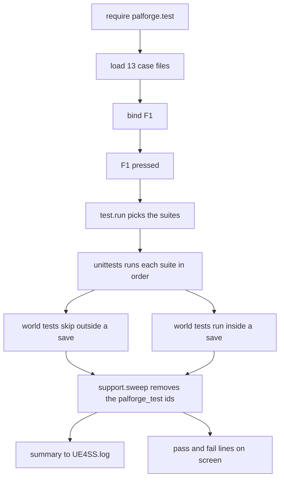

## What you can do after this page

- Find out in a few seconds whether PalForge is loaded and working in your game
- Read the pass and fail line that appears on your screen while you play
- Run only the part you care about instead of all of it
- Put your own content on a key, so you can try it without leaving the game
- Add your own checks, so a broken pack tells you before your players do

## Press F1

Press **F1** while the game is running. A moment later a line appears on your screen:

```text
[PalForge] tests: 276 passed, 0 failed, 18 skipped
```

That line is the answer to "is my setup working". `0 failed` means PalForge loaded, the api
you write against behaves the way the api pages describe it, and the game accepted the calls
it made. Any other number names the broken piece, on screen and in the log.

Press it at the title screen or inside a save; both are useful. Checks that need a loaded
world step aside at the title screen and are counted as **skipped**, not failed — that is
what the `18 skipped` above is.



Loading the checks and putting them on F1 happens once, when the game starts. Everything
from `F1 pressed` down happens again on every press.

Startup only **loads** the checks. It never runs them. They spawn pals and hand out items,
so a run only ever happens when you ask for one.

The key is installed through `core/keyboard/base/registory`, which wraps your callback in
`ExecuteInGameThread` and a `pcall`. A check that blows up cannot take your keyboard input
with it.

F1 is only installed in dev mode, and PalForge starts in dev mode. Turn it off before
`registry.initialize()` when you ship your pack:

```lua
local env = require("palforge.env")
env.dev = false     -- set this BEFORE registry.initialize()
```

With `dev = false` PalForge loads the content catalogs and nothing else — no dev keybinds,
no catalog dumper, no checks, no F1.

<Callout type="warn">
`reg.register` is fail-soft. If `RegisterKeyBind` or UE4SS's `Key` table is unavailable
this session, it logs `could not bind F1 (keybinds unavailable this session)` and returns
`false`. There is no key to press then — call `test.run()` from your own code instead.
</Callout>

## What gets checked

There are **294 checks**, grouped into 13 **suites** — a suite is one group of checks,
covering one area of the api. Each suite is one file under
`Scripts/palforge/test/cases/`. They run against the real game, in your session.

| suite | tests | tests that need a world |
| --- | --- | --- |
| `schema` | 28 | 0 |
| `registry` | 23 | 0 |
| `definitions` | 14 | 0 |
| `pal` | 30 | 5 |
| `item` | 21 | 1 |
| `building` | 26 | 2 |
| `skill` | 23 | 1 |
| `effect` | 35 | 1 |
| `audio` | 17 | 2 |
| `mesh` | 21 | 1 |
| `ui` | 32 | 1 |
| `player` | 10 | 4 |
| `events` | 14 | 0 |

The order in the table is the run order. The suites that touch nothing but Lua go first, so
a break in the basics is reported before anything touches your save.

## Reading the output

Results go to two places. `UE4SS.log` gets everything, under the scopes
`[PalForge.test]` (the runner) and `[PalForge.unittests]` (the framework):

```text
[PalForge.test][info] running 13 suite(s): schema, registry, definitions, pal, ...
[PalForge.unittests][info] SKIP [pal] spawns at a coordinate: no world loaded
[PalForge.unittests][info] tests: 276 passed, 0 failed, 18 skipped (294 total)
[PalForge.test][info] swept 217 test definition(s)
```

Read it as four kinds of line:

- `running N suite(s)` — what this press is about to do.
- `SKIP [suite] test: reason` — one line per skipped test, with the precondition that was
  missing. Logged at `info`, because a skip is not a problem.
- `FAIL [suite] test: message` — logged at `err`, with the assertion message.
- `tests: P passed, F failed, S skipped (T total)` — the one line to look at.

The same summary is put on screen with `SendSystemAnnounce`, prefixed `[PalForge]`, so you
do not have to alt-tab to find out whether the run was green:

```text
[PalForge] tests: running 13 suite(s)
[PalForge] tests: 276 passed, 0 failed, 18 skipped
[PalForge] FAIL [item] give hands the player a few Wood: give Wood x3 should execute
```

Every failure is repeated on screen individually. A summary that says `3 failed` and
nothing else means going back to the log anyway.

<Callout type="info">
The 18 skips above are the world-gated tests at the title screen. Inside a save that number
drops, and a handful of *other* tests skip instead — a few check the no-world path and step
aside once a world exists. The pass count moves with it. What must stay at zero is `failed`.
</Callout>

## Running one suite

`test.run` takes nothing, a suite name, or a list of names:

```lua
local test = require("palforge.test")

test.run()                        -- every suite this module owns
test.run("schema")                -- one
test.run({ "pal", "item" })       -- several
```

It returns the results table, so you can check it from your own tooling:

```lua
local results = test.run("item")

print(results.passed, results.failed, results.skipped, results.total)
for _, suite in ipairs(results.suites) do
    print(suite.name, suite.passed, suite.failed, suite.skipped)
    for _, f in ipairs(suite.failures) do print("FAIL", f.test, f.msg) end
    for _, s in ipairs(suite.skips)    do print("SKIP", s.test, s.msg) end
end
```

`test.run()` with no argument runs those thirteen suites and nothing more. PalForge also
runs a small set of pure-Lua checks at startup (`palforge.tests`); they register into the
same list, but F1 leaves them alone. To reach every registered suite, go one level down:

```lua
local T = require("palforge.core.unittests")

T.names()            -- every registered suite name, sorted
T.byName("pal")      -- one suite, or nil
T.run()              -- EVERY registered suite, including the headless bundle
T.reset()            -- drop all registrations (tooling; you rarely want this)
```

`palforge.test` also reports on itself:

```lua
test.CASES       -- the case names, in run order
test.loaded      -- case name -> suite, or false when the file failed to load
test.suites()    -- the names that actually loaded, in run order
test.bindings()  -- { "F1   tests: all suites", "F4   ?" }
```

## Binding your own key

`test.bind` is one line, and takes four shapes:

```lua
local test = require("palforge.test")

test.bind("F1")                              -- everything (installed by default)
test.bind("F2", "pal")                       -- one suite
test.bind("F3", { "item", "effect" })        -- several
test.bind("F5", function()                   -- anything at all
    Pal.get("ChickenPal"):spawn(Player.coordinate())
end, { desc = "spawn a chicken" })
```

The fourth shape is not a test run at all. Pass a function and the key calls it. Use it for
anything you want to try while you play — spawn a pal, hand yourself materials, open a UI
panel of your own.

`opts` goes through to the keybind registry. `desc` is what `test.bindings()` prints; when
you leave it out, `bind` writes one for you (`tests: pal`, `tests: all suites`, or
`custom`).

Put the calls anywhere that runs at startup. The dedicated place is a file under
`palforge/core/keyboard/functions/`, which `reg.load()` picks up by scanning the directory:

```lua title="Scripts/palforge/core/keyboard/functions/beacon_tests.lua"
local test = require("palforge.test")

test.bind("F6", { "building", "skill" }, { desc = "tests: beacon domains" })
```

Re-binding a key **replaces its behaviour in place**. The registry keeps one engine binding
per key and swaps the function behind it, so you never end up with two handlers on F1.

<Callout type="warn">
Do not claim F1 with `reg.register` from a `functions/` file. `reg.load()` runs earlier in
`registry.initialize()` than the `require("palforge.test")` that binds F1, so your handler
is silently overridden a moment later. Requiring `palforge.test` at the top of your file —
as above — loads it there and then, its own `bind("F1")` runs first, and your bind wins.
</Callout>

## The world gate

Most of the api needs a loaded world. A test that touches one calls `support.needWorld(t)`
as its first line, and that **skips the test rather than failing it** when there is no
player pawn — the character the game is currently controlling for you:

```lua
s:test(":give hands the player three Wood", function(t)
    local pawn = support.needWorld(t)     -- returns the pawn, or skips out of the test
    local wood = Item.get("Wood")
    t:eq(wood:give(3), true, "give runs through AddItem_ServerInternal")
end)
```

So one run is worth pressing in both places. At the title screen the other 276 checks still
cover the specs, the registry, the dispatch and every fail-soft return; in a save the 18
world checks join them. Nothing goes red just because you were not in a world.

`needWorld` returns the pawn, so `local pawn = support.needWorld(t)` reads as a normal
lookup. Discard the return when you only want the gate:

```lua
support.needWorld(t)
```

Two more gates sit next to it:

```lua
support.player()          -- the local PalPlayerCharacter, or nil; never throws
support.worldReady()      -- core/event's gate, falling back to the pawn check
support.needGlobal(t, "FindAllOf")   -- skip unless that engine global is a function
```

`support.worldReady()` asks `core/event.isWorldReady()` first — that gate only opens after
the ready watch has seen a pawn five polls running — and falls back to the raw pawn check
for the moment before the watch has settled. `needGlobal` covers the sessions and hosts
that do not expose every UE4SS global; nothing in the shipped cases needs it yet, but a
case that reaches for `LoopAsync` or `FindAllOf` directly should use it.

A test can also skip on its own terms, at any depth, once it learns the precondition is not
there:

```lua
s:test("a coordinate spawn in front of the player is accepted", function(t)
    support.needWorld(t)
    local coord = support.inFront(600.0, 50.0)
    if not coord then t:skip("no player location to spawn in front of") end

    local ok = Pal.get("ChickenPal"):spawn(coord)
    t:type(ok, "boolean", ":spawn reports a boolean verdict")
    if not ok then t:skip("no PalCheatManager this session — the spawn route is unavailable") end
end)
```

Skips run in both directions. Several checks cover the *no-world* path — the shut ready
gate, a widget's `:screen()` with no owner — and those call `t:skip("a world is loaded")`
when they find one.

## Assertions

The `t` handed to every test body carries ten methods. Each one takes an optional final
`msg`; when you leave it out, the framework writes a readable default.

| call | passes when |
| --- | --- |
| `t:assert(cond, msg)` | `cond` is truthy |
| `t:eq(a, b, msg)` | `a == b` |
| `t:neq(a, b, msg)` | `a ~= b` |
| `t:truthy(v, msg)` | `v` is neither `nil` nor `false` |
| `t:falsy(v, msg)` | `v` is `nil` or `false` |
| `t:type(v, want, msg)` | `type(v) == want` |
| `t:near(a, b, eps, msg)` | both are numbers and `math.abs(a - b) <= eps` |
| `t:errors(fn, pattern, msg)` | `fn` raises, and the message contains `pattern` |
| `t:fail(msg)` | never — it fails the test on the spot |
| `t:skip(reason)` | never — it stops the test without failing it |

`eq` is raw `==`. There is no deep table comparison: two tables are equal only when they
are the same table, which is exactly what you want for identity checks like
`t:neq(Player.coordinate(), c, "every call returns a new table")`.

`near` defaults `eps` to `0.001`. Use it for anything that came back through the engine —
floats rarely survive a round trip exactly:

```lua
local base = Player.coordinate()
local off  = Player.coordinateOffset(250.0, -750.0, 125.0)

t:near(off.x - base.x, 250.0, 0.001, "x moved by dx")
t:near(off.y - base.y, -750.0, 0.001, "y moved by dy")
t:near(off.z - base.z, 125.0, 0.001, "z moved by dz")
```

`errors` is how you pin down the api's strict validation. The `pattern` is a **plain
substring, not a Lua pattern** — the error text is full of magic characters, so matching it
literally is the only thing that works. It returns the message, so you can check more about
it:

```lua
s:test("an unknown field is rejected at define time", function(t)
    local msg = t:errors(function()
        Pal{ id = support.id("pal"), displayName = "Boss" }
    end, 'unknown field "displayName"')

    t:truthy(msg:find("did you mean", 1, true), "the error suggests a real field")
end)
```

A failing assertion raises. The runner catches it, marks that one test failed, logs it, and
moves on to the next test — one bad test never stops the suite. An unexpected Lua error is
caught the same way and reported as a failure with its raw message; only `t:skip` is
counted separately.

## Writing a case

<Steps>

<Step>

### Create the file

Case files live in `Scripts/palforge/test/cases/`, one per area. Require the framework and
the helpers, make a suite, add tests, return the suite.

```lua title="Scripts/palforge/test/cases/beacon.lua"
local T       = require("palforge.core.unittests")
local support = require("palforge.test.support")

local s = T.suite("beacon")

s:test("a beacon registers under the id it was declared with", function(t)
    local id = support.id("building")
    local h  = Building{ id = id, name = "Beacon" }

    t:eq(h.id, id, "the handle carries the id it was defined with")
    t:eq(h:name(), "Beacon")
end)

s:test("a beacon pays out wood when it is interacted with", function(t)
    support.needWorld(t)

    local wood = Item.get("Wood")
    t:eq(wood:give(3), true, "give runs through AddItem_ServerInternal")
    t:type(wood:take(3), "boolean", "take reports what it measured")
end)

return s
```

`Suite:test` is chainable, so `s:test(...):test(...)` works if you prefer it.

</Step>

<Step>

### Register the case name

Add the file's name to `M.CASES` in `Scripts/palforge/test/init.lua`. The list is the run
order, so put a pure suite before the ones that touch the world:

```lua
M.CASES = {
    "schema",
    "registry",
    "definitions",
    "beacon",
    "pal",
    -- ...
}
```

</Step>

<Step>

### Press the key

`M.load()` requires each name under `palforge.test.cases.` and records the result in
`test.loaded`. A file that fails to load does not stop the run: it is logged at `err` and
left out of `test.suites()`, so the other twelve still go.

```text
[PalForge.test][err] case 'beacon' failed to load: ...cases/beacon.lua:12: attempt to index a nil value
```

</Step>

</Steps>

<Callout type="warn">
Give your suite a name nobody else has used. `T.suite(name)` hands back the **existing**
suite when that name is already registered rather than making a second one, so a case file
that picks a taken name has its tests appended to someone else's suite. `M.load()` notices
and warns:
`case 'pal' shares its suite name with an already registered suite; the two are now merged`.
</Callout>

## Namespaced ids and the sweep

A definition never expires. Once something is defined it stays defined for the rest of the
session, and `core/event` walks the live registry on every scan. A run that defined
throwaway content therefore has to take it back out again, or pressing the key ten times
would leave ten runs' worth of it behind.

So every id a test creates comes from `support.id`, which mixes in a per-run counter:

```lua
support.id("pal")                          -- "palforge_test:pal_1"
support.id("pal")                          -- "palforge_test:pal_2"
support.NAMESPACE                          -- "palforge_test"
support.isTestId("palforge_test:pal_1")    -- true
support.isTestId("ChickenPal")             -- false
```

The counter never resets inside a session, so running the suite ten times never collides
with itself.

After the last suite, `test.run` calls `support.sweep()`, which walks every
`object_manager.TYPES` entry, unregisters the ids that pass `isTestId`, and returns the
count:

```lua
local removed = support.sweep()   -- 217
```

Because the check is a prefix match on `palforge_test:`, the sweep can never touch real
content — not the native catalogs, not your pack. Pressing the key repeatedly leaves the
registry exactly as it found it.

## Support helpers

`test/support.lua` is required by every case file and holds the things a suite running
inside a game needs.

Reporting:

```lua
support.announce("half way through")   -- on screen via SendSystemAnnounce, prefixed [PalForge]
support.log("give Wood x3 -> false")   -- UE4SS.log under [PalForge.test]
```

`announce` is wrapped in a `pcall` and needs both `PalUtility` and a live
`PalPlayerCharacter`. With no world it does nothing at all, quietly, so you can call it
without checking first.

World reads, all of them `nil`-returning rather than throwing:

```lua
support.player()             -- the local pawn, or nil
support.location(actor)      -- { x, y, z }, or nil
support.inFront(600.0, 50.0) -- a point 600cm ahead of the player and 50cm up, or nil
support.nearestPal(coord)    -- { actor, pos, dist, count }, or nil
```

`inFront` is where a spawn test puts things so they land visibly in front of you rather
than inside you; it falls back to the +X axis when the pawn's forward vector is
unreadable. `nearestPal` enumerates `PalCharacter` and reports the closest one to a
coordinate with its distance and the total count. A spawn check uses it to confirm the game
can still list its characters around the point it asked for.

<Callout type="info">
`:spawn` returning `true` means **accepted**, not arrived. The actor materialises a few
frames later and the relocation runs on a retry chain, so the pal suite deliberately does
not check the distance to the requested coordinate — only that the spawn was accepted and
that the world can be enumerated.
</Callout>

Real game ids the suites lean on, so a live check exercises content the game actually has:

```lua
support.GAME = {
    pal      = "ChickenPal",
    pal2     = "SheepBall",
    item     = "Wood",
    consume  = "Berries",
    building = "WorkBench",
    palbox   = "PalBoxV2",
    bgm      = "AKE_BGM_Title",
}
```

## What a run leaves behind

The sweep un-registers definitions. It cannot un-do what a live test did to your save, and
the world tests are written with that in mind — but not all of it is reversible.

- **Spawned pals stay.** `pal` asks `UPalCheatManager` for a `ChickenPal` in three of its
  live tests. Nothing in the tree can despawn them.
- **Given items may stay.** `item` hands out three `Wood` and immediately calls `:take(3)`.
  No removal call is confirmed on this build, so `:take` pushes a negative delta through
  the same add and re-reads the count; the test only claims that it returns a boolean it
  actually measured. `false` means the three Wood are still in your inventory.
- **Nothing is placed, worn or built.** The mesh and pal render tests point at a model path
  that deliberately will not load, so the backend bails before it touches the player's mesh
  component. The building suite is read-only over what you have already built, and never
  calls `inst:save()`. The UI suite stops short of constructing a widget when a
  `PalPlayerController` exists.
- **Effects clean up after themselves.** The one live effect test applies to the pawn under
  a `pcall` and removes it again, and a PalForge effect is pure Lua bookkeeping — no native
  ailment is toggled either way.

<Callout type="warn">
Run the world-touching suites in a throwaway save, not the one you care about. Three
chickens and three Wood is a small mess, but it is a mess, and the framework makes no
promise to clean it up.
</Callout>

A green run does not mean every call in the api does the whole job its name suggests. Two
of them fall short today, and the suites pin that down on purpose:

- `Audio.Handle:setVolume` returns `false` for every value, including the edges. It does
  nothing yet. Set the volume in the game's own audio options instead, and treat the
  `false` as the honest answer.
- `Audio.Handle:stop` is actor-wide. It issues `StopSoundByActor`, so it silences
  everything on that actor rather than the one sound you called it on — a handle for an id
  that was never defined stops the actor just the same. Play sounds you need to stop
  separately on separate actors.

## Summary

- Press **F1** in game. `0 failed` on the screen line means your setup works.
- Skips are fine. World checks skip at the title screen; only `failed` must stay at zero.
- `test.run("pal")` runs one suite, and `test.bind("F5", fn)` puts anything you like on a key.
- Checks that need a world start with `support.needWorld(t)`, so they skip instead of failing.
- Give every id you make up in a test `support.id(...)`, and the sweep removes it afterwards.
- Run the world-touching suites in a throwaway save: spawned pals and given Wood stay.

Next, read [Building a content pack](/docs/guides/first-content-pack) to write the content
these checks are there to protect.

<Cards>
  <Card title="Building a content pack" href="/docs/guides/first-content-pack">
    The walkthrough the beacon example above is lifted from.
  </Card>
  <Card title="Getting started" href="/docs/getting-started">
    Installing PalForge and confirming the kernel is loading.
  </Card>
</Cards>
