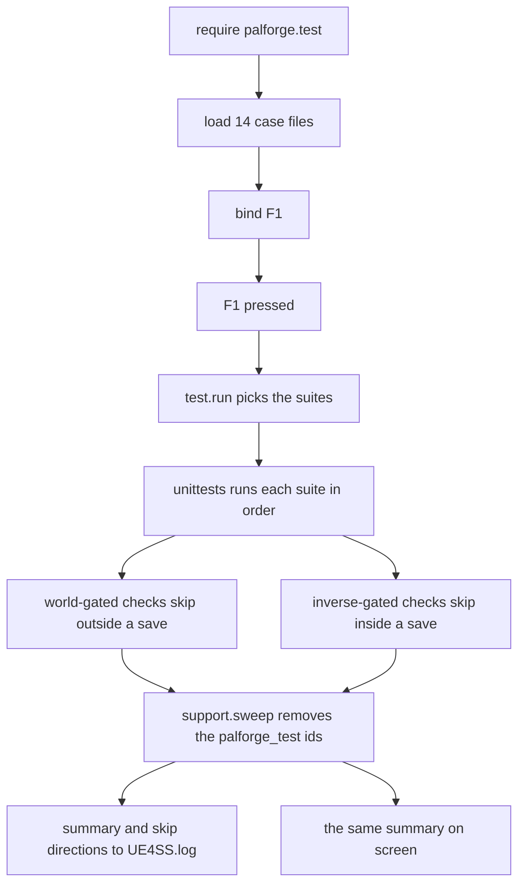

## What you can do after this page

- Find out in a few seconds whether PalForge is loaded and working in your game
- Read the pass, fail and skip line that appears on your screen while you play
- Know why one press cannot run every check, and which second press covers the rest
- Run only the part you care about instead of all of it
- Run the measurements that only a running Palworld can answer, one at a time and by name
- Put your own content on a key the game has not already taken
- Add your own checks, so a broken pack tells you before your players do

## Press F1, twice

Press **F1** while the game is running. A moment later two lines appear on your screen:

```text
[PalForge] tests: running 14 suite(s)
[PalForge] tests: 450 passed, 0 failed, 31 skipped (28 need a world, 1 need a declared test/hooks run, 2 could not be answered by this session)
```

`0 failed` is the answer to "is my setup working". It means PalForge loaded, the api you write
against behaves the way the api pages describe it, and the game accepted the calls it made.
Any other number names the broken piece, on screen and in the log.

**No single press runs every check, and the summary says so in words.** 28 checks need a loaded
save and skip at the title screen. Ten more are the inverse: they prove a *refusal* path — the
shut ready gate, a widget with no owner to draw under, `Player.coordinate()` with no pawn — so
they can only run where there is nothing to succeed with, and they skip once a world is up. The
two sets cannot both run in one press. Press the key once at the title screen and once inside a
save; a green run is two runs.

The numbers above are a real run of the whole suite, measured on 2026-08-02 in a plain `lua5.4`
process with no engine at all. In the game the world-gated 28 run instead, and the two
`could not be answered by this session` skips go away as well — both exist only because a bare
Lua process has no `LoopAsync` and no UE4SS `Key` table to check against.



Loading the checks and putting them on F1 happens once, when the game starts. Everything
from `F1 pressed` down happens again on every press.

Startup only **loads** the checks. It never runs them. They spawn pals and hand out items,
so a run only ever happens when you ask for one.

The key is installed through `core/keyboard/base/registory`, which wraps your callback in
`ExecuteInGameThread` and a `pcall`. A check that blows up cannot take your keyboard input
with it.

F1 exists only in a dev session, and `env.dev` ships as `false` — so does `env.debug`. Nothing
in the framework turns either of them on. A dev session turns them on through an optional
`Scripts/palforge_dev.lua`, which `tools/deploy.sh` writes in its default mode, deletes under
`--release`, and which is gitignored so it cannot reach a player through the repository:

```lua title="Scripts/palforge_dev.lua"
local env   = require("palforge.env")
env.dev     = true
env.debug   = true
-- Per-hook opt-in for the hooks that write into a real save.
-- env.debugHooks["pal-skills-equip"] = true
```

With `dev = false` PalForge loads the content catalogs and nothing else: no dev keybinds
(F4 unlocks every technology in the loaded save), no F1 suite, no F9 reload, no catalog
dumper, no headless bundle and no test hooks. The startup log names each piece it did and
did not load, so "the key does nothing" and "the key was never bound" are two different lines.

<Callout type="warn">
`reg.register` is fail-soft. If `RegisterKeyBind` or UE4SS's `Key` table is unavailable
this session, it logs `could not bind F1 (keybinds unavailable this session)` and returns
`false`. There is no key to press then — call `test.run()` from your own code instead.
</Callout>

## What gets checked

There are **481 checks**, grouped into **14 suites** — a suite is one group of checks,
covering one area of the api. Each suite is one file under
`Scripts/palforge/test/cases/`. They run against the real game, in your session.

| suite | checks | only inside a save | only at the title screen |
| --- | --- | --- | --- |
| `schema` | 28 | 0 | 0 |
| `registry` | 42 | 0 | 0 |
| `definitions` | 23 | 0 | 0 |
| `native` | 26 | 0 | 0 |
| `pal` | 34 | 5 | 0 |
| `item` | 23 | 3 | 0 |
| `building` | 32 | 3 | 1 |
| `skill` | 34 | 3 | 0 |
| `effect` | 40 | 2 | 0 |
| `audio` | 24 | 4 | 1 |
| `mesh` | 46 | 3 | 0 |
| `ui` | 105 | 1 | 6 |
| `player` | 10 | 4 | 1 |
| `events` | 14 | 0 | 1 |

The order in the table is the run order, and it is `M.CASES` in
`Scripts/palforge/test/init.lua` — that list is the only authority on which suites F1 runs.
The suites that touch nothing but Lua go first, so a break in the basics is reported before
anything touches your save.

One check in `pal` is in neither column: `teachAll`'s write half needs a live pal and mutates
a real save, so it is measured by a declared hook rather than by F1, and its skip line names
the hook that measures it.

## Reading the output

Results go to two places. `UE4SS.log` gets everything, under the scopes
`[PalForge.test]` (the runner) and `[PalForge.unittests]` (the framework):

```text
[PalForge.test][info] build 2026-08-02 12:41:30 | dev=true debug=true | game v1.0.2.101103 (live v1.0.2.101103) | running 14 suite(s): schema, registry, definitions, native, pal, item, building, skill, effect, audio, mesh, ui, player, events
[PalForge.unittests][info] SKIP [player] coordinate returns the local player's position as numeric x, y, z (world): no world loaded
[PalForge.unittests][info] tests: 450 passed, 0 failed, 31 skipped (481 total)
[PalForge.unittests][info] tests: 31 skipped (28 need a world, 1 need a declared test/hooks run, 2 could not be answered by this session)
[PalForge.unittests][info] tests: 28 check(s) were not measured because there is no world - load a save and press the key again.
[PalForge.unittests][info] tests: 1 check(s) can only be measured by a declared hook - `pf_hooks` lists them with the reason each one would skip, and each SKIP line above names the action that runs its own.
[PalForge.test][info] swept 123 test definition(s)
```

Read it as five kinds of line:

- The provenance line: the build stamp `tools/deploy.sh` wrote, both switches, the Palworld
  build every capability was measured against and the one the running game reports, then what
  this press is about to do. Lua that is already loaded stays loaded, so a stamp older than
  your last deploy means F9 was not pressed and nothing below it is evidence about the code
  you just wrote. `unstamped (not deployed by tools/deploy.sh)` is a tree you copied by hand.
- `SKIP [suite] test (direction): reason` — one line per skipped check, carrying which session
  state would have run it: `world`, `no-world`, `hook`, `opt-in`, `setup` or `session`.
  Logged at `info`, because a skip is not a problem.
- `FAIL [suite] test: message` — logged at `err`, with the assertion message.
- `tests: P passed, F failed, S skipped (T total)` — the one line to look at.
- The breakdown underneath it, which is what makes the line above readable: how many skips
  are waiting on which state, and — when both directions are waiting — the sentence saying
  that no single run measures everything.

The summary is put on screen with `SendSystemAnnounce`, prefixed `[PalForge]`, with the same
breakdown clause, so you do not have to alt-tab to find out what was actually measured:

```text
[PalForge] tests: running 14 suite(s)
[PalForge] tests: 450 passed, 0 failed, 31 skipped (28 need a world, 1 need a declared test/hooks run, 2 could not be answered by this session)
[PalForge] FAIL [item] give really adds to the live inventory, measured both ways: the Wood count must RISE across a give (135 -> 135)
```

Every failure is repeated on screen individually. A summary that says `3 failed` and
nothing else means going back to the log anyway.

<Callout type="info">
A bare `N skipped` cannot tell a run that measured almost everything from one that measured
almost nothing, which is why every skip carries a direction now. `28 need a world` is a
sentence you can act on; `31 skipped` is not.
</Callout>

## Running one suite

`test.run` takes nothing, a suite name, or a list of names:

```lua
local test = require("palforge.test")

test.run()                        -- every suite this module owns
test.run("schema")                -- one
test.run({ "pal", "item" })       -- several
```

It returns the results table, so you can check it from your own tooling:

```lua
local results = test.run("item")

print(results.passed, results.failed, results.skipped, results.total)
for direction, n in pairs(results.needs) do print(direction, n) end   -- world, no-world, hook, ...
for _, suite in ipairs(results.suites) do
    print(suite.name, suite.passed, suite.failed, suite.skipped)
    for _, f in ipairs(suite.failures) do print("FAIL", f.test, f.msg) end
    for _, s in ipairs(suite.skips)    do print("SKIP", s.test, s.needs, s.msg) end
end
```

`test.run()` with no argument runs those fourteen suites and nothing more. PalForge also
runs a small set of pure-Lua checks at startup (`palforge.tests`); they register into the
same list, but F1 leaves them alone. To reach every registered suite, go one level down:

```lua
local T = require("palforge.core.unittests")

T.names()            -- every registered suite name, sorted
T.byName("pal")      -- one suite, or nil
T.run()              -- EVERY registered suite, including the headless bundle
T.NEEDS              -- the seven skip directions, as the summary spells them
```

There is deliberately no way to empty that registry: the suite list lives for the process, and
the one thing that really needs a fresh slate — reloading edited case files — is F9, which
drops every `palforge.*` module and rebuilds it from nothing.

`palforge.test` also reports on itself:

```lua
test.CASES       -- the case names, in run order
test.loaded      -- case name -> suite, or false when the file failed to load
test.suites()    -- the names that actually loaded, in run order
test.ACTIONS     -- name -> function, every pf_* command this module owns
test.bindings()  -- one line per PalForge key, with what the GAME has on the same key
```

`test.bindings()` delegates to the keyboard registry's own report, and the second half of each
line is the part worth reading:

```text
keyboard: F1                   palforge tests: all suites                        game: nothing
keyboard: F5                   unknown  probe reflect (reflection dump: classes, functions, parameters, DataTable rows) - needs a loaded save game: the game's key config has not been read
```

`unknown` at startup is correct rather than broken: the game's key config lives on a world
subsystem, and there is no world when the mod loads. It fills in from `world.ready` onward,
and `pf_keys` prints the whole table on demand.

## Three ways in: a key, the console, autorun.txt

Three input routes have failed in turn on a real machine, and each time the work was fine and
only the way in was missing. So every command lives in one table — `test.ACTIONS` — and three
routes reach it.

**The UE4SS console.** Every action is registered as a console command, and the list is printed
sorted at every startup, generated from the table it describes:

```text
[PalForge.test][info] console commands: pf_hook  pf_hook_audio_custom_file_loader  pf_hook_audio_setvolume_audible  pf_hook_building_unlock  pf_hook_game_build_live  pf_hook_item_datatable_row_read  pf_hook_mesh_actor_identity  pf_hook_mesh_color_change  pf_hook_pal_skills_equip  pf_hook_pal_spawned_fresh  pf_hook_skill_hit_source  pf_hook_ui_backhandler  pf_hook_ui_host_layer  pf_hook_ui_update_event  pf_hooks  pf_hooks_all  pf_keys  pf_mesh  pf_native  pf_pal  pf_reflect  pf_spawn  pf_teach  pf_tests  pf_title  pf_uidecl  pf_uievents  pf_uiroute  pf_uislot  pf_uiz  pf_watch
```

**Registering a command is not the same as being able to type one.** UE4SS ships with its
console switched off, and the handler registers perfectly well into a window that does not
exist — the log says `console commands: ...` while there is nowhere to put them. Turn it on in
`ue4ss/UE4SS-settings.ini` and restart the game:

```ini title="ue4ss/UE4SS-settings.ini"
ConsoleEnabled = 1
GuiConsoleEnabled = 1
GuiConsoleVisible = 1
```

PalForge cannot read that file, so the startup log says the same thing as a note rather than a
check: `if you cannot type those, UE4SS's console is off`.

**A key.** F1 runs the suite; six discovery probes sit on their own keys. Nothing else in the
tree reserves one, because keys are not PalForge's to reserve.

**`Scripts/palforge/autorun.txt`.** The route that asks for no input at all: a text file of
action names, read once per world load and run on `world.ready`. A line is `[delay] name`,
where the delay is whole seconds after the world was ready:

```text title="Scripts/palforge/autorun.txt"
# comments and blank lines are ignored
pf_keys                       # as soon as the world is ready
12 pf_hook_item_datatable_row_read   # 12 seconds later
```

The delay matters more than it looks: a pal takes four to eight seconds to arrive, so an action
that needs one nearby cannot run in the same breath as the spawn that makes it. The file holds
no table of its own — every name is looked up in `test.ACTIONS`, and a name that is not there
is reported and skipped. It reads a list of names and never code, so nothing in it can run
anything a keypress could not, and a hook that writes into a save keeps its own second gate on
top. A line carries no argument, which is why each hook also gets its own generated action
name.

## Binding your own key

`test.bind` is one line, and takes four shapes:

```lua
local test = require("palforge.test")

test.bind("F1")                              -- everything (installed by default)
test.bind("F11", "pal")                      -- one suite
test.bind("F12", { "item", "effect" })       -- several
test.bind("INS", function()                  -- anything at all
    Pal.get("ChickenPal"):spawn(Player.coordinate())
end, { desc = "spawn a chicken" })
```

The fourth shape is not a test run at all. Pass a function and the key calls it. Use it for
anything you want to try while you play — spawn a pal, hand yourself materials, open a UI
panel of your own.

`opts` goes through to the keybind registry. `desc` is what `test.bindings()` prints; when
you leave it out, `bind` writes one for you (`tests: pal`, `tests: all suites`, or
`custom`).

**Pick a key nobody already has.** A dev session holds nine of the first ten function keys —
F1 for the suite, F2, F3, F5, F6, F8 and F10 for the six probes, F4 for unlock-all-technologies
and F9 for the reload. The tenth is F7, and F7 is Palworld's own volume control: the game
claims it below UE4SS, so a probe bound there could never be pressed, `RegisterKeyBind`
returned normally, and nothing in the log said so. From the outside, a key that never arrives
and a probe that ran and found nothing are the same silence.

That question is now a lookup. `pf_keys` reads Palworld's own key config out of the running
game — the struct the options screen edits — plus the project's shipped `DefaultInput.ini`
defaults, crosses it against every name UE4SS can bind and against what PalForge already
holds, and prints one row per name:

```text
keymap: UE4SS NAME           UNREAL FKEY        STATUS   WHAT HAS IT
keymap: F1                   F1                 palforge tests: all suites
keymap: W                    W                  game     MoveForward [project/axis]
keymap: ESCAPE               Escape             refused  Esc is not a KEY on this build ...
keymap: 64 free, 24 taken by the game, 9 held by PalForge, 1 refused outright, 67 unanswerable
```

- `free` — no action in the game's key config uses it. The strongest thing anyone can say
  about a key, and still not a promise the press arrives: the Steam overlay, the OS and UE's
  own console keys are outside that config. "Free here and it still never arrived" is now a
  reportable finding about something else instead of an unreadable zero.
- `game` — Palworld has an action on it, **named**. Both fire, or the press never reaches
  UE4SS at all.
- `palforge` — this mod already holds it, and the last column says which binding.
- `refused` — Esc, and only Esc. Nothing in PalForge may bind it; the player must always be
  able to close the game's own menu. A panel that wants Esc declares
  `UI{ backHandler = true }` instead.
- `unknown` — the config could not be read (no world yet), or Unreal has no `FKey` name for
  that UE4SS name. Never treat one as free.

It needs a loaded save, because the config lives on a world subsystem. It walks properties
only, calls no `UFunction`, writes nothing to your settings or save, and takes about a second.
A live run read 107 project mappings, an empty player config — Palworld stores key bindings as
overrides, so a save where nobody rebound anything is legitimately empty — and made zero name
look-ups.

Put the calls anywhere that runs at startup. The dedicated place is a file under
`palforge/core/keyboard/functions/`, which `reg.load()` picks up by scanning the directory:

```lua title="Scripts/palforge/core/keyboard/functions/beacon_tests.lua"
local test = require("palforge.test")

test.bind("F11", { "building", "skill" }, { desc = "tests: beacon domains" })
```

Re-binding a key **replaces its behaviour in place**. The registry keeps one engine binding
per key and swaps the function behind it, so you never end up with two handlers on F1 — and
the swap is logged as a warning naming both descriptions, so a replacement nobody meant shows
up in the log instead of being discovered by pressing F1 and getting somebody's panel.
`reg.claim(key, fn, opts)` is the other door: it asks the same question and refuses instead of
replacing.

<Callout type="warn">
Do not claim F1 with `reg.register` from a `functions/` file. `reg.load()` runs earlier in
`registry.initialize()` than the `require("palforge.test")` that binds F1, so your handler
is silently overridden a moment later. Requiring `palforge.test` at the top of your file —
as above — loads it there and then, its own `bind("F1")` runs first, and your bind wins.
</Callout>

## The measurements that need the game running

Some questions cannot be asked from a text editor. Does an active-move write land on a real
pal, and does the game survive it. Does a colour change on screen. Does `setVolume` do
anything audible. Which UI functions fire, and in what order. Those live under
`Scripts/palforge/test/hooks/` as **declared hooks**: one file per measurement, each naming
what it needs on screen, whether it writes into a save, and what its output means.

Nothing there runs unless it is asked for by name, and no hook file is even loaded unless
`env.debug` is true.

```lua
-- from the UE4SS console
pf_hooks                      -- list every hook, its gate state, and the sentence that opens it
pf_hook pal-skills-equip      -- run one by its id
pf_hooks_all                  -- run every hook whose gate is open, read-only ones first

-- from autorun.txt, which cannot carry an argument, one generated name per hook
pf_hook_pal_skills_equip
```

There are three gates, and a closed one is always printed rather than passed over:

1. `env.debug` — without it no hook file is loaded at all. `dev` gives you the keys and the
   suite; `debug` gives you this directory.
2. `needs = { world, player, pal, title }` — what has to be true in the running game. The
   refusal names the gate and the sentence that opens it: not "skipped" but "skipped because
   there is no pal near you, whistle one out or run `pf_spawn`".
3. `writes = true` — a hook that mutates a save needs a second, per-hook opt-in,
   `env.debugHooks["<id>"] = true`. `debug` is a session-wide switch; a write is a
   per-experiment decision taken on a throwaway save.

The nineteen declared hooks, in the order `pf_hooks_all` runs them — read-only first, so a run
that ends badly has printed everything it could before it got to a write:

| hook | needs | what it settles |
| --- | --- | --- |
| `game-build-live` | world | the raw `GetBuildVersion` / `GetEngineVersion` / `GetGameName` strings, so the declared build can be compared with the running one |
| `keymap-key-coverage` | *nothing* | whether `keymap.FKEY` covers UE4SS's live 165-name `Key` table, in both directions, naming every drift — the in-game half of the guard in `test/cases/ui.lua`, which skips headlessly. The only hook here that declares no `needs`, so it answers at the title screen too |
| `mesh-actor-identity` | world | whether a table keyed on a UE4SS actor handle still hits on a later sweep — the measurement the whole per-actor re-key rests on |
| `item-datatable-row-read` | world | whether a scalar or FName column can be indexed off the struct `dt:FindRow(id)` returns, or a recipe must be assembled column by column |
| `audio-custom-file-loader` | world | whether the shipping build exposes any way at all to turn a `.wav` on disk into something playable |
| `building-record-orphans` | world | the orphan quarantine round trip against a real save: how many records loaded, how many had no registered owner, how many were quarantined — and, the assertion that matters, that a pack merely not loaded this session was **not** destroyed |
| `ui-update-event` | world | arms every Open/Show/Construct/Refresh/Update/Setup function on the four UI classes and reports which fire, and in what order |
| `pal-spawned-fresh` | world | timestamps every `pal.spawned` firing against `world.ready`, so a fresh spawn can be told from the load storm |
| `skill-hit-source` | world | confirms that nothing in the damage path carries a waza id, and quantifies why correlating activation with damage would be wrong |
| `ui-host-layer` | world | pushes a panel onto one of Palworld's own CommonUI layers and reports whether the game accepted it |
| `ui-backhandler` | world | mounts a panel that claims the CommonUI back action, and finds out what Esc then does |
| `building-runtime-reload` | world | whether the building runtime survives F9, pressed **between two runs of this hook**: the scan and the dispatch now share one `_G.__PalForgeBuildingRegistry`, and `object_manager` is on the reload KEEP list — does a building hook still fire afterwards |
| `mesh-texture-import-live` | world, player | calls `ImportFileAsTexture2D` for the first time ever, then calls it again for the same path and says whether the new cache answered instead of re-importing |
| `mesh-color-change` | world, player, **writes** | puts a tinted mesh in front of the player and changes its colour twice |
| `audio-setvolume-audible` | world, player | plays one sound at four output-bus volumes so a person can say whether `setVolume` does anything audible |
| `building-unlock` | world, player, **writes** | records every establishable fact about `Building.Handle:unlock`, then hands the unverifiable half to the operator |
| `item-satiety-write` | world, player, **writes** | what parameter list the live build declares for `SetFullStomach`, and whether the satiety / HP write is reachable from Lua at all |
| `skill-projectile-spawn` | world, pal, **writes** | prints the declared parameter list of every projectile / spawn route, fires the one that takes no arguments, and refuses the struct ones by name |
| `pal-skills-equip` | world, pal, **writes** | whether an active-move write lands on a real pal, and whether the game survives it |

Five of the nineteen declare `writes = true`. `audio-setvolume-audible` deliberately does not:
it is audible, but nothing it changes survives the session or reaches a file, and `writes`
means "a save is mutated" rather than "something happens". Nor does `mesh-texture-import-live`,
for the same reason: it allocates a `UTexture2D` and drops a small PNG beside itself, which
changes the running process and a directory, not the player's save.

Output is bracketed exactly like the discovery probes, so a block can be lifted out of
`UE4SS.log` and pasted straight into a report:

```text
#### BEGIN item-datatable-row-read
NOTE can a scalar / FName column be indexed off the struct dt:FindRow(id) returns ...
NOTE build 2026-08-02 12:41:30 | dev=true debug=true | game v1.0.2.101103 (live v1.0.2.101103)
VALUE row.Rank                          = 3
PASS  a scalar column reads straight off the struct
NOTE item-datatable-row-read finished: 4 pass, 0 fail
#### END item-datatable-row-read
```

A hook that keeps watching after its body returns prints further blocks of its own,
`#### BEGIN <id>-1`, `-2`, and says so in its own words before it returns. While one of those
watchers is alive **F9 refuses to reload**, by name and with the age of the outstanding chain:
a reload that drops the modules a UE4SS callback is still holding is how this tree crashed
before. Deploy, then run the hook; not the reverse.

<Callout type="info">
Every "this needs the game" skip in the F1 suite names the hook that measures it, so a skip is
always traceable to something you can actually run. `pf_hooks` lists all nineteen with the
reason each one would skip right now.
</Callout>

## The world gate

Most of the api needs a loaded world. A check that touches one calls `support.needWorld(t)`
as its first line, and that **skips the check rather than failing it** when there is no
player pawn — the character the game is currently controlling for you:

```lua
s:test(":give hands the player three Wood", function(t)
    local pawn = support.needWorld(t)     -- returns the pawn, or skips out of the test
    local wood = Item.get("Wood")
    t:eq(wood:give(3), true, "give reads the count before and after, so true means it rose")
end)
```

Its inverse is `support.needNoWorld(t)`, which skips when a world **is** loaded. A check calls
it when what it verifies is a refusal — the path taken because there is no pawn, no controller,
no owner — and a loaded world would replace that refusal with a real action against the
player's session. Both ask the same question, so a gated pair is exactly complementary: one of
the two halves always runs, and it is never both.

```lua
support.needWorld(t)      -- skip unless a world is loaded; returns the pawn
support.needNoWorld(t)    -- skip when a world IS loaded
support.player()          -- the local PalPlayerCharacter, or nil; never throws
support.worldReady()      -- core/event's gate, falling back to the pawn check
support.nearbyPal()       -- the nearest PalMonsterCharacter and its class, or nil
support.needGlobal(t, "FindAllOf")   -- skip unless that engine global is a function
```

`support.worldReady()` asks `core/event.isWorldReady()` first — that gate only opens after
the ready watch has seen a pawn five polls running — and falls back to the raw pawn check
for the moment before the watch has settled. `needNoWorld` deliberately does not use it: that
gate fails *open* when `LoopAsync` is absent, and a session with no engine is exactly the one
where the no-world half is the only half that can run. `needGlobal` covers the sessions and
hosts that do not expose every UE4SS global.

`nearbyPal` looks for `PalMonsterCharacter` and not `PalCharacter`: the hierarchy is
`APalMonsterCharacter : APalNPC : APalCharacter`, so the wider name also matches villagers and
merchants, none of which has an equipped move — and a read against one of those reports zero
moves and looks exactly like a broken read.

A check can also skip on its own terms, at any depth, once it learns the precondition is not
there. Say which state would have run it, and the summary can count it:

```lua
s:test("a coordinate spawn is issued and the world can be enumerated", function(t)
    support.needWorld(t)
    local coord = support.inFront(600.0, 50.0)
    if not coord then t:skipUnanswerable("no player location to spawn in front of") end

    local ok = Pal.get("ChickenPal"):spawn(coord)
    t:eq(ok, true, "the spawn call was issued")

    -- The pal is seconds away, so there is nothing to assert about arrival here.
    local near = support.nearestPal(coord)
    if not near then t:skipUnanswerable("the world could not be enumerated") end
    t:type(near.dist, "number", "and the world can be measured around the point asked for")
end)
```

That shape is worth copying. A spawn is asynchronous, so a check cannot assert that the creature
arrived — it ends where the evidence ends, and the arrival goes to the log. Assert what
the call can actually answer for, and leave what it cannot to the thing that can see it.

## Assertions

The `t` handed to every test body carries nine assertions. Each one takes an optional final
`msg`; when you leave it out, the framework writes a readable default.

| call | passes when |
| --- | --- |
| `t:assert(cond, msg)` | `cond` is truthy |
| `t:eq(a, b, msg)` | `a == b` |
| `t:neq(a, b, msg)` | `a ~= b` |
| `t:truthy(v, msg)` | `v` is neither `nil` nor `false` |
| `t:falsy(v, msg)` | `v` is `nil` or `false` |
| `t:type(v, want, msg)` | `type(v) == want` |
| `t:near(a, b, eps, msg)` | both are numbers and `math.abs(a - b) <= eps` |
| `t:errors(fn, pattern, msg)` | `fn` raises, and the message contains `pattern` |
| `t:fail(msg)` | never — it fails the test on the spot |

Next to them are the seven ways to stop a check without failing it. Each one records a
direction, which is what the summary counts:

| call | means |
| --- | --- |
| `t:skipNeedsWorld(why)` | load a save and press the key again |
| `t:skipNeedsNoWorld(why)` | quit to the title screen and press the key again |
| `t:skipNeedsHook(id, why)` | only `test/hooks/<id>` can measure it; the reason names `pf_hook_<id>` |
| `t:skipOptIn(why)` | deliberately off: it would write to the tester's save |
| `t:skipNeedsSetup(why)` | a world is loaded, but not in the state this needs |
| `t:skipUnanswerable(why)` | this session could not answer, and that IS the finding |
| `t:skip(why)` | unclassified; still counted, reported as "did not say which" |

A direction that is not one of the seven fails the check rather than skipping it: a typo'd
direction would otherwise make the check invisible again, which is the defect this whole api
exists to remove. `skipNeedsHook` requires the hook id for the same reason — a skip that names
nothing is untraceable.

`eq` is raw `==`. There is no deep table comparison: two tables are equal only when they
are the same table, which is exactly what you want for identity checks like
`t:neq(Player.coordinate(), c, "every call returns a new table")`.

`near` defaults `eps` to `0.001`. Use it for anything that came back through the engine —
floats rarely survive a round trip exactly:

```lua
local base = Player.coordinate()
local off  = Player.coordinateOffset(250.0, -750.0, 125.0)

t:near(off.x - base.x, 250.0, 0.001, "x moved by dx")
t:near(off.y - base.y, -750.0, 0.001, "y moved by dy")
t:near(off.z - base.z, 125.0, 0.001, "z moved by dz")
```

`errors` is how you pin down the api's strict validation. The `pattern` is a **plain
substring, not a Lua pattern** — the error text is full of magic characters, so matching it
literally is the only thing that works. It returns the message, so you can check more about
it:

```lua
s:test("an unknown field is rejected at define time", function(t)
    local msg = t:errors(function()
        Pal{ id = support.id("pal"), displayName = "Boss" }
    end, 'unknown field "displayName"')

    t:truthy(msg:find("did you mean", 1, true), "the error suggests a real field")
end)
```

A failing assertion raises. The runner catches it, marks that one check failed, logs it, and
moves on to the next — one bad check never stops the suite. An unexpected Lua error is
caught the same way and reported as a failure with its raw message; only a skip is
counted separately.

## Writing a case

<Steps>

<Step>

### Create the file

Case files live in `Scripts/palforge/test/cases/`, one per area. Require the framework and
the helpers, make a suite, add checks, return the suite.

```lua title="Scripts/palforge/test/cases/beacon.lua"
local T       = require("palforge.core.unittests")
local support = require("palforge.test.support")

local s = support.sweepAfter(T.suite("beacon"))

s:test("a beacon registers under the id it was declared with", function(t)
    local id = support.id("building")
    local h  = Building{ id = id, name = "Beacon" }

    t:eq(h.id, id, "the handle carries the id it was defined with")
    t:eq(h:name(), "Beacon")
end)

s:test("a beacon pays out wood when it is interacted with", function(t)
    support.needWorld(t)

    local wood   = Item.get("Wood")
    local before = wood:count()
    if before == nil then t:skipUnanswerable("the inventory count could not be read") end

    t:eq(wood:give(3), true, "give answers the before/after delta, so true means the count rose")

    local after = wood:count()
    if after then t:eq(after - before, 3, "and it rose by exactly what was asked for") end
end)

return s
```

Measure rather than type-check wherever the game will let you. `:give`, `:take` and `:count`
all report numbers you can subtract, so a check can say what actually moved instead of only that
a boolean came back — and a check written that way still means something the day the numbers
change.

`Suite:test` is chainable, so `s:test(...):test(...)` works if you prefer it.
`support.sweepAfter(suite)` gives the suite its own teardown through `Suite:after`, so the
throwaway definitions go out the moment that suite finishes rather than at the end of the run.

</Step>

<Step>

### Register the case name

Add the file's name to `M.CASES` in `Scripts/palforge/test/init.lua`. The list is the run
order, so put a pure suite before the ones that touch the world:

```lua
M.CASES = {
    "schema",
    "registry",
    "definitions",
    "native",
    "beacon",
    "pal",
    -- ...
}
```

</Step>

<Step>

### Press the key

`M.load()` requires each name under `palforge.test.cases.` and records the result in
`test.loaded`. A file that fails to load does not stop the run: it is logged at `err` and
left out of `test.suites()`, so the other thirteen still go.

```text
[PalForge.test][err] case 'beacon' failed to load: ...cases/beacon.lua:12: attempt to index a nil value
```

</Step>

</Steps>

<Callout type="warn">
Give your suite a name nobody else has used. `T.suite(name)` hands back the **existing**
suite when that name is already registered rather than making a second one, so a case file
that picks a taken name has its checks appended to someone else's suite. `M.load()` notices
and warns:
`case 'pal' shares its suite name with an already registered suite; the two are now merged`.
</Callout>

## Namespaced ids and the sweep

A definition never expires. Once something is defined it stays defined for the rest of the
session, and `core/event` walks the live registry on every scan. A run that defined
throwaway content therefore has to take it back out again, or pressing the key ten times
would leave ten runs' worth of it behind.

So every id a check creates comes from `support.id`, which mixes in a per-run counter:

```lua
support.id("pal")                          -- "palforge_test:pal_1"
support.id("pal")                          -- "palforge_test:pal_2"
support.NAMESPACE                          -- "palforge_test"
support.isTestId("palforge_test:pal_1")    -- true
support.isTestId("ChickenPal")             -- false
```

The counter never resets inside a session, so running the suite ten times never collides
with itself.

`support.sweep()` walks every `object_manager.TYPES` entry, unregisters the ids that pass
`isTestId` through `object_manager.unregister`, and returns the count. `test.run` calls it
after the last suite, and the suites that define heavily — `schema`, `pal`, `item`, `skill`
and `effect` — also call it as their own teardown, so the registry never carries more than
one suite's worth at a time:

```text
[PalForge.test][info] swept 95 test definition(s) after [pal]
[PalForge.test][info] swept 123 test definition(s)
```

Because the check is a prefix match on `palforge_test:`, the sweep can never touch real
content — not the native catalogs, not your pack. Pressing the key repeatedly leaves the
registry exactly as it found it.

## Support helpers

`test/support.lua` holds the things a suite running inside a game needs. Every case file
requires it except `test/cases/native.lua`, which needs no world and creates no ids of its
own: it reads catalogs the kernel already loaded and materialises handles for real game rows.

Reporting:

```lua
support.announce("half way through")   -- on screen via SendSystemAnnounce, prefixed [PalForge]
support.log("give Wood x3 -> 135 -> 138")   -- UE4SS.log under [PalForge.test]
```

`announce` is wrapped in a `pcall` and needs both `PalUtility` and a live
`PalPlayerCharacter`. With no world it does nothing at all, quietly, so you can call it
without checking first.

World reads, all of them `nil`-returning rather than throwing:

```lua
support.player()             -- the local pawn, or nil
support.location(actor)      -- { x, y, z }, or nil
support.inFront(600.0, 50.0) -- a point 600cm ahead of the player and 50cm up, or nil
support.nearestPal(coord)    -- { actor, pos, dist, count }, or nil
support.nearbyPal()          -- the nearest PalMonsterCharacter, and its class name
```

`inFront` is where a spawn check puts things so they land visibly in front of you rather
than inside you; it falls back to the +X axis when the pawn's forward vector is
unreadable. `nearestPal` enumerates `PalCharacter` and reports the closest one to a
coordinate with its distance and the total count. A spawn check uses it to confirm the game
can still list its characters around the point it asked for.

<Callout type="info">
`:spawn` returns before the pal exists, so the pal suite does not try to assert an arrival. It
checks that the call was issued, and then that `nearestPal` can enumerate the world around the
point asked for — which is what the deferred pass uses to find the creature and report it.
</Callout>

Real game ids the suites lean on, so a live check exercises content the game actually has:

```lua
support.GAME = {
    pal      = "ChickenPal",
    pal2     = "SheepBall",
    item     = "Wood",
    consume  = "Berries",
    building = "WorkBench",
    palbox   = "PalBoxV2",
    bgm      = "AKE_BGM_Title",
}
```

## What a run leaves behind

The sweep un-registers definitions. It cannot un-do what a live check did to your save, and
the world checks are written with that in mind — but not all of it is reversible.

- **Spawned pals stay.** `pal` asks for a `ChickenPal` in three of its live checks, and each one
  turns up a few seconds after the run has finished. Nothing in the tree can despawn them.
- **Given Wood is handed straight back.** `item` gives three `Wood` and consumes the same three,
  so a clean run leaves your inventory where it found it. If the give landed and the take did
  not — a player with nothing equipped cannot take — the three Wood stay in your bag.
- **Nothing is placed, worn or built.** The mesh and pal render checks point at a model path
  that deliberately will not load, so the backend bails before it touches the player's mesh
  component. The building suite is read-only over what you have already built, and never
  calls `inst:save()`. The UI suite stops short of constructing a widget when a
  `PalPlayerController` exists.
- **Effects clean up after themselves.** The one live effect check applies to the pawn under
  a `pcall` and removes it again. It declares no `nativeStatus`, so no ailment of the game's own
  is switched on — an effect that named one would take it off again on the way out.
- **The suite never writes to a save on purpose.** Everything that does is a declared hook,
  behind `env.debugHooks`, and the F1 suite skips its half with the hook's name attached.

<Callout type="warn">
Run the world-touching suites in a throwaway save, not the one you care about. Three chickens is
a small mess, but it is a mess, and the framework makes no promise to clean it up — and they
turn up seconds after the run says it is done.
</Callout>

A green run does not mean every call in the api does the whole job its name suggests. Three of
them reach further, or later, than the name suggests, and the suites pin that down on purpose:

- `Pal.Handle:spawn` answers about the call, not the creature. The pal is four to eight seconds
  behind it, so no assertion here can be about arrival — the log is where that lands.
- `Audio.Handle:setVolume` is actor-wide. It scales everything one actor is emitting rather than
  the sound you called it on, so the checks treat it as a property of the actor.
- `Audio.Handle:stop` is actor-wide too. It issues `StopSoundByActor`, so it silences
  everything on that actor rather than the one sound you called it on — a handle for an id
  that was never defined stops the actor just the same. Play sounds you need to stop
  separately on separate actors.

## Summary

- Press **F1** in game. `0 failed` on the screen line means your setup works.
- Press it twice: once at the title screen, once in a save. 28 checks only run in a save and
  ten only run without one, so no single press measures everything — and the summary says which.
- Skips carry a direction. Only `failed` must stay at zero.
- `test.run("pal")` runs one suite, and `test.bind("F11", fn)` puts anything you like on a key —
  after `pf_keys` has told you the key is free.
- The measurements that need Palworld running are declared hooks under `test/hooks/`: loaded
  only under `env.debug`, run by name with `pf_hooks` / `pf_hook <id>` / `pf_hooks_all`, and
  the three that write into a save need `env.debugHooks[id] = true` on top.
- Every command is reachable three ways: the UE4SS console (which ships switched off), a key,
  or a line in `Scripts/palforge/autorun.txt` that runs on `world.ready`.
- Checks that need a world start with `support.needWorld(t)`, so they skip instead of failing.
- Give every id you make up in a check `support.id(...)`, and the sweep removes it afterwards.
- Run the world-touching suites in a throwaway save: the pals a live check spawns stay in the
  world, and they arrive after the run has finished.

Next, read [Building a content pack](/docs/guides/first-content-pack) to write the content
these checks are there to protect.

<Cards>
  <Card title="Building a content pack" href="/docs/guides/first-content-pack">
    The walkthrough the beacon example above is lifted from.
  </Card>
  <Card title="Getting started" href="/docs/getting-started">
    Installing PalForge and confirming the kernel is loading.
  </Card>
</Cards>
