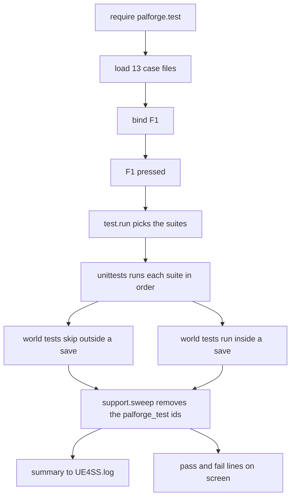

## 读完本页你可以做到

- 几秒钟内确认 PalForge 在你的游戏里已经加载并且正常工作
- 读懂游戏过程中出现在屏幕上的那行成功与失败统计
- 只跑你关心的那一部分，而不是全部
- 把自己的内容绑到一个键上，不用离开游戏就能试
- 加上自己的检查，让坏掉的包在玩家发现之前先告诉你

## 按 F1

游戏运行时按 **F1**。过一会儿，屏幕上会出现一行：

```text
[PalForge] tests: 276 passed, 0 failed, 18 skipped
```

这一行就是"我的环境能不能用"的答案。`0 failed` 表示 PalForge 已经加载，你写的 api 的行为和
api 页面描述的一致，游戏也接受了它发出的调用。出现别的数字时，坏掉的那一块会在屏幕上和日志里
被点名。

在标题画面按，或者进了存档再按，都可以，两种都有用。需要已加载世界的检查会在标题画面让开，
被计为**跳过**而不是失败 —— 上面那个 `18 skipped` 就是它们。



加载这些检查、把它们放到 F1 上，只在游戏启动时发生一次。从 `F1 pressed` 往下的部分，每按一次
就重新发生一次。

启动时只**加载**检查，从不运行它们。它们会生成帕鲁、发放道具，所以只有你主动要求时才会真的
跑一次。

按键是通过 `core/keyboard/base/registory` 安装的，它把你的回调包进 `ExecuteInGameThread` 和一个
`pcall` 里。某个检查炸了，也不会把你的键盘输入一起拖下水。

F1 只在 dev 模式下安装，而 PalForge 启动时就处于 dev 模式。发布你的包时，请在
`registry.initialize()` 之前关掉它：

```lua
local env = require("palforge.env")
env.dev = false     -- set this BEFORE registry.initialize()
```

`dev = false` 时 PalForge 只加载内容目录，别的都不加载 —— 没有 dev 按键绑定，没有目录导出，
没有检查，也没有 F1。

<Callout type="warn">
`reg.register` 是软失败的。如果这次会话里 `RegisterKeyBind` 或 UE4SS 的 `Key` 表不可用，它会
记录 `could not bind F1 (keybinds unavailable this session)` 并返回 `false`。这时没有键可按 ——
请改为从你自己的代码里调用 `test.run()`。
</Callout>

## 检查了哪些东西

一共有 **294 项检查**，分成 13 个**套件**。一个套件就是一组检查，覆盖 api 的一个领域。每个套件
是 `Scripts/palforge/test/cases/` 下的一个文件。它们针对你这次会话里真实的游戏运行。

| 套件 | 测试数 | 需要世界的测试数 |
| --- | --- | --- |
| `schema` | 28 | 0 |
| `registry` | 23 | 0 |
| `definitions` | 14 | 0 |
| `pal` | 30 | 5 |
| `item` | 21 | 1 |
| `building` | 26 | 2 |
| `skill` | 23 | 1 |
| `effect` | 35 | 1 |
| `audio` | 17 | 2 |
| `mesh` | 21 | 1 |
| `ui` | 32 | 1 |
| `player` | 10 | 4 |
| `events` | 14 | 0 |

表格里的顺序就是运行顺序。只碰 Lua 的套件排在前面，这样基础部分出了问题，会在任何东西碰到你的
存档之前先报出来。

## 读懂输出

结果会去两个地方。`UE4SS.log` 里什么都有，作用域是 `[PalForge.test]`（运行器）和
`[PalForge.unittests]`（框架）：

```text
[PalForge.test][info] running 13 suite(s): schema, registry, definitions, pal, ...
[PalForge.unittests][info] SKIP [pal] spawns at a coordinate: no world loaded
[PalForge.unittests][info] tests: 276 passed, 0 failed, 18 skipped (294 total)
[PalForge.test][info] swept 217 test definition(s)
```

把它当成四种行来读：

- `running N suite(s)` —— 这次按键接下来要做什么。
- `SKIP [suite] test: reason` —— 每个被跳过的测试一行，附上缺少的那个前提条件。记在 `info`
  级别，因为跳过不是问题。
- `FAIL [suite] test: message` —— 记在 `err` 级别，附上断言消息。
- `tests: P passed, F failed, S skipped (T total)` —— 最该看的那一行。

同一份汇总还会用 `SendSystemAnnounce` 显示在屏幕上，前缀是 `[PalForge]`，这样你不用切出游戏就能
知道这次跑是不是全绿：

```text
[PalForge] tests: running 13 suite(s)
[PalForge] tests: 276 passed, 0 failed, 18 skipped
[PalForge] FAIL [item] give adds to the live inventory and take drops it back out, both measured: the Wood count must RISE across a give (135 -> 135)
```

每一条失败都会单独在屏幕上再显示一次。只说 `3 failed` 而没有别的信息的汇总，最后还是得回日志里
去看。

<Callout type="info">
上面那 18 个跳过，是标题画面下受世界限制的测试。进了存档以后这个数字会下降，同时另外*一些*测试
会改为跳过 —— 有几项检查的是没有世界时的那条路径，一旦世界存在它们就让开。通过数也跟着一起动。
必须一直是零的是 `failed`。
</Callout>

## 只跑一个套件

`test.run` 可以不带参数，也可以接一个套件名，或者一组名字：

```lua
local test = require("palforge.test")

test.run()                        -- every suite this module owns
test.run("schema")                -- one
test.run({ "pal", "item" })       -- several
```

它返回结果表，所以你可以从自己的工具里去查：

```lua
local results = test.run("item")

print(results.passed, results.failed, results.skipped, results.total)
for _, suite in ipairs(results.suites) do
    print(suite.name, suite.passed, suite.failed, suite.skipped)
    for _, f in ipairs(suite.failures) do print("FAIL", f.test, f.msg) end
    for _, s in ipairs(suite.skips)    do print("SKIP", s.test, s.msg) end
end
```

不带参数的 `test.run()` 只跑那十三个套件，不会更多。PalForge 在启动时还会跑一小组纯 Lua 的检查
（`palforge.tests`）；它们注册进同一个列表，但 F1 不碰它们。要够到每一个注册过的套件，就往下
走一层：

```lua
local T = require("palforge.core.unittests")

T.names()            -- every registered suite name, sorted
T.byName("pal")      -- one suite, or nil
T.run()              -- EVERY registered suite, including the headless bundle
T.reset()            -- drop all registrations (tooling; you rarely want this)
```

`palforge.test` 也会报告它自己的情况：

```lua
test.CASES       -- the case names, in run order
test.loaded      -- case name -> suite, or false when the file failed to load
test.suites()    -- the names that actually loaded, in run order
test.bindings()  -- { "F1   tests: all suites", "F4   ?" }
```

## 绑定你自己的键

`test.bind` 一行就够，有四种形式：

```lua
local test = require("palforge.test")

test.bind("F1")                              -- everything (installed by default)
test.bind("F2", "pal")                       -- one suite
test.bind("F3", { "item", "effect" })        -- several
test.bind("F5", function()                   -- anything at all
    Pal.get("ChickenPal"):spawn(Player.coordinate())
end, { desc = "spawn a chicken" })
```

第四种形式根本不是跑测试。传一个函数，这个键就调用它。你在游戏里想随手试的任何东西都可以放
进去 —— 生成一只帕鲁、给自己发材料、打开一个你自己做的界面面板。

`opts` 会原样传给按键绑定注册表。`desc` 是 `test.bindings()` 打印的内容；不写的话，`bind` 会
替你写一个（`tests: pal`、`tests: all suites` 或 `custom`）。

这些调用放在任何启动时会运行的地方都行。专门的位置是 `palforge/core/keyboard/functions/` 下的
一个文件，`reg.load()` 扫描这个目录时会把它捡起来：

```lua title="Scripts/palforge/core/keyboard/functions/beacon_tests.lua"
local test = require("palforge.test")

test.bind("F6", { "building", "skill" }, { desc = "tests: beacon domains" })
```

重新绑定一个键会**就地替换它的行为**。注册表对每个键只保留一个引擎绑定，替换的是它背后的函数，
所以你不会在 F1 上留下两个处理函数。

<Callout type="warn">
不要从 `functions/` 下的文件里用 `reg.register` 去抢 F1。在 `registry.initialize()` 里，
`reg.load()` 比绑定 F1 的那句 `require("palforge.test")` 更早运行，所以你的处理函数会在片刻
之后被悄悄覆盖。像上面那样在文件开头 require `palforge.test`，它就会当场加载，它自己的
`bind("F1")` 先跑，然后你的 bind 胜出。
</Callout>

## 世界闸门

api 的大部分都需要一个已加载的世界。碰到世界的测试会把 `support.needWorld(t)` 写在第一行；当
没有玩家 pawn 时 —— 也就是游戏此刻替你操控的那个角色 —— 它会**跳过这个测试，而不是让它失败**：

```lua
s:test(":give hands the player three Wood", function(t)
    local pawn = support.needWorld(t)     -- returns the pawn, or skips out of the test
    local wood = Item.get("Wood")
    t:eq(wood:give(3), true, "give reads the count before and after, so true means it rose")
end)
```

所以两个地方各按一次都值得。在标题画面，另外 276 项检查照样覆盖了 spec、注册表、分发，以及每一个
软失败的返回值；进了存档，那 18 项世界检查会加进来。不会仅仅因为你当时不在世界里就变红。

`needWorld` 返回 pawn，所以 `local pawn = support.needWorld(t)` 读起来就像一次普通的取值。只想要
这道闸门时，把返回值丢掉：

```lua
support.needWorld(t)
```

旁边还有两道闸门：

```lua
support.player()          -- the local PalPlayerCharacter, or nil; never throws
support.worldReady()      -- core/event's gate, falling back to the pawn check
support.needGlobal(t, "FindAllOf")   -- skip unless that engine global is a function
```

`support.worldReady()` 会先问 `core/event.isWorldReady()` —— 那道闸门要等 ready 监视连续五次轮询
都看到 pawn 之后才打开 —— 并在监视还没稳定下来的那一小段时间里，回退到直接检查 pawn。
`needGlobal` 是为那些不会暴露全部 UE4SS 全局量的会话和主机准备的；随包提供的用例目前都还用不到
它，但如果你写的用例直接去拿 `LoopAsync` 或 `FindAllOf`，就应该用它。

测试也可以自己决定跳过，在任意深度上，只要它发现前提条件不在：

```lua
s:test("a coordinate spawn reports what it observed", function(t)
    support.needWorld(t)
    local coord = support.inFront(600.0, 50.0)
    if not coord then t:skip("no player location to spawn in front of") end

    local ok = Pal.get("ChickenPal"):spawn(coord)
    t:type(ok, "boolean", ":spawn reports a boolean verdict")
    t:eq(ok, false, "a coordinate spawn reports false while nothing appears; a true here "
        .. "means a pal was observed to arrive, and this test is what needs updating")
end)
```

最后那一行值得当成习惯抄下来。这个版本里 `:spawn` 什么都不会放下，所以这项检查就主张这件事 ——
将来真有帕鲁出现时，这个测试会变红，而那次失败就是通知。只写 `t:type(ok, "boolean")` 的话，两种
情况都会通过，什么也告诉不了你。把游戏今天做到的事如实写进断言，连不足的部分一起，让变化去
故意打破测试。

跳过是双向的。有几项检查覆盖的是*没有世界*的那条路径 —— 关着的 ready 闸门、没有归属者的控件的
`:screen()` —— 它们在发现世界存在时会调用 `t:skip("a world is loaded")`。

## 断言

传给每个测试体的 `t` 带着十个方法。每个方法最后都可以再加一个 `msg`；不写的话，框架会写一句
可读的默认消息。

| 调用 | 通过条件 |
| --- | --- |
| `t:assert(cond, msg)` | `cond` 为真值 |
| `t:eq(a, b, msg)` | `a == b` |
| `t:neq(a, b, msg)` | `a ~= b` |
| `t:truthy(v, msg)` | `v` 既不是 `nil` 也不是 `false` |
| `t:falsy(v, msg)` | `v` 是 `nil` 或 `false` |
| `t:type(v, want, msg)` | `type(v) == want` |
| `t:near(a, b, eps, msg)` | 两个都是数字，且 `math.abs(a - b) <= eps` |
| `t:errors(fn, pattern, msg)` | `fn` 抛出错误，且消息里含有 `pattern` |
| `t:fail(msg)` | 永远不通过 —— 它当场让测试失败 |
| `t:skip(reason)` | 永远不通过 —— 它停下测试，但不算失败 |

`eq` 就是原始的 `==`。它不做表的深度比较：两个表相等，只在它们是同一个表时成立，而这正是
`t:neq(Player.coordinate(), c, "every call returns a new table")` 这类同一性检查想要的。

`near` 的 `eps` 默认是 `0.001`。凡是从引擎那边返回的值都用它 —— 浮点数很少能原封不动地走完
一个来回：

```lua
local base = Player.coordinate()
local off  = Player.coordinateOffset(250.0, -750.0, 125.0)

t:near(off.x - base.x, 250.0, 0.001, "x moved by dx")
t:near(off.y - base.y, -750.0, 0.001, "y moved by dy")
t:near(off.z - base.z, 125.0, 0.001, "z moved by dz")
```

`errors` 是你把 api 的严格校验钉住的办法。`pattern` 是**普通子串，不是 Lua 模式** —— 错误文本
里全是魔法字符，只有按字面匹配才行得通。它会返回那条消息，所以你还能对它做更多检查：

```lua
s:test("an unknown field is rejected at define time", function(t)
    local msg = t:errors(function()
        Pal{ id = support.id("pal"), displayName = "Boss" }
    end, 'unknown field "displayName"')

    t:truthy(msg:find("did you mean", 1, true), "the error suggests a real field")
end)
```

失败的断言会抛出错误。运行器接住它，把这一个测试标记为失败，记录下来，然后继续下一个测试 ——
一个坏测试绝不会让整个套件停下。意料之外的 Lua 错误也会被同样接住，并带着原始消息报告为失败；
只有 `t:skip` 是单独计数的。

## 写一个用例

<Steps>

<Step>

### 建文件

用例文件放在 `Scripts/palforge/test/cases/`，一个领域一个。require 框架和辅助函数，建一个套件，
加上测试，返回这个套件。

```lua title="Scripts/palforge/test/cases/beacon.lua"
local T       = require("palforge.core.unittests")
local support = require("palforge.test.support")

local s = T.suite("beacon")

s:test("a beacon registers under the id it was declared with", function(t)
    local id = support.id("building")
    local h  = Building{ id = id, name = "Beacon" }

    t:eq(h.id, id, "the handle carries the id it was defined with")
    t:eq(h:name(), "Beacon")
end)

s:test("a beacon pays out wood when it is interacted with", function(t)
    support.needWorld(t)

    local wood = Item.get("Wood")
    local before = wood:count()
    if before == nil then t:skip("the inventory count could not be read") end

    t:eq(wood:give(3), true, "give answers the before/after delta, so true means the count rose")

    local after = wood:count()
    if after then t:eq(after - before, 3, "and it rose by exactly what was asked for") end
end)

return s
```

只要游戏允许，就用实测代替类型检查。`:give`、`:take` 和 `:count` 返回的都是可以相减的数字，所以
一个测试可以说出到底动了多少，而不只是说“回来了一个布尔值”—— 这样写的检查，等数字变了那天依然
说得出话。

`Suite:test` 可以链式调用，所以你喜欢的话可以写 `s:test(...):test(...)`。

</Step>

<Step>

### 登记用例名

把文件名加到 `Scripts/palforge/test/init.lua` 的 `M.CASES` 里。这个列表就是运行顺序，所以把纯
Lua 的套件放在碰世界的那些前面：

```lua
M.CASES = {
    "schema",
    "registry",
    "definitions",
    "beacon",
    "pal",
    -- ...
}
```

</Step>

<Step>

### 按键

`M.load()` 会在 `palforge.test.cases.` 下 require 每个名字，并把结果记进 `test.loaded`。某个
文件加载失败不会让这次运行停下：它会记在 `err` 级别，并从 `test.suites()` 里被排除，其余十二个
照跑。

```text
[PalForge.test][err] case 'beacon' failed to load: ...cases/beacon.lua:12: attempt to index a nil value
```

</Step>

</Steps>

<Callout type="warn">
给你的套件起一个别人没用过的名字。当一个名字已经注册过时，`T.suite(name)` 会把**已有的**套件
交回给你，而不是新建第二个，所以选了已被占用名字的用例文件，它的测试会被追加到别人的套件里。
`M.load()` 会注意到并发出警告：
`case 'pal' shares its suite name with an already registered suite; the two are now merged`。
</Callout>

## 带命名空间的 id 和清扫

定义不会过期。一旦定义了什么，它在这次会话剩下的时间里就一直存在，而 `core/event` 每次扫描都会
遍历活着的注册表。所以，定义了一次性内容的那次运行，必须自己再把它取出来，否则按十次键就会留下
十次运行的残留。

于是测试创建的每个 id 都来自 `support.id`，它会混进一个按次递增的计数器：

```lua
support.id("pal")                          -- "palforge_test:pal_1"
support.id("pal")                          -- "palforge_test:pal_2"
support.NAMESPACE                          -- "palforge_test"
support.isTestId("palforge_test:pal_1")    -- true
support.isTestId("ChickenPal")             -- false
```

这个计数器在一次会话里从不重置，所以把套件跑十次也不会和自己撞车。

最后一个套件跑完后，`test.run` 会调用 `support.sweep()`。它遍历 `object_manager.TYPES` 的每一
项，注销通过 `isTestId` 的那些 id，并返回数量：

```lua
local removed = support.sweep()   -- 217
```

因为判断是对 `palforge_test:` 的前缀匹配，清扫永远碰不到真实内容 —— 碰不到原生目录，也碰不到
你的包。反复按键之后，注册表和按之前完全一样。

## support 辅助函数

`test/support.lua` 会被每个用例文件 require，里面装着一个在游戏里运行的套件所需要的东西。

报告：

```lua
support.announce("half way through")   -- on screen via SendSystemAnnounce, prefixed [PalForge]
support.log("give Wood x3 -> 135 -> 138")   -- UE4SS.log under [PalForge.test]
```

`announce` 包在 `pcall` 里，需要 `PalUtility` 和一个活着的 `PalPlayerCharacter` 同时存在。没有
世界时它什么也不做，而且是安静地不做，所以你可以不先检查就直接调用。

读取世界的这些，全都返回 `nil` 而不是抛出错误：

```lua
support.player()             -- the local pawn, or nil
support.location(actor)      -- { x, y, z }, or nil
support.inFront(600.0, 50.0) -- a point 600cm ahead of the player and 50cm up, or nil
support.nearestPal(coord)    -- { actor, pos, dist, count }, or nil
```

生成测试用 `inFront` 把东西放在你面前看得见的地方，而不是放进你身体里；当 pawn 的朝向向量读不
出来时，它回退到 +X 轴。`nearestPal` 枚举 `PalCharacter`，报告离某个坐标最近的那一只，附带距离
和总数。生成检查用它来确认游戏仍然能在它请求的那个点周围列出自己的角色。

<Callout type="info">
这个版本里 `:spawn` 什么都不会放下，所以 pal 套件先核对那个 `false`，再核对这个判定所依赖的测量本身：
`nearestPal` 证明世界在它请求的那个点周围仍然可以被枚举，而那正是一次能用的生成会被检测到的方式。
</Callout>

套件依赖的真实游戏 id，这样一次实时检查用到的是游戏里真的有的内容：

```lua
support.GAME = {
    pal      = "ChickenPal",
    pal2     = "SheepBall",
    item     = "Wood",
    consume  = "Berries",
    building = "WorkBench",
    palbox   = "PalBoxV2",
    bgm      = "AKE_BGM_Title",
}
```

## 一次运行会留下什么

清扫注销的是定义。它没法撤销一次实时测试对你存档做过的事，世界测试也是照着这一点写的 —— 但
并不是所有事都可逆。

- **不会生成出帕鲁。** `pal` 在它的三个实时测试里向 `UPalCheatManager` 要一只 `ChickenPal`，而这个
  版本里什么都不会出现，所以这三项什么也不会留下。将来真有一只出现的话，它会留下：整棵树里没有
  东西能把帕鲁收回去。
- **发出去的 Wood 会被原样交回来，掉在地上。** `item` 发三个 `Wood`，再把同样的三个拿回来。拿走
  不是销毁，而是掉在你站着的地面上，所以一次运行留下的是你脚边的一小堆；如果 give 成了而 take
  没成，那它们就留在你的背包里。
- **不会放置、穿戴或建造任何东西。** mesh 和 pal 的渲染测试指向一个故意加载不了的模型路径，
  所以后端在碰到玩家的 mesh 组件之前就退出了。building 套件对你已经建好的东西只读，也从不
  调用 `inst:save()`。存在 `PalPlayerController` 时，UI 套件会在构造控件之前停下。
- **效果会自己收拾干净。** 唯一的实时 effect 测试在 `pcall` 下把效果加到 pawn 上再移除掉。它没有
  声明 `nativeStatus`，所以不会点亮游戏自己的状态异常；写了的效果，也会在退出时把它熄灭。

<Callout type="warn">
碰世界的套件请在一个可以丢掉的存档里跑，别在你在意的那个存档里跑。地上三个木头是很小的一点
乱，但它确实是乱，而框架并没有承诺会去收拾。
</Callout>

一次全绿的运行，并不代表 api 里每个调用都把它名字暗示的活干完了。今天有三个只做了一半，套件
特意把这一点钉住：

- `Pal.Handle:spawn` 不会在世界里放下生物。三项实时 pal 检查主张的就是那个 `false`，而不是绕过去，
  所以等到真有帕鲁出现的那天，套件会告诉你。
- `Audio.Handle:setVolume` 对每个值都返回 `false`，边界值也一样。它什么都不改，而这个版本上根本
  没有按声音调节的音量可改。请挑一个更安静的声音事件，或者把音量交给游戏自己的音频选项，并把那个
  `false` 当作诚实的回答。
- `Audio.Handle:stop` 是按 actor 生效的。它发出 `StopSoundByActor`，所以它让那个 actor 上的所有
  声音都安静下来，而不只是你调用它的那一个声音 —— 就算是一个从未定义过的 id 的句柄，也照样让
  actor 安静。需要单独停止的声音，请放在不同的 actor 上播放。

## 小结

- 在游戏里按 **F1**。屏幕那一行显示 `0 failed`，就说明你的环境能用。
- 跳过没关系。世界相关的检查会在标题画面跳过；必须保持为零的只有 `failed`。
- `test.run("pal")` 只跑一个套件，`test.bind("F5", fn)` 能把你想要的任何处理放到一个键上。
- 需要世界的检查以 `support.needWorld(t)` 开头，所以它们会跳过，而不是失败。
- 测试里自己编出来的 id 都用 `support.id(...)` 取，之后清扫会把它们移除。
- 碰世界的套件请在可以丢掉的存档里跑：实时检查发给你的东西会留下，它拿回去的东西会掉在地上。

接下来读[制作内容包](/docs/guides/first-content-pack)，写出这些检查要保护的那些内容。

<Cards>
  <Card title="制作内容包" href="/docs/guides/first-content-pack">
    上面那个 beacon 例子就是从这篇里摘出来的。
  </Card>
  <Card title="快速上手" href="/docs/getting-started">
    安装 PalForge，确认内核正在加载。
  </Card>
</Cards>
