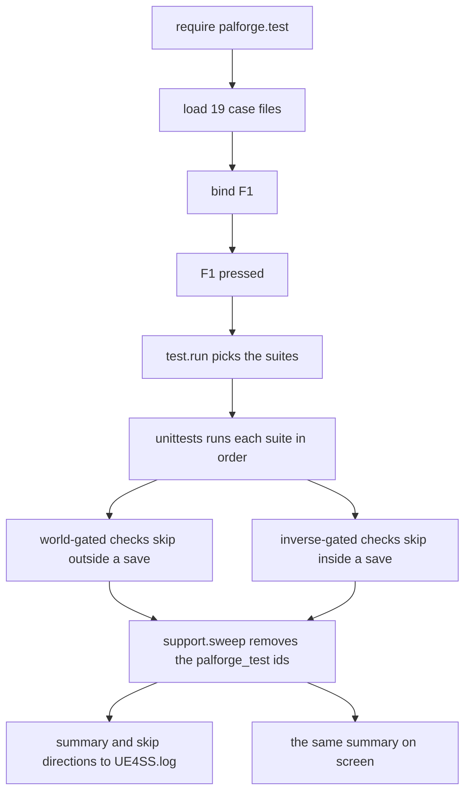

## 读完本页你可以做到

- 几秒钟内确认 PalForge 在你的游戏里已经加载并且正常工作
- 读懂游戏过程中出现在屏幕上的那行通过、失败与跳过统计
- 明白为什么一次按键跑不完全部检查，以及第二次该在哪按
- 只跑你关心的那一部分，而不是全部
- 按名字逐个跑那些只有运行中的 Palworld 才能回答的测量
- 把自己的内容绑到一个游戏还没占用的键上
- 加上自己的检查，让坏掉的包在玩家发现之前先告诉你

## 按两次 F1

游戏运行时按 **F1**。过一会儿，屏幕上会出现两行：

```text
[PalForge] tests: running 19 suite(s)
[PalForge] tests: 548 passed, 0 failed, 32 skipped (28 need a world, 1 need a declared test/hooks run, 3 could not be answered by this session)
```

`0 failed` 就是"我的环境能不能用"的答案：PalForge 已经加载，你写的 api 的行为和 api 页面描述的
一致，游戏也接受了它发出的调用。出现别的数字时，坏掉的那一块会在屏幕上和日志里被点名。

**没有哪一次按键能跑完所有检查，而汇总会用文字把这件事说出来。** 28 项检查需要已加载的存档，
在标题画面会跳过。另有 11 项正相反：它们验证的是*拒绝*路径 —— 关着的 ready 闸门、没有归属者可
挂载的控件、没有 pawn 时的 `Player.coordinate()` —— 所以只能在没有任何东西可以成功的地方运行，
一旦世界起来了它们就跳过。这两组不可能在一次按键里都跑到。请在标题画面按一次，进存档再按一次；
一次全绿的运行，其实是两次运行。

上面的数字是 2026-08-02 在一个没有任何引擎的纯 `lua5.4` 进程里跑完整套件的实测结果。在游戏里，
那 28 项受世界限制的检查会改为运行，`could not be answered by this session` 的三项里也会消失两项
—— 那两项只是因为纯 Lua 进程既没有 `LoopAsync` 也没有 UE4SS 的 `Key` 表才出现的。



加载这些检查、把它们放到 F1 上，只在游戏启动时发生一次。从 `F1 pressed` 往下的部分，每按一次
就重新发生一次。

启动时对这些检查只**加载**，从不运行。它们会生成帕鲁、发放道具，所以只有你主动要求时才会真的
跑一次。启动时真会跑的只有无界面的 `units/` 测试包，这也正是它单独成一个目录的原因：它除了 Lua
表以外什么都不碰。

按键是通过 `core/keyboard/base/registory` 安装的，它把你的回调包进 `ExecuteInGameThread` 和一个
`pcall` 里。某个检查炸了，也不会把你的键盘输入一起拖下水。

F1 只存在于 dev 会话里，而 `env.dev` 发布时是 `false`，`env.debug` 也一样。框架里没有任何东西会
自己把它们打开。dev 会话通过一个可选模块 `Scripts/palforge_dev.lua` 打开它们：这个文件由
`tools/deploy.sh` 在默认模式下写出，在 `--release` 下被删除，并且被 gitignore，所以它不可能顺着
仓库跑到玩家那里。

```lua title="Scripts/palforge_dev.lua"
local env   = require("palforge.env")
env.dev     = true
env.debug   = true
-- Per-hook opt-in for the hooks that write into a real save.
-- env.debugHooks["pal-skills-equip"] = true
```

`dev = false` 时 PalForge 只加载内容目录，别的都不加载：没有 dev 按键绑定（F4 会解锁当前存档里的
全部科技），没有 F1 套件，没有 F9 重载，没有目录导出，没有无头检查束，也没有测试钩子。启动日志会
逐项写出哪些加载了、哪些没有，所以"这个键没反应"和"这个键根本没绑上"是两行不同的话。

<Callout type="warn">
`reg.register` 是软失败的。如果这次会话里 `RegisterKeyBind` 或 UE4SS 的 `Key` 表不可用，它会
记录 `could not bind F1 (keybinds unavailable this session)` 并返回 `false`。这时没有键可按 ——
请改为从你自己的代码里调用 `test.run()`。
</Callout>

## 测试树

这一页上的所有东西都在 `Scripts/palforge/test/` 底下，是一棵树，分成五个角落。产品代码知道的名字
只有 `test/init.lua`：`core/registry.lua` 在 dev 开关内侧 require 它并调用 `install()`，就这一次
调用跑了启动测试包、加载了 case 文件、绑定了 F1 和探针的键、注册了包括 `ps_catalog` 在内的全部
`pf_*` 控制台命令，并把动作表交给 `core/autorun`。

```text
Scripts/palforge/test/
├── init.lua      唯一的入口；install() 把下面这些全部接好
├── units/        无界面套件，启动时就跑 - 2 个套件、8 项检查
├── cases/        游戏内 API 测试套件，挂在 F1 上 - 19 个文件
├── hooks/        需要 Palworld 在跑才能取的测量 - 声明了 25 个，从不自动运行
├── probes/       调查用的转储 - 不是测试；不判定通过或失败
├── tools/        dev 工具 - catalog.lua，也就是 ps_catalog 的本体
├── support.lua   世界读取、带命名空间的 id，以及清扫
└── probe.lua     探针和钩子给输出加的 BEGIN/END 括号
```

| 目录 | 什么该放这里 | 什么时候跑 |
| --- | --- | --- |
| `units/` | 除了 Lua 表以外什么都不碰的套件 | 启动时，每次 dev 会话 |
| `cases/` | 需要世界、pawn、UObject 或 UE4SS 全局的套件；环境不在时带方向地跳过 | 按 F1 时，绝不自己跑 |
| `hooks/` | 游戏关着就取不到的测量，通常还要有人盯着屏幕 | 只有被点名时 |
| `probes/` | 引擎实际长什么样的转储，用来关掉一个悬而未决的问题 | 自己的键，或 `pf_<name>` |
| `tools/` | 根本不是测试的工具 | 敲它的命令时 |

`units/` 的规矩最窄，而这正是启动安全的原因：整个测试包在第一个世界存在之前、在还在加载的游戏里
跑完，所以放在那里的套件一旦阻塞或抛出，每次启动都会被拖慢。需要世界、pawn、UObject 或 UE4SS
全局的检查，属于 `cases/` 的套件或 `hooks/` 的测量。

**发布部署里一个都没有。** `tools/deploy.sh --release` 会把 `palforge/test/` 连同它的 58 个文件
一起从暂存副本里删掉，于是内核那唯一一次 `require("palforge.test")` 答 `absent` —— 对玩家的安装
来说这是正确状态，而不是装了一半。这一页上的东西没有一样会到玩家手里：套件、探针键、钩子、
`pf_*` 命令、`ps_catalog`，一个也没有。

## 检查了哪些东西

一共有 **580 项检查**，分成 **19 个**套件。一个套件就是一组检查，覆盖 api 的一个领域。每个套件
是 `Scripts/palforge/test/cases/` 下的一个文件。它们针对你这次会话里真实的游戏运行。

| 套件 | 检查数 | 只在存档里跑 | 只在标题画面跑 |
| --- | --- | --- | --- |
| `schema` | 28 | 0 | 0 |
| `registry` | 42 | 0 | 0 |
| `definitions` | 23 | 0 | 0 |
| `store_codec` | 19 | 0 | 0 |
| `store_state` | 36 | 0 | 0 |
| `store_api` | 12 | 0 | 1 |
| `store_runtime` | 5 | 0 | 0 |
| `store_disk` | 27 | 0 | 0 |
| `native` | 26 | 0 | 0 |
| `pal` | 34 | 5 | 0 |
| `item` | 23 | 3 | 0 |
| `building` | 32 | 3 | 1 |
| `skill` | 34 | 3 | 0 |
| `effect` | 40 | 2 | 0 |
| `audio` | 24 | 4 | 1 |
| `mesh` | 46 | 3 | 0 |
| `ui` | 105 | 1 | 6 |
| `player` | 10 | 4 | 1 |
| `events` | 14 | 0 | 1 |

表格里的顺序就是运行顺序，它就是 `Scripts/palforge/test/init.lua` 里的 `M.CASES` —— 关于 F1 会跑
哪些套件，那份列表是唯一的权威。只碰 Lua 的套件排在前面，这样基础部分出了问题，会在任何东西碰到
你的存档之前先报出来。

`pal` 里有一项两列都不属于：`teachAll` 的写入那一半需要一只活着的帕鲁，并且会改动真实存档，
所以由一个声明过的钩子来测量，而不是 F1；它那行跳过会点出负责测量的钩子名字。

`store_runtime` 里那五项同样两列都不属于，理由更尖锐一点：它们拿一份假的 Actor 列表去驱动建筑
扫描，而在 UE4SS 已加载的情况下这么做，等于把一个不含玩家任何结构的世界交给真正的 500 ms 扫描
——那些结构会全部漏掉并被隔离。所以它们只在 `lua5.4` 的无头环境里跑，在游戏里的两种状态下都跳过，
并且会说明原因。另外四个 store 套件是纯 Lua，在哪里都能跑。这五个套件都不会写进 `state/`：三个把 store 的 I/O
整个换掉，而必须面对真实文件系统的 `store_disk` 在操作系统临时目录下的一个用完即弃的目录里工作。
因为一个测试"玩家保存状态所在模块"的套件，绝不能有能力去写玩家保存的状态。

## 读懂输出

结果会去两个地方。`UE4SS.log` 里什么都有，作用域是 `[PalForge.test]`（运行器）和
`[PalForge.unittests]`（框架）：

```text
[PalForge.test][info] build 2026-08-02 12:41:30 | dev=true debug=true | game v1.0.2.101103 (live v1.0.2.101103) | running 19 suite(s): schema, registry, definitions, store_codec, store_state, store_api, store_runtime, store_disk, native, pal, item, building, skill, effect, audio, mesh, ui, player, events
[PalForge.unittests][info] SKIP [player] coordinate returns the local player's position as numeric x, y, z (world): no world loaded
[PalForge.unittests][info] tests: 548 passed, 0 failed, 32 skipped (580 total)
[PalForge.unittests][info] tests: 32 skipped (28 need a world, 1 need a declared test/hooks run, 3 could not be answered by this session)
[PalForge.unittests][info] tests: 28 check(s) were not measured because there is no world - load a save and press the key again.
[PalForge.unittests][info] tests: 1 check(s) can only be measured by a declared hook - `pf_hooks` lists them with the reason each one would skip, and each SKIP line above names the action that runs its own.
[PalForge.test][info] swept 123 test definition(s)
```

把它当成五种行来读：

- 来源行：`tools/deploy.sh` 写下的构建戳、两个开关、所有能力据以测量的那个 Palworld 版本以及
  运行中的游戏自己报出的版本，然后是这次按键接下来要做什么。已经加载的 Lua 会一直留着，所以
  戳比你上一次部署还旧，就说明 F9 没有按，它下面的一切都不是关于你刚写的代码的证据。
  `unstamped (not deployed by tools/deploy.sh)` 表示这是手工复制的目录。
- `SKIP [suite] test (direction): reason` —— 每个被跳过的检查一行，带上在哪种会话状态下才会运行：
  `world`、`no-world`、`hook`、`opt-in`、`setup` 或 `session`。记在 `info` 级别，因为跳过不是问题。
- `FAIL [suite] test: message` —— 记在 `err` 级别，附上断言消息。
- `tests: P passed, F failed, S skipped (T total)` —— 最该看的那一行。
- 它下面的分解，正是让上面那行变得可读的东西：有多少跳过在等哪种状态；两个方向都在等时，还会
  多出一句"没有哪一次运行能测完全部"。

汇总还会用 `SendSystemAnnounce` 显示在屏幕上，前缀是 `[PalForge]`，并且带着同一份分解，这样你不用
切出游戏就能知道到底测到了什么：

```text
[PalForge] tests: running 19 suite(s)
[PalForge] tests: 548 passed, 0 failed, 32 skipped (28 need a world, 1 need a declared test/hooks run, 3 could not be answered by this session)
[PalForge] FAIL [item] give really adds to the live inventory, measured both ways: the Wood count must RISE across a give (135 -> 135)
```

每一条失败都会单独在屏幕上再显示一次。只说 `3 failed` 而没有别的信息的汇总，最后还是得回日志里
去看。

<Callout type="info">
光一个 `N skipped`，分不出"几乎全都测到了"和"几乎什么都没测到"这两种运行，所以现在每个跳过都带
方向。`28 need a world` 是一句你能照着做的话，`32 skipped` 不是。
</Callout>

## 只跑一个套件

`test.run` 可以不带参数，也可以接一个套件名，或者一组名字：

```lua
local test = require("palforge.test")

test.run()                        -- every suite this module owns
test.run("schema")                -- one
test.run({ "pal", "item" })       -- several
```

它返回结果表，所以你可以从自己的工具里去查：

```lua
local results = test.run("item")

print(results.passed, results.failed, results.skipped, results.total)
for direction, n in pairs(results.needs) do print(direction, n) end   -- world, no-world, hook, ...
for _, suite in ipairs(results.suites) do
    print(suite.name, suite.passed, suite.failed, suite.skipped)
    for _, f in ipairs(suite.failures) do print("FAIL", f.test, f.msg) end
    for _, s in ipairs(suite.skips)    do print("SKIP", s.test, s.needs, s.msg) end
end
```

不带参数的 `test.run()` 只跑那十九个套件，不会更多。启动测试包是另一回事：那是一组纯 Lua 的检查
`palforge.test.units`，由 `test/init.lua` 的 `install()` 来跑，而不是内核。它们注册进同一个列表，
而 F1 仍然刻意不碰它们。要够到每一个注册过的套件，就往下走一层：

```lua
local T = require("palforge.core.unittests")

T.names()            -- every registered suite name, sorted
T.byName("pal")      -- one suite, or nil
T.run()              -- EVERY registered suite, including the headless bundle
T.NEEDS              -- the seven skip directions, as the summary spells them
```

那份注册表刻意没有提供清空的办法：套件列表和进程同寿，而真正需要一张白纸的场景 —— 重新加载改过的
用例文件 —— 由 F9 负责，它会丢掉每一个 `palforge.*` 模块，再从零把这张表建起来。

`palforge.test` 也会报告它自己的情况：

```lua
test.CASES       -- the case names, in run order
test.loaded      -- case name -> suite, or false when the file failed to load
test.suites()    -- the names that actually loaded, in run order
test.ACTIONS     -- name -> function, every pf_* command this module owns
test.bindings()  -- one line per PalForge key, with what the GAME has on the same key
```

`test.bindings()` 委托给键盘注册表自己的报告，而每行后半段才是值得读的部分：

```text
keyboard: F1                   palforge tests: all suites                        game: nothing
keyboard: F5                   unknown  probe reflect (reflection dump: classes, functions, parameters, DataTable rows) - needs a loaded save game: the game's key config has not been read
```

启动时的 `unknown` 是正确状态，不是坏了：游戏的按键配置挂在一个世界子系统上，而 mod 加载时还没有
世界。它会从 `world.ready` 起被填上，`pf_keys` 则可以随时把整张表打印出来。

## 三个入口：按键、控制台、autorun.txt

在真机上，输入通道已经接连失效过三次，每一次真正的工作都没问题，缺的只是进去的路。所以所有命令
都放在同一张表 `test.ACTIONS` 里，由三条路通向它。

**UE4SS 控制台。** 每个动作都注册成一条控制台命令，这份清单在每次启动时排序打印，由它所描述的
那张表生成，因此不会走样：

```text
[PalForge.test][info] console commands: pf_hook  pf_hook_audio_custom_file_loader  pf_hook_audio_setvolume_audible  pf_hook_building_actor_streaming  pf_hook_building_record_orphans  pf_hook_building_runtime_reload  pf_hook_building_unlock  pf_hook_game_build_live  pf_hook_item_datatable_row_read  pf_hook_item_satiety_write  pf_hook_keymap_key_coverage  pf_hook_mesh_actor_identity  pf_hook_mesh_color_change  pf_hook_mesh_texture_import_live  pf_hook_pal_skills_equip  pf_hook_pal_spawned_fresh  pf_hook_save_survives_pack_removal  pf_hook_skill_hit_source  pf_hook_skill_projectile_spawn  pf_hook_store_base_load_cost  pf_hook_store_crash_recovery  pf_hook_store_save_roundtrip  pf_hook_ui_backhandler  pf_hook_ui_host_layer  pf_hook_ui_update_event  pf_hooks  pf_hooks_all  pf_keys  pf_mesh  pf_native  pf_pal  pf_reflect  pf_spawn  pf_teach  pf_tests  pf_title  pf_uidecl  pf_uievents  pf_uiroute  pf_uislot  pf_uiz  pf_watch
```

**能注册命令，不等于你能敲命令。** UE4SS 发布时控制台是关着的，处理函数会一丝不苟地注册进一个
并不存在的窗口 —— 日志写着 `console commands: ...`，而根本没有地方可以输入。请在
`ue4ss/UE4SS-settings.ini` 里打开它，然后重启游戏：

```ini title="ue4ss/UE4SS-settings.ini"
ConsoleEnabled = 1
GuiConsoleEnabled = 1
GuiConsoleVisible = 1
```

PalForge 读不到那个文件，所以启动日志把同一件事写成提示而不是检查：
`if you cannot type those, UE4SS's console is off`。

**按键。** F1 跑套件，六个探测器各占一个键。树里没有别的东西再去占键 —— 键不是 PalForge 能替
别人预留的。

**`Scripts/palforge/autorun.txt`。** 完全不需要输入的那条路：一个写着动作名的文本文件，每次世界
加载时读一遍，在 `world.ready` 时执行。一行是 `[delay] name`，延迟是世界就绪之后的整秒数：

```text title="Scripts/palforge/autorun.txt"
# comments and blank lines are ignored
pf_keys                       # as soon as the world is ready
12 pf_hook_item_datatable_row_read   # 12 seconds later
```

这个延迟比看上去重要：一只帕鲁要 4 到 8 秒才到，所以需要旁边有帕鲁的动作，不可能和生成它的那次
调用挤在同一口气里。这个文件自己不带任何表 —— 每个名字都到 `test.ACTIONS` 里去查，查不到就报出
来并跳过。它读的是一串名字而不是代码，所以里面写不出按键做不到的事；会写入存档的钩子在这之上还有
自己的第二道关卡。一行带不了参数，这也正是每个钩子还额外拥有一个生成出来的动作名的原因。

## 绑定你自己的键

`test.bind` 一行就够，有四种形式：

```lua
local test = require("palforge.test")

test.bind("F1")                              -- everything (installed by default)
test.bind("F11", "pal")                      -- one suite
test.bind("F12", { "item", "effect" })       -- several
test.bind("INS", function()                  -- anything at all
    Pal.get("ChickenPal"):spawn(Player.coordinate())
end, { desc = "spawn a chicken" })
```

第四种形式根本不是跑测试。传一个函数，这个键就调用它。你在游戏里想随手试的任何东西都可以放
进去 —— 生成一只帕鲁、给自己发材料、打开一个你自己做的界面面板。

`opts` 会原样传给按键绑定注册表。`desc` 是 `test.bindings()` 打印的内容；不写的话，`bind` 会
替你写一个（`tests: pal`、`tests: all suites` 或 `custom`）。

**挑一个还没人占的键。** 一个 dev 会话握着前十个功能键里的九个：F1 跑套件，F2、F3、F5、F6、F8、
F10 是六个探测器，F4 解锁全部科技，F9 是重载。剩下的第十个是 F7，而 F7 是 Palworld 自己的音量键：
游戏在 UE4SS 之下就把它拿走了，所以绑在那里的探测器一次也没能被按到，`RegisterKeyBind` 正常返回，
日志里什么都没说。从外面看，一个永远不会到达的键，和一个"跑过了但什么也没发现"的探测器，是同一种
沉默。

现在这个问题只要查一下就有答案。`pf_keys` 从运行中的游戏里读出 Palworld 自己的按键配置（就是选项
界面在编辑的那个结构体），加上工程自带的 `DefaultInput.ini` 默认值，和 UE4SS 能绑定的每个名字、
以及 PalForge 已经握着的键交叉比对，每个名字打印一行：

```text
keymap: UE4SS NAME           UNREAL FKEY        STATUS   WHAT HAS IT
keymap: F1                   F1                 palforge tests: all suites
keymap: W                    W                  game     MoveForward [project/axis]
keymap: ESCAPE               Escape             refused  Esc is not a KEY on this build ...
keymap: 64 free, 24 taken by the game, 9 held by PalForge, 1 refused outright, 67 unanswerable
```

- `free` —— 游戏的按键配置里没有任何动作用到它。这是关于一个键能说的最强的话，但仍然不是"按下去
  一定到得了"的承诺：Steam 覆盖层、操作系统、UE 自己的控制台键都在那份配置之外。"这里写着 free，
  它却还是没到"如今是一个关于别的东西的、可以上报的发现，而不再是一个读不出含义的零。
- `game` —— Palworld 在它上面有动作，而且**点名说出**是哪个。要么两边都触发，要么这次按键根本
  到不了 UE4SS。
- `palforge` —— 这个 mod 已经占着它，最后一列写明是哪个绑定。
- `refused` —— Esc，而且只有 Esc。PalForge 里没有任何地方可以绑它，因为玩家必须永远能关掉游戏
  自己的菜单。想要 Esc 的面板改为声明 `UI{ backHandler = true }`。
- `unknown` —— 配置读不到（还没有世界），或者那个 UE4SS 名字在 Unreal 里没有对应的 `FKey`。
  绝不要把它当成 free。

它需要一个已加载的存档，因为配置挂在世界子系统上。它只走属性，一个 `UFunction` 都不调用，不往你的
设置或存档里写任何东西，大约一秒完成。一次实机运行读到工程侧 107 条映射、玩家侧配置为空（Palworld
把按键配置当作覆盖来保存，所以没人改过键的存档理应是空的），名字查询次数为 0。

这些调用放在任何启动时会运行的地方都行。专门的位置是 `palforge/core/keyboard/functions/` 下的
一个文件，`reg.load()` 扫描这个目录时会把它捡起来：

```lua title="Scripts/palforge/core/keyboard/functions/beacon_tests.lua"
local test = require("palforge.test")

test.bind("F11", { "building", "skill" }, { desc = "tests: beacon domains" })
```

重新绑定一个键会**就地替换它的行为**。注册表对每个键只保留一个引擎绑定，替换的是它背后的函数，
所以你不会在 F1 上留下两个处理函数 —— 而且这次替换会作为一条点出双方说明文字的警告记进日志，
于是没人想要的替换会出现在日志里，而不是等你按下 F1 弹出别人的面板才发现。另一道门
`reg.claim(key, fn, opts)` 会问同样的问题，然后拒绝而不是替换。

<Callout type="warn">
不要从 `functions/` 下的文件里用 `reg.register` 去抢 F1。在 `registry.initialize()` 里，
`reg.load()` 比绑定 F1 的那句 `require("palforge.test")` 更早运行，所以你的处理函数会在片刻
之后被悄悄覆盖。像上面那样在文件开头 require `palforge.test`，它就会当场加载，它自己的
`bind("F1")` 先跑，然后你的 bind 胜出。
</Callout>

## 必须有游戏在跑才能做的测量

有些问题在文本编辑器里问不出来。主动技的写入会不会真的落到一只活帕鲁身上，游戏又能不能撑住。
颜色在屏幕上到底变没变。`setVolume` 有没有听得出来的效果。哪些 UI 函数会触发，按什么顺序。这些
都放在 `Scripts/palforge/test/hooks/` 下，作为**声明过的钩子**：一次测量一个文件，各自写明屏幕上
需要什么、会不会写入存档、它的输出是什么意思。

不按名字点它，什么都不会跑；`env.debug` 不为 true，钩子文件一个都不会加载。

```lua
-- from the UE4SS console
pf_hooks                      -- list every hook, its gate state, and the sentence that opens it
pf_hook pal-skills-equip      -- run one by its id
pf_hooks_all                  -- run every hook whose gate is open, read-only ones first

-- from autorun.txt, which cannot carry an argument, one generated name per hook
pf_hook_pal_skills_equip
```

一共有三道关卡，而关着的那道永远会被打印出来，不会被默默略过：

1. `env.debug` —— 没有它，钩子文件一个都不加载。`dev` 给你按键和套件，`debug` 给你这个目录。
2. `needs = { world, player, pal, title }` —— 运行中的游戏里必须成立的条件。拒绝会点出是哪道关卡，
   以及打开它的那句话：不是"跳过了"，而是"因为你旁边没有帕鲁所以跳过了，吹哨叫一只出来，或者跑
   `pf_spawn`"。
3. `writes = true` —— 会改动存档的钩子还需要一个逐钩子的同意：`env.debugHooks["<id>"] = true`。
   `debug` 是整个会话范围的开关，而写入是在一个可以丢掉的存档上、针对单次实验做出的决定。

二十四个声明过的钩子，按 `pf_hooks_all` 的运行顺序排列 —— 只读的在前，这样即使中途出事，凡是能打印
的东西都已经在写入发生之前打印完了：

| 钩子 | 需要 | 它把什么问题定下来 |
| --- | --- | --- |
| `game-build-live` | world | `GetBuildVersion` / `GetEngineVersion` / `GetGameName` 的原始字符串，好让声明的版本和运行中的版本真正对上 |
| `keymap-key-coverage` | *无* | `keymap.FKEY` 有没有双向覆盖 UE4SS 那张实时的、165 个名字的 `Key` 表，并把每一处偏差点名 —— 这是 `test/cases/ui.lua` 那道守卫在无头环境下只能跳过的、必须在游戏里跑的那一半。它是这里唯一不声明 `needs` 的钩子，所以在标题画面也能给出答案 |
| `mesh-actor-identity` | world | 以 UE4SS actor 句柄为键的表，在之后的扫描里还能不能命中 —— 整套按 actor 重新取键的做法都压在这次测量上 |
| `item-datatable-row-read` | world | `dt:FindRow(id)` 返回的结构体上能不能直接索引标量或 FName 列，还是配方只能一列一列拼出来 |
| `audio-custom-file-loader` | world | 正式版里到底有没有任何办法，把磁盘上的 `.wav` 变成能播放的东西 |
| `building-record-orphans` | world | 针对真实存档的孤儿隔离往返：读进来多少条记录、多少条没有已注册的归属、多少条被隔离 —— 以及最要紧的那条断言：仅仅是本次会话没有加载的包，**没有**被销毁 |
| `store-base-load-cost` | world | 一个真实基地让 store 加载起来要付多少：文件数、字节数、按那些字节计时的解码，以及同样这些记录若合成一个文件会是多少 |
| `building-actor-streaming` | world, player | `FindAllOf("PalBuildObject")` 会不会不再返回玩家已经走远的基地，以及在多远处开始 |
| `ui-update-event` | world | 给四个 UI 类上的每个 Open/Show/Construct/Refresh/Update/Setup 函数挂钩，报告哪些真的触发、按什么顺序 |
| `pal-spawned-fresh` | world | 把每次 `pal.spawned` 的触发相对 `world.ready` 打上时间戳，好把新生成和加载风暴区分开 |
| `skill-hit-source` | world | 确认伤害路径上没有任何东西携带技能 id，并量化为什么把发动和伤害相关联是错的 |
| `ui-host-layer` | world | 把一个面板推到 Palworld 自己的 CommonUI 层上，报告游戏是否接受了它 |
| `ui-backhandler` | world | 挂载一个声明了 CommonUI back 动作的面板，看看这时 Esc 会做什么 |
| `building-runtime-reload` | world | 建筑运行时到底扛不扛得住 F9 —— 而且要按在**这个钩子两次运行之间**。现在扫描和派发共用同一张 `_G.__PalForgeBuildingRegistry`，`object_manager` 也进了重载的 KEEP 名单 —— 之后建筑钩子还会不会触发 |
| `mesh-texture-import-live` | world, player | 有史以来第一次调用 `ImportFileAsTexture2D`，然后对同一个路径再调一次，说清楚新的缓存是不是替代了重新导入 |
| `mesh-color-change` | world, player, **写入** | 在玩家面前放一个带色的网格，并把颜色改两次 |
| `audio-setvolume-audible` | world, player | 用四档输出总线音量播放同一个声音，好让人判断 `setVolume` 有没有听得见的效果 |
| `building-unlock` | world, player, **写入** | 把关于 `Building.Handle:unlock` 能确认的事实全部记下来，剩下确认不了的那一半交给操作者 |
| `item-satiety-write` | world, player, **写入** | 运行中的版本给 `SetFullStomach` 声明的是什么参数表，以及饱食度 / HP 的写入从 Lua 到底够不够得着 |
| `skill-projectile-spawn` | world, pal, **写入** | 打印每一条弹道 / 生成路径声明的参数表，只发射那条不吃参数的，并把吃结构体的那些点名拒绝 |
| `store-save-roundtrip` | world, **写入** | 通过公开接口把一个包的状态写进真实存档的 store，再从真实路径读回来，并在重载之后再跑一次，看它能不能跨过一次世界加载 |
| `store-crash-recovery` | world, **写入** | 在真实存档的 store 里种下一个写到一半的文件和一个读不了的文件，报告加载器是从哪一份副本恢复的 |
| `save-survives-pack-removal` | world, player, **写入** | 把 PalForge 让这个存档记下的每一个 id 都点名，然后在卸载内容包并重新加载之后，说清楚它们各自变成了什么 |
| `pal-skills-equip` | world, pal, **写入** | 主动技的写入会不会落到一只真帕鲁身上，以及游戏能不能撑住 |

二十四个里有八个声明了 `writes = true`。`audio-setvolume-audible` 刻意不声明：它确实出声，但它改的
东西既不跨会话存在也不写到文件里，而 `writes` 的意思是"存档被改动"，不是"发生了点什么"。
`mesh-texture-import-live` 同样出于这个理由不声明：它分配一个 `UTexture2D`，并在自己旁边写下一个
很小的 PNG，改的是运行中的进程和一个目录，不是玩家的存档。

输出的包裹方式和探测器完全一样，所以可以直接从 `UE4SS.log` 里把整块剪下来贴进报告：

```text
#### BEGIN item-datatable-row-read
NOTE can a scalar / FName column be indexed off the struct dt:FindRow(id) returns ...
NOTE build 2026-08-02 12:41:30 | dev=true debug=true | game v1.0.2.101103 (live v1.0.2.101103)
VALUE row.Rank                          = 3
PASS  a scalar column reads straight off the struct
NOTE item-datatable-row-read finished: 4 pass, 0 fail
#### END item-datatable-row-read
```

在函数体返回之后还继续观察的钩子，会再打印属于自己的 `#### BEGIN <id>-1`、`-2` 等区块，并且在返回
前用自己的话说明这一点。只要还有这样的观察者活着，**F9 重载会被拒绝**：它会点名说出是哪条链还没
结束、已经过了多久。丢掉 UE4SS 回调还握着的模块的那种重载，正是这棵树以前崩溃的原因。先部署，
再跑钩子，不要反过来。

<Callout type="info">
F1 套件里每一条"这需要游戏"的跳过，都会点出负责测量它的钩子，所以任何一次跳过都能追到一件你真的
可以去跑的事情上。`pf_hooks` 会把二十四个全列出来，并附上它们此刻会跳过的理由。
</Callout>

## 世界闸门

api 的大部分都需要一个已加载的世界。碰到世界的检查会把 `support.needWorld(t)` 写在第一行；当
没有玩家 pawn 时 —— 也就是游戏此刻替你操控的那个角色 —— 它会**跳过这个检查，而不是让它失败**：

```lua
s:test(":give hands the player three Wood", function(t)
    local pawn = support.needWorld(t)     -- returns the pawn, or skips out of the test
    local wood = Item.get("Wood")
    t:eq(wood:give(3), true, "give reads the count before and after, so true means it rose")
end)
```

它的反面是 `support.needNoWorld(t)`，在世界**存在**时跳过。当一项检查验证的是拒绝 —— 因为没有
pawn、没有控制器、没有归属者而走的那条路 —— 而一个已加载的世界会把这种拒绝换成对玩家会话的真实
动作时，就该用它。两者问的是同一个问题，所以成对的闸门刚好互补：两半里总有一半会跑，而且从来
不会两半都跑。

```lua
support.needWorld(t)      -- skip unless a world is loaded; returns the pawn
support.needNoWorld(t)    -- skip when a world IS loaded
support.player()          -- the local PalPlayerCharacter, or nil; never throws
support.worldReady()      -- core/event's gate, falling back to the pawn check
support.nearbyPal()       -- the nearest PalMonsterCharacter and its class, or nil
support.needGlobal(t, "FindAllOf")   -- skip unless that engine global is a function
```

`support.worldReady()` 会先问 `core/event.isWorldReady()` —— 那道闸门要等 ready 监视连续五次轮询
都看到 pawn 之后才打开 —— 并在监视还没稳定下来的那一小段时间里，回退到直接检查 pawn。
`needNoWorld` 刻意不用它：缺少 `LoopAsync` 时那道闸门是往*开*的一侧倒的，而一个没有引擎的会话，
恰恰是只有"无世界"那一半能跑的场合。`needGlobal` 是为那些不会暴露全部 UE4SS 全局量的会话和主机
准备的。

`nearbyPal` 找的是 `PalMonsterCharacter` 而不是 `PalCharacter`，这是有原因的：继承关系是
`APalMonsterCharacter : APalNPC : APalCharacter`，所以更宽的那个名字也会匹配到村民和商人，而它们
一个装备技能都没有 —— 对着这种对象读出来就是"技能 0 个"，和一次坏掉的读取长得一模一样。

检查也可以自己决定跳过，在任意深度上，只要它发现前提条件不在。说清楚哪种状态才会让它跑，汇总就
能把它数进去：

```lua
s:test("a coordinate spawn is issued and the world can be enumerated", function(t)
    support.needWorld(t)
    local coord = support.inFront(600.0, 50.0)
    if not coord then t:skipUnanswerable("no player location to spawn in front of") end

    local ok = Pal.get("ChickenPal"):spawn(coord)
    t:eq(ok, true, "the spawn call was issued")

    -- The pal is seconds away, so there is nothing to assert about arrival here.
    local near = support.nearestPal(coord)
    if not near then t:skipUnanswerable("the world could not be enumerated") end
    t:type(near.dist, "number", "and the world can be measured around the point asked for")
end)
```

这个形状值得抄下来。生成是异步的，所以检查没法断言生物已经到了 —— 它在证据到头的地方结束，到达
则写进日志。只断言这个调用真正能负责的部分，负责不了的交给能看见它的那一方。

## 断言

传给每个测试体的 `t` 带着九个断言。每个方法最后都可以再加一个 `msg`；不写的话，框架会写一句
可读的默认消息。

| 调用 | 通过条件 |
| --- | --- |
| `t:assert(cond, msg)` | `cond` 为真值 |
| `t:eq(a, b, msg)` | `a == b` |
| `t:neq(a, b, msg)` | `a ~= b` |
| `t:truthy(v, msg)` | `v` 既不是 `nil` 也不是 `false` |
| `t:falsy(v, msg)` | `v` 是 `nil` 或 `false` |
| `t:type(v, want, msg)` | `type(v) == want` |
| `t:near(a, b, eps, msg)` | 两个都是数字，且 `math.abs(a - b) <= eps` |
| `t:errors(fn, pattern, msg)` | `fn` 抛出错误，且消息里含有 `pattern` |
| `t:fail(msg)` | 永远不通过 —— 它当场让测试失败 |

它们旁边是七种不算失败地停下一项检查的办法。每一种都记录一个方向，而汇总数的就是这个方向：

| 调用 | 含义 |
| --- | --- |
| `t:skipNeedsWorld(why)` | 读一个存档，再按一次键 |
| `t:skipNeedsNoWorld(why)` | 退回标题画面，再按一次键 |
| `t:skipNeedsHook(id, why)` | 只有 `test/hooks/<id>` 能测量它，理由里会写出 `pf_hook_<id>` |
| `t:skipOptIn(why)` | 刻意关掉：跑起来会写进测试者的存档 |
| `t:skipNeedsSetup(why)` | 世界是加载了，但不是这项检查需要的状态 |
| `t:skipUnanswerable(why)` | 这次会话回答不了，而这本身就是结论 |
| `t:skip(why)` | 未分类；照样计数，但报告成"没说是哪种" |

不属于这七种的方向会让检查失败，而不是跳过：一个拼错的方向会重新把检查变成隐形的，而那正是这套
api 要消除的缺陷。`skipNeedsHook` 强制要求钩子 id 也是同一个道理 —— 一条什么都没点名的跳过是追
不下去的。

`eq` 就是原始的 `==`。它不做表的深度比较：两个表相等，只在它们是同一个表时成立，而这正是
`t:neq(Player.coordinate(), c, "every call returns a new table")` 这类同一性检查想要的。

`near` 的 `eps` 默认是 `0.001`。凡是从引擎那边返回的值都用它 —— 浮点数很少能原封不动地走完
一个来回：

```lua
local base = Player.coordinate()
local off  = Player.coordinateOffset(250.0, -750.0, 125.0)

t:near(off.x - base.x, 250.0, 0.001, "x moved by dx")
t:near(off.y - base.y, -750.0, 0.001, "y moved by dy")
t:near(off.z - base.z, 125.0, 0.001, "z moved by dz")
```

`errors` 是你把 api 的严格校验钉住的办法。`pattern` 是**普通子串，不是 Lua 模式** —— 错误文本
里全是魔法字符，只有按字面匹配才行得通。它会返回那条消息，所以你还能对它做更多检查：

```lua
s:test("an unknown field is rejected at define time", function(t)
    local msg = t:errors(function()
        Pal{ id = support.id("pal"), displayName = "Boss" }
    end, 'unknown field "displayName"')

    t:truthy(msg:find("did you mean", 1, true), "the error suggests a real field")
end)
```

失败的断言会抛出错误。运行器接住它，把这一项检查标记为失败，记录下来，然后继续下一项 —— 一项坏
检查绝不会让整个套件停下。意料之外的 Lua 错误也会被同样接住，并带着原始消息报告为失败；只有跳过
是单独计数的。

## 写一个用例

<Steps>

<Step>

### 建文件

用例文件放在 `Scripts/palforge/test/cases/`，一个领域一个。require 框架和辅助函数，建一个套件，
加上检查，返回这个套件。

```lua title="Scripts/palforge/test/cases/beacon.lua"
local T       = require("palforge.core.unittests")
local support = require("palforge.test.support")

local s = support.sweepAfter(T.suite("beacon"))

s:test("a beacon registers under the id it was declared with", function(t)
    local id = support.id("building")
    local h  = Building{ id = id, name = "Beacon" }

    t:eq(h.id, id, "the handle carries the id it was defined with")
    t:eq(h:name(), "Beacon")
end)

s:test("a beacon pays out wood when it is interacted with", function(t)
    support.needWorld(t)

    local wood   = Item.get("Wood")
    local before = wood:count()
    if before == nil then t:skipUnanswerable("the inventory count could not be read") end

    t:eq(wood:give(3), true, "give answers the before/after delta, so true means the count rose")

    local after = wood:count()
    if after then t:eq(after - before, 3, "and it rose by exactly what was asked for") end
end)

return s
```

只要游戏允许，就用实测代替类型检查。`:give`、`:take` 和 `:count` 返回的都是可以相减的数字，所以
一项检查可以说出到底动了多少，而不只是说"回来了一个布尔值"—— 这样写的检查，等数字变了那天依然
说得出话。

`Suite:test` 可以链式调用，所以你喜欢的话可以写 `s:test(...):test(...)`。
`support.sweepAfter(suite)` 通过 `Suite:after` 给套件装上属于它自己的收尾，于是一次性的定义会在
这个套件结束时就退出，而不是等到整轮跑完。

</Step>

<Step>

### 登记用例名

把文件名加到 `Scripts/palforge/test/init.lua` 的 `M.CASES` 里。这个列表就是运行顺序，所以把纯
Lua 的套件放在碰世界的那些前面：

```lua
M.CASES = {
    "schema",
    "registry",
    "definitions",
    "native",
    "beacon",
    "pal",
    -- ...
}
```

</Step>

<Step>

### 按键

`M.load()` 会在 `palforge.test.cases.` 下 require 每个名字，并把结果记进 `test.loaded`。某个
文件加载失败不会让这次运行停下：它会记在 `err` 级别，并从 `test.suites()` 里被排除，其余十八个
照跑。

```text
[PalForge.test][err] case 'beacon' failed to load: ...cases/beacon.lua:12: attempt to index a nil value
```

</Step>

</Steps>

<Callout type="warn">
给你的套件起一个别人没用过的名字。当一个名字已经注册过时，`T.suite(name)` 会把**已有的**套件
交回给你，而不是新建第二个，所以选了已被占用名字的用例文件，它的检查会被追加到别人的套件里。
`M.load()` 会注意到并发出警告：
`case 'pal' shares its suite name with an already registered suite; the two are now merged`。
</Callout>

## 带命名空间的 id 和清扫

定义不会过期。一旦定义了什么，它在这次会话剩下的时间里就一直存在，而 `core/event` 每次扫描都会
遍历活着的注册表。所以，定义了一次性内容的那次运行，必须自己再把它取出来，否则按十次键就会留下
十次运行的残留。

于是检查创建的每个 id 都来自 `support.id`，它会混进一个按次递增的计数器：

```lua
support.id("pal")                          -- "palforge_test:pal_1"
support.id("pal")                          -- "palforge_test:pal_2"
support.NAMESPACE                          -- "palforge_test"
support.isTestId("palforge_test:pal_1")    -- true
support.isTestId("ChickenPal")             -- false
```

这个计数器在一次会话里从不重置，所以把套件跑十次也不会和自己撞车。

`support.sweep()` 遍历 `object_manager.TYPES` 的每一项，用 `object_manager.unregister` 注销通过
`isTestId` 的那些 id，并返回数量。`test.run` 在最后一个套件之后调用它，而定义量大的
`schema`、`pal`、`item`、`skill`、`effect` 还会把它当作自己的收尾来调用，于是注册表里任何时候都
不会积压超过一个套件的量：

```text
[PalForge.test][info] swept 95 test definition(s) after [pal]
[PalForge.test][info] swept 123 test definition(s)
```

因为判断是对 `palforge_test:` 的前缀匹配，清扫永远碰不到真实内容 —— 碰不到原生目录，也碰不到
你的包。反复按键之后，注册表和按之前完全一样。

## support 辅助函数

`test/support.lua` 里装着一个在游戏里运行的套件所需要的东西。每个用例文件都会 require 它，只有
`test/cases/native.lua` 例外：它不需要世界，也不创建自己的 id，只是读内核已经加载好的目录，并为
真实存在的游戏行取句柄。

报告：

```lua
support.announce("half way through")   -- on screen via SendSystemAnnounce, prefixed [PalForge]
support.log("give Wood x3 -> 135 -> 138")   -- UE4SS.log under [PalForge.test]
```

`announce` 包在 `pcall` 里，需要 `PalUtility` 和一个活着的 `PalPlayerCharacter` 同时存在。没有
世界时它什么也不做，而且是安静地不做，所以你可以不先检查就直接调用。

读取世界的这些，全都返回 `nil` 而不是抛出错误：

```lua
support.player()             -- the local pawn, or nil
support.location(actor)      -- { x, y, z }, or nil
support.inFront(600.0, 50.0) -- a point 600cm ahead of the player and 50cm up, or nil
support.nearestPal(coord)    -- { actor, pos, dist, count }, or nil
support.nearbyPal()          -- the nearest PalMonsterCharacter, and its class name
```

生成相关的检查用 `inFront` 把东西放在你面前看得见的地方，而不是放进你身体里；当 pawn 的朝向向量读
不出来时，它回退到 +X 轴。`nearestPal` 枚举 `PalCharacter`，报告离某个坐标最近的那一只，附带距离
和总数。生成检查用它来确认游戏仍然能在它请求的那个点周围列出自己的角色。

<Callout type="info">
`:spawn` 在帕鲁存在之前就返回了，所以 pal 套件不会去断言到达。它核对调用发出去了，再核对 `nearestPal`
能在请求的那个点周围枚举世界 —— 而那正是延后处理用来找到并报告这只生物的手段。
</Callout>

套件依赖的真实游戏 id，这样一次实时检查用到的是游戏里真的有的内容：

```lua
support.GAME = {
    pal      = "ChickenPal",
    pal2     = "SheepBall",
    item     = "Wood",
    consume  = "Berries",
    building = "WorkBench",
    palbox   = "PalBoxV2",
    bgm      = "AKE_BGM_Title",
}
```

## 一次运行会留下什么

清扫注销的是定义。它没法撤销一次实时检查对你存档做过的事，世界相关的检查也是照着这一点写的 ——
但并不是所有事都可逆。

- **生成出来的帕鲁会留下。** `pal` 在它的三个实时检查里各要一只 `ChickenPal`，每一只都会在这次运行
  结束之后几秒才出现。整棵树里没有东西能把帕鲁收回去。
- **发出去的 Wood 会被原样交回来。** `item` 发三个 `Wood`，再把同样的三个消耗掉，所以顺利跑完一遍
  之后，你的背包和开始时一样。如果 give 成了而 take 没成 —— 什么都没装备的玩家拿不走 —— 那三个
  Wood 就留在你包里。
- **不会放置、穿戴或建造任何东西。** mesh 和 pal 的渲染检查指向一个故意加载不了的模型路径，
  所以后端在碰到玩家的 mesh 组件之前就退出了。building 套件对你已经建好的东西只读，也从不
  调用 `inst:save()`。存在 `PalPlayerController` 时，UI 套件会在构造控件之前停下。
- **效果会自己收拾干净。** 唯一的实时 effect 检查在 `pcall` 下把效果加到 pawn 上再移除掉。它没有
  声明 `nativeStatus`，所以不会点亮游戏自己的状态异常；写了的效果，也会在退出时把它熄灭。
- **套件不会故意往存档里写。** 凡是会写的都是声明过的钩子，藏在 `env.debugHooks` 之后，而 F1 套件
  会带着钩子名字跳过它那一半。

<Callout type="warn">
碰世界的套件请在一个可以丢掉的存档里跑，别在你在意的那个存档里跑。三只鸡是很小的一点乱，但它确实
是乱，而框架并没有承诺会去收拾 —— 而且它们会在运行显示结束之后几秒才出现。
</Callout>

一次全绿的运行，并不代表 api 里每个调用都把它名字暗示的活干完了。今天有三个管到的范围比名字更大，
或者比名字更晚，套件特意把这一点钉住：

- `Pal.Handle:spawn` 回答的是调用，不是生物。帕鲁在它之后 4 到 8 秒才到，所以这里的任何断言都不会
  是关于到达的 —— 到达落在日志里。
- `Audio.Handle:setVolume` 是按 actor 生效的。它调整的是那个 actor 正在发出的一切，而不是你调用它的
  那一个声音，所以检查也把它当成 actor 的性质来对待。
- `Audio.Handle:stop` 同样是按 actor 生效的。它发出 `StopSoundByActor`，所以它让那个 actor 上的所有
  声音都安静下来，而不只是你调用它的那一个声音 —— 就算是一个从未定义过的 id 的句柄，也照样让
  actor 安静。需要单独停止的声音，请放在不同的 actor 上播放。

## 小结

- 在游戏里按 **F1**。屏幕那一行显示 `0 failed`，就说明你的环境能用。
- 按两次：标题画面一次，存档里一次。28 项只在存档里跑，10 项只在没有世界时跑，所以没有哪一次按键
  能测完全部 —— 汇总会告诉你是哪一边。
- 跳过是带方向的。必须保持为零的只有 `failed`。
- `test.run("pal")` 只跑一个套件，`test.bind("F11", fn)` 能把你想要的任何处理放到一个键上 ——
  前提是 `pf_keys` 告诉过你这个键是空的。
- 需要 Palworld 在跑才能做的测量，是 `test/hooks/` 下声明过的钩子：只在 `env.debug` 下加载，用
  `pf_hooks` / `pf_hook <id>` / `pf_hooks_all` 按名字运行，其中会写入存档的八个还需要
  `env.debugHooks[id] = true`。
- 一棵树，五个角落 —— `units/`、`cases/`、`hooks/`、`probes/`、`tools/` —— 而 `--release` 会把它
  整个删掉，所以玩家一个都拿不到。
- 每条命令都有三个入口：UE4SS 控制台（默认是关着的）、一个键，或者
  `Scripts/palforge/autorun.txt` 里在 `world.ready` 时运行的一行。
- 需要世界的检查以 `support.needWorld(t)` 开头，所以它们会跳过，而不是失败。
- 检查里自己编出来的 id 都用 `support.id(...)` 取，之后清扫会把它们移除。
- 碰世界的套件请在可以丢掉的存档里跑：实时检查生成出来的帕鲁会留在世界里，而且是在运行结束之后
  才到。

接下来读[制作内容包](/docs/guides/first-content-pack)，写出这些检查要保护的那些内容。

<Cards>
  <Card title="制作内容包" href="/docs/guides/first-content-pack">
    上面那个 beacon 例子就是从这篇里摘出来的。
  </Card>
  <Card title="快速上手" href="/docs/getting-started">
    安装 PalForge，确认内核正在加载。
  </Card>
</Cards>
