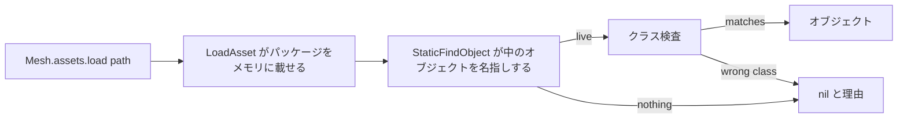

## このページでできるようになること

- このビルドに実在するメッシュ、アニメーションブループリント、テクスチャ、マテリアルを指定する
- 実セッションで観測されたエントリと、命名規則から組み立てただけのパスを見分ける
- パスを自分で解決し、解決できなかったときの理由を読む
- ゲームのパッチ後にカタログ全体を走らせ、解決しなくなったものを 1 ブロックで確認する

## 5 つのカタログ

`Mesh.assets` は PalForge が把握している `/Game/...` パスのテーブルです。中身は
`require("palforge.core.mesh.assets")` と同一で、`api/mesh.lua` がそのまま再エクスポートしている
ため、ドメインを持っているパックはサブモジュールのパスを知らなくて済みます。

```lua
Building{ id = "mypack:Statue", mesh = { kind = "static", model = Mesh.assets.SM.ChestWood } }

Pal{ id = "mypack:Boss", mesh = { kind      = "skeletal",
                                  model     = Mesh.assets.SK.PinkCat,
                                  animClass = Mesh.assets.ABP.PinkCat } }
```

テーブルは 5 つで、それぞれ埋めるフィールドが違います。

| テーブル | 件数 | UE クラス | 埋めるフィールド |
| --- | --- | --- | --- |
| `Mesh.assets.SM` | 15 | `UStaticMesh` | `kind = "static"` の `model` |
| `Mesh.assets.SK` | 10 | `USkeletalMesh` | `kind = "skeletal"` の `model` |
| `Mesh.assets.ABP` | 2 | `AnimBlueprintGeneratedClass` | `animClass`（skeletal のみ） |
| `Mesh.assets.T` | 4 | `UTexture2D` | `texture` と `params.texture` |
| `Mesh.assets.MI` | 1 | マテリアルインスタンス | `material` |

`SM` の末尾にある `Cube`、`Cylinder`、`Sphere` は Palworld の小物ではなく `/Engine/` のシェイプ
です。素性のない純粋な形状なので最初の動作確認に向いていて、しかもほかのエントリと同じライブ
スイープに出てきています。

`Mesh.assets.T` は 1 つのモデル分のフルセット、つまり AttackHelicopter のベースカラー、ノーマル、
メタリックラフネス、エミッシブです。そのスケルタルメッシュが `Mesh.assets.SK.AttackHelicopter`
です。接尾辞の規則は 4 本のパスからそのまま読み取れます。`_B` がベースカラー、`_N` がノーマル、
`_M` がメタリック/ラフネス/オクルージョン、`_E` がエミッシブ。つまり 1 つの `Mesh{ ... }` で、
ゲームのメッシュとゲーム自身の 4 枚のマップを、でっち上げた文字列ゼロで指定できます。

## 各エントリの出どころ

これらのテーブルに推測は入っていません。ただし裏づけの強さは 2 種類あり、同じではありません。

- **ロード済みオブジェクトのライブスイープ**（`dumps/reflection/05_assets.txt`）は、実セッション中に
  メモリ上にあった UObject を歩いてパスを出力したものです。ここに出ているエントリはスイープ時点で
  常駐していたので、そのパスは構成上必ず解決します。`SM` の大半と `SK` の全部がここ由来です。
- **ライブアクターからの読み出し**（`dumps/reflection/04_live_objects.txt`）は、動作中のアクターの
  コンポーネント自身に何を着ているかを尋ねたものです。`SM.ChestWood` は生きた
  `BP_BuildObject_ItemChest_C` の `StaticMeshComponent` から、`SK.PinkCat` は生きた
  `BP_PinkCat_C` の `PalSkeletalMeshComponent` から読まれました。ゲーム自身がそのパスを描画して
  いたということです。

`Mesh.assets.ABP` は正直に言って例外です。2 件ともライブポーンのオブジェクトプロパティとして読み
出されており、実際にセットする以外ではこれ以上ない強さの証拠ですが、**パスからアニメーション
ブループリントを解決できた実績はまだありません**。`ABP_PinkCat_C` がポーンを明らかに駆動していた
セッションでも、ライブのアセットスイープは `AnimBlueprint classes : 0 loaded` と報告しました。
クラスが存在しないというより、スイープ側のフィルタが取りこぼしたと読むのが妥当で、決着をつける
方法は解決を実行することだけです。`pf_mesh` がそれを実行します。

単独で覚えておく価値のあるエントリが 1 つあります。`Mesh.assets.SM.Mug` は
`/Game/Pal/Model/Prop/Mug/Sm_Mug.SM_Mug` で、パッケージが `Sm_Mug`、オブジェクトが `SM_Mug` と
大文字小文字が違います。ツリー内で実測されたパスのうち、前後 2 つの半分が同じ語ではない唯一の例で、
フルで書いたパスが書き換えられない理由でもあります。

## 自分で 1 本解決する

`Mesh.assets.load(path, opts)` はパスをライブオブジェクトに変えます。戻り値はオブジェクト、または
`nil` と英語の理由です。例外は投げません。



この 2 段はフォールバックの連鎖ではありません。`LoadAsset` は I/O で、すべてのビルドがオブジェクト
を返すわけではありません。`StaticFindObject` は検索で、何もロードしません。メッシュなら 2 つの
文字列は一致します。パッケージ `SK_PinkCat` はオブジェクト `SK_PinkCat` を含むからです。ブループ
リントでは一致せず、だからこそ `loadClass` が別の呼び出しとして存在します。

```lua
local assets = require("palforge.core.mesh.assets")

local obj, why = assets.load(assets.SM.ChestWood, { class = "StaticMesh" })
if not obj then log.warn(why) end

-- アニメーションブループリント: アセットパスをロードし、_C オブジェクトパスを検索する
local cls = assets.loadClass("/Game/Pal/Blueprint/Character/Player/ABP_Player")
```

`opts.class` は `U`/`A` 接頭辞なしの短い UE クラス名で、これを渡すことが、宣言の `kind` の誤りを
読める英語のエラーに変えます。`UStaticMesh` と `USkeletalMesh` は親子ではなく兄弟です
（`USkeletalMesh : USkinnedAsset : UStreamableRenderAsset` に対して
`UStaticMesh : UStreamableRenderAsset`）。したがって static のパスを skeletal のセッターに渡すと、
型の違う引数のままネイティブのマーシャリングに到達し、それは `pcall` では見えない落ち方です。
引数がマーシャリングされる前に、ここでクラスを検査します。

解決に失敗したときは、その場で否定できた原因を明示します。

```text
/Game/Pal/Model/Prop/Mug/Sm_Mug.Sm_Mug did not resolve, but its package
/Game/Pal/Model/Prop/Mug/Sm_Mug IS in memory - so the <package>.<object> tail is wrong
rather than the path (the two halves are not always the same word: ...)
```

失敗を生む状況は 4 つあり、プロセス内から区別できるのはそのうち 2 つだけです。`LoadAsset` がそもそも
存在しない（ヘッドレス実行）。パッケージはメモリにあるが、その末尾名のオブジェクトを持っていない
（末尾のタイプミス）。あるいはその名前のものが何もメモリにない場合で、このときはパスが違うのか、
このビルドにクックされていないのか、まだストリーミングされていないだけなのかは区別できません。
メッセージは 1 つに決め打ちせず、そのとおりに書きます。

解決に成功したものは、解決に使われた文字列そのものをキーにキャッシュされます。失敗はキャッシュ
しません。失敗の大半は「まだストリーミングされていない」であり、それを覚えてしまうとそのセッション
の間ずっとメッシュが解決不能になるからです。

## 命名規則から組み立てるパス

2 つのヘルパーは、実測されたパスではなくパスの**形**を返します。そしてそのことを自分で明言します。

```lua
Mesh.assets.palMesh("ChickenPal")
-- "/Game/Pal/Model/Character/Monster/ChickenPal/SK_ChickenPal.SK_ChickenPal"

Mesh.assets.palAnim("ChickenPal")
-- ".../PalActorBP/ChickenPal/ABP_ChickenPal.ABP_ChickenPal_C"
```

`palMesh` の形は 5 回実測されています。ライブのスケルタルスイープに出てくるモンスターのエントリは
すべてこの形でした。ただし *ほかの* 名前について返すパスは実測ではなく、同じスイープが例外も示して
います。1 体のパルが同じフォルダに追加のメッシュ（`SK_QueenBee_spear`、
`SK_YakushimaBoss002_Arm_L`）を持つことがあり、その名前はどんな規則でも予測できません。

`palAnim` は 2 つのうち弱いほうで、その差は書いておく価値があります。この形のサンプルは
**1 件しか**実測されていません。ほかのアニメーションブループリントクラスが存在するのは確かで、
C++ ヘッダダンプには `ABP_LegendDeer.hpp` などが入っています。しかしヘッダダンプが持つのはクラス
宣言であってアセットパスではないので、そのパッケージディレクトリはどこにも記録されていません。

どちらの結果も事実ではなく「解決してみる候補」として扱ってください。`load` はどちらであっても
正直に答えます。

## assets.probe でカタログ全体を確認する

`Mesh.assets.probe(sink)` はカタログのパスを全部試し、結果を報告します。ゲームのパッチ後に走らせる
べきものです。解決しなくなったパスが 1 行で分かります。

```lua
local assets = require("palforge.core.mesh.assets")
local log    = require("palforge.utils.log").scope("mypack")

local results = assets.probe(log.info)
for _, r in ipairs(results) do
    if not r.ok then log.warn(r.group .. "." .. r.name .. " -> " .. r.detail) end
end
```

```text
ASSET OK   SM.ChestWood -> StaticMesh /Game/Pal/Model/Prop/Architecture/ChestWood/SM_ChestWood.SM_ChestWood
ASSET MISS ABP.PinkCat -> ... did not resolve (LoadAsset(...) ran, and no _C class object of that name is in memory afterwards)
```

歩くパスは 32 本です。オブジェクト系の 4 テーブルはそれぞれクラスを指定して `load` に通し
（`SM` は `StaticMesh`、`SK` は `SkinnedAsset`、`T` は `Texture`、`MI` は `MaterialInterface`）、
`ABP` の 2 件は `loadClass` に通します。`sink` を渡さなければ
`{ group, name, path, ok, detail }` のレコード一覧が返るだけです。

意味のある水準で読み取り専用です。パッケージのロード、つまり I/O とメモリは発生しますが、アクター、
コンポーネント、セーブのいずれにも書き込みません。

`probe` が歩くのは **PalForge 自身のカタログ**です。逆方向、つまり *あなたが*登録したメッシュが
宣言しているパスを全部見るのは `Mesh.validateDeclared()` で、`world.ready` で 1 回走り、id と
フィールドとパスの解決結果を並べた `MESHVALIDATE` ブロックを 1 つ出力します。
`Building{ mesh = { ... } }` の中にインラインで書いたメッシュ仕様はそのレジストリに載らないため、
対象外です。

## まとめ

- `Mesh.assets` は 5 つのテーブルに 32 本の `/Game/...` パスを持ち、テーブルごとに埋めるフィールドが決まっています。
- どのエントリもこのビルドで観測済みです。ロード済みオブジェクトのスイープか、ライブアクターからの読み出しです。
- `Mesh.assets.ABP` は動作中のポーンのプロパティとしては実測済みで、パスからの解決はまだ一度もありません。
- `palMesh` と `palAnim` は命名規則からパスを組み立てます。サンプル数は前者が 5、後者が 1 です。
- `assets.load` は `nil` と理由を返し、例外は投げません。`opts.class` が `kind` の誤りを捕まえます。
- パッチ後は `assets.probe()` で 32 本を再確認し、`Mesh.validateDeclared()` で自分のパックの宣言を確認します。

<Cards>
  <Card title="Mesh" href="/docs/api/mesh">メッシュ定義の全フィールド</Card>
  <Card title="パックが同梱できるもの" href="/docs/guides/what-a-pack-can-ship">これらの経路のうち自前のファイルを受け付けるのはどれか</Card>
  <Card title="コンソールコマンド" href="/docs/guides/console-commands">probe を走らせて目の前に木箱を吊るす pf_mesh</Card>
</Cards>
