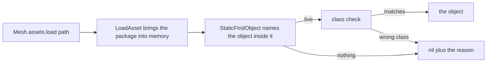

## What you can do after this page

- Name a mesh, an animation blueprint, a texture or a material that this build really has
- Tell an entry that was observed in a live session from a path built out of a naming rule
- Resolve one path yourself and read the reason back when it does not resolve
- Run the whole catalog after a game patch and see in one block what stopped resolving

## The five catalogs

`Mesh.assets` is the table of `/Game/...` paths PalForge knows about. It is the same table as
`require("palforge.core.mesh.assets")`; `api/mesh.lua` re-exports it so a pack that already has
the domain does not need the submodule path.

```lua
Building{ id = "mypack:Statue", mesh = { kind = "static", model = Mesh.assets.SM.ChestWood } }

Pal{ id = "mypack:Boss", mesh = { kind      = "skeletal",
                                  model     = Mesh.assets.SK.PinkCat,
                                  animClass = Mesh.assets.ABP.PinkCat } }
```

Five tables, and each one feeds a different field:

| Table | Entries | UE class | The field it fills |
| --- | --- | --- | --- |
| `Mesh.assets.SM` | 15 | `UStaticMesh` | `model`, with `kind = "static"` |
| `Mesh.assets.SK` | 10 | `USkeletalMesh` | `model`, with `kind = "skeletal"` |
| `Mesh.assets.ABP` | 2 | `AnimBlueprintGeneratedClass` | `animClass`, skeletal only |
| `Mesh.assets.T` | 4 | `UTexture2D` | `texture` and `params.texture` |
| `Mesh.assets.MI` | 1 | material instance | `material` |

The `SM` table ends with `Cube`, `Cylinder` and `Sphere`, which are `/Engine/` shapes rather than
Palworld props. They are the useful ones for a first test because they are geometry with no story
attached, and they were in the same live sweep as everything else here.

`Mesh.assets.T` is one model's full set — base colour, normal, metallic-roughness and emissive for
the AttackHelicopter, whose skeletal mesh is `Mesh.assets.SK.AttackHelicopter`. The suffix rule is
readable straight off those four paths: `_B` base colour, `_N` normal, `_M`
metallic/roughness/occlusion, `_E` emissive. One `Mesh{ ... }` can therefore name a game mesh and
the game's own four maps for it without a single invented string.

## Where each entry comes from

Nothing in those tables is a guess, and the two kinds of evidence behind them are not equally
strong.

- **The live loaded-object sweep** (`dumps/reflection/05_assets.txt`) walked the UObjects that
  were in memory during a real session and printed their paths. An entry that appears there was
  resident when the sweep ran, so the path resolves by construction. That is where the bulk of
  `SM` and all of `SK` come from.
- **A read off a live actor** (`dumps/reflection/04_live_objects.txt`) asked a running actor's own
  component what it was wearing. `SM.ChestWood` was read off a live `BP_BuildObject_ItemChest_C`'s
  `StaticMeshComponent`, and `SK.PinkCat` off a live `BP_PinkCat_C`'s
  `PalSkeletalMeshComponent` — the game itself was rendering those exact paths.

`Mesh.assets.ABP` is the honest exception. Both entries were read as object properties off live
pawns, which is as strong as evidence gets short of setting one, but **nobody has ever resolved an
animation blueprint from a path**. The live asset sweep reported `AnimBlueprint classes : 0 loaded`
in a session where `ABP_PinkCat_C` was demonstrably driving a pawn, so the sweep's own filter is
the likeliest explanation rather than the class being absent — and only running the resolve
settles it. `pf_mesh` runs it.

One entry is worth knowing about on its own. `Mesh.assets.SM.Mug` is
`/Game/Pal/Model/Prop/Mug/Sm_Mug.SM_Mug`: the package is `Sm_Mug` and the object is `SM_Mug`, and
they differ in case. It is the one measured path in the tree whose two halves are not the same
word, and it is the reason a path you write in full is never rewritten.

## Resolving one yourself

`Mesh.assets.load(path, opts)` turns a path into a live object. It returns the object, or `nil`
plus an English reason. It never raises.



Those two steps are not a fallback chain. `LoadAsset` is I/O and does not return the object on
every build; `StaticFindObject` is a lookup and loads nothing. For a mesh the two strings coincide,
because the package `SK_PinkCat` contains an object `SK_PinkCat`. For a blueprint they do not,
which is why `loadClass` exists as a separate call.

```lua
local assets = require("palforge.core.mesh.assets")

local obj, why = assets.load(assets.SM.ChestWood, { class = "StaticMesh" })
if not obj then log.warn(why) end

-- an animation blueprint: the ASSET path is loaded, the _C OBJECT path is looked up
local cls = assets.loadClass("/Game/Pal/Blueprint/Character/Player/ABP_Player")
```

`opts.class` is the short UE class name with no `U`/`A` prefix, and passing it is what turns a
wrong `kind` on a declaration into a readable error. A `UStaticMesh` and a `USkeletalMesh` are
siblings, not relatives — `USkeletalMesh : USkinnedAsset : UStreamableRenderAsset` against
`UStaticMesh : UStreamableRenderAsset` — so a static path handed to a skeletal setter reaches
native marshalling with the wrong argument type, and that is a fault `pcall` cannot see. The class
is checked here, before the argument is ever marshalled.

A miss says which of the possible causes it could rule out:

```text
/Game/Pal/Model/Prop/Mug/Sm_Mug.Sm_Mug did not resolve, but its package
/Game/Pal/Model/Prop/Mug/Sm_Mug IS in memory - so the <package>.<object> tail is wrong
rather than the path (the two halves are not always the same word: ...)
```

Four situations produce a miss and only two of them can be told apart from inside the process:
there is no `LoadAsset` at all (a headless run); the package is in memory but carries no object
under that tail (a tail typo); or nothing of that name is in memory, in which case the path may be
wrong, the asset may not be cooked into this build, or its package may simply not have streamed in
yet. The message says that rather than picking one.

Successful resolves are cached by the exact string that resolved them. Misses are not, because a
miss is usually "the package has not streamed in yet" and caching it would keep a mesh
unresolvable for the rest of the session.

## Paths built from a naming convention

Two helpers return a path **shape** rather than a measured path, and they say so.

```lua
Mesh.assets.palMesh("ChickenPal")
-- "/Game/Pal/Model/Character/Monster/ChickenPal/SK_ChickenPal.SK_ChickenPal"

Mesh.assets.palAnim("ChickenPal")
-- ".../PalActorBP/ChickenPal/ABP_ChickenPal.ABP_ChickenPal_C"
```

`palMesh`'s shape is measured five times over: every monster entry in the live skeletal sweep sits
at exactly it. The path it returns for any *other* name is not measured, and the same sweep shows
the exceptions — a pal can own extra meshes in the same folder (`SK_QueenBee_spear`,
`SK_YakushimaBoss002_Arm_L`) whose names no rule predicts.

`palAnim` is the weaker claim of the two, and the difference is worth stating: exactly **one**
sample of that shape has ever been measured. Other animation blueprint classes certainly exist —
the C++ header dump ships `ABP_LegendDeer.hpp` and others — but a header dump carries class
declarations, not asset paths, so nothing records their package directories.

Treat both results as candidates to resolve, not as facts. `load` answers honestly either way.

## Checking the whole catalog with assets.probe

`Mesh.assets.probe(sink)` tries every catalogued path and reports what came back. It is the thing
to run after a game patch: a path that stops resolving says so in one line.

```lua
local assets = require("palforge.core.mesh.assets")
local log    = require("palforge.utils.log").scope("mypack")

local results = assets.probe(log.info)
for _, r in ipairs(results) do
    if not r.ok then log.warn(r.group .. "." .. r.name .. " -> " .. r.detail) end
end
```

```text
ASSET OK   SM.ChestWood -> StaticMesh /Game/Pal/Model/Prop/Architecture/ChestWood/SM_ChestWood.SM_ChestWood
ASSET MISS ABP.PinkCat -> ... did not resolve (LoadAsset(...) ran, and no _C class object of that name is in memory afterwards)
```

It walks 32 paths: the four object tables through `load` with a class each — `SM` as `StaticMesh`,
`SK` as `SkinnedAsset`, `T` as `Texture`, `MI` as `MaterialInterface` — then both `ABP` entries
through `loadClass`. With no `sink` it just returns the list of
`{ group, name, path, ok, detail }` records.

It is read-only in the sense that matters: it loads packages, which is I/O and memory, and writes
nothing to any actor, component or save.

`probe` walks **PalForge's own catalog**. The other direction — every path *your* registered meshes
declare — is `Mesh.validateDeclared()`, which runs once at `world.ready` and prints one
`MESHVALIDATE` block naming the id, the field and what the path resolved to. A mesh spec written
inline inside a `Building{ mesh = { ... } }` block is not in that registry and is not covered by it.

## Summary

- `Mesh.assets` carries 32 `/Game/...` paths in five tables, one per field they fill.
- Every entry was observed in this build: in a sweep of loaded objects, or read off a live actor.
- `Mesh.assets.ABP` is measured as a property of a running pawn, never yet resolved from a path.
- `palMesh` and `palAnim` build a path from a naming rule; the first has five samples, the second one.
- `assets.load` returns `nil` plus a reason and never raises, and `opts.class` is what catches a wrong `kind`.
- `assets.probe()` re-checks all 32 after a patch; `Mesh.validateDeclared()` checks what your pack declared.

<Cards>
  <Card title="Mesh" href="/docs/api/mesh">Every field of a mesh definition</Card>
  <Card title="What a pack can ship" href="/docs/guides/what-a-pack-can-ship">Which of these routes accepts a file of your own</Card>
  <Card title="Console commands" href="/docs/guides/console-commands">pf_mesh, which runs the probe and hangs a chest in front of you</Card>
</Cards>
