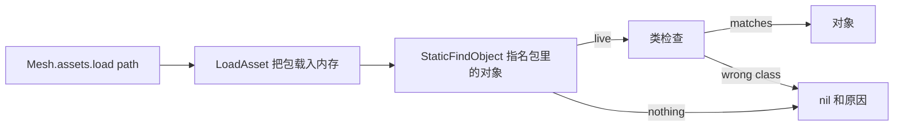

## 读完本页你可以做到

- 指定这次构建里确实存在的网格、动画蓝图、贴图和材质
- 分清哪些条目是在实机会话里观测到的，哪些只是按命名规则拼出来的路径
- 自己解析一条路径，并在解析不到时读懂返回的原因
- 游戏打补丁后跑一遍整份目录，用一段输出看清哪些路径不再解析

## 五份目录

`Mesh.assets` 是 PalForge 已知的 `/Game/...` 路径表。它和
`require("palforge.core.mesh.assets")` 是同一张表；`api/mesh.lua` 把整张表重新导出，所以已经拿到
这个域的包不需要再记子模块路径。

```lua
Building{ id = "mypack:Statue", mesh = { kind = "static", model = Mesh.assets.SM.ChestWood } }

Pal{ id = "mypack:Boss", mesh = { kind      = "skeletal",
                                  model     = Mesh.assets.SK.PinkCat,
                                  animClass = Mesh.assets.ABP.PinkCat } }
```

一共五张表，各自喂给不同的字段：

| 表 | 条数 | UE 类 | 对应字段 |
| --- | --- | --- | --- |
| `Mesh.assets.SM` | 15 | `UStaticMesh` | `kind = "static"` 时的 `model` |
| `Mesh.assets.SK` | 10 | `USkeletalMesh` | `kind = "skeletal"` 时的 `model` |
| `Mesh.assets.ABP` | 2 | `AnimBlueprintGeneratedClass` | `animClass`，仅限 skeletal |
| `Mesh.assets.T` | 4 | `UTexture2D` | `texture` 与 `params.texture` |
| `Mesh.assets.MI` | 1 | 材质实例 | `material` |

`SM` 表末尾的 `Cube`、`Cylinder`、`Sphere` 不是幻兽帕鲁的道具，而是 `/Engine/` 的基本形体。它们
适合做第一次验证，因为就是几何体本身、没有别的牵连，而且和其余条目出自同一次实机扫描。

`Mesh.assets.T` 是同一个模型的整套贴图：AttackHelicopter 的基础色、法线、金属度粗糙度和自发光，
它的骨骼网格就是 `Mesh.assets.SK.AttackHelicopter`。后缀规则可以直接从这四条路径读出来：`_B` 基础
色，`_N` 法线，`_M` 金属度/粗糙度/遮蔽，`_E` 自发光。也就是说一个 `Mesh{ ... }` 就能同时指定游戏
的网格和游戏自己的四张贴图，不需要编造任何字符串。

## 每一条的来源

这些表里没有猜测。不过背后的证据分两种，强度并不相同。

- **已加载对象的实机扫描**（`dumps/reflection/05_assets.txt`）走遍了一次真实会话中在内存里的
  UObject 并打印其路径。出现在那里的条目在扫描时是常驻的，所以路径按构造必然解析得到。`SM` 的
  绝大部分和 `SK` 的全部都来自这里。
- **从活着的 Actor 上读出来**（`dumps/reflection/04_live_objects.txt`）是直接问运行中 Actor 自己的
  组件穿了什么。`SM.ChestWood` 读自一个活的 `BP_BuildObject_ItemChest_C` 的
  `StaticMeshComponent`，`SK.PinkCat` 读自一个活的 `BP_PinkCat_C` 的
  `PalSkeletalMeshComponent`，也就是游戏本身正在渲染这两条路径。

`Mesh.assets.ABP` 是需要如实说明的例外。两条都是从活着的 Pawn 上作为对象属性读到的，除了真正设置
一次以外这已经是最强的证据；但是**还没有任何一次从路径解析出动画蓝图**。在 `ABP_PinkCat_C` 明显
正在驱动 Pawn 的会话里，实机资源扫描仍然报告 `AnimBlueprint classes : 0 loaded`，比起该类不存在，
更可能是扫描自身的过滤条件漏掉了它们；能定论的只有真正执行一次解析。`pf_mesh` 就在做这件事。

有一条值得单独记住。`Mesh.assets.SM.Mug` 是
`/Game/Pal/Model/Prop/Mug/Sm_Mug.SM_Mug`：包名是 `Sm_Mug`，对象名是 `SM_Mug`，大小写不同。它是本
仓库实测路径中唯一前后两半不是同一个词的例子，也是写全的路径永远不会被改写的原因。

## 自己解析一条

`Mesh.assets.load(path, opts)` 把路径变成活的 UObject。返回值是对象，或者 `nil` 加一句英文原因。
它不会抛异常。



这两步不是回退链。`LoadAsset` 是 I/O，并非每个构建都会把对象返回；`StaticFindObject` 是查找，什么
都不加载。对网格来说两个字符串是一样的，因为包 `SK_PinkCat` 里就有对象 `SK_PinkCat`；对蓝图来说
不一样，`loadClass` 才因此作为单独的调用存在。

```lua
local assets = require("palforge.core.mesh.assets")

local obj, why = assets.load(assets.SM.ChestWood, { class = "StaticMesh" })
if not obj then log.warn(why) end

-- 动画蓝图：加载的是资源路径，查找的是 _C 对象路径
local cls = assets.loadClass("/Game/Pal/Blueprint/Character/Player/ABP_Player")
```

`opts.class` 是不带 `U`/`A` 前缀的 UE 短类名，传了它，声明里写错的 `kind` 才会变成一句读得懂的
错误。`UStaticMesh` 和 `USkeletalMesh` 是兄弟而不是父子——
`USkeletalMesh : USkinnedAsset : UStreamableRenderAsset` 对上
`UStaticMesh : UStreamableRenderAsset`——所以把静态网格路径交给骨骼网格的 setter，会带着类型不对
的参数一路走到原生封送层，而那种崩法 `pcall` 看不见。类检查放在参数被封送之前完成。

解析失败时，消息会说明当场能排除掉哪些原因：

```text
/Game/Pal/Model/Prop/Mug/Sm_Mug.Sm_Mug did not resolve, but its package
/Game/Pal/Model/Prop/Mug/Sm_Mug IS in memory - so the <package>.<object> tail is wrong
rather than the path (the two halves are not always the same word: ...)
```

会造成失败的情形有四种，进程内部只能区分其中两种：根本没有 `LoadAsset`（无引擎的无头运行）；包在
内存里但里面没有那个尾名的对象（尾名拼错）；或者内存里根本没有同名的东西，此时路径写错、资源没被
烘焙进这次构建、包还没流式加载进来三种可能无法区分。消息如实这么写，而不是替你挑一个。

解析成功的结果按解析所用的确切字符串缓存。失败不缓存：失败大多是「包还没流式加载进来」，把它记
下来会让这个网格在整个会话里都解析不到。

## 按命名规则拼出来的路径

有两个辅助函数返回的是路径的**形状**，不是实测到的路径，而且它们自己会讲清楚这一点。

```lua
Mesh.assets.palMesh("ChickenPal")
-- "/Game/Pal/Model/Character/Monster/ChickenPal/SK_ChickenPal.SK_ChickenPal"

Mesh.assets.palAnim("ChickenPal")
-- ".../PalActorBP/ChickenPal/ABP_ChickenPal.ABP_ChickenPal_C"
```

`palMesh` 的形状被实测过五次：实机骨骼扫描里每一条怪物条目都正好是这个形状。但它对*其他*名字返回
的路径并没有被实测过，而且同一次扫描本身就给出了例外——一只帕鲁可以在同一个目录下拥有额外的网格
（`SK_QueenBee_spear`、`SK_YakushimaBoss002_Arm_L`），这些名字任何规则都推不出来。

`palAnim` 是两者中较弱的一个，这个差别值得写明：这种形状**只有一个**样本被实测过。其他动画蓝图类
当然存在，C++ 头文件转储里就有 `ABP_LegendDeer.hpp` 之类；但头文件转储记录的是类声明而不是资源
路径，所以没有任何地方记下它们的包目录。

把两者的结果当作待验证的候选，而不是事实。无论哪种情况，`load` 都会如实回答。

## 用 assets.probe 核对整份目录

`Mesh.assets.probe(sink)` 会尝试目录里的每一条路径并报告结果。游戏打完补丁就该跑一次：哪条路径不
再解析，一行就能看出来。

```lua
local assets = require("palforge.core.mesh.assets")
local log    = require("palforge.utils.log").scope("mypack")

local results = assets.probe(log.info)
for _, r in ipairs(results) do
    if not r.ok then log.warn(r.group .. "." .. r.name .. " -> " .. r.detail) end
end
```

```text
ASSET OK   SM.ChestWood -> StaticMesh /Game/Pal/Model/Prop/Architecture/ChestWood/SM_ChestWood.SM_ChestWood
ASSET MISS ABP.PinkCat -> ... did not resolve (LoadAsset(...) ran, and no _C class object of that name is in memory afterwards)
```

它一共走 32 条路径：四张对象表各带一个类走 `load`（`SM` 用 `StaticMesh`，`SK` 用 `SkinnedAsset`，
`T` 用 `Texture`，`MI` 用 `MaterialInterface`），`ABP` 的两条走 `loadClass`。不传 `sink` 时它只是
返回一串 `{ group, name, path, ok, detail }` 记录。

在要紧的意义上它是只读的：它会加载包，也就是产生 I/O 和内存开销，但不会向任何 Actor、组件或存档
写入。

`probe` 走的是 **PalForge 自己的目录**。另一个方向——*你*注册的网格所声明的每一条路径——是
`Mesh.validateDeclared()`，它在 `world.ready` 时跑一次，输出一段 `MESHVALIDATE`，列出 id、字段和
该路径解析到了什么。写在 `Building{ mesh = { ... } }` 里的内联网格规格不在那个注册表中，因此不在
覆盖范围内。

## 小结

- `Mesh.assets` 用五张表装了 32 条 `/Game/...` 路径，每张表对应一个字段。
- 每一条都在这次构建里观测过：要么来自已加载对象扫描，要么读自活着的 Actor。
- `Mesh.assets.ABP` 作为运行中 Pawn 的属性是实测过的，但从未从路径解析成功过。
- `palMesh` 和 `palAnim` 按命名规则拼路径；前者有五个样本，后者只有一个。
- `assets.load` 返回 `nil` 加原因且不抛异常，`opts.class` 是抓住 `kind` 写错的那一步。
- 打完补丁用 `assets.probe()` 复查这 32 条，用 `Mesh.validateDeclared()` 复查自己包里的声明。

<Cards>
  <Card title="Mesh" href="/docs/api/mesh">网格定义的全部字段</Card>
  <Card title="一个包能同梱什么" href="/docs/guides/what-a-pack-can-ship">这些路线里哪一条接受你自己的文件</Card>
  <Card title="控制台命令" href="/docs/guides/console-commands">跑 probe 并在你面前挂一个木箱的 pf_mesh</Card>
</Cards>
