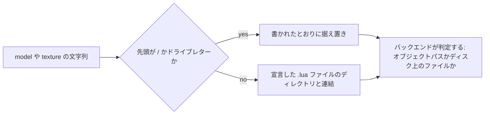

## このページでできるようになること

- 何かを作り始める前に、自分のファイルのうちゲームが実際に受け取るものを把握する
- 他人のマシンでも通るパスで OBJ モデルを同梱する
- 実測済みの経路と、配線だけされている経路を見分ける
- 同じ結果を今日得るためのバニラアセットを選ぶ

## 一覧表

PalForge のアセット経路と、それぞれが受け付けるものです。「自分のフォルダから」は自分の MOD
フォルダに同梱したファイル、「バニラ」は Palworld 自身の pak にすでにクックされている
`/Game/...` パスを指します。

| アセット | 自分のフォルダから | `/Game/...` パスから |
| --- | --- | --- |
| スタティック / スケルタルメッシュ | **不可** | 可。動作実績あり、クラス検査つき |
| プロシージャルジオメトリ | **可** — ディスク上の `.obj` | 対象外 |
| テクスチャ | 未実証。配線済みだが一度も呼ばれていない | 可 |
| サウンド | **不可** | 可。1957 件のイベント名カタログ |
| マテリアル | **不可** | 可。ロード済みのものを親にした動的インスタンス |

2 つの「不可」は、フレームワークではなくエンジンについての記述として読んでください。それらの経路
が書きかけなのではなく、呼ぶべき関数が存在しません。

つまり今日の PalForge は **ゲーム自身のアセットを再利用する**フレームワークであり、動作する
ディスク経路が 1 つ（OBJ）、配線済みだが未観測の経路が 1 つ（PNG テクスチャ）あります。モデルを
作り始める前に知っておく価値のある事実です。

## メッシュはバニラ経路のみ

`Mesh.assets.load` は `/` で始まらない文字列を拒否します。UE のオブジェクトパスはマウントポイント
を根に持つので必ず `/` で始まり、Windows のパスは決してそうなりません。この 1 文字があるおかげで、
1 つの `model` フィールドが両方の文字列を運べて、各バックエンドがどちらを渡されたか言えます。

```lua
-- 動く: すでにゲームの pak に入っているパス
Building{ id = "mypack:Statue", mesh = { kind = "static", model = Mesh.assets.SM.ChestWood } }

-- ローダーが拒否する: 自前の .uasset はここからは届かない
Building{ id = "mypack:Statue", mesh = { kind = "static", model = "mypack/statue.uasset" } }
```

クックされたメッシュを実行時にインポートする経路は存在しないので、2 番目の書き方はパスの綴りを
変えても動きません。このビルドに実在すると分かっているパスの一覧は
[参照できるバニラアセット](/docs/guides/vanilla-assets)にあります。

## OBJ 経路と、それを同梱可能にしているもの

`kind = "obj"`（`kind = "procedural"` と同じバックエンド）はディスクから Wavefront OBJ を読み、
Lua でパースして `ProceduralMeshComponent` を組み立てます。この連鎖は実測済みです。
`AddComponentByClass`、`CreateMeshSection`、`SetWorldScale3D` の順です。

同梱可能にしている要素は、`model` と `texture` のパスが**それを宣言した `.lua` ファイルからの
相対パス**でよいことです。`Mesh.Spec` は検証時に両フィールドを `utils.file.resolvePackPath` に
通すので、パックは自分のコードの隣に自分のモデルを置いて配れます。

```lua title="Scripts/mypack/marker.lua"
-- Scripts/mypack/marker.obj がこのファイルの隣にある
Mesh{ id = "mypack:Marker", kind = "obj", model = "marker.obj", scale = 1.0 }
```

絶対パスはそのまま残ります。だからこそ、どの種類のパスか事前に知らなくても、仕様が持つすべての
パスにこの規則を安全に適用できます。



別の方法でパスを組み立てる場合は、リゾルバを直接呼べます。

```lua
local file = require("palforge.utils.file")

file.packDir()                       -- これを呼んだ .lua ファイルのディレクトリ、または nil
file.resolvePackPath("marker.obj")   -- そのディレクトリ + "marker.obj"
file.resolvePackPath("C:/x/m.obj")   -- 変更なし: すでに絶対パス
file.isAbsolute("/Game/A/SK_X")      -- true。オブジェクトパスがディレクトリと連結されることはない
```

引数なしの `packDir()` は、PalForge 自身のツリーから**外へ**歩いて呼び出し元を見つけます。
`Scripts/palforge/` の下にないソースを持つ最初のスタックフレームがパックです。だからネストの深さに
関係なく動きます。直接書いた `Mesh{ ... }` と `Pal{ ... }` の中に入れ子にしたメッシュではスタック
の深さが違い、固定のフレーム数ではどちらかが必ず外れます。

`nil` を返して相対パスを相対のまま残すケースが 2 つあります。文字列チャンクや C から行われた定義と、
PalForge 自身のテストスイートの中から行われた定義です。相対のままなら `io.open` があなたが書いた
文字列そのもので失敗するので読み取れます。推測したディレクトリと連結されたパスはそうなりません。

## テクスチャは配線済み、ただし未実行

`Renderer.importTexture` は
`UKismetRenderingLibrary::ImportFileAsTexture2D(UObject* WorldContextObject, FString Filename)`
を呼びます。両引数とも出荷バイナリから読み取ったもので、ワールドコンテキストは本当にただの
`UObject*` なのでアクターで条件を満たし、パスも本当に `FName` ではなく `FString` です。呼び出しは
`core.signature` を通るので、この関数を宣言していないビルドではゲームに触れる前に拒否されます。

**この呼び出しはまだ一度も実行されていません。** テクスチャが返ってくるところを誰も観測していま
せん。自前の PNG は壊れているのではなく未実証と考え、自分で確かめる前提でいてください。

同じフィールドの `/Game/...` 側は証拠の面で強いほうです。`LoadAsset` と `StaticFindObject` であり、
このツリーが毎セッション成功させている呼び出しです。`texture` は文字列の形で分岐するので、2 つの
うち必ず片方だけが適用され、もう片方は試されません。

```lua
-- 実測済み: ゲームがすでに同梱しているテクスチャ
Mesh{ id = "mypack:Heli", model = Mesh.assets.SK.AttackHelicopter,
      texture = Mesh.assets.T.HelicopterBase }

-- 未実証: 自前の PNG、このファイルからの相対パス
Mesh{ id = "mypack:Body", kind = "obj", model = "body.obj", texture = "body.png" }
```

インポートしたテクスチャはパス文字列そのものをキーに、成功だけをキャッシュします。同じアタッチを
繰り返してもインポートし直しません。

## サウンドとマテリアル

`Audio.Spec.soundFile` は**定義時のハードエラー**です。no-op でも警告でもありません。

```text
PalForge: Audio: soundFile is not accepted (id "mypack:Theme", soundFile "theme.wav"). Custom
audio files do not play on this build: the UE-native route has no importer that survives
shipping (USoundWave declares none, USoundWaveProcedural declares nothing at all) and the
Wwise route rebinds media the cook already staged rather than reading a file. This is the open
item audio-custom-file-loader. ... Name a game sound instead: soundId =
"AKE_UI_Common_Menu_Close", or soundPath = the asset path from PalForge.native.audio.CATALOG.
```

フィールド自体は仕様に宣言されたまま残ります。エラーがその名前を出せるようにするためと、ツールが
一覧に出せるようにするためです。代わりに使うのはゲームのサウンドで、
`PalForge.native.audio.CATALOG` が Wwise の `AkAudioEvent` 名 1957 件をアセットパスつきで持って
います。名前を指定するだけで十分です。`soundId` があり `soundPath` がない定義には、lowering の
過程で実際のパスが付きます。

マテリアルも答えの形は同じです。パックはマテリアルを同梱できません。できるのは、コンポーネント上に
動的マテリアルインスタンスを作り、すでにロードされているマテリアルを親にして、そこにパラメータを
書き込むことです。`Mesh.assets.MI` はそのための実測済みマテリアルインスタンスパスを 1 件持って
いて、メッシュ仕様の `material` がその置き場所です。

<Callout type="warn">
Palworld のマテリアルが応答するパラメータ*名*は動作中のゲームから読み取ったものです
（`BaseColor`、`Base Texture`、`Normal Map` など）。書き込みも宣言どおりに呼ばれています。ただし
画面上で色が変わるところはまだ誰も観測していません。それを測る宣言済みフックが
`mesh-color-change` です。
</Callout>

## まとめ

- メッシュ、サウンド、マテリアルは自分のフォルダからは持ち込めません。`/Game/...` パスを指してください。
- `.obj` は持ち込めます。`model` と `texture` の相対パスは、それを宣言した `.lua` ファイルを基準に解決されます。
- 自分で組み立てるパスには `file.packDir()` と `file.resolvePackPath()` が同じ規則を提供します。
- PNG テクスチャはシグネチャどおりに配線されていますが一度も呼ばれていません。未実証として扱ってください。
- `soundFile` は、鳴っていた音を黙らせる代わりに定義時に例外を投げます。
- 各行のバニラ側はすべて実在し、[バニラアセット](/docs/guides/vanilla-assets)に既知のものが並んでいます。

<Cards>
  <Card title="参照できるバニラアセット" href="/docs/guides/vanilla-assets">実測済みの /Game パス 32 本</Card>
  <Card title="Mesh" href="/docs/api/mesh">メッシュ定義の全フィールド</Card>
  <Card title="Audio" href="/docs/api/audio">soundId、soundPath、イベントカタログ</Card>
</Cards>
