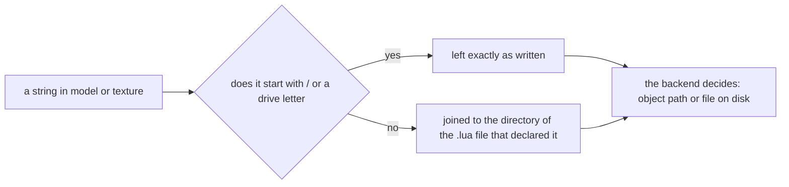

## What you can do after this page

- Know, before you build anything, which of your own files the game will actually take
- Ship an OBJ model with a path that works on someone else's machine
- Tell a route that is measured working from one that is only wired up
- Choose the vanilla asset that gets you the same result today

## The table

Every asset route in PalForge, and what it accepts. "Pack-supplied" means a file that ships
inside your own mod folder; "vanilla" means a `/Game/...` path that is already cooked into
Palworld's own pak.

| Asset | From your own folder | From a `/Game/...` path |
| --- | --- | --- |
| Static / skeletal mesh | **No** | Yes — working, and class-checked |
| Procedural geometry | **Yes** — a `.obj` off disk | not applicable |
| Texture | **Yes** — a PNG off disk, imported and cached | Yes |
| Sound | **No** | Yes — a catalog of 1957 event names |
| Material | **No** | Yes — parent a dynamic instance to a loaded one |

Read the two "No" rows as a statement about the engine, not about the framework. Nothing about
those routes is half-written; there is no call to make.

So PalForge today is a framework for **reusing the game's own assets**, with two working disk
routes — OBJ geometry and PNG textures, both watched working — and three rows that no call
exists for. That is worth knowing before you model anything.

## Meshes: the vanilla route only

`Mesh.assets.load` refuses anything that does not begin with `/`. A UE object path is rooted at
a mount point and always starts with one; a Windows path never does. That single character is
what lets one `model` field carry both kinds of string and lets each backend say which one it
was handed.

```lua
-- works: a path that is already inside the game's pak
Building{ id = "mypack:Statue", mesh = { kind = "static", model = Mesh.assets.SM.ChestWood } }

-- refused by the loader: a .uasset of your own is not reachable from here
Building{ id = "mypack:Statue", mesh = { kind = "static", model = "mypack/statue.uasset" } }
```

There is no import path for a cooked mesh at runtime, so the second form cannot be made to work
by writing the path differently. [Vanilla assets you can point at](/docs/guides/vanilla-assets)
is the list of paths this build is known to have.

## The OBJ route, and what makes it shippable

`kind = "obj"` (the same backend as `kind = "procedural"`) reads a Wavefront OBJ off disk, parses
it in Lua and builds a `ProceduralMeshComponent`. The chain is measured: `AddComponentByClass`,
`CreateMeshSection`, `SetWorldScale3D`, in that order.

The thing that makes it shippable is that a path in `model` or `texture` may be **relative to the
`.lua` file that declared it**. `Mesh.Spec` resolves both fields through
`utils.file.resolvePackPath` at validate time, so a pack ships its own model beside its own code:

```lua title="Scripts/mypack/marker.lua"
-- Scripts/mypack/marker.obj sits next to this file
Mesh{ id = "mypack:Marker", kind = "obj", model = "marker.obj", scale = 1.0 }
```

An absolute path is left alone, which is what makes the rule safe to apply to every path a spec
carries without knowing which kind it is:



You can call the resolver yourself when you build a path some other way:

```lua
local file = require("palforge.utils.file")

file.packDir()                       -- the directory of the .lua file calling this, or nil
file.resolvePackPath("marker.obj")   -- that directory + "marker.obj"
file.resolvePackPath("C:/x/m.obj")   -- unchanged: already absolute
file.isAbsolute("/Game/A/SK_X")      -- true, so an object path is never joined to a directory
```

`packDir()` with no argument finds the caller by walking **out** of PalForge's own tree: the first
stack frame whose source file is not under `Scripts/palforge/` is the pack. That is what makes it
work at any nesting depth — a `Mesh{ ... }` written directly and a mesh nested inside a `Pal{ ... }`
arrive at different stack depths, and a fixed frame count would be wrong for one of them.

Two cases return `nil` and leave a relative path relative: a definition made from a string chunk
or from C, and one made from inside PalForge's own test suite. A relative path that stays relative
fails at `io.open` with the string you wrote, which is readable; a path joined to a guessed
directory is not.

## Textures: measured, and what one costs

`Renderer.importTexture` calls `UKismetRenderingLibrary::ImportFileAsTexture2D(UObject*
WorldContextObject, FString Filename)`. Both arguments are read off the shipping binary, the world
context really is a plain `UObject*` so an actor qualifies, and the path really is an `FString`
rather than an `FName`. The call goes through `core.signature`, so a build that does not declare
the function refuses without ever touching the game.

**It was called in a loaded save on 2026-08-02, and it answered.** A pack-supplied PNG came back as
a real `Texture2D` — the class chain is `Texture2D : Texture : StreamableRenderAsset : Object`, so
it satisfies the `UTexture*` the material setter declares — and the second call for the same path
returned the identical value, which only the cache can do. It also imported fine on a path that had
missed a moment earlier, so a file written after the first attempt is not written off.

What that route costs you is one `UTexture2D` per distinct path per session, allocated and never
freed: UE4SS's Lua layer has no destroy call, so nothing in this process can release it. That is
the cache's real job — a texture named by a mesh that attaches once per spawned pal is imported
once, not once per pal.

The `/Game/...` half of the same field is the stronger of the two by evidence — it is
`LoadAsset` and `StaticFindObject`, which this tree uses successfully every session. `texture`
dispatches on the shape of the string, so exactly one of the two applies and the other is never
tried:

```lua
-- measured: a texture the game already ships
Mesh{ id = "mypack:Heli", model = Mesh.assets.SK.AttackHelicopter,
      texture = Mesh.assets.T.HelicopterBase }

-- measured: a PNG of your own, relative to this file
Mesh{ id = "mypack:Body", kind = "obj", model = "body.obj", texture = "body.png" }
```

Imported textures are cached by the exact path string, positives only, so a repeated attach does
not re-import.

## Sound and material

`Audio.Spec.soundFile` is a **hard error at define time**. It is not a no-op and not a warning:

```text
PalForge: Audio: soundFile is not accepted (id "mypack:Theme", soundFile "theme.wav"). Custom
audio files do not play on this build: the UE-native route has no importer that survives
shipping (USoundWave declares none, USoundWaveProcedural declares nothing at all) and the
Wwise route rebinds media the cook already staged rather than reading a file. This is the open
item audio-custom-file-loader. ... Name a game sound instead: soundId =
"AKE_UI_Common_Menu_Close", or soundPath = the asset path from PalForge.native.audio.CATALOG.
```

The field stays declared in the spec so the error can name it and tooling can still list it. What
you use instead is a game sound: `PalForge.native.audio.CATALOG` holds 1957 Wwise `AkAudioEvent`
names with their asset paths, and naming one is enough — a definition with a `soundId` and no
`soundPath` gets the real path attached during lowering.

Materials are the same shape of answer. A pack cannot ship a material; what it can do is make a
dynamic material instance on a component and parent it to a material that is already loaded, then
write parameters into it. `Mesh.assets.MI` carries one measured material instance path for that,
and `material` on a mesh spec is where it goes.

<Callout type="info">
The parameter *names* a Palworld material answers to were read off the running game
(`BaseColor`, `Base Texture`, `Normal Map`, and the rest), the writes are declared exactly as
called, and on 2026-08-02 `mesh-color-change` was run with someone watching: a chest went
**red → green → blue**. The whole route is measured end to end.
</Callout>

## Summary

- Meshes, sounds and materials cannot come out of your folder; point at a `/Game/...` path instead.
- A `.obj` can, and a relative path in `model` or `texture` resolves against the `.lua` file that declared it.
- `file.packDir()` and `file.resolvePackPath()` are the same rule for paths you build yourself.
- A PNG texture imports and is cached by path; each distinct path costs one texture that lives as long as the session.
- `soundFile` raises at define time rather than silencing a sound that was working.
- The vanilla side of every row is real, and [Vanilla assets](/docs/guides/vanilla-assets) lists what is known to exist.

<Cards>
  <Card title="Vanilla assets you can point at" href="/docs/guides/vanilla-assets">The 32 measured /Game paths</Card>
  <Card title="Mesh" href="/docs/api/mesh">Every field of a mesh definition</Card>
  <Card title="Audio" href="/docs/api/audio">soundId, soundPath and the event catalog</Card>
</Cards>
