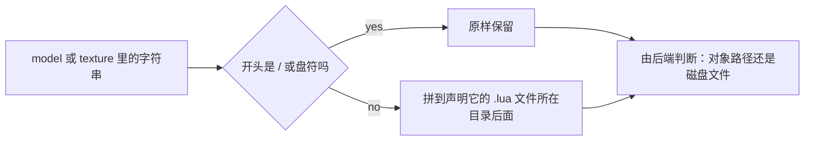

## 读完本页你可以做到

- 在动手做任何东西之前，知道你自己的哪些文件游戏真的会接受
- 用一条在别人机器上也成立的路径同梱 OBJ 模型
- 分清哪条路线是实测可用的，哪条只是接好了线
- 挑出今天就能拿到同样效果的原版资源

## 一览表

PalForge 的每条资源路线，以及各自接受什么。「来自你自己的文件夹」指同梱在你自己 MOD 目录里的
文件；「原版」指已经烘焙进幻兽帕鲁自身 pak 的 `/Game/...` 路径。

| 资源 | 来自你自己的文件夹 | 来自 `/Game/...` 路径 |
| --- | --- | --- |
| 静态 / 骨骼网格 | **不行** | 可以，有实测，并且带类检查 |
| 程序化几何体 | **可以** — 磁盘上的 `.obj` | 不适用 |
| 贴图 | 未验证 — 线接好了，但一次都没被调用 | 可以 |
| 声音 | **不行** | 可以 — 一份 1957 条事件名的目录 |
| 材质 | **不行** | 可以 — 把动态实例挂到已加载的材质上 |

那两行「不行」说的是引擎，不是框架。这些路线并不是写了一半，而是根本没有可调用的入口。

所以今天的 PalForge 是一个**复用游戏自身资源**的框架，外加一条能用的磁盘路线（OBJ）和一条接好了
但没观测过的路线（PNG 贴图）。在开始建模之前，这件事值得先知道。

## 网格只有原版路线

`Mesh.assets.load` 会拒绝任何不以 `/` 开头的字符串。UE 的对象路径挂在挂载点上，一定以 `/` 开头；
Windows 路径永远不会。就是这一个字符，让同一个 `model` 字段能同时承载两种字符串，也让每个后端能
说清楚自己拿到的是哪一种。

```lua
-- 可行：已经在游戏 pak 里的路径
Building{ id = "mypack:Statue", mesh = { kind = "static", model = Mesh.assets.SM.ChestWood } }

-- 加载器会拒绝：自带的 .uasset 从这里够不到
Building{ id = "mypack:Statue", mesh = { kind = "static", model = "mypack/statue.uasset" } }
```

运行时没有导入已烘焙网格的入口，所以第二种写法换个拼法也不会成立。这次构建里已知存在的路径清单
见[可以直接引用的原版资源](/docs/guides/vanilla-assets)。

## OBJ 路线，以及让它可同梱的关键

`kind = "obj"`（和 `kind = "procedural"` 是同一个后端）从磁盘读取 Wavefront OBJ，用 Lua 解析，然后
搭出一个 `ProceduralMeshComponent`。这条链路是实测过的：`AddComponentByClass`、
`CreateMeshSection`、`SetWorldScale3D`，就是这个顺序。

让它可以同梱的关键在于，`model` 和 `texture` 里的路径可以是**相对于声明它的那个 `.lua` 文件**。
`Mesh.Spec` 在校验时把这两个字段都过一遍 `utils.file.resolvePackPath`，于是一个包就能把自己的模型
放在自己的代码旁边一起发布：

```lua title="Scripts/mypack/marker.lua"
-- Scripts/mypack/marker.obj 就在这个文件旁边
Mesh{ id = "mypack:Marker", kind = "obj", model = "marker.obj", scale = 1.0 }
```

绝对路径原样保留，这正是可以把这条规则安全套在规格里每一条路径上、而不必先分辨它属于哪一类的
原因：



如果你用别的方式拼路径，也可以自己调用解析器：

```lua
local file = require("palforge.utils.file")

file.packDir()                       -- 调用它的那个 .lua 文件所在目录，或者 nil
file.resolvePackPath("marker.obj")   -- 该目录 + "marker.obj"
file.resolvePackPath("C:/x/m.obj")   -- 不变：本来就是绝对路径
file.isAbsolute("/Game/A/SK_X")      -- true，所以对象路径永远不会被拼到目录后面
```

不带参数的 `packDir()` 通过**走出** PalForge 自己的目录树来找调用者：第一个源文件不在
`Scripts/palforge/` 下的栈帧就是这个包。这就是它在任意嵌套深度都成立的原因——直接写的
`Mesh{ ... }` 和嵌在 `Pal{ ... }` 里的网格，到达时的栈深度不同，固定帧数必然会错一个。

有两种情况会返回 `nil`，让相对路径保持相对：从字符串块或 C 发起的定义，以及在 PalForge 自己的测试
套件里发起的定义。相对路径保持相对时，`io.open` 会用你写的那个字符串失败，这是读得懂的；拼上一个
猜出来的目录之后就读不懂了。

## 贴图：线接好了，但没跑过

`Renderer.importTexture` 调用
`UKismetRenderingLibrary::ImportFileAsTexture2D(UObject* WorldContextObject, FString Filename)`。
两个参数都读自出货二进制：世界上下文确实只是普通的 `UObject*`，所以 Actor 满足条件；路径也确实是
`FString` 而不是 `FName`。调用走 `core.signature`，因此没有声明该函数的构建会在碰到游戏之前就被
拒绝。

**这个调用一次都没有跑过。** 没有任何一次运行看到过贴图被返回。请把自带 PNG 当作未验证，而不是
坏掉，并且做好自己去确认的准备。

同一字段的 `/Game/...` 那一半在证据上更强：那是 `LoadAsset` 和 `StaticFindObject`，本仓库每个会话
都在成功使用。`texture` 按字符串的形状分派，两条里恰好只有一条会适用，另一条根本不会被尝试：

```lua
-- 实测：游戏本身就带的贴图
Mesh{ id = "mypack:Heli", model = Mesh.assets.SK.AttackHelicopter,
      texture = Mesh.assets.T.HelicopterBase }

-- 未验证：自带 PNG，相对于本文件
Mesh{ id = "mypack:Body", kind = "obj", model = "body.obj", texture = "body.png" }
```

导入过的贴图按精确的路径字符串缓存，只缓存成功，所以重复挂载不会重新导入。

## 声音与材质

`Audio.Spec.soundFile` 在定义时就是**硬错误**。既不是空操作，也不是警告：

```text
PalForge: Audio: soundFile is not accepted (id "mypack:Theme", soundFile "theme.wav"). Custom
audio files do not play on this build: the UE-native route has no importer that survives
shipping (USoundWave declares none, USoundWaveProcedural declares nothing at all) and the
Wwise route rebinds media the cook already staged rather than reading a file. This is the open
item audio-custom-file-loader. ... Name a game sound instead: soundId =
"AKE_UI_Common_Menu_Close", or soundPath = the asset path from PalForge.native.audio.CATALOG.
```

字段本身仍然声明在规格里，这样错误信息才能点名它，工具也仍然能把它列出来。替代做法是用游戏自己的
声音：`PalForge.native.audio.CATALOG` 收了 1957 个 Wwise `AkAudioEvent` 名和对应的资源路径，只写名字
就够了——只有 `soundId` 而没有 `soundPath` 的定义，会在下沉时被补上真实路径。

材质的答案形状相同。包不能同梱材质；能做的是在组件上创建动态材质实例、把它挂到一个已经加载的材质
上，然后往里写参数。`Mesh.assets.MI` 为此准备了一条实测过的材质实例路径，网格规格里的 `material`
就是它的位置。

<Callout type="warn">
幻兽帕鲁的材质会响应哪些参数*名*，是从运行中的游戏里读出来的（`BaseColor`、`Base Texture`、
`Normal Map` 等），写入调用也和声明完全一致——但还没有任何一次运行真正看到屏幕上的颜色发生变化。
`mesh-color-change` 就是测量这件事的声明式钩子。
</Callout>

## 小结

- 网格、声音和材质不能来自你的文件夹；请指向 `/Game/...` 路径。
- `.obj` 可以，而且 `model` 与 `texture` 里的相对路径会以声明它的 `.lua` 文件为基准解析。
- 自己拼路径时，`file.packDir()` 和 `file.resolvePackPath()` 提供同一条规则。
- PNG 贴图按正确签名接好了线却从未被调用，请当作未验证。
- `soundFile` 会在定义时抛错，而不是把本来在响的声音弄哑。
- 表里每一行的原版侧都是真的，[原版资源](/docs/guides/vanilla-assets)列出了已知存在的那些。

<Cards>
  <Card title="可以直接引用的原版资源" href="/docs/guides/vanilla-assets">32 条实测 /Game 路径</Card>
  <Card title="Mesh" href="/docs/api/mesh">网格定义的全部字段</Card>
  <Card title="Audio" href="/docs/api/audio">soundId、soundPath 与事件目录</Card>
</Cards>
