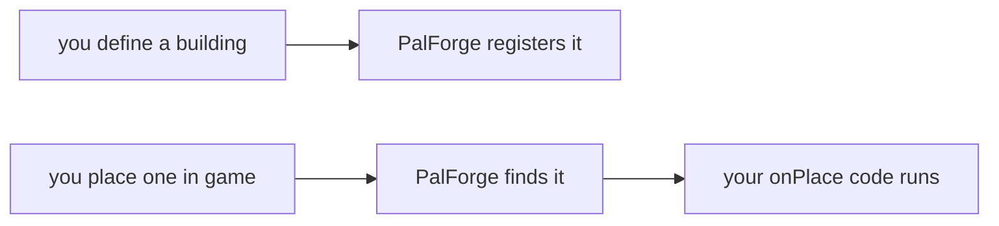

PalForge は Palworld のベース MOD です。自分の建築物・音楽・エフェクト・パル・アイテム・
モデル・スキル・メニューを追加でき、それらを組み合わせてまったく新しいコンテンツを作ることも
できます。しかも、すぐゲームの中で確認できます。作りたいものを短い Lua ファイルに書けば、
PalForge がそれをワールドに反映します。

## このページでできるようになること

- 自分の建築物・アイテム・パル・サウンド・メニューを Palworld に追加する
- 建築物を置いたとき、アイテムを拾ったとき、パルを捕まえたときに自分のコードを走らせる
- 置いた建築物ごとにデータを覚えさせて、次に遊ぶときも残す
- 作りたいものに対応するページを見つける

## 何を対象にしているか

<Callout type="warn">
PalForge targets SINGLE-PLAYER Palworld. Dedicated servers and co-op guests are not
supported and are not tested: there is no replication layer, and the item, spawn and event
routes are all client-authoritative. A pack may appear to work for the host and do nothing
for anyone else.

（PalForge が対象にするのは**シングルプレイヤーの Palworld** です。専用サーバーとマルチプレイの
ゲストはサポート対象外で、テストもされていません。レプリケーション層が存在せず、アイテム・
スポーン・イベントの経路はすべてクライアント権威だからです。ホストでは動いているように見えて、
他の誰の画面でも何も起きない、ということが起こり得ます。）
</Callout>

これは見落としではなく、意図的なスコープの決定です。理由も偶発的なものではなく構造的なものです。
`core/spawn` は **ローカルの** プレイヤーコントローラから `PalCheatManager` を作ります。アイテムの
消費は、ローカルにスポーンした `APalWeaponBase::RequestConsumeItem` を通ります。`core/event` の
イベントソースはすべてローカルの `RegisterHook` です。そのどれも専用サーバーやマルチプレイの
ゲストに対して実行されたことは一度もなく、まともに動くと期待できる根拠もありません。サーバー
対応をやるなら、それは新しいサブシステム — 書き込みごとの権威チェック、RPC の接合面、パックの
状態を誰が持つのかという判断 — であって、個々の項目の修正ではありません。同じ文はゲーム起動の
たびにログにも出力されるので、誰かがまずここを見つける必要はありません。

PalForge が「動く」と報告しているものはすべて、**Palworld v1.0.2.101103** に対して計測されて
います。実際のセーブで観測したか、インストールされたバイナリ自身の宣言を読んだかのどちらかです。
この番号は `Scripts/palforge/env.lua` の `gameBuild` にあり、起動行にも出ます。どのビルドに対して
計測したのかを言わないフレームワークは、利用者に *「PalForge が壊れている」* と *「ゲームのほうが
動いた」* を区別する手段を与えないからです。このツリーはまさにその隙間で一度痛い目に遭っています。
`AddItem` はヘッダダンプでは 4 引数でしたが、実際には 5 引数を宣言していました。ダンプがインストール
済みバイナリより 1 パッチ古かったのです。PalForge は起動時に、動いているゲームにもビルドを尋ねて
答えを `env.gameBuildLive` に記録します。両者が食い違えば、両方を名指しした 1 行を 1 度だけ出します。
ゲームが答えられない場合 — Mod ロード時にはそれが普通なので、最初のワールドロードで 1 度だけ読み
直します — 起動行は推測ではなく `unknown` と書きます。

## はじめての建築物

これで 1 つのコンテンツファイルです。ゲームにある焚き火に新しい挙動を与えます。右クリックすると
木材が 5 個手に入ります。

```lua title="Scripts/content/campfire.lua"
require("palforge.api")

Building{
    id = "CampFire",
    events = {
        onRightClick = function(self, ctx)
            Item.get("Wood"):give(5)
        end,
    },
}
```

やっていることは 3 つです。`Building{ ... }` が建築物を宣言します。`"CampFire"` はゲーム側の
建築 id なので、すでにある焚き火そのものが変わります。`events` が自分のコードを書く場所で、
`onRightClick` はプレイヤーが操作するたびに走ります。

このファイルは PalForge のスクリプトの隣に置き、入口から読み込みます。置き場所と、読み込むための
1 行は [はじめかた](/docs/getting-started) にあります。

## 作れるもの

8 種類あり、それぞれにモジュールが 1 つあります。モジュールを呼べば作れます。

| 作りたいもの | 宣言する内容 | ページ |
| --- | --- | --- |
| 設置できる建築物 | 見た目、グリッドの大きさ、覚えさせるデータ、そして 置いた／使った／壊した／数秒ごと のコード。 | [/docs/api/building](/docs/api/building) |
| インベントリのアイテム | 名前、カテゴリ、スタック上限、レシピ、そして 拾った／使った のコード。 | [/docs/api/item](/docs/api/item) |
| 生き物 | モデル、色、持っているスキルの id、そして 出現／被弾／死亡／捕獲 のコード。 | [/docs/api/pal](/docs/api/pal) |
| アビリティ | アクティブかパッシブか、属性、威力、そして Lua 側で数えるクールダウン。 | [/docs/api/skill](/docs/api/skill) |
| 時限付きのステータス | 持続時間、発動する間隔、スタックの仕方、終わったときの処理。 | [/docs/api/effect](/docs/api/effect) |
| サウンドや BGM | 再生できるゲーム内サウンド 1 つ。`Audio.bgm` と `Audio.se` は `kind` を固定してくれます。 | [/docs/api/audio](/docs/api/audio) |
| モデル | モデルアセットと、その塗り方。パルや建築物が身に着けます。 | [/docs/api/mesh](/docs/api/mesh) |
| パネルやボタン | Palworld 自身の UI キットで組み立てるウィジェット。`render` と `update` を持ちます。 | [/docs/api/ui](/docs/api/ui) |

`Player` だけは何かを作るためのモジュールではありません。プレイヤーの位置を教えてくれます。
`Player.character()`、`Player.coordinate()`、`Player.coordinateOffset(dx, dy, dz)` があります —
[/docs/api/player](/docs/api/player)。

## 定義を書く

どのモジュールも使い方は同じです。呼べば作れて、`get` と `get_all` ですでにあるものを探せます。

```lua
local boss = Pal{ id = "example:Boss", name = "Boss" }  -- CALL the module to define
Pal.get("ChickenPal")                                   -- an existing one, by id
Pal.get_all()                                           -- every registered one
```

`X{ ... }` は `X({ ... })` を短く書いた Lua の書き方です。波かっこがそのまま引数リストで、Lua で
名前付き引数に一番近い形になります。返ってくるのは **Handle** で、そのドメインのアクションを
持っています。`:spawn`、`:give`、`:play`、`:apply` などがそのまま使えます。

もう少し中身のある定義です。

```lua title="Scripts/content/flint.lua"
local api = require("palforge.api")

Item{
    id       = "Flint",
    name     = "Flint",
    category = "material",
    maxStack = 999,
    events = {
        onObtain = function(item, ctx)
            Audio.get("AKE_General_Explosion"):play()
        end,
    },
}
```

`Flint` はもともとゲームにあります。この定義は、その id に名前・カテゴリ・スタック上限と、
プレイヤーが拾ったときに鳴るサウンドを与えています。

`palforge.api` を require すると、`Pal`、`Item`、`Building`、`Skill`、`Effect`、`Audio`、
`Mesh`、`UI`、`Player` という名前がそのまま使えるようになり、同じ内容のテーブルも返ります。
どちらの書き方でも動きます。

<Tabs items={['Globals', 'Namespaced']}>
<Tab value="Globals">

```lua
require("palforge.api")

Pal.get("ChickenPal"):spawn(Player.coordinate())   -- the pal arrives a few seconds later
Item.get("Wood"):give(10)
```

</Tab>
<Tab value="Namespaced">

```lua
local api = require("palforge.api")

api.Pal.get("ChickenPal"):spawn(api.Player.coordinate())
api.Item.get("Wood"):give(10)
```

</Tab>
</Tabs>

これらの名前はあなたの MOD の中だけのものです。ゲーム本体や他の MOD と衝突しません。

モジュールの呼び出しと `get` / `get_all` のほかに、追加のものが 3 つあります。`Audio.bgm` と
`Audio.se` は `kind` を固定してくれるので自分で書かずに済み、`Effect.activeOn(target)` は対象に
いまかかっている効果の id をすべて返します。また `Player` を除くどのモジュールも、定義のもとに
なる基底クラス `X.Class` を公開しています。これはサブクラスを作るときにだけ必要です。

### 定義は 1 回、操作は何度でも

`X{ ... }` は作る側、`X.get(id)` はすでにあるものを引く側です。ハンドラーはイベントのたびに
走るので、その中では `get` を使ってください。

```lua
Pal{
    id = "ChickenPal",
    events = {
        onCaptured = function(pal, ctx)
            Audio.get("AKE_Arena_Victory_01"):play()   -- a play
            -- Audio.bgm{ id = "AKE_Arena_Victory_01" }  -- would RE-DEFINE on every capture
        end,
    },
}
```

### ハンドラーが受け取るもの

第 1 引数は、そのイベントが起きた対象そのものです。パル・アイテム・スキル・効果ではその Handle
なので、ドメインのアクションがそのまま使えます。建築物では、プレイヤーが触ったその 1 つの
構造物です。`self.actor` が設置されたアクター、`self.pos` がその位置、`self.state` があなたの
テーブルで、`self:save()` がそのテーブルを保存します。

```lua
Item{
    id = "Berries",
    events = {
        onUse = function(item, ctx)          -- item is the Item.Handle
            item:give(1)                     -- so :give is in scope
        end,
    },
}

Building{
    id = "CampFire",
    state = { lit = 0 },
    events = {
        onRightClick = function(self, ctx)   -- self is the live instance
            self.state.lit = self.state.lit + 1
            self:save()
        end,
    },
}
```

第 2 引数以降はドメインごとです。`(pal, ctx)`、`(item, ctx)`、`(skill, owner, ctx)`、
`(effect, target, ctx)`、`(instance, ctx)` になります。`ctx` はただのテーブルで、中身は
イベントによって変わります。`ctx.actor`、`ctx.itemId`、`ctx.count` などです。

### 定義を入れ子にする

定義を受け取るフィールドには、素のテーブルでも、すでに作った定義でも渡せます。どちらもまったく
同じように検査されます。

```lua
-- inline
Pal{ id = "example:Boss", mesh = { model = "/Game/Pal/Model/Character/Monster/ChickenPal/SK_ChickenPal.SK_ChickenPal" } }

-- named, declared once and reused
local body = Mesh{
    id    = "example:BossBody",
    model = "/Game/Pal/Model/Character/Monster/ChickenPal/SK_ChickenPal.SK_ChickenPal",
}
Pal{ id = "example:Boss", mesh = body }
Pal{ id = "example:Add",  mesh = Mesh.get("example:BossBody") }
```

### コンテンツに名前を付ける

コロンを含む id、たとえば `"example:Potion"` は自分のコンテンツです。PalForge はこれをゲームの
データ上の行名 `example_Potion` に変換します。コロンを含まない id は、`Wood`、`ChickenPal`、
`PalBoxV2` のようにゲームにすでにある id です。コロンで区切った id は、どちらの部分も英数字か
アンダースコアである必要があります。

```lua
local om = require("palforge.core.object_manager")

om.resolve("example:Potion")   --> "example_Potion"
om.resolve("Wood")             --> "Wood"        (literal game id, passed through)
om.resolve("bad pack:Potion")  --> nil, "invalid pack id 'bad pack' (letters/digits/_ only)"
```

同じルールは解決名を要求されたときだけでなく、**定義時**にも適用されます。
`Building{ id = "my-pack:Bench" }`（ハイフン）は、書いたその行でエラーになり、ルールを名指しします。
ゲームのどの行にも決して届かない id が登録されてしまうことはありません。

<Callout type="warn">
ゲームにすでにある id には、新しい挙動とメタデータを与えられます。一方、ゲーム側のテーブルに
まったく新しい行 — 新しいアイテム、新しい生き物、新しい建築物 — を追加するには別のツールが
必要です。Lua だけでは行を書けません。ですから `Item{ id = "example:Potion" }` は登録されて
コードからも使えますが、`example_Potion` という行ができるまでゲーム内のインベントリには
現れません。それまでは、ゲームにすでにある id の上に作るのが早道です。
</Callout>

### フィールドを間違えたとき

呼び出しは毎回、そのドメインが受け付ける形に照らして検査されます。問題があればその場で止まり、
中途半端に成功することはありません。未知のフィールド（もしかして候補付き）、必須フィールドの
欠落、型の不一致、許可された値以外、`arrayOf` や `mapOf` の要素の不正、`check` の失敗は、
いずれもエラーになります。メッセージはすべて `PalForge: ` で始まり、ドメイン名とフィールド名を
含みます。

```text
PalForge: Pal: unknown field "displayName" (did you mean "name"?). Valid fields: id, name, description, skills, mesh, material, color, texture, icon, events, data
PalForge: Pal: field "id" is required (pal id: a game CharacterID ("ChickenPal") or "pack:name")
PalForge: Pal: field "mesh" (Mesh.Spec): field "model" is required (USkeletalMesh / UStaticMesh asset path)
PalForge: Item: field "category" must be one of { "material", "consumable", "equipment", "ammo", "ingredient", "other" }, got "food"
```

ドメインが受け付ける内容は、ゲームを離れずに実行時に確認できます。

```lua
local schema = require("palforge.core.schema")

print(schema.help("Pal.Spec"))        -- every field, its type, default and meaning
schema.get("Pal.Spec").fields         -- the same as a table, for tooling
schema.all()                          -- every declared spec, in declaration order
```

エディタでは同じ情報が `Scripts/palforge/types.lua` から得られます。このファイルは
`lua5.4 tools/gen-types.lua` で生成されます。中身はアノテーションだけで、実行時に require する
ものはありません。`Pal{ ... }` で全フィールドがドキュメント付きで補完されるには、LuaLS が
ワークスペース内でこのファイルを見えていれば十分です。詳しくは
[エディタの設定](/docs/concepts/editor-setup) を読んでください。

## ゲームが自動で動かすもの

建築物のハンドラーを自分で呼ぶ必要はありません。構造物を置けば、PalForge がそれに気づいて
あなたのコードを走らせます。



どこまで自動で動くかはドメインによって違い、証拠の強さも違います。どのイベントがライブで、何が
それを裏付けているかは、各 api モジュールのヘッダに書かれています。

- **Building** — 一番充実しています。`onPlace`、`onLoad`、`onRightClick`、`onRemove`、
  `onTick`、`onWorldReady`、`onWorldLeft` はすべて、生きている構造物に対して走ります。構造物ごとに
  本物のインスタンスがあり、それぞれが自分の永続状態を持ちます。`onBuild` も建築が完了した瞬間に
  走りますが、構造物ができる前に届くため、生きた構造物ではなく定義そのものが渡されます。あとから
  読み込まれた構造物は `onWorldReady` を取り逃すので、構造物ごとの初期化処理は `onLoad` に置いて
  ください。決して発火しないのは `onLeftClick` と `onBreak` の 2 つで、これは未解決ではなく決着済み
  です（下の Callout を参照）。
- **Item** — 4 つとも走ります。`onObtain` と `onUse` はインベントリと使用の経路から、`onCraft` は
  2 つのマップオブジェクトモデルの `OnFinishWorkInServer` から、`onDiscard` は
  `RequestDrop_ToServer` / `RequestDispose_ToServer` から来ます。後ろの 2 つは、実際の作業設備で
  クラフトし、実際のスロットからドロップして観測されています。`:give` / `:take` / `:count` はいずれも
  後からインベントリを読み直すので、返り値は期待ではなく実測です。`:recipeOf` は宣言したレシピ、
  無ければその id に対するゲーム自身の行を返します。2026-08-02 にセーブ上での動作を確認しており、
  `Arrow` は `Arrow x10, work = 1000.0, from { Stone x2, Wood x2 }` として返ってきました。そして
  アイテムは**満腹度と体力を回復**できます。`restores = { satiety = 20, hpRate = 0.25 }` は使用時に
  その両方を書き込み、生きたキャラクターで実測されています。
- **Pal** — 5 つすべて走ります。`onCaptured`、`onDamaged`、`onDeath` は確認済みのゲーム側の
  呼び出しから来ます。`onSpawned` は `PalNPC:OnCompletedInitParam` と
  `PalPlayerCharacter:OnCompleteInitializeParameter` に乗っており、本当に新しいパルでの発火が
  実測されています。2026-08-02 の発火 27 回のうち、17 回はワールドロードとまったく無関係な時刻
  でした。ロード中にも発火はするので、2 回走っても平気な書き方にしておいてください。`onTick` は
  ワールド内のパルを走査する仕組みが駆動していて、おおよそ 3 秒ごとです。宣言した `mesh` は同じ
  スポーンチャンネルで自動的に取り付けられます。`renderOn` を自分で呼ぶ必要はありません。
- **Skill** — 4 つのうち 3 つが走ります。`onActivate` は `PalActionBase:OnBeginAction` が運んで、
  実戦で観測されました。`onEquip` と `onUnequip` は `AddPassiveSkill` / `RemovePassiveSkill` から
  です。走らないのは `onHit` で、そこへ届く唯一の経路は手動の `:hit(target)` です。`:activate` は
  クールダウンを Lua 側で管理し、冷却中は `false` を返します。
- **Effect** — `onApply`、`onTick`、`onStack`、`onExpire` がすべて走ります。時間の管理は
  PalForge 自身が 0.5 秒間隔の鼓動で行います。定義に `nativeStatus` を書けば、エフェクトが動いて
  いるあいだ対象にゲーム本体の状態異常が点灯します。この経路はロード済みのセーブで動作が確認されて
  おり、ゲーム側が状態異常を「付いている」→「消えている」と読み返すところまで見えています。状態
  異常はゲーム自身のルールで動き、その強さを PalForge は制御しません。
- **Audio** — ライフサイクルのイベントはありません。サウンドは自分で鳴らします。名前だけで十分です。
  1957 件の AkAudioEvent カタログが、実際に鳴るアセットパスへ解決してくれます。
  `Audio.Handle:stop(actor)` はサウンド単位ではなく、そのアクターで鳴っているものをすべて止めます。
  `:setVolume` も同じ理由でアクター単位です。
- **Mesh** — ライフサイクルのイベントはありません。バニラの `/Game/...` の static / skeletal メッシュ
  は動作し、エンジンに渡す前にクラスが検査されます。`.obj` のジオメトリはディスクから読めます。
  自前の PNG もインポートでき、パスごとにキャッシュされます。2026-08-02 のロード済みセーブで実際
  に動くところが観測されましたし、色の変化も同様です。チェストが赤、次に緑、次に青へ変わりました。
- **UI** — ライフサイクルのイベントはありませんが、「UI が変わった」というネイティブのシグナルは
  *あります*。2026-08-02 に実測されました。`CommonActivatableWidget:ActivateWidget`、
  `PalHUDService:Push`、`PalHUDService:Close` はいずれも、Palworld が画面を組み立てるとき・畳むときに
  発火します。`:autoRefresh(ms)` はこの 3 つすべてに乗り、その下に床としてハートビートのポーリングを
  敷いています。Palworld 自身の UMG キットでウィジェットを組み、ゲーム本体のゲーム内 UI ルートに
  マウントする経路はライブで確認済みです。
- **Player** — `Player.character()`、`Player.coordinate()`、`Player.coordinateOffset(dx, dy, dz)`。
  イベントはなく、プレイヤーがどこにいるかを答えます。

<Callout type="error" title="このバージョンがはっきり拒否する 1 つのこと">
**自分で用意したサウンドファイルは再生できません。`Audio.Spec.soundFile` は定義時のハードエラー
です。** Wwise 側は決着しました。このビルドの `AkExternalMediaAsset` と `AkMediaAsset` は関数を
1 つも宣言せず、インスタンスもロードされていないので、外部メディア経路そのものが存在しません。
エンジン側にもインポータはなく（`USoundWave` は宣言していません）、Lua から自前で作れるのかどうか
だけが未解決項目 `audio-custom-file-loader` に残った問いです。このフィールドは、エラーがそれを
名指しできるように宣言だけ残してあります。再生できるのはゲームに最初から入っているサウンド
だけで、その数は 1957 件です。カタログは [Audio](/docs/api/audio) にあります。

このページの残りは今日から動きます。ひとつだけ身に付けたい習慣があります。ゲームに触れる呼び出しは
「実測した結果」を返すので、決めつけずに戻り値を確かめてください。
</Callout>

<Callout type="warn">
宣言はできるが何も走らないものが 3 つあります。実際に走る場所に処理を置いてください。

- Building の `onLeftClick` と `onBreak` — 未解決ではなく否定側で決着しています。そのフックを持ち
  得るクラスの関数一覧を全部読んだ結果、存在しませんでした。`PalBuildObject` にクリック系の項目は
  なく、破壊はデリゲートの「フィールド」としてしか存在しないため、`RegisterHook` はパスで指定でき
  ません。`onRightClick` を、消失については `reason = "missing"` で届く `onRemove` を使ってください。
- Skill の `onHit` — 否定側で、しかも構造として決着しています。このビルドが宣言する 3 つのダメージ
  構造体のどのフィールドも技 id を運んでいないので、ヒットを技に突き合わせる材料が存在しません。
  パルのハンドラー、建築物の `onRightClick`、キーバインドなど、自分のコードから `:hit(target)` を
  呼んでください。
- UI 要素を*自動で*更新してくれるものはありません。自分の状態が変わったら `:refresh()` を呼ぶか、
  `:autoRefresh(ms)` を使ってください。こちらは Palworld 自身の再構築シグナルに乗り、駄目なときは
  ハートビートに落ちます。
</Callout>

## もっと大きな例

メッシュ・ステータス・アビリティ・建築物を作り、それらをつなげる 1 ファイルです。

```lua title="Scripts/content/supply_bench.lua"
local api = require("palforge.api")

-- 1. A named mesh, declared once so anything can wear it.
local BenchBody = Mesh{
    id    = "example:BenchBody",
    kind  = "static",
    model = "/Game/Pal/Model/Prop/Architecture/WorkBenchPrimitive/SM_WorkBenchPrimitive.SM_WorkBenchPrimitive",
}

-- 2. A timed status. Its schedule is driven by the shared heartbeat, in Lua.
local WellFed = Effect{
    id          = "example:WellFed",
    name        = "Well Fed",
    description = "Hands out a berry every ten seconds.",
    duration    = 60.0,
    interval    = 10.0,
    events = {
        onApply = function(effect, target, ctx)
            Audio.get("AKE_BGM_Title"):play(target)
        end,
        onTick = function(effect, target, ctx)
            Item.get("Berries"):give(1)
        end,
        onExpire = function(effect, target, ctx)
            Audio.get("AKE_BGM_Title"):stop(target)
        end,
    },
}

-- 3. A skill. onActivate has a live source in real combat; this one is fired by hand
--    from the building below, and the cooldown is enforced in Lua by :activate.
local Whistle = Skill{
    id       = "example:Whistle",
    name     = "Whistle",
    kind     = "active",
    cooldown = 30.0,
    events = {
        onActivate = function(skill, owner, ctx)
            Pal.get("ChickenPal"):spawn(Player.coordinateOffset(200, 0, 0))
        end,
    },
}

-- 4. The structure. "CampFire" is an EXISTING game build id; this gives it a mesh,
--    per-structure persisted state and a lifecycle.
Building{
    id           = "CampFire",
    name         = "Supply Bench",
    gridCm       = 100,
    tickInterval = 20,               -- onTick every 20 heartbeats, so every 10 seconds
    mesh         = BenchBody,
    state        = { uses = 0 },
    events = {
        onPlace = function(self, ctx)
            self.state.uses = 0
            self:save()
        end,
        onLoad = function(self, ctx)
            -- ctx.reconstructed is true when this came back from a saved record
        end,
        onRightClick = function(self, ctx)
            self.state.uses = self.state.uses + 1
            self:save()
            Item.get("Wood"):give(5)
            WellFed:apply(Player.character())
            Whistle:activate(ctx.player)     -- returns false while cooling down
        end,
        onTick = function(self, ctx)
            if self.state.uses >= 10 then
                Item.get("Berries"):give(1)
                self.state.uses = 0
                self:save()
            end
        end,
        onRemove = function(self, ctx)
            WellFed:remove(Player.character())
        end,
    },
}
```

各パーツがしていることは次のとおりです。

- `BenchBody` は `("mesh", "example:BenchBody")` として登録され、建築物には値として入れ子に
  なります。ここでは `kind` を明示する必要があります。名前付きの `Mesh{ ... }` は単独で
  `Mesh.Spec` に照らして検査され、その `kind` の既定値 `"skeletal"` が埋まった状態で持ち回される
  ためです。`"static"` という既定値は `Building.Spec.Mesh` のものなので、建築物の中にインラインで
  書いたメッシュにしか効きません。
- `WellFed:apply(target)` は適用を開始します。すぐに `onApply`、`interval` 秒ごとに `onTick`、
  `duration` 経過後または `:remove()` で `onExpire` が走ります。
- `Whistle:activate(owner)` は 30 秒のクールダウンに阻まれない限り `onActivate` をすぐ実行します。
  阻まれた場合は `false` を返します。
- `tickInterval = 20` は 0.5 秒の鼓動と合わせて、`onTick` が 10 秒ごとに走ることを意味します。
- `self:save()` は構造物の `state` テーブルをワールドごとの状態ファイルに書き出します。
- `onRightClick` の `ctx.player` は操作したキャラクター、`ctx.actor` は建築物のアクターです。
- `Audio.Handle:stop(actor)` はサウンド単位ではありません。そのアクターで鳴っているものを
  すべて止めます。
- `Item.Handle:give` はインベントリが実測でどう動いたかを返すので、`false` は「何も届かなかった」
  という意味です。`:spawn` の行は、実行の数秒後にパルをワールドへ出します。即座ではありません。

<Callout type="info">
`CampFire`、`Wood`、`Berries`、`ChickenPal` は `Scripts/palforge/native/*.lua` にある実在の id で、
`AKE_BGM_Title` は `palforge.native.audio` が定義しているサウンドです。登録は `(type, id)` を
キーにしているため、PalForge に同梱されている id を定義すると、その登録を置き換えます。
</Callout>

## 次に読むもの

<Cards>
  <Card title="はじめかた" href="/docs/getting-started">
    PalForge を導入し、パックを配置して、定義をゲーム内で動かすまで。
  </Card>
  <Card title="はじめてのコンテンツパック" href="/docs/guides/first-content-pack">
    空のフォルダから遊べる状態まで、パックを 1 つ順番に作ります。
  </Card>
  <Card title="定義" href="/docs/concepts/definitions">
    スペック、厳格な検査、Handle、入れ子、そして id モデルの詳細。
  </Card>
  <Card title="ライフサイクル" href="/docs/concepts/lifecycle">
    チャンネル、鼓動、そしてどのハンドラーが何で走るのか。
  </Card>
  <Card title="保存される状態" href="/docs/concepts/saved-state">
    mod が保存したものがどこに置かれるか、そして mod を削除するとセーブに何が起きるか。
  </Card>
</Cards>

## まとめ

- コンテンツは Lua ファイル 1 つで追加できます。`Building{ ... }`、`Item{ ... }`、`Pal{ ... }`
  などはすべて同じ使い方で、どれも必須のフィールドは `id` だけです。
- コロンを含む id は自分のコンテンツ、含まない id はゲームにすでにあるものです。すでにある id の
  上に作るのが、ゲーム内で結果を見る一番早い方法です。
- 走らせたいコードは `events` に書きます。第 1 引数はイベントが起きた対象で、建築物なら生きて
  いる構造物、それ以外はその定義の Handle です。
- 建築物は `state` に入れたものを覚えます。`self:save()` を呼んでください。
- フィールド名を間違えると呼び出しは止まり、`PalForge: ` で始まるメッセージが正しい候補を
  教えてくれます。id の形が不正なときも、書いたその行で止まります。
- 発火しないハンドラーは 3 つです。否定側で決着した Building の `onLeftClick` と `onBreak`、
  そして Skill の `onHit`。このページで宣言できる残りのものにはすべてライブのソースがあります。
- PalForge はシングルプレイヤー専用で、掲げている機能はすべて Palworld v1.0.2.101103 に対して
  計測されています。

次は [はじめかた](/docs/getting-started) を読んで、PalForge を導入し、書いたファイルを
読み込ませましょう。
