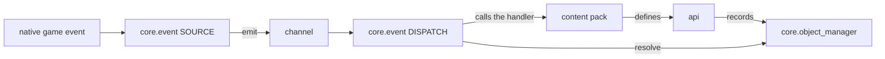

PalForge は UE4SS の Lua MOD として動作する Palworld 向けのコンテンツフレームワークです。
コンテンツパックとは、パル・アイテム・建築物・スキル・効果・サウンド・メッシュ・UI を宣言し、
それらに挙動を結び付ける Lua コードのことです。

## PalForge とは

インストール構成は通常の UE4SS Lua MOD と同じです。

```text
ue4ss/Mods/PalForge/Scripts/main.lua        <- entry point
ue4ss/Mods/PalForge/Scripts/palforge/*.lua  <- modules
```

`main.lua` は薄い入口です。`palforge.*` がその `Scripts` ディレクトリを基準に解決されるよう
`package.path` を設定し、`registry.initialize()` を `pcall` で呼び、コンパニオン MOD 向けに
`_G.PalForge` を公開します。

`registry.initialize()` は MOD ロード時に一度だけ、決まった順序で実行されます。

1. `palforge.api` を require します。これにより `Pal`、`Item`、`Building`、`Skill`、
   `Effect`、`Audio`、`Mesh`、`UI`、`Player` のグローバルが導入されます。
2. ネイティブカタログ（`palforge.native.buildings`、`.items`、`.pals`、`.skills`、
   `.effects`、`.audio`、`.ui`）を require します。厳選された定義は、定義された時点で自身を登録します。
3. `event.start()` — バス、ネイティブソース、ディスパッチを起動します。
4. `env.dev` で制御される開発用ツール。開発用キーバインド、`ps_catalog` コンソールコマンド、
   テストスイートを読み込みます。
5. `event.emit("gameStart")`。

`palforge/env.lua` は `dev`、`name`、`version` を保持する、プロセス全体で共有されるテーブルです。
`dev` が唯一の開発／リリース切り替えスイッチで、コンテンツだけを登録するビルドを配布したい場合は
`registry.initialize()` が走る前に `false` にします。

```lua
local env = require("palforge.env")
env.dev = false
```

最小限の実用的なパックは、定義ひとつです。

```lua title="Scripts/content/flint.lua"
local api = require("palforge.api")

Item{
    id       = "Flint",
    name     = "Flint",
    category = "material",
    maxStack = 999,
    events = {
        onObtain = function(item, ctx)
            Audio.get("AKE_General_Explosion"):play()
        end,
    },
}
```

`Flint` はゲームのアイテムテーブルに実在する行です。この定義がその行を作るわけではありません。
既存の id に対して、名前・カテゴリ・スタック上限、そしてプレイヤーが入手したときに走る
ハンドラーを与えているだけです。

## PalForge ではないもの

PalForge は DataTable の行を追加しません。Lua だけで Palworld のデータテーブルに新しい
アイテム・生物・建築物の行を追加することはできません。それは PalSchema の役割です。定義が行うのは
**id に対して挙動とメタデータを結び付けること**、そしてその id を操作するアクションを渡すことです。

id の規則はひとつです。コンテンツパックは `"packid:name"` と書き、
`core/object_manager.resolve` がそれを DataTable の行 FName である `packid_name` に変換します。
どちらの部分も英数字かアンダースコアである必要があります。コロンを**含まない** id はゲームの
リテラル id です。

```lua
local om = require("palforge.core.object_manager")

om.resolve("example:Potion")   --> "example_Potion"
om.resolve("Wood")             --> "Wood"        (literal game id, passed through)
om.resolve("bad pack:Potion")  --> nil, "invalid pack id 'bad pack' (letters/digits/_ only)"
```

つまり `Item{ id = "example:Potion" }` が意味を持つのは、PalSchema（あるいは別の MOD）が
`example_Potion` という行を公開している場合だけです。その行がなければ、定義自体は登録されて
Lua から呼び出せますが、ゲーム内のインベントリはそれを参照しません。

<Callout type="warn">
PalForge が行わないことがもう 2 つあります。PalForge の `Effect` はゲーム自身の状態異常列挙型
`EPalStatusEffectType` を切り替えません。状態異常を適用するネイティブ呼び出しは確認できていないため、
ゲームプレイはあなたのハンドラーの中に置かれます。またスキルにはネイティブソースが存在しません。
ゲーム側が `Skill` のハンドラーを自動で発火することはないので、自分のコードから呼び出します。
</Callout>

## レイヤー構成

ディレクトリは 4 つあり、そのうちパックが直接呼ぶのは 2 つだけです。

| レイヤー | 役割 |
| --- | --- |
| `api/` | パックが書く対象となる公開サーフェス。1 ドメインにつき 1 モジュール。 |
| `core/` | エンジン。`registry` が読み込み順を、`event` がチャンネル・ネイティブソース・ディスパッチと建築物ランタイム全体を担当し、Palworld とのブリッジとして `object_manager`、`spawn`、`mesh`、`sound`、`player`、`icons`、`spatial`、`schema` があります。 |
| `utils/` | パックが直接呼ぶ汎用ツールボックス。`log`、`json`、`file`、`items`。 |
| `native/` | Palworld 自身のコンテンツをデータカタログ化したものと、いくつかの厳選済み定義。 |

`core/` 内の責務分担は 3 文で言えます。`object_manager` は**何が**存在するかを、`registry` は
**いつ**読み込まれるかを、`event` は**何が起きるか**を知っています。



登録は独立した手順ではありません。定義の呼び出しそのものが `object_manager` に書き込むため、
モジュールを読み込むことが、そのコンテンツを登録することです。走査すべき集約テーブルも、
忘れずに呼ぶべきクラスごとの `register()` もありません。

## すべてのドメインが共有する形

どのドメインモジュールにも、公開された入口がちょうど 3 つあります。

```lua
local boss = Pal{ id = "example:Boss", name = "Boss" }  -- CALL the module to define
Pal.get("ChickenPal")                                   -- an existing one, by id
Pal.get_all()                                           -- every registered one
```

`X{ ... }` は `X({ ... })` に対する Lua のテーブル呼び出し糖衣構文です。モジュール自体が
`__call` メタメソッドによってコンストラクタになっており、`X.define` は存在しません。定義すると
`core/object_manager` に `(type, id)` をキーとして定義クラスが登録され、そのドメインのアクションを
持つ **Handle** が返ります。

`palforge.api` を require すると、グローバルが導入され、**かつ**同じテーブルが名前空間付きで
返ります。したがって次のどちらの書き方も動きます。

<Tabs items={['Globals', 'Namespaced']}>
<Tab value="Globals">

```lua
require("palforge.api")

Pal.get("ChickenPal"):spawn(Player.coordinate())
Item.get("Wood"):give(10)
```

</Tab>
<Tab value="Namespaced">

```lua
local api = require("palforge.api")

api.Pal.get("ChickenPal"):spawn(api.Player.coordinate())
api.Item.get("Wood"):give(10)
```

</Tab>
</Tabs>

UE4SS は Lua MOD ごとに独立した state を与えるため、これらのグローバルは MOD ローカルです。
ゲーム本体や他の MOD と衝突しません。

### 定義は 1 回、操作は何度でも

`X{ ... }` は登録します。`X.get(id)` は登録済みのものに対する handle を返すだけです。ハンドラーは
イベントのたびに走るので、その中では `get` を使ってください。

```lua
Pal{
    id = "ChickenPal",
    events = {
        onCaptured = function(pal, ctx)
            Audio.get("AKE_Arena_Victory_01"):play()   -- a play
            -- Audio.bgm{ id = "AKE_Arena_Victory_01" }  -- would RE-DEFINE on every capture
        end,
    },
}
```

### ハンドラーの第 1 引数

第 1 引数は、そのイベントが起きた対象そのものです。パル・アイテム・スキル・効果では
**その定義の Handle** なので、ドメインのアクションがそのまま使えます。建築物では**ライブ
インスタンス**であり、`self.actor`、`self.pos`、`self.state`、`self:save()` を持ちます。

```lua
Item{
    id = "Berries",
    events = {
        onUse = function(item, ctx)          -- item is the Item.Handle
            item:give(1)                     -- so :give is in scope
        end,
    },
}

Building{
    id = "CampFire",
    state = { lit = 0 },
    events = {
        onRightClick = function(self, ctx)   -- self is the live instance
            self.state.lit = self.state.lit + 1
            self:save()
        end,
    },
}
```

第 2 引数以降はドメインごとです。`(pal, ctx)`、`(item, ctx)`、`(skill, owner, ctx)`、
`(effect, target, ctx)`、`(instance, ctx)` になります。

### 定義のネスト

ネストされた定義は、それ自体をそのまま渡せます。`Mesh` の Handle のメタテーブルは `__spec` を
持っており、バリデータがそれを素の宣言に展開するため、インライン形式と名前付き形式はまったく
同じように検証されます。

```lua
-- inline
Pal{ id = "example:Boss", mesh = { model = "/Game/Pal/Model/Character/Monster/ChickenPal/SK_ChickenPal.SK_ChickenPal" } }

-- named, declared once and reused
local body = Mesh{
    id    = "example:BossBody",
    model = "/Game/Pal/Model/Character/Monster/ChickenPal/SK_ChickenPal.SK_ChickenPal",
}
Pal{ id = "example:Boss", mesh = body }
Pal{ id = "example:Add",  mesh = Mesh.get("example:BossBody") }
```

### 検証は厳格です

形は `core/schema` によってデータとして宣言され、呼び出しのたびに強制されます。問題はすべて
ハードエラーで、呼び出しが中途半端に成功することはありません。未宣言のフィールド（もしかして候補付き）、
必須フィールドの欠落、型の不一致、宣言された `values` に含まれない値、不正な `arrayOf` や `mapOf` の要素、
失敗した `check` — いずれもエラーになります。メッセージはすべて `PalForge: ` で始まり、ドメイン名と
フィールド名を含みます。

```text
PalForge: Pal: unknown field "displayName" (did you mean "name"?). Valid fields: id, name, description, skills, mesh, material, color, texture, icon, events, data
PalForge: Pal: field "id" is required (pal id: a game CharacterID ("ChickenPal") or "pack:name")
PalForge: Pal: field "mesh" (Mesh.Spec): field "model" is required (USkeletalMesh / UStaticMesh asset path)
PalForge: Item: field "category" must be one of { "material", "consumable", "equipment", "ammo", "ingredient", "other" }, got "food"
```

宣言はモジュール内に閉じています。ドメインは「呼ぶもの」であって「中を見に行く名前空間」では
ありません。ただし実行時にはスキーマレジストリ経由で読み出せます。

```lua
local schema = require("palforge.core.schema")

print(schema.help("Pal.Spec"))        -- every field, its type, default and meaning
schema.get("Pal.Spec").fields         -- the same as a table, for tooling
schema.all()                          -- every declared spec, in declaration order
```

エディタでは同じ情報が `Scripts/palforge/types.lua` から得られます。このファイルは
`lua5.4 tools/gen-types.lua` によって同じ宣言から生成されます。中身はアノテーションだけで、
実行時に require するものはありません。`Pal{ ... }` で全フィールドがドキュメント付きで補完される
ためには、LuaLS がワークスペース内でこのファイルを見えていれば十分です。

## 実例

Mesh、Effect、Skill、Building、Item、Audio、Pal、Player をまとめて扱う 1 ファイルのパックです。

```lua title="Scripts/content/supply_bench.lua"
local api = require("palforge.api")

-- 1. A named mesh, declared once so anything can wear it.
local BenchBody = Mesh{
    id    = "example:BenchBody",
    kind  = "static",
    model = "/Game/Pal/Model/Prop/Architecture/WorkBenchPrimitive/SM_WorkBenchPrimitive.SM_WorkBenchPrimitive",
}

-- 2. A timed status. Its schedule is driven by the shared heartbeat, in Lua.
local WellFed = Effect{
    id          = "example:WellFed",
    name        = "Well Fed",
    description = "Hands out a berry every ten seconds.",
    duration    = 60.0,
    interval    = 10.0,
    events = {
        onApply = function(effect, target, ctx)
            Audio.get("AKE_BGM_Title"):play(target)
        end,
        onTick = function(effect, target, ctx)
            Item.get("Berries"):give(1)
        end,
        onExpire = function(effect, target, ctx)
            Audio.get("AKE_BGM_Title"):stop(target)
        end,
    },
}

-- 3. A skill. Nothing in the game fires one, so it is invoked below by hand;
--    the cooldown is enforced in Lua by :activate.
local Whistle = Skill{
    id       = "example:Whistle",
    name     = "Whistle",
    kind     = "active",
    cooldown = 30.0,
    events = {
        onActivate = function(skill, owner, ctx)
            Pal.get("ChickenPal"):spawn(Player.coordinateOffset(200, 0, 0))
        end,
    },
}

-- 4. The structure. "CampFire" is an EXISTING game build id; this gives it a mesh,
--    per-structure persisted state and a lifecycle.
Building{
    id           = "CampFire",
    name         = "Supply Bench",
    gridCm       = 100,
    tickInterval = 20,               -- onTick every 20 heartbeats, so every 10 seconds
    mesh         = BenchBody,
    state        = { uses = 0 },
    events = {
        onPlace = function(self, ctx)
            self.state.uses = 0
            self:save()
        end,
        onLoad = function(self, ctx)
            -- ctx.reconstructed is true when this came back from a saved record
        end,
        onRightClick = function(self, ctx)
            self.state.uses = self.state.uses + 1
            self:save()
            Item.get("Wood"):give(5)
            WellFed:apply(Player.character())
            Whistle:activate(ctx.player)     -- returns false while cooling down
        end,
        onTick = function(self, ctx)
            if self.state.uses >= 10 then
                Item.get("Berries"):give(1)
                self.state.uses = 0
                self:save()
            end
        end,
        onRemove = function(self, ctx)
            WellFed:remove(Player.character())
        end,
    },
}
```

各パーツが実際に行っていることは次のとおりです。

- `BenchBody` は `("mesh", "example:BenchBody")` として登録され、建築物には値としてネストされます。
  ここでは `kind` を明示する必要があります。名前付きの `Mesh{ ... }` は単独で `Mesh.Spec` により
  検証され、その `kind` の既定値である `"skeletal"` が埋まった状態で持ち回されるためです。
  `"static"` という既定値は `Building.Spec.Mesh` のものなので、建築物の中にインラインで書いた
  メッシュにしか効きません。
- `WellFed:apply(target)` はライブな適用を開始します。すぐに `onApply`、`interval` 秒ごとに
  `onTick`、`duration` 経過後または `:remove()` で `onExpire` が走ります。
- `Whistle:activate(owner)` は 30 秒のクールダウンに阻まれない限り `onActivate` を即座に実行します。
  阻まれた場合は `false` を返します。
- `tickInterval = 20` は 500 ms のハートビートと合わせて、`onTick` が 10 秒ごとに走ることを意味します。
- `self:save()` はインスタンスの `state` テーブルをワールドごとの状態ファイルに書き出します。
- `onRightClick` の `ctx.player` は操作したキャラクター、`ctx.actor` は建築物のアクターです。
- `Audio.Handle:stop(actor)` はサウンド単位ではありません。ネイティブの停止経路は、そのアクターで
  再生中のものをすべて止めます。

<Callout type="info">
`CampFire`、`Wood`、`Berries`、`ChickenPal` は `Scripts/palforge/native/*.lua` にある実在の id で、
`AKE_BGM_Title` は `palforge.native.audio` が定義している厳選済みサウンドです。登録は `(type, id)` を
キーにしているため、ネイティブカタログが既に厳選定義している id を定義すると、その登録を置き換えます。
</Callout>

## ドメイン一覧

| ドメイン | 宣言する内容 | リファレンス |
| --- | --- | --- |
| `Pal` | 出現させられる生物。メッシュ、マテリアル、スキル id、そして spawn / damage / death / capture のハンドラー。 | [/docs/api/pal](/docs/api/pal) |
| `Item` | インベントリのコンテンツ。カテゴリ、スタック上限、レシピ、obtain / use のハンドラー。 | [/docs/api/item](/docs/api/item) |
| `Building` | 設置できる構造物。構造物ごとのライブインスタンス、永続化される状態、完全なライフサイクルを持つ唯一のドメイン。 | [/docs/api/building](/docs/api/building) |
| `Skill` | アクティブまたはパッシブのアビリティ。属性、威力、Lua 側で強制されるクールダウンを持ちます。 | [/docs/api/skill](/docs/api/skill) |
| `Effect` | 対象に付く時限付きステータス。持続時間、間隔、スタック、失効。 | [/docs/api/effect](/docs/api/effect) |
| `Audio` | 再生可能な Wwise の `AkAudioEvent` ひとつ。アクター上で鳴らします。`Audio.bgm` と `Audio.se` は `kind` を固定します。 | [/docs/api/audio](/docs/api/audio) |
| `Mesh` | モデルアセットと、その塗り方。パルや建築物が身に着けます。 | [/docs/api/mesh](/docs/api/mesh) |
| `UI` | Palworld 自身の UMG キットで組み立てる、マウント可能な要素。`render` と `update` を持ちます。 | [/docs/api/ui](/docs/api/ui) |
| `Player` | ローカルキャラクターとその座標。単なるファサードで、呼び出し可能ではありません。 | [/docs/api/player](/docs/api/player) |

3 つの入口以外の追加要素は 3 つだけで、これがその全部です。`Audio.bgm` と `Audio.se` は `kind` を
固定し、`Effect.activeOn(target)` は対象に現在かかっている効果の id をすべて返します。`Player` には
そもそも入口がなく、`character()`、`coordinate()`、`coordinateOffset(dx, dy, dz)` だけです。加えて、
`Player` を除くどのモジュールも基底の定義クラス `X.Class` を公開しており、サブクラス化と
`core/event` のオーバーライド検出に使われます。

<Callout type="warn">
現時点で実際に発火するフックは次のとおりです。

- **Building** — 次のフックがライブです。`onPlace`、`onLoad`、`onRightClick`、`onRemove`、
  `onTick`、`onWorldLeft`。`onBuild`、`onLeftClick`、`onBreak` は宣言できますが、発行する
  ネイティブソースがありません。`onWorldReady` はディスパッチされますがインスタンスには
  届きません。`world.ready` はゲートが開いた瞬間に emit され、インスタンスを作るスキャンは
  同じゲートを待つためです。処理は `onLoad` に置いてください。
- **Pal** — `onCaptured`、`onDamaged`、`onDeath` はライブです。`onSpawned` は未確認の候補フックに
  乗っています。`onTick` は宣言できるだけです。パルにはインスタンススキャンがないため、駆動源が
  存在しません。
- **Item** — `onObtain` と `onUse` はライブです。`onCraft` と `onDiscard` は宣言できるだけで、
  チャンネルとディスパッチはありますが、発行するものがありません。
- **Effect** — 4 つのフックすべてがライブですが、そのタイミングを持っているのは `api/effect` 自身で、
  `tick` チャンネルに乗って動きます。ネイティブのゲームイベントではありません。
- **Skill** — ネイティブソースはまったくありません。`:activate`、`:hit`、`:equip`、`:unequip` が
  その場でハンドラーを実行します。自分のコードから駆動してください。
- **Audio / Mesh / UI** — ライフサイクルチャンネルはありません。`Audio.Handle:setVolume` は未実装で
  `false` を返し、`soundFile` は解決されても何もせず、UI 要素の `refresh()` を代わりに呼ぶものは
  ありません。
</Callout>

## `_G.PalForge` が公開するもの

`main.lua` の実行後、同じ Lua state に読み込まれたコンパニオン MOD は、ひとつのテーブルから
すべてに到達できます。

```lua
_G.PalForge = {
    env    = env,                      -- dev / name / version
    api    = require("palforge.api"),  -- Pal, Item, Building, Skill, Effect, Audio, Mesh, UI, Player
    utils  = { log, json, file, items },
    core   = { registry, event, object_manager, spawn, mesh, sound, player, spatial, icons },
    native = require("palforge.native"),
}
```

`api` はコンテンツパックが書く対象、`utils` はツールボックスです。`core` と `native` は
高度な用途、つまり独自のイベントチャンネルやカタログ参照のために公開されています。

```lua title="a companion mod"
local PalForge = _G.PalForge
local event    = PalForge.core.event
local log      = PalForge.utils.log.scope("mymod")

-- Subscribe to any channel. Returns a subscription with :unsubscribe().
local sub = event.on("item.obtain", function(ctx)
    log.info("obtained " .. tostring(ctx.itemId) .. " x" .. tostring(ctx.count))
end)

-- Run something on the shared heartbeat, quantized to event.TICK_MS (500 ms).
event.every(5000, function()
    log.info("live buildings: " .. tostring(#event.instances()))
end)

-- Operator chains, because a channel is a hot Rx Subject.
event.observable("building.interact")
    :filter(function(ctx) return ctx.buildId == "PalBoxV2" end)
    :subscribe(function(ctx) log.info("palbox opened") end)

-- Read the catalogs.
local native = PalForge.native
native.audio.MainTheme:play()
native.items.get("Arrow_Fire"):give(20)

sub:unsubscribe()
```

チャンネルの一覧は `event.CHANNELS` です。すべてのチャンネルは事前に作成されているので、
最初の emit より先に subscribe しても動きます。

```text
gameStart
world.ready   world.left
building.place  building.load  building.interact  building.remove
pal.spawned  pal.damaged  pal.death  pal.captured
item.obtain  item.use  item.craft  item.discard
tick
```

`registry.registered()` は、登録済みのクラスをオブジェクト型と id で引けるスナップショットとして
返します。ツールを書くときに便利です。

```lua
local registry = _G.PalForge.core.registry

for id in pairs(registry.registered().building) do
    print(id)
end
```

## 次に読むもの

<Cards>
  <Card title="はじめかた" href="/docs/getting-started">
    PalForge を導入し、パックを配置して、定義をゲーム内で動かすまで。
  </Card>
  <Card title="定義" href="/docs/concepts/definitions">
    スペック、厳格な検証、Handle、ネスト、そして id モデルの詳細。
  </Card>
  <Card title="ライフサイクル" href="/docs/concepts/lifecycle">
    チャンネル、ネイティブソース、ディスパッチ、ハートビート、そしてどのフックがライブか。
  </Card>
</Cards>
