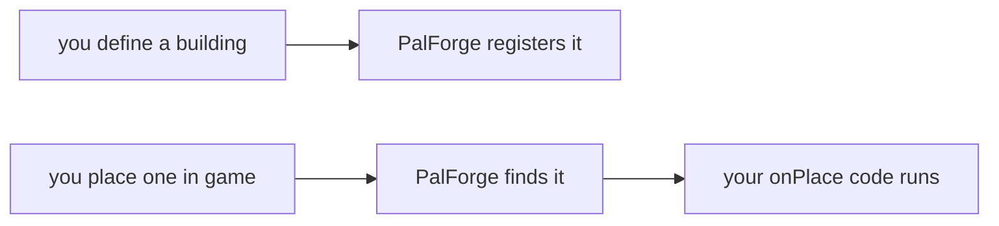

PalForge is a base mod for Palworld that lets anyone add their own buildings, music,
effects, pals, items, models, skills and menus — or build entirely new content out of
them — and see it in the game straight away. You write a short Lua file describing what
you want, and PalForge puts it in the world.

## What you can do after this page

- Add your own building, item, pal, sound or menu to Palworld.
- Run your own code when a structure is placed, an item is picked up or a pal is caught.
- Give a placed structure its own memory that is still there the next time you play.
- Find the page for the exact thing you want to make.

## What this targets

<Callout type="warn">
PalForge targets SINGLE-PLAYER Palworld. Dedicated servers and co-op guests are not
supported and are not tested: there is no replication layer, and the item, spawn and event
routes are all client-authoritative. A pack may appear to work for the host and do nothing
for anyone else.
</Callout>

That is a deliberate scope decision rather than an oversight, and the reasons are structural
rather than incidental. `core/spawn` builds a `PalCheatManager` off the **local** player
controller. Spending an item goes through a locally spawned
`APalWeaponBase::RequestConsumeItem`. Every event source in `core/event` is a local
`RegisterHook`. None of it has ever been run against a dedicated server or a co-op guest, and
none of it would be expected to behave. Server support would be a new subsystem — authority
checks on every write, an RPC seam, a decision about who owns pack state — not a fix to any one
item. The same sentence is printed in the log at every startup, so nobody has to find it here
first.

Everything PalForge reports as working was measured against **Palworld v1.0.2.101103**: watched
in a real save, or read off the installed binary's own declarations. That number is `gameBuild`
in `Scripts/palforge/env.lua`, and it is in the startup line, because a framework that does not
say which build it was measured on gives its users no way to tell *"PalForge is broken"* from
*"the game moved"*. This tree has already been bitten by exactly that gap: `AddItem` turned out
to declare five parameters where the header dump had four, because the dump predated the
installed binary by a single patch. At startup PalForge also asks the running game what build it
is and records the answer in `env.gameBuildLive`. When the two disagree it says so once, in one
line naming both. When the game cannot answer — which is ordinary at mod load, so the read is
retried once at the first world load — the startup line reads `unknown` rather than a guess.

## Your first building

This is a whole content file. It gives the game's own campfire a new behaviour: right-click
one and you get five wood.

```lua title="Scripts/content/campfire.lua"
require("palforge.api")

Building{
    id = "CampFire",
    events = {
        onRightClick = function(self, ctx)
            Item.get("Wood"):give(5)
        end,
    },
}
```

Three things are happening. `Building{ ... }` declares a structure. `"CampFire"` is the
game's own build id, so the campfire you already know is the one that changes. `events` is
where your code goes, and `onRightClick` runs every time a player interacts with one.

Put the file next to PalForge's own scripts and load it from your entry point —
[Getting started](/docs/getting-started) shows the exact folder and the one line that
requires it.

## What you can make

Eight kinds of thing, one module each. Call the module to make one.

| You want to make | What you declare | Page |
| --- | --- | --- |
| A placeable structure | Its look, its grid size, the data it remembers, and code for placed / used / removed / every few seconds. | [/docs/api/building](/docs/api/building) |
| Inventory content | A name, a category, a stack limit, a recipe, and code for picked up / used. | [/docs/api/item](/docs/api/item) |
| A creature | A model, a colour, the ids of its skills, and code for spawned / damaged / killed / captured. | [/docs/api/pal](/docs/api/pal) |
| An ability | Active or passive, its element, its power, and a cooldown counted in Lua. | [/docs/api/skill](/docs/api/skill) |
| A timed status | How long it lasts, how often it fires, how it stacks, what happens when it ends. | [/docs/api/effect](/docs/api/effect) |
| A sound or music track | One playable game sound. `Audio.bgm` and `Audio.se` pin `kind` for you. | [/docs/api/audio](/docs/api/audio) |
| A model | A model asset plus how to paint it. A pal or a building wears one. | [/docs/api/mesh](/docs/api/mesh) |
| A panel or a button | Widgets built from Palworld's own UI kit, with `render` and `update`. | [/docs/api/ui](/docs/api/ui) |

`Player` is the one module you do not make anything with. It tells you where the player is:
`Player.character()`, `Player.coordinate()` and `Player.coordinateOffset(dx, dy, dz)` —
[/docs/api/player](/docs/api/player).

## Writing a definition

Every module works the same way. Call it to make something, and use `get` and `get_all` to
find what is already there.

```lua
local boss = Pal{ id = "example:Boss", name = "Boss" }  -- CALL the module to define
Pal.get("ChickenPal")                                   -- an existing one, by id
Pal.get_all()                                           -- every registered one
```

`X{ ... }` is Lua's shorthand for `X({ ... })` — the braces are the argument list, which is
as close to named arguments as Lua gets. What comes back is a **Handle**: an object
carrying that domain's actions, so `:spawn`, `:give`, `:play` and `:apply` are right there.

Here is a definition with a bit more on it:

```lua title="Scripts/content/flint.lua"
local api = require("palforge.api")

Item{
    id       = "Flint",
    name     = "Flint",
    category = "material",
    maxStack = 999,
    events = {
        onObtain = function(item, ctx)
            Audio.get("AKE_General_Explosion"):play()
        end,
    },
}
```

`Flint` is already in the game. This gives that id a name, a category, a stack ceiling and
a sound that plays when the player picks some up.

Requiring `palforge.api` gives you the bare names `Pal`, `Item`, `Building`, `Skill`,
`Effect`, `Audio`, `Mesh`, `UI` and `Player`, and hands back the same table with those names
on it. Both spellings work:

<Tabs items={['Globals', 'Namespaced']}>
<Tab value="Globals">

```lua
require("palforge.api")

Pal.get("ChickenPal"):spawn(Player.coordinate())   -- the pal arrives a few seconds later
Item.get("Wood"):give(10)
```

</Tab>
<Tab value="Namespaced">

```lua
local api = require("palforge.api")

api.Pal.get("ChickenPal"):spawn(api.Player.coordinate())
api.Item.get("Wood"):give(10)
```

</Tab>
</Tabs>

Those bare names belong to your mod alone. They do not clash with the game or with anyone
else's mod.

Beyond calling a module and `get` / `get_all`, there are three extras. `Audio.bgm` and
`Audio.se` pin `kind` so you do not have to write it, and `Effect.activeOn(target)` gives
you the ids of every effect currently on a target. Every module except `Player` also
exposes `X.Class`, the base class a definition is built from — you need it only if you
subclass one.

### Define once, use many times

`X{ ... }` makes something. `X.get(id)` looks up something that already exists. A handler
runs on every event, so use `get` inside one:

```lua
Pal{
    id = "ChickenPal",
    events = {
        onCaptured = function(pal, ctx)
            Audio.get("AKE_Arena_Victory_01"):play()   -- a play
            -- Audio.bgm{ id = "AKE_Arena_Victory_01" }  -- would RE-DEFINE on every capture
        end,
    },
}
```

### What your handler gets

The first argument is the thing the event happened to. For a pal, item, skill or effect
that is its Handle, so the domain's actions are already in scope. For a building it is the
one structure the player touched: `self.actor` is the placed actor, `self.pos` its
position, `self.state` your own table, and `self:save()` writes that table to disk.

```lua
Item{
    id = "Berries",
    events = {
        onUse = function(item, ctx)          -- item is the Item.Handle
            item:give(1)                     -- so :give is in scope
        end,
    },
}

Building{
    id = "CampFire",
    state = { lit = 0 },
    events = {
        onRightClick = function(self, ctx)   -- self is the live instance
            self.state.lit = self.state.lit + 1
            self:save()
        end,
    },
}
```

The later arguments belong to the domain: `(pal, ctx)`, `(item, ctx)`,
`(skill, owner, ctx)`, `(effect, target, ctx)`, `(instance, ctx)`. `ctx` is a plain table
whose contents depend on the event — `ctx.actor`, `ctx.itemId`, `ctx.count` and so on.

### Putting one definition inside another

A field that wants a definition takes either a plain table or a definition you already
made. Both are checked in exactly the same way:

```lua
-- inline
Pal{ id = "example:Boss", mesh = { model = "/Game/Pal/Model/Character/Monster/ChickenPal/SK_ChickenPal.SK_ChickenPal" } }

-- named, declared once and reused
local body = Mesh{
    id    = "example:BossBody",
    model = "/Game/Pal/Model/Character/Monster/ChickenPal/SK_ChickenPal.SK_ChickenPal",
}
Pal{ id = "example:Boss", mesh = body }
Pal{ id = "example:Add",  mesh = Mesh.get("example:BossBody") }
```

### Naming your content

An id with a colon, `"example:Potion"`, is content of your own. PalForge turns it into the
row name `example_Potion` in the game's data. An id without a colon is a game id that
already exists, like `Wood`, `ChickenPal` or `PalBoxV2`. Both halves of a namespaced id
must be letters, digits or underscores:

```lua
local om = require("palforge.core.object_manager")

om.resolve("example:Potion")   --> "example_Potion"
om.resolve("Wood")             --> "Wood"        (literal game id, passed through)
om.resolve("bad pack:Potion")  --> nil, "invalid pack id 'bad pack' (letters/digits/_ only)"
```

The same rule is enforced at **define** time, not only when something asks for the resolved
name. `Building{ id = "my-pack:Bench" }` — a hyphen — raises where you typed it and names the
rule, instead of registering an id that could never reach a row in the game.

<Callout type="warn">
You can give an id the game already has new behaviour and new metadata. Adding a brand-new
row to the game's own tables — a new item, a new creature, a new build object — needs a
different tool, because Lua cannot write one. So `Item{ id = "example:Potion" }` registers
fine and works from your code, but no in-game inventory shows it until a row named
`example_Potion` exists. Until then, build on ids the game already has.
</Callout>

### If you get a field wrong

Every call is checked against the shape that domain accepts, and a problem stops the call
outright — it never half-succeeds. An unknown field (with a did-you-mean), a missing
required field, a wrong type, a value outside the allowed list, a bad `arrayOf` or `mapOf`
element, or a failing `check` all raise. Every message starts with `PalForge: ` and names
the domain and the field:

```text
PalForge: Pal: unknown field "displayName" (did you mean "name"?). Valid fields: id, name, description, skills, mesh, material, color, texture, icon, events, data
PalForge: Pal: field "id" is required (pal id: a game CharacterID ("ChickenPal") or "pack:name")
PalForge: Pal: field "mesh" (Mesh.Spec): field "model" is required (USkeletalMesh / UStaticMesh asset path)
PalForge: Item: field "category" must be one of { "material", "consumable", "equipment", "ammo", "ingredient", "other" }, got "food"
```

To see what a domain accepts without leaving the game, ask at runtime:

```lua
local schema = require("palforge.core.schema")

print(schema.help("Pal.Spec"))        -- every field, its type, default and meaning
schema.get("Pal.Spec").fields         -- the same as a table, for tooling
schema.all()                          -- every declared spec, in declaration order
```

In an editor the same information comes from `Scripts/palforge/types.lua`, generated by
`lua5.4 tools/gen-types.lua`. It holds annotations only and nothing requires it at runtime;
LuaLS just has to see it in the workspace for `Pal{ ... }` to complete every field with its
documentation. [Editor setup](/docs/concepts/editor-setup) covers it.

## What the game runs for you

You never call your own handlers for a building. You place a structure, and PalForge
notices and runs your code.



How much of that happens by itself differs per domain, and so does how strong the evidence is.
Each api module's header states which of its events are live and what measured them:

- **Building** — the fullest one. `onPlace`, `onLoad`, `onRightClick`, `onRemove`,
  `onTick`, `onWorldReady` and `onWorldLeft` all run on the live structure, which is a real
  per-structure instance with its own persisted state. `onBuild` runs too, the moment a build
  finishes; it arrives before the structure exists, so it is handed the definition rather than a
  live structure. A structure that streams in on a later pass misses `onWorldReady`, so
  per-structure startup work belongs in `onLoad`. `onLeftClick` and `onBreak` are the two that
  never fire, and that is settled rather than pending — see the callout below.
- **Item** — all four run. `onObtain` and `onUse` off the inventory and use paths; `onCraft`
  off `OnFinishWorkInServer` on the two map-object models; `onDiscard` off
  `RequestDrop_ToServer` / `RequestDispose_ToServer`. Both of the last two were observed live
  while crafting at a real machine and dropping from a real slot. `:give`, `:take` and `:count`
  each read the inventory back afterwards, so what they return is a measurement rather than a
  hope. `:recipeOf` answers your declared recipe, or the game's own row for that id — confirmed
  running in a save on 2026-08-02, where `Arrow` came back as
  `Arrow x10, work = 1000.0, from { Stone x2, Wood x2 }`. And an item can **feed and heal**:
  `restores = { satiety = 20, hpRate = 0.25 }` writes both on use, measured on a live character.
- **Pal** — all five run. `onCaptured`, `onDamaged` and `onDeath` come from confirmed game
  calls. `onSpawned` rides `PalNPC:OnCompletedInitParam` and
  `PalPlayerCharacter:OnCompleteInitializeParameter`, and it is measured firing for a genuinely
  new pal: 27 firings on 2026-08-02, 17 of them nowhere near a world load. It still fires during a
  load as well, so keep that handler safe to run twice. `onTick` is driven by a sweep
  over the pals in the world, roughly every three seconds. A declared `mesh` is attached for you
  on that same spawn channel: you do not call `renderOn` yourself.
- **Skill** — three of the four run. `onActivate` was observed in real combat, carried by
  `PalActionBase:OnBeginAction`; `onEquip` and `onUnequip` from `AddPassiveSkill` /
  `RemovePassiveSkill`. `onHit` is the one that does not, and manual `:hit(target)` is the only
  route to it. `:activate` enforces the cooldown in Lua and returns `false` while it is cooling.
- **Effect** — `onApply`, `onTick`, `onStack` and `onExpire` all run. PalForge keeps the
  clock itself, off its own half-second heartbeat. A `nativeStatus` switches one of the game's
  own ailments on for the target while the effect runs, and that route was watched working in a
  loaded save, with the game reading the ailment back as present and then as gone. The ailment
  runs on the game's rules; PalForge does not control its strength.
- **Audio** — no lifecycle events; you play a sound. A name on its own is enough: the
  1957-entry AkAudioEvent catalog resolves it to the asset path that actually plays.
  `Audio.Handle:stop(actor)` is not per-sound — it silences everything on that actor — and
  `:setVolume` is actor-wide for the same reason.
- **Mesh** — no lifecycle events. Vanilla `/Game/...` static and skeletal meshes work and are
  class-checked before the engine is handed them, `.obj` geometry loads from disk, and a PNG of
  your own imports and is cached by path — that was watched happening in a loaded save on
  2026-08-02, and so was a colour change: a chest went red, then green, then blue.
- **UI** — no lifecycle events, but there *is* a native "the UI changed" signal, and it was
  measured on 2026-08-02: `CommonActivatableWidget:ActivateWidget`, `PalHUDService:Push` and
  `PalHUDService:Close` all fire when Palworld builds or tears down a screen. `:autoRefresh(ms)`
  rides all three, with the heartbeat poll underneath as the floor. Building widgets out of
  Palworld's own UMG kit and mounting them into the game's own in-game UI root is confirmed live.
- **Player** — `Player.character()`, `Player.coordinate()` and
  `Player.coordinateOffset(dx, dy, dz)`. No events; it answers where the player is.

<Callout type="error" title="One thing this version refuses outright">
**A sound file of your own cannot be played, and `Audio.Spec.soundFile` is a hard error at
define time.** The Wwise half is settled: `AkExternalMediaAsset` and `AkMediaAsset` declare zero
functions on this build and the game holds no instance of either, so there is no external-media
route to find. The engine-native half has no importer either — `USoundWave` declares none — and
whether one could be built from Lua instead is the whole of what the open item
`audio-custom-file-loader` still asks. The field stays declared so the error can name it. Only
sounds the game already ships can be played, and there are 1957 of them —
[Audio](/docs/api/audio) has the catalog.

Everything else on this page runs today, with one habit worth forming: a call that touches the
game answers what it measured, so check the boolean rather than assuming.
</Callout>

<Callout type="warn">
Three things are declarable, so your code stays valid, and nothing runs them. Put the work
somewhere that does run:

- Building `onLeftClick` and `onBreak` — settled negatively rather than pending. The complete
  function lists of every class that could own such a hook were read, and there is none: no
  click entry on `PalBuildObject`, and destruction exists only as delegate fields, which
  `RegisterHook` cannot address by path. Use `onRightClick`, and `onRemove`, which reports
  disappearance as `reason = "missing"`.
- Skill `onHit` — settled negatively, and structurally: not one field in the three damage structs
  this build declares carries a waza id, so there is nothing to correlate a hit with. Call
  `:hit(target)` from your own code, such as a pal's handler, a building's `onRightClick` or a
  keybind.
- Nothing refreshes a UI element for you *automatically*. Call `:refresh()` when your own state
  changes, or `:autoRefresh(ms)`, which rides Palworld's own rebuild signal and falls back on the
  heartbeat.
</Callout>

## A bigger example

One file that makes a mesh, a status, an ability and a structure, and wires them together.

```lua title="Scripts/content/supply_bench.lua"
local api = require("palforge.api")

-- 1. A named mesh, declared once so anything can wear it.
local BenchBody = Mesh{
    id    = "example:BenchBody",
    kind  = "static",
    model = "/Game/Pal/Model/Prop/Architecture/WorkBenchPrimitive/SM_WorkBenchPrimitive.SM_WorkBenchPrimitive",
}

-- 2. A timed status. Its schedule is driven by the shared heartbeat, in Lua.
local WellFed = Effect{
    id          = "example:WellFed",
    name        = "Well Fed",
    description = "Hands out a berry every ten seconds.",
    duration    = 60.0,
    interval    = 10.0,
    events = {
        onApply = function(effect, target, ctx)
            Audio.get("AKE_BGM_Title"):play(target)
        end,
        onTick = function(effect, target, ctx)
            Item.get("Berries"):give(1)
        end,
        onExpire = function(effect, target, ctx)
            Audio.get("AKE_BGM_Title"):stop(target)
        end,
    },
}

-- 3. A skill. onActivate has a live source in real combat; this one is fired by hand
--    from the building below, and the cooldown is enforced in Lua by :activate.
local Whistle = Skill{
    id       = "example:Whistle",
    name     = "Whistle",
    kind     = "active",
    cooldown = 30.0,
    events = {
        onActivate = function(skill, owner, ctx)
            Pal.get("ChickenPal"):spawn(Player.coordinateOffset(200, 0, 0))
        end,
    },
}

-- 4. The structure. "CampFire" is an EXISTING game build id; this gives it a mesh,
--    per-structure persisted state and a lifecycle.
Building{
    id           = "CampFire",
    name         = "Supply Bench",
    gridCm       = 100,
    tickInterval = 20,               -- onTick every 20 heartbeats, so every 10 seconds
    mesh         = BenchBody,
    state        = { uses = 0 },
    events = {
        onPlace = function(self, ctx)
            self.state.uses = 0
            self:save()
        end,
        onLoad = function(self, ctx)
            -- ctx.reconstructed is true when this came back from a saved record
        end,
        onRightClick = function(self, ctx)
            self.state.uses = self.state.uses + 1
            self:save()
            Item.get("Wood"):give(5)
            WellFed:apply(Player.character())
            Whistle:activate(ctx.player)     -- returns false while cooling down
        end,
        onTick = function(self, ctx)
            if self.state.uses >= 10 then
                Item.get("Berries"):give(1)
                self.state.uses = 0
                self:save()
            end
        end,
        onRemove = function(self, ctx)
            WellFed:remove(Player.character())
        end,
    },
}
```

What each piece does:

- `BenchBody` is registered under `("mesh", "example:BenchBody")` and nested into the
  building by value. `kind` has to be pinned here: a named `Mesh{ ... }` is checked against
  `Mesh.Spec` on its own, whose `kind` defaults to `"skeletal"`, and that filled-in value
  travels with it. The `"static"` default belongs to `Building.Spec.Mesh`, so it only
  applies to a mesh written inline in the building.
- `WellFed:apply(target)` starts a live application: `onApply` now, `onTick` every
  `interval` seconds, `onExpire` after `duration` or on `:remove()`.
- `Whistle:activate(owner)` runs `onActivate` immediately unless the 30-second cooldown
  blocks it, in which case it returns `false`.
- `tickInterval = 20` with the half-second heartbeat means `onTick` runs every ten seconds.
- `self:save()` writes the structure's `state` table to the per-world state file.
- `ctx.player` on `onRightClick` is the character that interacted; `ctx.actor` is the
  building actor.
- `Audio.Handle:stop(actor)` is not per-sound. It stops everything playing on that actor.
- `Item.Handle:give` reports what the inventory was measured to do, so a `false` from it means
  nothing arrived. The `:spawn` line puts a pal in the world a few seconds after it runs, not
  straight away.

<Callout type="info">
`CampFire`, `Wood`, `Berries` and `ChickenPal` are real ids from
`Scripts/palforge/native/*.lua`, and `AKE_BGM_Title` is a sound defined by
`palforge.native.audio`. Registration is keyed on `(type, id)`, so defining an id that
comes with PalForge replaces that registration.
</Callout>

## Where to go next

<Cards>
  <Card title="Getting started" href="/docs/getting-started">
    Install PalForge, lay out a pack, and get a definition running in game.
  </Card>
  <Card title="Your first content pack" href="/docs/guides/first-content-pack">
    A full pack built step by step, from empty folder to something you can play.
  </Card>
  <Card title="Definitions" href="/docs/concepts/definitions">
    Specs, strict checking, handles, nesting and the id model in detail.
  </Card>
  <Card title="Lifecycle" href="/docs/concepts/lifecycle">
    Channels, the heartbeat, and exactly what fires each of your handlers.
  </Card>
  <Card title="Saved state" href="/docs/concepts/saved-state">
    Where what your mod saves lives, and what removing the mod does to a save.
  </Card>
</Cards>

## Summary

- You add content by writing one Lua file. `Building{ ... }`, `Item{ ... }`, `Pal{ ... }`
  and the rest all work the same way, and `id` is the only field every one of them needs.
- An id with a colon is content of your own; an id without one is something the game
  already has. Building on an existing id is the fastest way to see something in game.
- Code you want to run goes in `events`. The first argument is the thing the event happened
  to: the live structure for a building, that definition's Handle everywhere else.
- A building remembers whatever you put in `state`, once you call `self:save()`.
- A wrong field name stops the call with a message starting `PalForge: ` that suggests the
  right one, and a malformed id stops it at the line you wrote.
- Three handlers never fire: Building `onLeftClick` and `onBreak`, settled negatively, and
  Skill `onHit`. Everything else declared on this page has a live source.
- PalForge is single-player only, and every capability it claims was measured against
  Palworld v1.0.2.101103.

Next, read [Getting started](/docs/getting-started) to install PalForge and get your file
loading.
