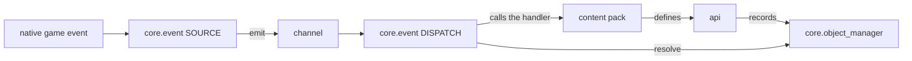

PalForge is a content framework for Palworld that runs as a UE4SS Lua mod. A content pack
is Lua code that declares pals, items, buildings, skills, effects, sounds, meshes and UI,
and attaches behaviour to them.

## What PalForge is

The install layout is a normal UE4SS Lua mod:

```text
ue4ss/Mods/PalForge/Scripts/main.lua        <- entry point
ue4ss/Mods/PalForge/Scripts/palforge/*.lua  <- modules
```

`main.lua` is thin. It bootstraps `package.path` so `palforge.*` resolves relative to that
`Scripts` directory, calls `registry.initialize()` inside a `pcall`, and publishes
`_G.PalForge` for companion mods.

`registry.initialize()` runs a fixed order, once, at mod load:

1. require `palforge.api` — this installs the bare globals `Pal`, `Item`, `Building`,
   `Skill`, `Effect`, `Audio`, `Mesh`, `UI`, `Player`.
2. require the native catalogs (`palforge.native.buildings`, `.items`, `.pals`, `.skills`,
   `.effects`, `.audio`, `.ui`). Each curated definition self-registers as it is defined.
3. `event.start()` — the bus, the native sources and the dispatch.
4. dev-only tooling, gated on `env.dev`: the dev keybinds, the `ps_catalog` console
   command, and the test suites.
5. `event.emit("gameStart")`.

`palforge/env.lua` is a process-wide singleton table holding `dev`, `name` and `version`.
`dev` is the one dev/release switch — set it to `false` before `registry.initialize()`
runs to ship a build that only registers content:

```lua
local env = require("palforge.env")
env.dev = false
```

The smallest useful pack is one definition:

```lua title="Scripts/content/flint.lua"
local api = require("palforge.api")

Item{
    id       = "Flint",
    name     = "Flint",
    category = "material",
    maxStack = 999,
    events = {
        onObtain = function(item, ctx)
            Audio.get("AKE_General_Explosion"):play()
        end,
    },
}
```

`Flint` is a real row in the game's item table. The definition does not create it — it
gives that existing id a name, a category, a stack ceiling and a handler that runs when
the player picks some up.

## What PalForge is not

PalForge does not publish DataTable rows. Lua alone cannot add a new item, creature or
build-object row to Palworld's data tables; that is PalSchema's job. What a definition
does is attach **behaviour and metadata to an id**, and give you actions on it.

Ids follow one rule. A content pack writes `"packid:name"`, and
`core/object_manager.resolve` maps that to the DataTable row FName `packid_name`. Both
halves must be letters, digits or underscores. An id **without** a colon is a literal game
id:

```lua
local om = require("palforge.core.object_manager")

om.resolve("example:Potion")   --> "example_Potion"
om.resolve("Wood")             --> "Wood"        (literal game id, passed through)
om.resolve("bad pack:Potion")  --> nil, "invalid pack id 'bad pack' (letters/digits/_ only)"
```

So `Item{ id = "example:Potion" }` is only useful if PalSchema (or another mod) has
published a row named `example_Potion`. Without that row the definition is still
registered and still callable from Lua, but no in-game inventory refers to it.

<Callout type="warn">
Two more things PalForge does not do. A PalForge `Effect` does not toggle the game's own
ailment enum `EPalStatusEffectType` — no native call to apply one has been confirmed, so
the gameplay lives in your handlers. And there is no native source for skills: nothing in
the game fires a `Skill` handler by itself, so you invoke it from your own code.
</Callout>

## The layer map

Four directories, and only two of them are things a pack calls.

| Layer | Role |
| --- | --- |
| `api/` | The public surface a pack writes against. One module per domain. |
| `core/` | The engine. `registry` decides when things load, `event` owns channels, native sources, dispatch and the whole building runtime, and the Palworld bridges are `object_manager`, `spawn`, `mesh`, `sound`, `player`, `icons`, `spatial`, `schema`. |
| `utils/` | The generic toolbox a pack does call: `log`, `json`, `file`, `items`. |
| `native/` | Palworld's own content as data catalogs, plus a few curated definitions. |

The responsibility split inside `core/` is three sentences: `object_manager` knows **what**
exists, `registry` knows **when** it loads, `event` knows **what happens**.



Registration is not a separate step. A definition call writes into `object_manager` itself,
so loading a module *is* registering its content. There is no aggregator table to walk and
no per-class `register()` to remember.

## The uniform shape of a domain

Every domain module has exactly three public entry points:

```lua
local boss = Pal{ id = "example:Boss", name = "Boss" }  -- CALL the module to define
Pal.get("ChickenPal")                                   -- an existing one, by id
Pal.get_all()                                           -- every registered one
```

`X{ ... }` is Lua's call-with-a-table sugar for `X({ ... })`. The module itself is the
constructor, through a `__call` metamethod — there is no `X.define`. Defining registers the
definition class in `core/object_manager` under `(type, id)` and returns a **Handle**
carrying that domain's actions.

Requiring `palforge.api` installs the bare globals *and* returns the same table namespaced,
so both spellings work:

<Tabs items={['Globals', 'Namespaced']}>
<Tab value="Globals">

```lua
require("palforge.api")

Pal.get("ChickenPal"):spawn(Player.coordinate())
Item.get("Wood"):give(10)
```

</Tab>
<Tab value="Namespaced">

```lua
local api = require("palforge.api")

api.Pal.get("ChickenPal"):spawn(api.Player.coordinate())
api.Item.get("Wood"):give(10)
```

</Tab>
</Tabs>

UE4SS gives each Lua mod its own state, so those globals are mod-local. They do not clash
with the game or with other mods.

### Define once, act many times

`X{ ... }` registers. `X.get(id)` hands you a handle for something already registered. A
handler runs on every event, so reach for `get` inside one:

```lua
Pal{
    id = "ChickenPal",
    events = {
        onCaptured = function(pal, ctx)
            Audio.get("AKE_Arena_Victory_01"):play()   -- a play
            -- Audio.bgm{ id = "AKE_Arena_Victory_01" }  -- would RE-DEFINE on every capture
        end,
    },
}
```

### The handler's first argument

The first argument is the object the event happened to. For pal, item, skill and effect
that is **that definition's Handle**, so the domain's actions are right there. For a
building it is the **live instance** — `self.actor`, `self.pos`, `self.state`, `self:save()`.

```lua
Item{
    id = "Berries",
    events = {
        onUse = function(item, ctx)          -- item is the Item.Handle
            item:give(1)                     -- so :give is in scope
        end,
    },
}

Building{
    id = "CampFire",
    state = { lit = 0 },
    events = {
        onRightClick = function(self, ctx)   -- self is the live instance
            self.state.lit = self.state.lit + 1
            self:save()
        end,
    },
}
```

The later arguments are the domain's own: `(pal, ctx)`, `(item, ctx)`,
`(skill, owner, ctx)`, `(effect, target, ctx)`, `(instance, ctx)`.

### Nesting a definition

A nested definition can be passed as itself. A `Mesh` handle's metatable carries `__spec`,
which the validator unwraps to the plain declaration, so the inline form and the named form
are validated identically:

```lua
-- inline
Pal{ id = "example:Boss", mesh = { model = "/Game/Pal/Model/Character/Monster/ChickenPal/SK_ChickenPal.SK_ChickenPal" } }

-- named, declared once and reused
local body = Mesh{
    id    = "example:BossBody",
    model = "/Game/Pal/Model/Character/Monster/ChickenPal/SK_ChickenPal.SK_ChickenPal",
}
Pal{ id = "example:Boss", mesh = body }
Pal{ id = "example:Add",  mesh = Mesh.get("example:BossBody") }
```

### Validation is strict

Shapes are declared as data with `core/schema` and enforced on every call. Every problem is
a hard error and the call never half-succeeds: an unknown field (with a did-you-mean), a
missing required field, a wrong type, a value outside the declared `values`, a bad
`arrayOf` or `mapOf` element, or a failing `check`. Every message is prefixed `PalForge: `
and names the domain and the field.

```text
PalForge: Pal: unknown field "displayName" (did you mean "name"?). Valid fields: id, name, description, skills, mesh, material, color, texture, icon, events, data
PalForge: Pal: field "id" is required (pal id: a game CharacterID ("ChickenPal") or "pack:name")
PalForge: Pal: field "mesh" (Mesh.Spec): field "model" is required (USkeletalMesh / UStaticMesh asset path)
PalForge: Item: field "category" must be one of { "material", "consumable", "equipment", "ammo", "ingredient", "other" }, got "food"
```

The declarations stay private to their module — a domain is a thing you call, not a
namespace to browse — but they are readable at runtime through the schema registry:

```lua
local schema = require("palforge.core.schema")

print(schema.help("Pal.Spec"))        -- every field, its type, default and meaning
schema.get("Pal.Spec").fields         -- the same as a table, for tooling
schema.all()                          -- every declared spec, in declaration order
```

In the editor the same information comes from `Scripts/palforge/types.lua`, which is
generated from those declarations by `lua5.4 tools/gen-types.lua`. It is annotations only;
nothing requires it at runtime. LuaLS just has to see it in the workspace for `Pal{ ... }`
to complete every field with its documentation.

## A worked example

One pack file that touches Mesh, Effect, Skill, Building, Item, Audio, Pal and Player.

```lua title="Scripts/content/supply_bench.lua"
local api = require("palforge.api")

-- 1. A named mesh, declared once so anything can wear it.
local BenchBody = Mesh{
    id    = "example:BenchBody",
    kind  = "static",
    model = "/Game/Pal/Model/Prop/Architecture/WorkBenchPrimitive/SM_WorkBenchPrimitive.SM_WorkBenchPrimitive",
}

-- 2. A timed status. Its schedule is driven by the shared heartbeat, in Lua.
local WellFed = Effect{
    id          = "example:WellFed",
    name        = "Well Fed",
    description = "Hands out a berry every ten seconds.",
    duration    = 60.0,
    interval    = 10.0,
    events = {
        onApply = function(effect, target, ctx)
            Audio.get("AKE_BGM_Title"):play(target)
        end,
        onTick = function(effect, target, ctx)
            Item.get("Berries"):give(1)
        end,
        onExpire = function(effect, target, ctx)
            Audio.get("AKE_BGM_Title"):stop(target)
        end,
    },
}

-- 3. A skill. Nothing in the game fires one, so it is invoked below by hand;
--    the cooldown is enforced in Lua by :activate.
local Whistle = Skill{
    id       = "example:Whistle",
    name     = "Whistle",
    kind     = "active",
    cooldown = 30.0,
    events = {
        onActivate = function(skill, owner, ctx)
            Pal.get("ChickenPal"):spawn(Player.coordinateOffset(200, 0, 0))
        end,
    },
}

-- 4. The structure. "CampFire" is an EXISTING game build id; this gives it a mesh,
--    per-structure persisted state and a lifecycle.
Building{
    id           = "CampFire",
    name         = "Supply Bench",
    gridCm       = 100,
    tickInterval = 20,               -- onTick every 20 heartbeats, so every 10 seconds
    mesh         = BenchBody,
    state        = { uses = 0 },
    events = {
        onPlace = function(self, ctx)
            self.state.uses = 0
            self:save()
        end,
        onLoad = function(self, ctx)
            -- ctx.reconstructed is true when this came back from a saved record
        end,
        onRightClick = function(self, ctx)
            self.state.uses = self.state.uses + 1
            self:save()
            Item.get("Wood"):give(5)
            WellFed:apply(Player.character())
            Whistle:activate(ctx.player)     -- returns false while cooling down
        end,
        onTick = function(self, ctx)
            if self.state.uses >= 10 then
                Item.get("Berries"):give(1)
                self.state.uses = 0
                self:save()
            end
        end,
        onRemove = function(self, ctx)
            WellFed:remove(Player.character())
        end,
    },
}
```

What each piece really does:

- `BenchBody` is registered under `("mesh", "example:BenchBody")` and nested into the
  building by value. `kind` has to be pinned here: a named `Mesh{ ... }` is validated
  against `Mesh.Spec` on its own, whose `kind` defaults to `"skeletal"`, and that
  filled-in value travels with it. The `"static"` default belongs to
  `Building.Spec.Mesh`, so it only applies to a mesh written inline in the building.
- `WellFed:apply(target)` starts a live application: `onApply` now, `onTick` every
  `interval` seconds, `onExpire` after `duration` or on `:remove()`.
- `Whistle:activate(owner)` runs `onActivate` immediately unless the 30-second cooldown
  blocks it, in which case it returns `false`.
- `tickInterval = 20` with the 500 ms heartbeat means `onTick` runs every ten seconds.
- `self:save()` writes the instance's `state` table to the per-world state file.
- `ctx.player` on `onRightClick` is the character that interacted; `ctx.actor` is the
  building actor.
- `Audio.Handle:stop(actor)` is not per-sound. The native stop route stops everything
  playing on that actor.

<Callout type="info">
`CampFire`, `Wood`, `Berries` and `ChickenPal` are real ids from
`Scripts/palforge/native/*.lua`, and `AKE_BGM_Title` is a curated sound defined by
`palforge.native.audio`. Registration is keyed on `(type, id)`, so defining an id the
native catalogs already curated replaces that registration.
</Callout>

## The domains

| Domain | What it declares | Reference |
| --- | --- | --- |
| `Pal` | A spawnable creature: mesh, material, skill ids, and spawn / damage / death / capture handlers. | [/docs/api/pal](/docs/api/pal) |
| `Item` | Inventory content: category, stack ceiling, recipe, and obtain / use handlers. | [/docs/api/item](/docs/api/item) |
| `Building` | A placeable structure. The one domain with a live per-structure instance, persisted state and a full lifecycle. | [/docs/api/building](/docs/api/building) |
| `Skill` | An active or passive ability with element, power and a Lua-enforced cooldown. | [/docs/api/skill](/docs/api/skill) |
| `Effect` | A timed status on a target: duration, interval, stacking, expiry. | [/docs/api/effect](/docs/api/effect) |
| `Audio` | One playable Wwise `AkAudioEvent`, played on an actor. `Audio.bgm` and `Audio.se` pin `kind`. | [/docs/api/audio](/docs/api/audio) |
| `Mesh` | A model asset plus how to paint it, worn by a pal or a building. | [/docs/api/mesh](/docs/api/mesh) |
| `UI` | A mountable element built from Palworld's own UMG kit, with `render` and `update`. | [/docs/api/ui](/docs/api/ui) |
| `Player` | The local character and its coordinate. A plain facade, not callable. | [/docs/api/player](/docs/api/player) |

Beyond the three entry points there are three extras, and they are the whole list:
`Audio.bgm` and `Audio.se` pin `kind`, and `Effect.activeOn(target)` returns the ids of
every effect currently on a target. `Player` has no entry points at all — it is
`character()`, `coordinate()` and `coordinateOffset(dx, dy, dz)`. Every module except
`Player` also exposes `X.Class`, the base definition class, used for subclassing and for
`core/event`'s override detection.

<Callout type="warn">
Which hooks actually fire, today:

- **Building** — these are live: `onPlace`, `onLoad`, `onRightClick`, `onRemove`,
  `onTick`, `onWorldLeft`. `onBuild`, `onLeftClick` and `onBreak` are declarable but no
  native source emits them. `onWorldReady` is dispatched and never reaches an instance:
  `world.ready` is emitted at the moment the gate opens, and the scan that creates
  instances waits on that same gate, so put the work in `onLoad`.
- **Pal** — `onCaptured`, `onDamaged` and `onDeath` are live. `onSpawned` rides an
  unconfirmed candidate hook. `onTick` is declarable only: pals have no instance scan, so
  nothing drives it.
- **Item** — `onObtain` and `onUse` are live. `onCraft` and `onDiscard` are declarable
  only; the channels and dispatch exist, nothing emits them.
- **Effect** — all four hooks are live, but the timing is owned by `api/effect` off the
  `tick` channel, not by a native game event.
- **Skill** — no native source at all. `:activate`, `:hit`, `:equip` and `:unequip` run the
  handler now; drive them from your own code.
- **Audio / Mesh / UI** — no lifecycle channels. `Audio.Handle:setVolume` is not
  implemented and returns `false`, a `soundFile` resolves and no-ops, and nothing calls a
  UI element's `refresh()` for you.
</Callout>

## The `_G.PalForge` surface

After `main.lua` has run, companion mods loaded into the same Lua state reach everything
through one table:

```lua
_G.PalForge = {
    env    = env,                      -- dev / name / version
    api    = require("palforge.api"),  -- Pal, Item, Building, Skill, Effect, Audio, Mesh, UI, Player
    utils  = { log, json, file, items },
    core   = { registry, event, object_manager, spawn, mesh, sound, player, spatial, icons },
    native = require("palforge.native"),
}
```

`api` is what a content pack writes against. `utils` is the toolbox. `core` and `native`
are exposed for advanced use — custom event channels, catalog lookups:

```lua title="a companion mod"
local PalForge = _G.PalForge
local event    = PalForge.core.event
local log      = PalForge.utils.log.scope("mymod")

-- Subscribe to any channel. Returns a subscription with :unsubscribe().
local sub = event.on("item.obtain", function(ctx)
    log.info("obtained " .. tostring(ctx.itemId) .. " x" .. tostring(ctx.count))
end)

-- Run something on the shared heartbeat, quantized to event.TICK_MS (500 ms).
event.every(5000, function()
    log.info("live buildings: " .. tostring(#event.instances()))
end)

-- Operator chains, because a channel is a hot Rx Subject.
event.observable("building.interact")
    :filter(function(ctx) return ctx.buildId == "PalBoxV2" end)
    :subscribe(function(ctx) log.info("palbox opened") end)

-- Read the catalogs.
local native = PalForge.native
native.audio.MainTheme:play()
native.items.get("Arrow_Fire"):give(20)

sub:unsubscribe()
```

The channel list is `event.CHANNELS`, and every channel is pre-created so subscribing
before the first emit works:

```text
gameStart
world.ready   world.left
building.place  building.load  building.interact  building.remove
pal.spawned  pal.damaged  pal.death  pal.captured
item.obtain  item.use  item.craft  item.discard
tick
```

`registry.registered()` gives a snapshot of every registered class, keyed by object type
then id — useful for tooling:

```lua
local registry = _G.PalForge.core.registry

for id in pairs(registry.registered().building) do
    print(id)
end
```

## Where to go next

<Cards>
  <Card title="Getting started" href="/docs/getting-started">
    Install PalForge, lay out a pack, and get a definition running in game.
  </Card>
  <Card title="Definitions" href="/docs/concepts/definitions">
    Specs, strict validation, handles, nesting and the id model in detail.
  </Card>
  <Card title="Lifecycle" href="/docs/concepts/lifecycle">
    Channels, native sources, dispatch, the heartbeat, and which hooks are live.
  </Card>
</Cards>
