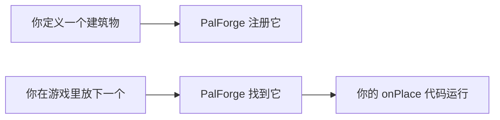

PalForge 是 Palworld 的基础模组。你可以用它添加自己的建筑物、音乐、效果、帕鲁、道具、模型、
技能和菜单，也可以把它们组合成全新的内容，而且马上就能在游戏里看到结果。把想做的东西写进一个
简短的 Lua 文件，PalForge 就会把它放进世界里。

## 读完本页你可以做到

- 把自己的建筑物、道具、帕鲁、音效或菜单加进 Palworld。
- 在放下建筑物、捡起道具或捕捉帕鲁时运行自己的代码。
- 让放下的每个建筑物记住自己的数据，下次进游戏时还在。
- 找到你想做的东西对应的页面。

## 第一个建筑物

这就是一个完整的内容文件。它给游戏自带的篝火加上新行为：右键点一下，你会得到 5 个木材。

```lua title="Scripts/content/campfire.lua"
require("palforge.api")

Building{
    id = "CampFire",
    events = {
        onRightClick = function(self, ctx)
            Item.get("Wood"):give(5)
        end,
    },
}
```

这里有三件事在发生。`Building{ ... }` 声明一个建筑物。`"CampFire"` 是游戏自己的建筑 id，所以
改变的就是你早就认识的那个篝火。`events` 是写自己代码的地方，`onRightClick` 在玩家每次交互时
运行。

把这个文件放在 PalForge 自己的脚本旁边，然后从入口文件加载它。具体的文件夹和加载用的那一行，
[快速开始](/docs/getting-started) 里有。

## 你能做出什么

八类东西，每类一个模块。调用模块就能做出一个。

| 你想做的 | 你要声明的内容 | 页面 |
| --- | --- | --- |
| 可放置的建筑物 | 外观、占地格数、要记住的数据，以及 放下 / 使用 / 移除 / 每隔几秒 时运行的代码。 | [/docs/api/building](/docs/api/building) |
| 背包里的道具 | 名称、分类、堆叠上限、配方，以及 捡起 / 使用 时运行的代码。 | [/docs/api/item](/docs/api/item) |
| 一种生物 | 模型、颜色、技能的 id，以及 出现 / 受伤 / 死亡 / 被捕捉 时运行的代码。 | [/docs/api/pal](/docs/api/pal) |
| 一个能力 | 主动还是被动、属性、威力，以及由 Lua 计时的冷却。 | [/docs/api/skill](/docs/api/skill) |
| 一个限时状态 | 持续多久、多久触发一次、怎么叠加、结束时做什么。 | [/docs/api/effect](/docs/api/effect) |
| 一段音效或音乐 | 一个可以播放的游戏内声音。`Audio.bgm` 和 `Audio.se` 会替你固定 `kind`。 | [/docs/api/audio](/docs/api/audio) |
| 一个模型 | 模型资源，以及怎么给它上色。帕鲁或建筑物会穿上它。 | [/docs/api/mesh](/docs/api/mesh) |
| 一个面板或按钮 | 用 Palworld 自带的界面组件搭出的控件，带 `render` 和 `update`。 | [/docs/api/ui](/docs/api/ui) |

`Player` 是唯一一个不用来创建东西的模块。它告诉你玩家在哪里：`Player.character()`、
`Player.coordinate()` 和 `Player.coordinateOffset(dx, dy, dz)` —
[/docs/api/player](/docs/api/player)。

## 编写一个定义

每个模块的用法都一样。调用它来创建，用 `get` 和 `get_all` 找已经存在的东西。

```lua
local boss = Pal{ id = "example:Boss", name = "Boss" }  -- CALL the module to define
Pal.get("ChickenPal")                                   -- an existing one, by id
Pal.get_all()                                           -- every registered one
```

`X{ ... }` 是 Lua 里 `X({ ... })` 的简写 —— 花括号本身就是参数列表，这是 Lua 里最接近具名参数的
写法。返回的是一个 **句柄**：一个带着该领域各种操作的对象，所以 `:spawn`、`:give`、`:play`、
`:apply` 直接就能用。

下面是一个内容多一点的定义：

```lua title="Scripts/content/flint.lua"
local api = require("palforge.api")

Item{
    id       = "Flint",
    name     = "Flint",
    category = "material",
    maxStack = 999,
    events = {
        onObtain = function(item, ctx)
            Audio.get("AKE_General_Explosion"):play()
        end,
    },
}
```

`Flint` 本来就在游戏里。这个定义给这个 id 加上名称、分类、堆叠上限，以及玩家捡起它时播放的
声音。

require `palforge.api` 之后，你可以直接用 `Pal`、`Item`、`Building`、`Skill`、`Effect`、
`Audio`、`Mesh`、`UI` 和 `Player` 这些名字，同时它也会返回一张带着同样名字的表。两种写法都能用：

<Tabs items={['Globals', 'Namespaced']}>
<Tab value="Globals">

```lua
require("palforge.api")

Pal.get("ChickenPal"):spawn(Player.coordinate())   -- :spawn places nothing in this version
Item.get("Wood"):give(10)
```

</Tab>
<Tab value="Namespaced">

```lua
local api = require("palforge.api")

api.Pal.get("ChickenPal"):spawn(api.Player.coordinate())
api.Item.get("Wood"):give(10)
```

</Tab>
</Tabs>

这些名字只属于你的模组。它们不会和游戏本体冲突，也不会和别人的模组冲突。

除了调用模块和 `get` / `get_all`，还有三个额外的东西。`Audio.bgm` 和 `Audio.se` 会替你固定
`kind`，省得自己写；`Effect.activeOn(target)` 会返回目标身上当前所有效果的 id。除 `Player` 以外
的每个模块还提供 `X.Class`，也就是定义所基于的基类 —— 只有要派生子类时才用得上。

### 定义一次，使用很多次

`X{ ... }` 用来创建，`X.get(id)` 用来查已经存在的东西。处理函数每次事件都会运行，所以在里面要
用 `get`：

```lua
Pal{
    id = "ChickenPal",
    events = {
        onCaptured = function(pal, ctx)
            Audio.get("AKE_Arena_Victory_01"):play()   -- a play
            -- Audio.bgm{ id = "AKE_Arena_Victory_01" }  -- would RE-DEFINE on every capture
        end,
    },
}
```

### 处理函数会收到什么

第一个参数就是事件发生在谁身上。对帕鲁、道具、技能或效果来说，它是对应的句柄，所以该领域的
操作直接就在手边。对建筑物来说，它是玩家碰到的那一个建筑物：`self.actor` 是放置出来的 actor，
`self.pos` 是它的位置，`self.state` 是你自己的表，`self:save()` 把这张表写进存档。

```lua
Item{
    id = "Berries",
    events = {
        onUse = function(item, ctx)          -- item is the Item.Handle
            item:give(1)                     -- so :give is in scope
        end,
    },
}

Building{
    id = "CampFire",
    state = { lit = 0 },
    events = {
        onRightClick = function(self, ctx)   -- self is the live instance
            self.state.lit = self.state.lit + 1
            self:save()
        end,
    },
}
```

后面的参数由各个领域决定：`(pal, ctx)`、`(item, ctx)`、`(skill, owner, ctx)`、
`(effect, target, ctx)`、`(instance, ctx)`。`ctx` 就是一张普通的表，内容随事件而变 ——
`ctx.actor`、`ctx.itemId`、`ctx.count` 等等。

### 把一个定义放进另一个里

需要定义的字段，既可以给它一张普通的表，也可以给它一个你已经创建好的定义。两者的检查方式完全
一样：

```lua
-- inline
Pal{ id = "example:Boss", mesh = { model = "/Game/Pal/Model/Character/Monster/ChickenPal/SK_ChickenPal.SK_ChickenPal" } }

-- named, declared once and reused
local body = Mesh{
    id    = "example:BossBody",
    model = "/Game/Pal/Model/Character/Monster/ChickenPal/SK_ChickenPal.SK_ChickenPal",
}
Pal{ id = "example:Boss", mesh = body }
Pal{ id = "example:Add",  mesh = Mesh.get("example:BossBody") }
```

### 给你的内容起名字

带冒号的 id，比如 `"example:Potion"`，是你自己的内容。PalForge 会把它转成游戏数据里的行名
`example_Potion`。不带冒号的 id 是游戏里已经有的 id，比如 `Wood`、`ChickenPal` 或 `PalBoxV2`。
带命名空间的 id，冒号两边都只能是字母、数字或下划线：

```lua
local om = require("palforge.core.object_manager")

om.resolve("example:Potion")   --> "example_Potion"
om.resolve("Wood")             --> "Wood"        (literal game id, passed through)
om.resolve("bad pack:Potion")  --> nil, "invalid pack id 'bad pack' (letters/digits/_ only)"
```

<Callout type="warn">
你可以给游戏已有的 id 加上新行为和新的元数据。但要往游戏自己的表里加一行全新的数据 —— 一个新
道具、一个新生物、一个新建筑物 —— 就需要别的工具，因为 Lua 写不了新的行。所以
`Item{ id = "example:Potion" }` 能正常注册，也能在你的代码里用，但在名为 `example_Potion` 的行
存在之前，游戏里的任何背包都不会显示它。在那之前，请在游戏已有的 id 上做扩展。
</Callout>

### 字段写错的时候

每次调用都会对照该领域接受的形状做检查，有问题就当场中止 —— 绝不会只成功一半。未知字段（会附上
你可能想写的名字）、缺少必填字段、类型不对、取值不在允许的列表里、`arrayOf` 或 `mapOf` 的元素
不合法、`check` 没通过，都会报错。每条消息都以 `PalForge: ` 开头，并写明领域和字段：

```text
PalForge: Pal: unknown field "displayName" (did you mean "name"?). Valid fields: id, name, description, skills, mesh, material, color, texture, icon, events, data
PalForge: Pal: field "id" is required (pal id: a game CharacterID ("ChickenPal") or "pack:name")
PalForge: Pal: field "mesh" (Mesh.Spec): field "model" is required (USkeletalMesh / UStaticMesh asset path)
PalForge: Item: field "category" must be one of { "material", "consumable", "equipment", "ammo", "ingredient", "other" }, got "food"
```

想知道某个领域接受什么，不用离开游戏，运行时问一下就行：

```lua
local schema = require("palforge.core.schema")

print(schema.help("Pal.Spec"))        -- every field, its type, default and meaning
schema.get("Pal.Spec").fields         -- the same as a table, for tooling
schema.all()                          -- every declared spec, in declaration order
```

在编辑器里，同样的信息来自 `Scripts/palforge/types.lua`，它由 `lua5.4 tools/gen-types.lua` 生成。
这个文件里只有注解，运行时没有任何东西 require 它；只要 LuaLS 能在工作区里看到它，
`Pal{ ... }` 就会补全每个字段并带上说明。[编辑器设置](/docs/concepts/editor-setup) 讲了做法。

## 游戏会替你运行什么

建筑物的处理函数不用你自己调用。你在游戏里放下一个建筑物，PalForge 就会注意到，并运行你的代码。



自动到什么程度，取决于领域：

- **Building** —— 最完整的一个。`onPlace`、`onLoad`、`onRightClick`、`onRemove`、`onTick`、
  `onWorldReady` 和 `onWorldLeft` 都会在活着的建筑物上运行。`onBuild` 也会运行，就在建造完成的
  那一刻；它到达时建筑物还不存在，所以传给它的是定义，而不是活着的建筑物。晚一轮才加载进来的
  建筑物会错过 `onWorldReady`，所以每个建筑物自己的启动处理要写在 `onLoad` 里。
- **Pal** —— 五个都会运行。`onCaptured`、`onDamaged` 和 `onDeath` 来自已经确认的游戏调用。
  `onSpawned` 挂在一个候选钩子上，还没有证实它表示的是新出现而不是重新初始化，所以这个处理函数
  要写成运行两次也没问题。`onTick` 由一个遍历世界里所有帕鲁的扫描驱动，大约每三秒一次。
- **Item** —— `onObtain` 和 `onUse` 会运行，带着 `ctx.itemId`、`ctx.count` 和 `ctx.actor`。
- **Effect** —— `onApply`、`onTick`、`onStack` 和 `onExpire` 都会运行。时间由 PalForge 自己按
  半秒一次的心跳来数。定义里写上 `nativeStatus`，效果运行期间就会点亮游戏自带的状态异常；除此
  之外目标身上发生了什么，全由你的处理函数决定。
- **Audio、Mesh 和 UI** —— 完全没有生命周期事件。声音要你自己播放，网格要你自己指定给谁穿，界面
  元素也要你自己挂载、刷新和卸载。`Audio.Handle:stop(actor)` 不是按单个声音来的：它会把那个
  actor 上正在播放的一切都停掉。

<Callout type="error" title="这个版本做不到的两件事">
设计整合包之前先把这两件事考虑进去。它们都还能照常写出来 —— 返回 `false`、什么都不改，而不是
做到一半失败。

- **帕鲁没法放进世界。** `Pal.Handle:spawn` 不会在任何地方放出生物。能用的是对游戏自己生成的
  生物做出反应：捕捉、伤害、死亡和定期巡检全都在跑。
- **单个声音没有自己的音量。** `Audio.Handle:setVolume` 什么都不改，而游戏也没有提供按声音调节的
  音量。请改从目录里挑一个更安静的声音。

本页其余内容今天都能用。
</Callout>

<Callout type="warn">
下面这些可以写在定义里，你的代码不会因此出错，但今天没有任何东西会运行它们。把逻辑放到真正会
运行的地方：

- Building 的 `onLeftClick` 和 `onBreak` —— 改用 `onRightClick` 和 `onRemove`。
- Item 的 `onCraft` 和 `onDiscard` —— 改用 `onObtain` 或 `onUse`。
- 技能的处理函数 —— 游戏里没有任何东西会触发技能。请从你自己的代码里调用 `:activate(owner)`、
  `:hit(target)`、`:equip(owner)` 或 `:unequip(owner)`，比如在帕鲁的处理函数里、建筑物的
  `onRightClick` 里，或者一个按键绑定里。冷却由 Lua 计时，冷却期间 `:activate` 返回 `false`。
- 你自己准备的 `soundFile` 能被解析，但不会发出声音。请改用游戏内的声音 id。
- 没有东西会替你刷新界面元素。状态变了就自己调用 `:refresh()`，或者用 `:autoRefresh(ms)` 定时
  轮询。
</Callout>

## 一个更大的例子

一个文件，创建了一个网格、一个状态、一个能力和一个建筑物，并把它们连在一起。

```lua title="Scripts/content/supply_bench.lua"
local api = require("palforge.api")

-- 1. A named mesh, declared once so anything can wear it.
local BenchBody = Mesh{
    id    = "example:BenchBody",
    kind  = "static",
    model = "/Game/Pal/Model/Prop/Architecture/WorkBenchPrimitive/SM_WorkBenchPrimitive.SM_WorkBenchPrimitive",
}

-- 2. A timed status. Its schedule is driven by the shared heartbeat, in Lua.
local WellFed = Effect{
    id          = "example:WellFed",
    name        = "Well Fed",
    description = "Hands out a berry every ten seconds.",
    duration    = 60.0,
    interval    = 10.0,
    events = {
        onApply = function(effect, target, ctx)
            Audio.get("AKE_BGM_Title"):play(target)
        end,
        onTick = function(effect, target, ctx)
            Item.get("Berries"):give(1)
        end,
        onExpire = function(effect, target, ctx)
            Audio.get("AKE_BGM_Title"):stop(target)
        end,
    },
}

-- 3. A skill. Nothing in the game fires one, so it is invoked below by hand;
--    the cooldown is enforced in Lua by :activate.
local Whistle = Skill{
    id       = "example:Whistle",
    name     = "Whistle",
    kind     = "active",
    cooldown = 30.0,
    events = {
        onActivate = function(skill, owner, ctx)
            Pal.get("ChickenPal"):spawn(Player.coordinateOffset(200, 0, 0))   -- no pal appears
        end,
    },
}

-- 4. The structure. "CampFire" is an EXISTING game build id; this gives it a mesh,
--    per-structure persisted state and a lifecycle.
Building{
    id           = "CampFire",
    name         = "Supply Bench",
    gridCm       = 100,
    tickInterval = 20,               -- onTick every 20 heartbeats, so every 10 seconds
    mesh         = BenchBody,
    state        = { uses = 0 },
    events = {
        onPlace = function(self, ctx)
            self.state.uses = 0
            self:save()
        end,
        onLoad = function(self, ctx)
            -- ctx.reconstructed is true when this came back from a saved record
        end,
        onRightClick = function(self, ctx)
            self.state.uses = self.state.uses + 1
            self:save()
            Item.get("Wood"):give(5)
            WellFed:apply(Player.character())
            Whistle:activate(ctx.player)     -- returns false while cooling down
        end,
        onTick = function(self, ctx)
            if self.state.uses >= 10 then
                Item.get("Berries"):give(1)
                self.state.uses = 0
                self:save()
            end
        end,
        onRemove = function(self, ctx)
            WellFed:remove(Player.character())
        end,
    },
}
```

每一部分都做了什么：

- `BenchBody` 以 `("mesh", "example:BenchBody")` 注册，并按值嵌进建筑物里。这里必须写明 `kind`：
  具名的 `Mesh{ ... }` 会单独按 `Mesh.Spec` 检查，而 `Mesh.Spec` 的 `kind` 默认是 `"skeletal"`，
  这个填好的值会一路跟着它走。`"static"` 这个默认值属于 `Building.Spec.Mesh`，只对直接写在建筑物
  里的网格生效。
- `WellFed:apply(target)` 会开始一次生效：立刻运行 `onApply`，之后每 `interval` 秒运行一次
  `onTick`，过了 `duration` 或调用 `:remove()` 时运行 `onExpire`。
- `Whistle:activate(owner)` 会立刻运行 `onActivate`，除非 30 秒的冷却挡住了它，这时它返回
  `false`。
- `tickInterval = 20` 配上半秒一次的心跳，意味着 `onTick` 每十秒运行一次。
- `self:save()` 把建筑物的 `state` 表写进按世界分开的状态文件。
- `onRightClick` 里的 `ctx.player` 是发起交互的角色，`ctx.actor` 是建筑物的 actor。
- `Audio.Handle:stop(actor)` 不是按单个声音来的。它会把那个 actor 上正在播放的一切都停掉。
- `Item.Handle:give` 返回的是背包实测到的变化，所以它给出 `false` 就意味着什么都没到位。`:spawn`
  那一行在这个版本里什么都不会放下；其余部分都能用。

<Callout type="info">
`CampFire`、`Wood`、`Berries` 和 `ChickenPal` 都是 `Scripts/palforge/native/*.lua` 里真实存在的
id，`AKE_BGM_Title` 是 `palforge.native.audio` 定义的声音。注册以 `(type, id)` 为键，所以定义一个
PalForge 自带的 id，会替换掉原来的注册。
</Callout>

## 接下来读什么

<Cards>
  <Card title="快速开始" href="/docs/getting-started">
    安装 PalForge，摆好一个内容包，让一个定义在游戏里跑起来。
  </Card>
  <Card title="你的第一个内容包" href="/docs/guides/first-content-pack">
    从空文件夹到能玩的东西，一步步做出一个完整的内容包。
  </Card>
  <Card title="定义" href="/docs/concepts/definitions">
    规格、严格检查、句柄、嵌套，以及 id 模型的细节。
  </Card>
  <Card title="生命周期" href="/docs/concepts/lifecycle">
    通道、心跳，以及到底是什么触发了你的每个处理函数。
  </Card>
</Cards>

## 小结

- 添加内容只要写一个 Lua 文件。`Building{ ... }`、`Item{ ... }`、`Pal{ ... }` 和其他模块用法都
  一样，而且它们唯一必填的字段都是 `id`。
- 带冒号的 id 是你自己的内容，不带冒号的是游戏里已经有的东西。在已有的 id 上做扩展，是最快在
  游戏里看到效果的办法。
- 想运行的代码写在 `events` 里。第一个参数是事件发生在谁身上：建筑物是活着的那一个，其他都是
  那个定义的句柄。
- 只要你调用 `self:save()`，建筑物就会记住你放进 `state` 的东西。
- 字段名写错会中止调用，并给出一条以 `PalForge: ` 开头的消息，告诉你正确的名字。
- 技能不会自己触发；Item 的 `onCraft` / `onDiscard` 和 Building 的 `onLeftClick` / `onBreak` 也
  不会运行 —— 把这些逻辑放进真正会运行的处理函数里。

接下来读 [快速开始](/docs/getting-started)，安装 PalForge，让你写的文件被加载进来。
